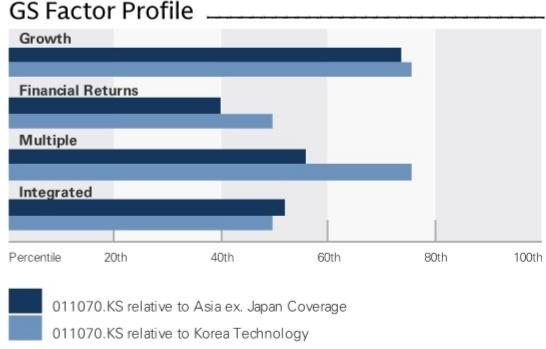
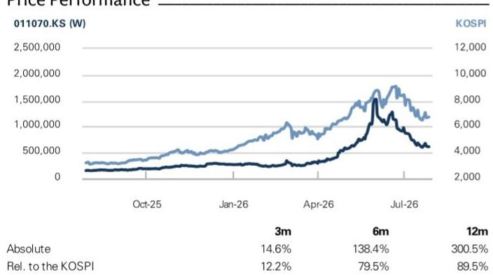
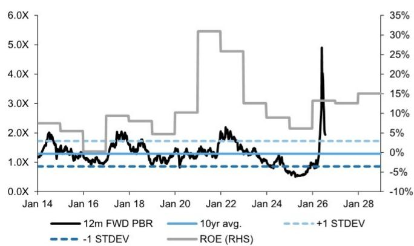
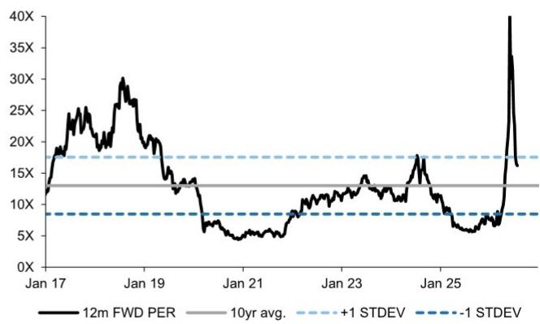

# LG Innotek Co. (011070.KS)

业绩回顾：2Q26 表现超出预期，但预计 2H26 利润率扩张空间有限；中性

011070.KS 12个月目标价：W860,000 现价：W614,000 潜在空间：40.1%

2Q26 营收/营业利润超预期，主要得益于相机模组业务表现强劲。LG Innotek（LGI）公布的 2Q26 营收为 5.5 万亿韩元，营业利润为 2460 亿韩元，营收高于GS预测及彭博一致预期的 5.1 万亿韩元，营业利润也高于GS预测的 2000 亿韩元及市场一致预期的 1960 亿韩元。我们认为营收超预期主要得益于相机模组和封装基板业务的强劲表现，尤其是前者产品组合优化以及汇率因素带来的利好。我们认为营业利润超预期可能源于更强劲的营收以及相机模组利润率高于预期。尽管业绩表现强劲，但我们下调了 2H26 的盈利预期，因为预计相机模组业务的利润率扩张空间有限，并将目标价下调至 86 万韩元，同时维持中性评级。

## 要点总结

- **光学解决方案（相机模组和 3D 传感器）**：继 1Q26 表现稳健之后，2Q26 光学业务的营收/利润率再次超出预期，可能得益于 iPhone 需求稳健、产品组合改善以及汇率利好。从 2Q25 的低基数来看，该业务营收同比增长 48%，我们认为随着营收显著增长和汇率有利，利润率同比回升超过 4 个百分点。我们预计导致 2Q26 超预期的因素将继续推动 3Q26E 营收同比强劲增长，但预计利润率在环比和同比基础上均不会有显著改善，因为更高的存储成本可能在 2H26E 成为更明显的阻力，并逐渐抵消营收增长带来的正面影响。我们更新的 3Q26E 光学业务营收为 5.3 万亿韩元（环比增长 18%，同比增长 19%），营业利润率为 3.2%（3Q25 为 3.6%）。

## ■ 封装解决方案（封装基板和显示解决方案）：

## 中性

Giuni Lee
+82(2)3788-1177 | giuni.lee@gs.com
GS (Asia) L.L.C., Seoul Branch

Taeyong Lee
+82(2)3788-0981 | taeyong.lee@gs.com
GS (Asia) L.L.C., Seoul Branch

Daiki Takayama
+81(3)4587-9870 | daiki.takayama@gs.com
GS Japan Co., Ltd.

## 关键数据

市值：14.5 万亿韩元 / 99 亿美元
企业价值：15.6 万亿韩元 / 107 亿美元
3个月日均交易量：4402 亿韩元 / 2.911 亿美元
韩国
韩国科技
并购排名：3
租赁包含在净债务及企业价值中？：是

GS预测

<table><tr><td></td><td>12/25</td><td>12/26E</td><td>12/27E</td><td>12/28E</td></tr><tr><td>营收（十亿韩元）新</td><td>21,896.6</td><td>24,515.6</td><td>25,145.8</td><td>28,178.8</td></tr><tr><td>营收（十亿韩元）旧</td><td>21,896.6</td><td>24,713.3</td><td>26,045.9</td><td>28,378.5</td></tr><tr><td>EBITDA（十亿韩元）</td><td>1,815.3</td><td>2,173.7</td><td>2,396.4</td><td>2,933.2</td></tr><tr><td>每股收益（韩元）新</td><td>14,421</td><td>35,619</td><td>39,249</td><td>53,237</td></tr><tr><td>每股收益（韩元）旧</td><td>14,421</td><td>36,916</td><td>42,732</td><td>54,481</td></tr><tr><td>市盈率（倍）</td><td>12.4</td><td>17.2</td><td>15.6</td><td>11.5</td></tr><tr><td>市净率（倍）</td><td>0.7</td><td>2.1</td><td>1.9</td><td>1.6</td></tr><tr><td>股息率（%）</td><td>1.1</td><td>0.7</td><td>1.0</td><td>1.2</td></tr><tr><td>CROCI（%）</td><td>13.2</td><td>7.9</td><td>11.1</td><td>12.0</td></tr><tr><td></td><td>6/26</td><td>9/26E</td><td>12/26E</td><td>3/27E</td></tr><tr><td>每股收益（韩元）</td><td>7,170</td><td>7,326</td><td>11,440</td><td>7,285</td></tr></table>

GS因子画像

  
来源：公司数据，GS预测。详情请参阅披露。

## LG Innotek Co. (011070.KS)

自 2019 年 1 月 10 日起评级

比率与估值

<table><tr><td></td><td>12/25</td><td>12/26E</td><td>12/27E</td><td>12/28E</td></tr><tr><td>市盈率（倍）</td><td>12.4</td><td>17.2</td><td>15.6</td><td>11.5</td></tr><tr><td>市净率（倍）</td><td>0.7</td><td>2.1</td><td>1.9</td><td>1.6</td></tr><tr><td>自由现金流回报表现（%）</td><td>16.7</td><td>(2.3)</td><td>(1.9)</td><td>4.2</td></tr><tr><td>EV/EBITDAR（倍）</td><td>2.8</td><td>7.2</td><td>6.7</td><td>5.3</td></tr><tr><td>EV/EBITDA（不含租赁）（倍）</td><td>2.8</td><td>7.3</td><td>6.8</td><td>5.4</td></tr><tr><td>CROCI（%）</td><td>13.2</td><td>7.9</td><td>11.1</td><td>12.0</td></tr><tr><td>净资产回报表现（%）</td><td>6.1</td><td>13.2</td><td>12.6</td><td>15.1</td></tr><tr><td>净债务/权益（%）</td><td>15.2</td><td>15.9</td><td>19.4</td><td>12.0</td></tr><tr><td>净债务/权益（不含租赁）（%）</td><td>14.8</td><td>15.6</td><td>19.2</td><td>11.8</td></tr><tr><td>利息覆盖倍数（倍）</td><td>7.6</td><td>13.3</td><td>14.8</td><td>20.0</td></tr><tr><td>库存周转天数</td><td>28.0</td><td>32.1</td><td>40.8</td><td>40.7</td></tr><tr><td>应收账款周转天数</td><td>51.5</td><td>48.5</td><td>48.1</td><td>46.4</td></tr><tr><td>应付账款周转天数</td><td>44.2</td><td>44.0</td><td>45.6</td><td>44.2</td></tr><tr><td>杜邦净资产回报表现（%）</td><td>5.9</td><td>12.1</td><td>11.9</td><td>14.1</td></tr><tr><td>周转率（倍）</td><td>1.8</td><td>1.9</td><td>1.8</td><td>1.9</td></tr><tr><td>杠杆率（倍）</td><td>2.1</td><td>1.8</td><td>1.8</td><td>1.7</td></tr><tr><td>总投资资本（不含现金）（十亿韩元）</td><td>14,052.4</td><td>16,249.7</td><td>18,484.0</td><td>20,243.1</td></tr><tr><td>平均使用资本（十亿韩元）</td><td>6,647.1</td><td>7,343.5</td><td>8,683.2</td><td>9,633.2</td></tr><tr><td>每股账面价值（韩元）</td><td>243,532</td><td>294,895</td><td>329,644</td><td>376,880</td></tr></table>

利润表（十亿韩元）

增长率与利润率（%）

<table><tr><td colspan="5">增长率与利润率（%）</td></tr><tr><td></td><td>12/25</td><td>12/26E</td><td>12/27E</td><td>12/28E</td></tr><tr><td>总营收增长率</td><td>3.3</td><td>12.0</td><td>2.6</td><td>12.1</td></tr><tr><td>EBITDA 增长率</td><td>(8.6)</td><td>19.7</td><td>10.2</td><td>22.4</td></tr><tr><td>每股收益增长率</td><td>(24.0)</td><td>147.0</td><td>10.2</td><td>35.6</td></tr><tr><td>每股股息增长率</td><td>(10.0)</td><td>139.4</td><td>33.3</td><td>25.0</td></tr><tr><td>EBIT 利润率</td><td>3.0</td><td>4.7</td><td>5.1</td><td>6.1</td></tr><tr><td>EBITDA 利润率</td><td>8.3</td><td>8.9</td><td>9.5</td><td>10.4</td></tr><tr><td>净利润率</td><td>1.6</td><td>3.4</td><td>3.7</td><td>4.5</td></tr></table>

<table><tr><td></td><td>12/25</td><td>12/26E</td><td>12/27E</td><td>12/28E</td></tr><tr><td>总营收</td><td>21,896.6</td><td>24,515.6</td><td>25,145.8</td><td>28,178.8</td></tr><tr><td>销售成本</td><td>(20,147.0)</td><td>(21,952.2)</td><td>(22,401.9)</td><td>(24,815.7)</td></tr><tr><td>销售及管理费用</td><td>(507.2)</td><td>(838.9)</td><td>(850.2)</td><td>(972.0)</td></tr><tr><td>研发费用</td><td>(577.4)</td><td>(562.0)</td><td>(608.4)</td><td>(658.5)</td></tr><tr><td>其他营业收支</td><td>-</td><td>-</td><td>-</td><td>-</td></tr><tr><td>EBITDA</td><td>1,815.3</td><td>2,173.7</td><td>2,396.4</td><td>2,933.2</td></tr><tr><td>折旧与摊销</td><td>(1,150.3)</td><td>(1,011.2)</td><td>(1,111.0)</td><td>(1,200.6)</td></tr><tr><td>EBIT</td><td>665.0</td><td>1,162.5</td><td>1,285.3</td><td>1,732.7</td></tr><tr><td>净利息收支</td><td>(46.4)</td><td>(53.6)</td><td>(48.6)</td><td>(51.6)</td></tr><tr><td>联营公司损益</td><td>-</td><td>-</td><td>-</td><td>-</td></tr><tr><td>税前利润</td><td>408.6</td><td>1,074.4</td><td>1,190.8</td><td>1,615.2</td></tr><tr><td>所得税拨备</td><td>(67.4)</td><td>(231.5)</td><td>(262.0)</td><td>(355.3)</td></tr><tr><td>少数股东权益</td><td>-</td><td>-</td><td>-</td><td>-</td></tr><tr><td>优先股股息</td><td>-</td><td>-</td><td>-</td><td>-</td></tr><tr><td>净利润（扣除非常项目前）</td><td>341.3</td><td>842.9</td><td>928.8</td><td>1,259.8</td></tr><tr><td>税后非常项目</td><td>-</td><td>-</td><td>-</td><td>-</td></tr><tr><td>净利润（扣除非常项目后）</td><td>341.3</td><td>842.9</td><td>928.8</td><td>1,259.8</td></tr><tr><td>每股收益（基本，扣除非常项目前）（韩元）</td><td>14,421</td><td>35,619</td><td>39,249</td><td>53,237</td></tr><tr><td>每股收益（摊薄，扣除非常项目前）（韩元）</td><td>14,421</td><td>35,619</td><td>39,249</td><td>53,237</td></tr><tr><td>每股收益（基本，扣除非常项目后）（韩元）</td><td>14,421</td><td>35,619</td><td>39,249</td><td>53,237</td></tr><tr><td>每股收益（摊薄，扣除非常项目后）（韩元）</td><td>14,421</td><td>35,619</td><td>39,249</td><td>53,237</td></tr><tr><td>每股股息（韩元）</td><td>1,880</td><td>4,500</td><td>6,000</td><td>7,500</td></tr><tr><td>股息支付率（%）</td><td>13.0</td><td>12.6</td><td>15.3</td><td>14.1</td></tr></table>

价格表现  
来源：FactSet。价格截至 2026 年 7 月 27 日收盘。

资产负债表（十亿韩元）

<table><tr><td colspan="5">资产负债表（十亿韩元）</td></tr><tr><td></td><td>12/25</td><td>12/26E</td><td>12/27E</td><td>12/28E</td></tr><tr><td>现金及现金等价物</td><td>1,407.7</td><td>1,076.1</td><td>670.5</td><td>1,116.3</td></tr><tr><td>应收账款</td><td>3,398.4</td><td>3,123.4</td><td>3,501.7</td><td>3,661.6</td></tr><tr><td>存货</td><td>1,788.8</td><td>2,519.3</td><td>3,096.9</td><td>3,193.6</td></tr><tr><td>其他流动资产</td><td>183.5</td><td>614.8</td><td>665.4</td><td>720.3</td></tr><tr><td>流动资产合计</td><td>6,778.4</td><td>7,333.6</td><td>7,934.6</td><td>8,691.8</td></tr><tr><td>不动产、厂房及设备净额</td><td>4,108.2</td><td>3,786.1</td><td>4,224.6</td><td>4,575.6</td></tr><tr><td>无形资产净额</td><td>609.9</td><td>301.2</td><td>290.8</td><td>280.0</td></tr><tr><td>总投资</td><td>124.1</td><td>127.7</td><td>127.7</td><td>127.7</td></tr><tr><td>其他长期资产</td><td>310.3</td><td>1,263.2</td><td>1,367.3</td><td>1,480.0</td></tr><tr><td>资产总计</td><td>11,930.9</td><td>12,811.8</td><td>13,945.0</td><td>15,155.1</td></tr><tr><td>应付账款</td><td>2,642.1</td><td>2,645.3</td><td>2,956.1</td><td>3,048.4</td></tr><tr><td>短期债务</td><td>722.3</td><td>811.5</td><td>811.5</td><td>811.5</td></tr><tr><td>短期租赁负债</td><td>7.2</td><td>7.9</td><td>7.3</td><td>6.5</td></tr><tr><td>其他流动负债</td><td>1,135.6</td><td>903.5</td><td>904.0</td><td>904.9</td></tr><tr><td>流动负债合计</td><td>4,507.2</td><td>4,368.2</td><td>4,679.0</td><td>4,771.3</td></tr><tr><td>长期债务</td><td>1,540.2</td><td>1,355.3</td><td>1,355.3</td><td>1,355.3</td></tr><tr><td>长期租赁负债</td><td>15.2</td><td>14.2</td><td>13.4</td><td>12.5</td></tr><tr><td>其他长期负债</td><td>105.2</td><td>95.5</td><td>96.4</td><td>97.2</td></tr><tr><td>长期负债合计</td><td>1,660.6</td><td>1,465.1</td><td>1,465.1</td><td>1,465.1</td></tr><tr><td>负债合计</td><td>6,167.8</td><td>5,833.2</td><td>6,144.1</td><td>6,236.4</td></tr><tr><td>优先股</td><td>-</td><td>-</td><td>-</td><td>-</td></tr><tr><td>普通股权益合计</td><td>5,763.1</td><td>6,978.5</td><td>7,800.9</td><td>8,918.7</td></tr><tr><td>少数股东权益</td><td>--</td><td>--</td><td>--</td><td>--</td></tr><tr><td>负债及权益合计</td><td>11,930.9</td><td>12,811.8</td><td>13,945.0</td><td>15,155.1</td></tr><tr><td>净债务（调整后）</td><td>854.7</td><td>1,090.7</td><td>1,496.3</td><td>1,050.5</td></tr></table>

<table><tr><td></td><td>12/25</td><td>12/26E</td><td>12/27E</td><td>12/28E</td></tr><tr><td>净利润</td><td>341.3</td><td>842.9</td><td>928.8</td><td>1,259.8</td></tr><tr><td>加回折旧与摊销</td><td>1,150.3</td><td>1,011.2</td><td>1,111.0</td><td>1,200.6</td></tr><tr><td>加回少数股东权益</td><td>-</td><td>-</td><td>-</td><td>-</td></tr><tr><td>营运资本变动净额</td><td>(427.0)</td><td>(452.4)</td><td>(645.0)</td><td>(164.3)</td></tr><tr><td>其他经营活动现金流</td><td>266.8</td><td>(696.4)</td><td>(154.8)</td><td>(167.6)</td></tr><tr><td>经营活动现金流</td><td>1,331.4</td><td>705.3</td><td>1,240.0</td><td>2,128.5</td></tr><tr><td>资本支出</td><td>(611.0)</td><td>(1,024.3)</td><td>(1,500.0)</td><td>(1,500.0)</td></tr><tr><td>收购</td><td>-</td><td>-</td><td>-</td><td>-</td></tr><tr><td>资产处置</td><td>-</td><td>-</td><td>-</td><td>-</td></tr><tr><td>其他</td><td>(185.4)</td><td>(56.2)</td><td>(39.1)</td><td>(40.7)</td></tr><tr><td>投资活动现金流</td><td>(796.3)</td><td>(1,080.5)</td><td>(1,539.1)</td><td>(1,540.7)</td></tr><tr><td>偿还租赁负债</td><td>(15.3)</td><td>(14.0)</td><td>(15.5)</td><td>(17.0)</td></tr><tr><td>已支付股息（普通股及优先股）</td><td>(49.5)</td><td>(44.5)</td><td>(106.5)</td><td>(142.0)</td></tr><tr><td>债务增减</td><td>(389.6)</td><td>(95.6)</td><td>-</td><td>-</td></tr><tr><td>其他融资现金流</td><td>(2.4)</td><td>197.6</td><td>15.5</td><td>17.0</td></tr><tr><td>融资活动现金流</td><td>(456.7)</td><td>43.6</td><td>(106.5)</td><td>(142.0)</td></tr><tr><td>现金净流量</td><td>78.3</td><td>(331.6)</td><td>(405.6)</td><td>445.8</td></tr><tr><td>自由现金流</td><td>705.1</td><td>(333.0)</td><td>(275.5)</td><td>611.6</td></tr></table>

来源：公司数据，GS预测。

LGI 的封装解决方案业务受益于高端基板需求增长和有利的定价趋势，持续实现稳健的营收增长。营业利润率提升至低双位数水平，符合我们的预期，该业务的营收和利润均超出预期。虽然我们预计未来几个季度高端基板的强劲势头将持续，但考虑到该业务当前产能利用率已处于较高水平，整体业务的营收增长在短期内可能面临一定限制。同时，我们也注意到，由于公司计划在未来几年投入大量资本支出，尤其是 FC-BGA 领域，可能会面临固定成本增加的压力。我们更新的 3Q26E 封装解决方案营收为 5090 亿韩元（环比增长 2%，同比增长 16%），营业利润率为 13%（3Q25 为 7%）。

■ 下调 3Q26E 营业利润至 2470 亿韩元：我们将 3Q26E 营业利润预测下调至 2470 亿韩元（此前为 3060 亿韩元），主要调整来自相机模组营收和利润率预测的下调。

## 下调盈利预测及目标价至 86 万韩元；维持中性评级

我们下调 2026E/2027E/2028E 每股收益预测 4%/8%/2%，主要反映了相机模组平均售价降低以及移动解决方案营收/利润率预测的下调。在更新目标倍数（光学解决方案从 10.2 倍调整至 8.1 倍，封装解决方案从 15.1 倍调整至 16.0 倍）以反映同业估值变化后，基于 2027E-2028E 的 SOTP 12 个月目标价下调至 860,000 韩元（此前为 1,000,000 韩元）。虽然我们认可基板业务贡献的增加，但相机模组仍是整体营收/利润的主要驱动力，而该业务的利润率扩张空间有限。因此，我们在预测期内的盈利预测低于市场一致预期，并维持对该公司的中性评级。主要风险包括 LGI 在苹果相机模组中的市场份额高于或低于预期。

图表 1：LGI 股价目前交易于 1.9 倍 12 个月远期市净率，2026E/2027E 净资产回报表现为 13%/13% LGI 12 个月远期市净率 vs. 净资产回报表现  
  
来源：彭博，公司数据，GS全球投资研究

图表 2：LGI 目前交易于 16.2 倍 12 个月远期市盈率
LGI 12 个月远期市盈率  
  
来源：彭博，公司数据，GS全球投资研究

图表 3：LGI 盈利预测调整

<table><tr><td rowspan="2">（十亿韩元）</td><td colspan="4">修正后</td><td colspan="4">修正前</td><td colspan="4">变动百分比</td></tr><tr><td>2Q26</td><td>FY26E</td><td>FY27E</td><td>FY28E</td><td>2Q26E</td><td>FY26E</td><td>FY27E</td><td>FY28E</td><td>2Q26E</td><td>FY26E</td><td>FY27E</td><td>FY28E</td></tr><tr><td>销售额</td><td>5,527</td><td>24,516</td><td>25,146</td><td>28,179</td><td>5,056</td><td>24,713</td><td>26,046</td><td>28,378</td><td>9.3%</td><td>-0.8%</td><td>-3.5%</td><td>-0.7%</td></tr><tr><td>光学解决方案</td><td>4,518</td><td>20,466</td><td>20,550</td><td>22,506</td><td>4,079</td><td>20,623</td><td>21,313</td><td>22,815</td><td>10.8%</td><td>-0.8%</td><td>-3.6%</td><td>-1.4%</td></tr><tr><td>移动解决方案</td><td>511</td><td>2,053</td><td>2,293</td><td>2,541</td><td>536</td><td>2,165</td><td>2,411</td><td>2,662</td><td>-4.6%</td><td>-5.2%</td><td>-4.9%</td><td>-4.6%</td></tr><tr><td>封装解决方案</td><td>498</td><td>1,997</td><td>2,303</td><td>3,132</td><td>441</td><td>1,925</td><td>2,323</td><td>2,902</td><td>13.0%</td><td>3.7%</td><td>-0.8%</td><td>7.9%</td></tr><tr><td>基板</td><td>339</td><td>1,381</td><td>1,668</td><td>2,492</td><td>295</td><td>1,323</td><td>1,715</td><td>2,275</td><td>14.7%</td><td>4.4%</td><td>-2.7%</td><td>9.6%</td></tr><tr><td>显示解决方案</td><td>159</td><td>616</td><td>635</td><td>640</td><td>146</td><td>602</td><td>608</td><td>627</td><td>9.5%</td><td>2.3%</td><td>4.4%</td><td>2.1%</td></tr><tr><td>营业利润</td><td>246</td><td>1,163</td><td>1,285</td><td>1,733</td><td>200</td><td>1,204</td><td>1,382</td><td>1,748</td><td>22.7%</td><td>-3.4%</td><td>-7.0%</td><td>-0.9%</td></tr><tr><td>光学解决方案</td><td>171</td><td>854</td><td>814</td><td>948</td><td>122</td><td>875</td><td>888</td><td>988</td><td>39.4%</td><td>-2.4%</td><td>-8.3%</td><td>-4.0%</td></tr><tr><td>移动解决方案</td><td>19</td><td>66</td><td>97</td><td>116</td><td>23</td><td>87</td><td>112</td><td>127</td><td>-18.5%</td><td>-23.9%</td><td>-13.2%</td><td>-8.6%</td></tr><tr><td>封装解决方案</td><td>56</td><td>243</td><td>374</td><td>669</td><td>55</td><td>242</td><td>383</td><td>633</td><td>2.8%</td><td>0.2%</td><td>-2.1%</td><td>5.6%</td></tr><tr><td>基板</td><td>46</td><td>198</td><td>304</td><td>597</td><td>39</td><td>189</td><td>315</td><td>563</td><td>17.9%</td><td>4.9%</td><td>-3.6%</td><td>6.0%</td></tr><tr><td>显示解决方案</td><td>11</td><td>45</td><td>71</td><td>72</td><td>16</td><td>53</td><td>67</td><td>71</td><td>-34.0%</td><td>-16.1%</td><td>5.0%</td><td>2.3%</td></tr><tr><td>营业利润率（%）</td><td>4.4%</td><td>4.7%</td><td>5.1%</td><td>6.1%</td><td>4.0%</td><td>4.9%</td><td>5.3%</td><td>6.2%</td><td></td><td></td><td></td><td></td></tr><tr><td>光学解决方案</td><td>3.8%</td><td>4.2%</td><td>4.0%</td><td>4.2%</td><td>3.0%</td><td>4.2%</td><td>4.2%</td><td>4.3%</td><td></td><td></td><td></td><td></td></tr><tr><td>移动解决方案
