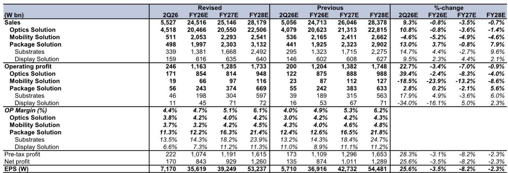
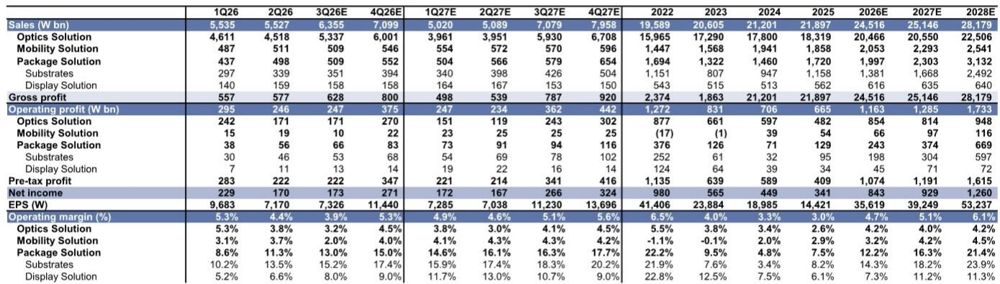
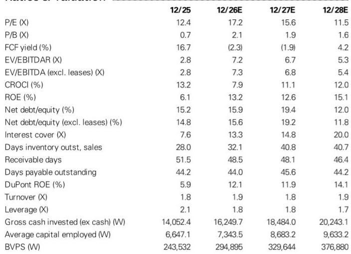

# LG Innotek 的摄像头模组业务表现强劲，但下半年成本压力限制了上行空间

LG Innotek 第二季度营收和营业利润均超出预期，显著高于市场共识。营收达 5.5 万亿韩元，较市场预期的 5.1 万亿高出 8%；营业利润 2460 亿韩元，较预期的 1960 亿韩元高出约 25%。光学解决方案部门（涵盖摄像头模组和 3D 传感器业务）是主要驱动力，该部门营收同比增长 48%，利润率同比提升超过 4 个百分点，受益于 iPhone 需求稳健、产品组合优化及汇率因素。封装解决方案部门同样贡献突出，高端基板需求及有利定价推动其营收和利润超预期。

然而，尽管短期动能明确，该公司的风险回报特征并未改善。原因在于：推动上半年超预期表现的动力将在下半年遭遇强劲逆风。内存成本上升将成为 2026 年下半年显著的不利因素，逐步侵蚀摄像头模组营收增长带来的利润空间。预计第三季度光学解决方案营业利润率将从去年同期的 3.6% 收缩至 3.2%，即便营收同比增长 19%。这是 LG Innotek 故事的核心矛盾：营收增长真实存在，但利润扩张在结构上受限。

因此，LG Innotek 的研究案例围绕一个核心问题：公司新兴的基板业务能否抵消核心摄像头模组业务的利润率压缩？现有证据表明，至少在预测期内，答案是否定的。尽管封装解决方案部门 FC-BGA 基板需求上升，营收有望持续增长，但其自身面临高产能利用率和计划资本支出带来的固定成本上升压力。综合来看，公司总盈利预测正在下调：2026 年下调 4%，2027 年下调 8%，2028 年下调 2%。

## 摄像头模组表现确实强劲，但当前利润率不可持续

第二季度光学解决方案表现令人瞩目。营收 4.518 万亿韩元，较此前预期高出 10.8%；营业利润 1710 亿韩元，较预期高出 39.4%。同比数据更为突出：营收增长 48%，营业利润率提升超过 4 个百分点。iPhone 需求稳健、产品组合向高价值摄像头模组倾斜以及韩元兑美元走弱，共同创造了近乎理想的市场环境。

问题在于，这三个有利因素中有两个是周期性或暂时性的。汇率因素可能迅速逆转，产品组合改善往往是渐进而非跳跃式变化。第三个因素——iPhone 需求稳健——是真实的，但需与即将变得不利的成本结构相权衡。报告明确指出，内存成本上升是下半年将日益抵消营收增长积极影响的不利因素。这并非推测性风险，而是已纳入第三季度预测的量化预期。

第三季度光学解决方案营收预估为 5.3 万亿韩元，环比增长 18%，同比增长 19%。从任何标准看，这都是强劲的营收增长轨迹。然而，营业利润率预计仅为 3.2%，低于 2025 年同期的 3.6%。含义明确：增量营收的边际利润正在下降。内存组件成本上涨速度超过了 LG Innotek 对摄像头模组客户的定价能力。这一动态并非 LG Innotek 独有，反映了更广泛的供应链紧张状况——组件供应商面临无法完全转嫁给 OEM 客户的投入成本上涨。

对于观察者而言，关键洞察是第二季度的超预期表现是时机和有利条件共同作用的结果，而这些条件不会重复。2025 年第二季度的低基数放大了同比数据，上半年内存成本稳定的优势正让位于下半年的成本上升。因此，利润率轨迹向下而非向上，即便营收持续增长。

## 封装解决方案增长真实，但面临产能上限和固定成本上升

封装解决方案部门（包括基板和显示解决方案）已成为 LG Innotek 真正的增长引擎。第二季度营收 4980 亿韩元，较此前预期高出 13%；营业利润 560 亿韩元，较预期高出 2.8%，营业利润率达到低两位数水平。该部门受益于高端 FC-BGA 基板需求上升（这些基板是先进计算和网络应用的关键组件）以及反映供应紧张的有利定价趋势。

积极趋势预计将持续，第三季度营收预估为 5090 亿韩元，环比增长 2%，同比增长 16%，营业利润率从去年同期的 7% 提升至 13%。这显然是一个顺应时势的业务，受益于 AI、高性能计算和数据中心扩张驱动的先进封装长期需求。

然而，该部门面临结构性限制，使其无法完全抵消摄像头模组利润率压缩。产能利用率已处于高位，意味着短期营收增长受产能制约。更重要的是，公司计划在未来几年对 FC-BGA 产能进行大量资本支出。这项投资对于捕捉未来需求是必要的，但会在中短期内增加固定成本负担。这些投资的折旧和摊销费用将在新产能营收完全实现之前开始影响利润表。

综合来看，封装解决方案部门虽有前景，但无法作为短期盈利抵消摄像头模组利润率压力的来源。预计 2026 年该部门对公司总营业利润的贡献为 2430 亿韩元，而光学解决方案为 8540 亿韩元。即使增长强劲，基板业务规模仍然太小，无法改变整体盈利轨迹。多元化叙事方向正确，但作为盈利驱动因素为时尚早。

## 修订后的预测揭示公司处于营收增长与利润率压缩之间

报告中的盈利修订表清晰说明了情况。2026 年，总营收预估仅下调 0.8%，但营业利润预估下调 3.4%。2027 年，差距扩大：营收预估下调 3.5%，营业利润预估下调 7.0%。光学解决方案部门是下调的主要来源，2027 年营业利润预估下调 8.3%。移动解决方案部门（包括汽车电子）也在下调，2027 年营业利润预估下调 13.2%。

这种模式——营收表现优于利润——正是面临投入成本上涨但缺乏相应定价能力的公司所预期的。营收受益于销量增长和有利的终端市场需求，但利润受到组件成本上升以及基板业务折旧增加的挤压。净利润率预计从 2025 年的 1.6% 提升至 2026 年的 3.4%，但这一改善已反映在 17.2 倍远期市盈率的报价中。

自由现金流情况同样值得关注。在 2025 年产生 7050 亿韩元正自由现金流后，公司预计 2026 年将出现 3330 亿韩元负自由现金流，2027 年为 2760 亿韩元负自由现金流，主要受资本支出计划驱动。这意味着公司将通过债务或现金储备为增长提供资金，这增加了财务风险，降低了向股东返还资本的灵活性。2026 年 0.7% 的股息率对此风险的补偿有限。

## 评估 LG Innotek 研究案例的决策框架

对于评估 LG Innotek 的机构研究者，决策框架应围绕三个变量：内存成本轨迹、基板产能爬坡速度以及公司在苹果供应链中维持或获得摄像头模组市场份额的能力。

第一个变量，内存成本，最为直接且影响最大。下半年利润率压缩与内存价格上涨直接相关。如果内存成本稳定或下降，利润率前景将显著改善。然而，这是 LG Innotek 无法控制的外部变量，当前趋势指向成本上升。研究者应关注内存行业供需动态和定价报告，作为 LG Innotek 利润率轨迹的先行指标。

第二个变量，基板产能，决定了封装解决方案部门的中期盈利贡献。资本支出计划将增加产能，但营收实现相对于折旧费用的时间点至关重要。如果新 FC-BGA 产能爬坡快于预期，固定成本负担将被稀释，利润率将改善。如果爬坡延迟，折旧费用将在较长时间内压低利润率。研究者应跟踪公司的产能利用率和关键客户的新产品认证情况。

第三个变量，苹果摄像头模组市场份额，是最重要的结构性驱动因素。LG Innotek 的光学解决方案业务高度依赖 iPhone 出货量及其在每台设备中摄像头模组内容的份额。报告将高于或低于预期的市场份额确定为研究案例的关键风险。份额增长将直接提升营收，并可能改善定价能力，部分抵消内存成本逆风。相反，份额损失将加剧利润率压力。研究者应关注供应链报告和拆解分析，以获取内容份额变化的证据。

这三个变量的相互作用决定了合适的估值倍数。当前分部估值法对光学解决方案业务应用 8.1 倍倍数，对封装解决方案业务应用 16.0 倍倍数。光学解决方案倍数已从 10.2 倍下调，反映了较低的利润率预期。如果内存成本稳定且市场份额保持，倍数可能扩大。如果两个变量均恶化，倍数可能进一步收缩。

## 基板业务是真实的增长故事，但无法改变短期盈利轨迹

需要明确封装解决方案部门代表什么和不代表什么。它确实代表了先进封装领域的长期增长机会，受 AI 加速器、高性能计算和网络基础设施需求驱动。该部门营业利润率正在改善，资本支出计划使公司能够捕捉未来需求。仅基板业务 2028 年营收预估为 2.492 万亿韩元，几乎是 2026 年预估 1.381 万亿韩元的两倍。

该部门不代表的是足以改变整体研究案例的短期盈利催化剂。即使增长强劲，封装解决方案部门预计 2026 年贡献 2430 亿韩元营业利润，而光学解决方案为 8540 亿韩元。基板业务需要再增长数年才能有意义地抵消摄像头模组业务的低迷。多元化论点方向正确，但时间上尚远。

对管理层的战略含义明确：公司必须在管理摄像头模组业务以维持利润率稳定的同时，积极投资基板业务以实现未来增长。这是一个艰难的平衡，因为基板所需的资本支出减少了自由现金流并增加了财务杠杆。净债务权益比率预计从 2025 年的 15.2% 上升至 2027 年的 19.4%，之后下降。资产负债表仍可控，但趋势指向盈利增长放缓时杠杆率上升。

对于研究者而言，结论是 LG Innotek 是一家在一个部门拥有真实结构性增长、在另一个部门面临周期性利润率压力的公司。摄像头模组业务在可预见的未来将继续驱动大部分营收和利润，其利润率轨迹受投入成本上涨制约。基板业务提供了引人注目的长期增长故事，但规模太小，无法改变短期盈利格局。该报价为 2026 年盈利的 17.2 倍和账面价值的 1.9 倍，在缺乏明确的利润率扩张催化剂的情况下，这些倍数提供的上行空间有限。报告观点反映了这种平衡但缺乏兴奋点的风险回报特征。

*仅供参考。部分内容可能基于源材料通过 AI 辅助生成、翻译、总结或编辑，可能存在遗漏或错误。请独立核实。本文不构成研究、法律、税务、会计或其他专业建议。*

仅供参考。部分内容可能基于源材料通过 AI 辅助生成、翻译、总结或编辑，可能存在遗漏或错误。请独立核实。本文不构成研究、法律、税务、会计或其他专业建议。

