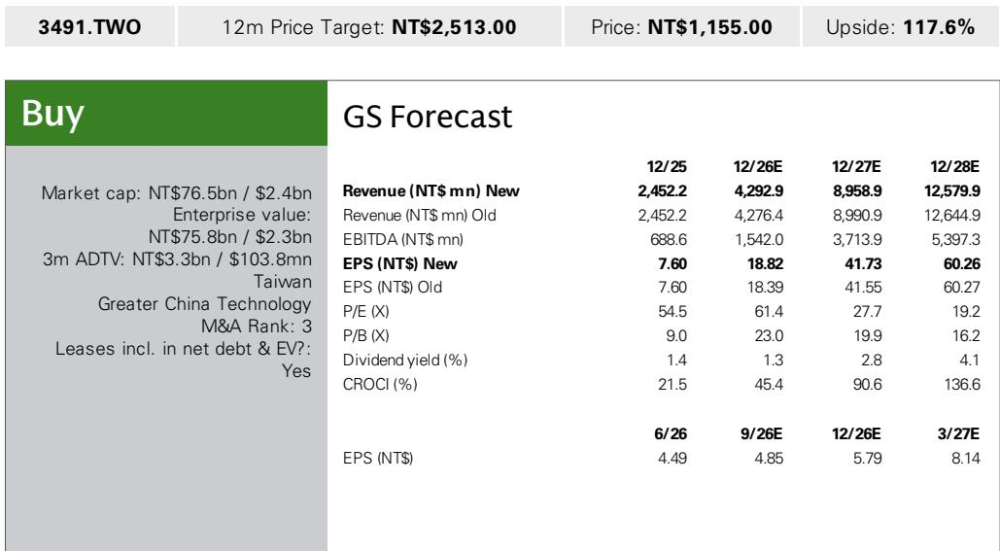
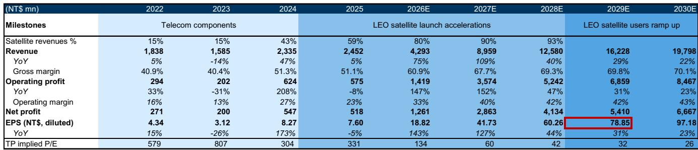
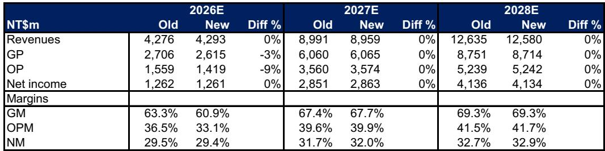

# A Model Transition, Not a Miss: Why UMT’s 2Q26 Revenue Dip Signals a Stronger Trajectory for LEO Satellite Component Suppliers

UMT’s June revenues surged 89% year-on-year to NT$257 million, yet the company’s second-quarter revenues of NT$902 million fell 7% below analyst estimates. The cause was not fading demand or competitive loss, but a deliberate model transition by its largest LEO satellite customer. This distinction matters. For those evaluating the LEO satellite supply chain, the quarter’s headline miss obscures a more important structural story: UMT is navigating a temporary production reconfiguration that will unlock higher dollar content per satellite, expanding gross margins from 55.6% in 2Q26 toward a projected 68% by 4Q26. The company’s rectangular waveguide technology is becoming more embedded in each satellite as operators adopt additional frequency bands, and the addressable market is extending beyond satellite communications into AI data center interconnects. The tension between a near-term hiccup and a multi-year expansion creates a strategic observation point.

The report projects UMT’s revenues will grow from NT$2.45 billion in 2025 to NT$12.58 billion by 2028, a compound annual growth rate of approximately 72%. Operating profit is expected to expand from NT$575 million to NT$5.24 billion over the same period. These projections rest on three structural drivers: accelerating LEO satellite launch cadence, increasing waveguide content per satellite as more bands are deployed, and the emergence of data center applications for waveguide technology. The 2Q26 revenue miss, while real, is a one-time adjustment within a much larger trajectory.

## The 2Q26 Model Transition Was a Temporary Disruption, Not a Demand Signal, and Will Reverse by 3Q26

UMT’s 2Q26 revenues of NT$902 million represented a 12% sequential decline from 1Q26’s NT$1.02 billion, and fell 7% below the analyst estimate of NT$966 million and 12% below Bloomberg consensus of NT$1.028 billion. Gross margin compressed from 58.0% in 1Q26 to 55.6% in 2Q26, also missing estimates of 59.6%. Operating profit declined 23% quarter-on-quarter to NT$241 million, trailing estimates by 24%. The operating expense ratio rose to 28.8% versus the 26.7% estimate, a direct consequence of the smaller revenue base failing to absorb fixed costs.

The root cause was a model transition by UMT’s major customer, a leading global LEO satellite operator. Model transitions in aerospace supply chains typically involve requalification of components, changes in production specifications, and temporary inventory adjustments by the customer. These are not indicators of end-market weakness. The analyst explicitly expects the impact from this transition to be lower in 3Q26 compared to 2Q26, supporting a return to sequential monthly revenue growth. July 2026 revenues are estimated at NT$277 million, up 8% month-on-month and 119% year-on-year, with September projected to reach NT$520 million, a 68% sequential jump.

The key metric to watch is the monthly revenue progression from July through September. If the analyst’s estimates hold, 3Q26 revenues of NT$1.108 billion would represent 23% sequential growth, fully reversing the 2Q26 decline and establishing a new baseline for the acceleration into 4Q26.

## Gross Margin Will Recover and Expand as LEO Satellite Revenue Share Crosses the 80% Threshold

Gross margin dynamics in this business are driven by product mix, not volume alone. In 2Q26, LEO satellite revenues already constituted a majority of UMT’s total, but the model transition temporarily diluted the mix. The analyst projects gross margin will improve sequentially from 55.6% in 2Q26 to 59.8% in 3Q26 and 68.0% in 4Q26. This recovery is not speculative; it is grounded in the expected resumption of higher-margin LEO satellite shipments as the model transition concludes.

The structural margin story is even more compelling. UMT’s gross margin has already moved from 40.4% in 2023 to 51.3% in 2024, and the analyst projects it will reach 60.9% in 2026, 67.7% in 2027, and 69.3% in 2028. The driving mechanism is the rising share of satellite revenues in the total mix, projected to increase from 59% in 2025 to 80% in 2026 and 93% by 2028. Traditional telecom radio frequency products carry lower margins; LEO satellite components command a premium. As the satellite share crosses 80%, the blended margin naturally expands toward the satellite component margin, which the analyst expects to approach 70%.

This margin expansion is the single most important financial driver for UMT’s earnings growth. Operating margin is projected to rise from 23.4% in 2025 to 33.1% in 2026 and 41.7% by 2028. Each percentage point of margin expansion compounds significantly given the revenue growth trajectory.

## Waveguide Content Per Satellite Is Increasing as Operators Add Frequency Bands, Creating a Second Growth Vector

The report identifies a specific technical driver that multiplies UMT’s opportunity beyond simple satellite launch count. Rectangular waveguides are used to guide microwave and millimeter-wave signals in satellites. As LEO satellite operators deploy additional frequency bands per satellite to increase capacity and reduce latency, the number of waveguide components required per satellite increases. This is not a one-time step change but a progressive specification upgrade that occurs as constellations mature and operators seek to maximize spectral efficiency.

The analyst explicitly notes that waveguide dollar content per LEO satellite is increasing given more bands are adopted per satellite. This creates a dual growth engine: more satellites being launched and more waveguides per satellite. The revenue projections already embed this assumption, with 2027E revenue growth of 109% year-on-year and 2028E growth of 40%, even as the base expands. The deceleration from 109% to 40% reflects the natural maturation of the launch cycle, but the absolute revenue step from NT$8.96 billion to NT$12.58 billion in a single year still implies substantial content-per-satellite growth.

For observers, this means that simply tracking LEO satellite launch schedules understates UMT’s addressable market. The company benefits from both volume and value per unit, a combination that typically supports above-average revenue durability during periods of launch cadence variation.

## The Addressable Market Is Expanding from Satellite Communications to AI Data Center Interconnects

The report introduces a third growth vector that extends UMT’s opportunity beyond its core LEO satellite business. Rectangular waveguide technology is being explored for high-speed interconnection in AI data centers. This is a nascent but potentially transformative application. As AI training clusters scale to tens of thousands of accelerators, the interconnection network becomes a bottleneck. Traditional copper and optical interconnects face distance, power, and latency constraints. Waveguide-based millimeter-wave interconnects offer a potential solution for rack-to-rack and cluster-level connectivity at speeds that could complement or compete with emerging optical interconnect standards.

The analyst states that the waveguide end market expands from LEO satellite to AI data center for high-speed interconnection in scale up. While the report does not provide specific revenue estimates for this application, its inclusion in the thesis signals that management and the analyst see a path beyond satellite communications. For a company whose satellite revenue share is projected to reach 93% by 2028, diversification into data centers would reduce concentration risk and extend the growth runway beyond the LEO satellite buildout cycle.

This is a second-order implication worth monitoring. If waveguide-based interconnects gain traction in data center architecture, UMT’s addressable market would expand from a few thousand satellites per year to potentially millions of interconnect ports per year. The technology is early stage, but the directional signal is clear: the company’s core competency in millimeter-wave signal guidance has applications beyond its current served market.

## A Decision Framework for Evaluating LEO Satellite Component Suppliers

For institutional observers evaluating UMT or comparable LEO satellite component suppliers, the 2Q26 results offer a structured framework for assessment. The framework consists of four sequential considerations.

First, distinguish between temporary and structural revenue disruptions. UMT’s 2Q26 miss was driven by a model transition, a temporary event with a defined end date. If the miss had been driven by launch delays, customer loss, or technology substitution, the risk profile would be fundamentally different. The analyst’s expectation of sequential revenue recovery in 3Q26 provides a clear test: if monthly revenues do not re-accelerate as projected, the initial diagnosis should be revisited.

Second, track gross margin as the primary lead indicator of product mix improvement. UMT’s gross margin trajectory from 2023 to 2028 shows a clear correlation with satellite revenue share. Observers should monitor quarterly gross margin against the satellite revenue percentage. If gross margin expands faster than the satellite share increase, it suggests content-per-satellite growth is accelerating. If it lags, the model transition impact may be persisting or competitive pressure may be emerging.

Third, calibrate valuation against the revenue and margin average plus one standard deviation of 40x. This premium reflects the product mix upgrade toward LEO satellites. The justification for the premium depends on the sustainability of 109% revenue growth in 2027 and 40% in 2028. If launch cadence or content-per-satellite growth disappoints, the multiple would contract. The framework requires observers to assess whether the growth duration justifies the multiple premium.

Fourth, monitor the data center waveguide opportunity as a call option. The report does not assign revenue or margin to this application, but its inclusion in the thesis creates upside optionality. Observers should track announcements of waveguide-based interconnect trials or partnerships with data center equipment providers. Any commercial validation would expand the addressable market and support a higher terminal valuation.

## The Risk of In-House Manufacturing by LEO Satellite Operators Is Real but Manageable

The report explicitly identifies a key risk: LEO satellite operators manufacturing waveguide components in-house. This is a credible concern. As LEO constellations scale, operators have incentives to vertically integrate to control costs, quality, and supply chain security. If a major customer internalizes waveguide production, UMT would face revenue loss and margin compression.

However, three factors mitigate this risk in the medium term. First, waveguide manufacturing requires specialized precision engineering and qualification processes. Building in-house capability takes years and significant capital investment. Second, UMT serves leading global LEO satellite operators, implying it has already achieved qualification status, which creates switching costs for customers. Third, the technology is evolving as more bands are deployed, meaning operators may prefer to outsource to specialists who can innovate across multiple customer programs. The risk is real but likely to materialize gradually, if at all, giving UMT time to diversify its customer base and expand into data center applications.

*For informational purposes only. Portions may be generated, translated, summarized, or edited with AI assistance based on source materials and may contain omissions or errors. Please verify independently. This is not professional advice.*

For informational purposes only. Portions may be generated, translated, summarized, or edited with AI assistance based on source materials and may contain omissions or errors. Please verify independently. This is not professional advice.

