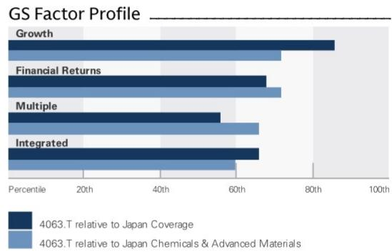
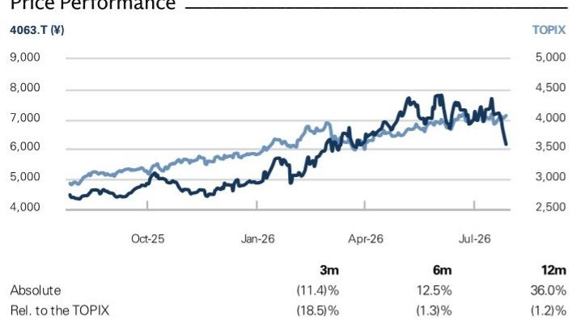
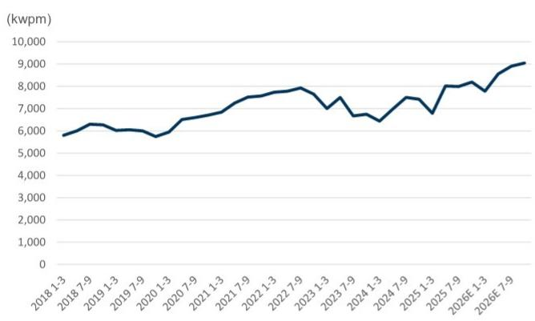
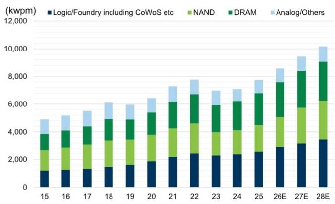
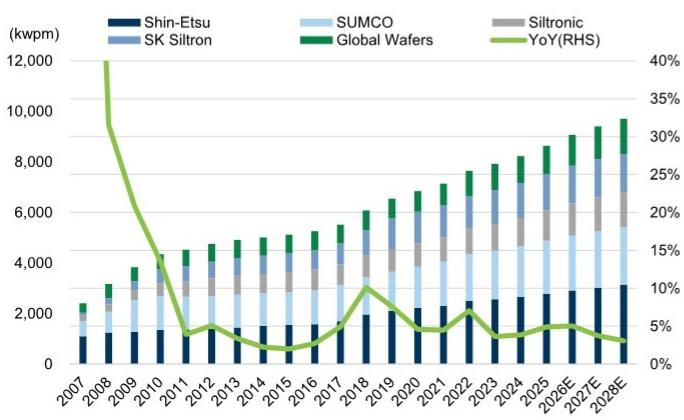

# Shin-Etsu Chemical (4063.T)

# Q1 review: FY3/27 forecast adjusted on PVC outlook, but semiconductor and AI materials support FY3/28 onwards

4063.T

12m Price Target: ¥9,510

Price: ¥6,159

Upside: 54.4%

We have revised our earnings forecasts for Shin-Etsu Chemical following its Q1 results and our subsequent review of business trends. We adjusted our FY3/27 operating profit forecast by 5%, primarily reflecting a lower PVC pricing assumption in the Infrastructure segment. While the PVC outlook also affects our FY3/28–29 forecasts, the impact is expected to be partially offset by growth in the Electronics Materials business—driven by silicon wafers, photoresists, and magnetic materials—as well as performance in Functional Materials, supported by silicones and new products. As a result, our FY3/28 and FY3/29 operating profit forecasts are adjusted by only 2% and less than 1%, respectively.

The business environment for PVC from Q2 onward is clearly more challenging than we previously expected. The stock has corrected, falling 8.3% between the Q1 earnings announcement and July 27 vs a 1.4% gain for TOPIX. However, we believe the market has largely priced in the anticipated downward consensus revisions. Shin-Etsu now trades at a relatively attractive valuation, while the contribution of the cyclical Infrastructure segment to company-wide operating profit is expected to decline to an average of 18% over FY3/27–29, down from a 42% average over the past five years.

In contrast, expanding demand for semiconductor materials and AI-related products—particularly in front-end semiconductor applications—should drive a CAGR of 19% in operating profit between FY3/26 and FY3/29. Against this backdrop, the stock is trading at 17x FY3/28 P/E, within its 10-year historical range of 14–21x and increasingly attractive in our view. We adjust our target price slightly to ¥9,510 from ¥9,610 to reflect our revised earnings forecasts, but maintain our positive rating.

## BUY

Atsushi Ikeda
+81(3)4587-9940 | atsushi.ikeda@gs.com
GS Japan Co., Ltd.

Yuri Izumikawa
+81(3)4587-3643 | yuri.x.izumikawa@gs.com
GS Japan Co., Ltd.

Key Data

Market cap: ¥11.4tr / $69.8bn  
Enterprise value: ¥10.5tr / $64.0bn  
3m ADTV: ¥57.0bn / $355.5mn  
Japan  
Japan Chemicals & Advanced Materials  
M&A Rank: 3  
Leases incl. in net debt & EV?: No

<table><tr><td colspan="5">GS Forecast</td></tr><tr><td></td><td>3/26</td><td>3/27E</td><td>3/28E</td><td>3/29E</td></tr><tr><td>Revenue (¥ bn)</td><td>2,574.0</td><td>2,863.7</td><td>3,155.5</td><td>3,496.5</td></tr><tr><td>Op. profit (¥ bn) New</td><td>635.2</td><td>738.4</td><td>873.3</td><td>1,065.1</td></tr><tr><td>Op. profit (¥ bn) Old</td><td>635.2</td><td>780.5</td><td>887.9</td><td>1,069.7</td></tr><tr><td>Op. profit CoE (¥ bn)</td><td>-</td><td>700.0</td><td>-</td><td>-</td></tr><tr><td>EPS (¥) New</td><td>255.5</td><td>307.9</td><td>370.2</td><td>445.5</td></tr><tr><td>EPS (¥) Old</td><td>255.5</td><td>322.8</td><td>374.6</td><td>445.7</td></tr><tr><td>P/E (X)</td><td>19.0</td><td>20.0</td><td>16.6</td><td>13.8</td></tr><tr><td>P/B (X)</td><td>2.0</td><td>2.6</td><td>2.5</td><td>2.5</td></tr><tr><td>CROCI (%)</td><td>10.3</td><td>11.0</td><td>12.1</td><td>13.4</td></tr><tr><td></td><td>6/26</td><td>9/26E</td><td>12/26E</td><td>3/27E</td></tr><tr><td>EPS (¥)</td><td>70.3</td><td>-</td><td>-</td><td>-</td></tr></table>

  
Source: Company data, GS estimates. See disclosures for details.

## Shin-Etsu Chemical (4063.T)

Rating since Aug 15, 2019

Ratios & Valuation

<table><tr><td></td><td>3/26</td><td>3/27E</td><td>3/28E</td><td>3/29E</td></tr><tr><td>P/E (X)</td><td>19.0</td><td>20.0</td><td>16.6</td><td>13.8</td></tr><tr><td>P/B (X)</td><td>2.0</td><td>2.6</td><td>2.5</td><td>2.5</td></tr><tr><td>FCF yield (%)</td><td>4.1</td><td>3.3</td><td>4.1</td><td>5.3</td></tr><tr><td>EV/EBITDAR (X)</td><td>8.8</td><td>10.2</td><td>8.8</td><td>7.5</td></tr><tr><td>EV/EBITDA (excl. leases) (X)</td><td>8.8</td><td>10.2</td><td>8.8</td><td>7.5</td></tr><tr><td>CROCI (%)</td><td>10.3</td><td>11.0</td><td>12.1</td><td>13.4</td></tr><tr><td>ROE (%)</td><td>10.4</td><td>12.6</td><td>14.9</td><td>17.9</td></tr><tr><td>Net debt/equity (%)</td><td>(30.5)</td><td>(25.8)</td><td>(21.0)</td><td>(17.9)</td></tr><tr><td>Net debt/equity (excl. leases) (%)</td><td>(30.5)</td><td>(25.8)</td><td>(21.0)</td><td>(17.9)</td></tr><tr><td>Interest cover (X)</td><td>234.7</td><td>144.8</td><td>171.2</td><td>208.8</td></tr><tr><td>Days inventory outst, sales</td><td>110.7</td><td>105.5</td><td>103.6</td><td>99.4</td></tr><tr><td>Receivable days</td><td>74.5</td><td>72.1</td><td>72.4</td><td>72.2</td></tr><tr><td>Days payable outstanding</td><td>38.9</td><td>36.8</td><td>37.9</td><td>38.9</td></tr><tr><td>DuPont ROE (%)</td><td>10.2</td><td>12.2</td><td>14.1</td><td>16.6</td></tr><tr><td>Turnover (X)</td><td>0.5</td><td>0.5</td><td>0.6</td><td>0.6</td></tr><tr><td>Leverage (X)</td><td>1.2</td><td>1.2</td><td>1.2</td><td>1.2</td></tr><tr><td>Gross cash invested (ex cash) (¥)</td><td>6,992.9</td><td>7,346.8</td><td>7,774.2</td><td>8,215.7</td></tr><tr><td>Average capital employed (¥)</td><td>3,186.3</td><td>3,301.8</td><td>3,495.4</td><td>3,733.4</td></tr><tr><td>BVPS (¥)</td><td>2,404.5</td><td>2,409.1</td><td>2,472.4</td><td>2,509.5</td></tr></table>

Income Statement (¥ bn)

<table><tr><td colspan="5">Income Statement (EUR)</td></tr><tr><td></td><td>3/26</td><td>3/27E</td><td>3/28E</td><td>3/29E</td></tr><tr><td>Total revenue</td><td>2,574.0</td><td>2,863.7</td><td>3,155.5</td><td>3,496.5</td></tr><tr><td>Cost of goods sold</td><td>(1,693.2)</td><td>(1,852.1)</td><td>(1,981.1)</td><td>(2,097.8)</td></tr><tr><td>SG&A</td><td>(245.6)</td><td>(273.2)</td><td>(301.1)</td><td>(333.6)</td></tr><tr><td>R&D</td><td>-</td><td>-</td><td>-</td><td>-</td></tr><tr><td>Other operating inc./(exp.)</td><td>-</td><td>-</td><td>-</td><td>-</td></tr><tr><td>EBITDA</td><td>878.2</td><td>988.7</td><td>1,148.5</td><td>1,355.7</td></tr><tr><td>Depreciation & amortization</td><td>(243.0)</td><td>(250.3)</td><td>(275.2)</td><td>(290.6)</td></tr><tr><td>EBIT</td><td>635.2</td><td>738.4</td><td>873.3</td><td>1,065.1</td></tr><tr><td>Net interest inc./(exp.)</td><td>60.2</td><td>64.9</td><td>66.9</td><td>67.9</td></tr><tr><td>Income/(loss) from associates</td><td>0.0</td><td>0.0</td><td>0.0</td><td>-</td></tr><tr><td>Pre-tax profit</td><td>708.5</td><td>807.2</td><td>943.1</td><td>1,135.9</td></tr><tr><td>Provision for taxes</td><td>(202.2)</td><td>(217.9)</td><td>(254.6)</td><td>(306.7)</td></tr><tr><td>Minority interest</td><td>(31.8)</td><td>(35.2)</td><td>(41.6)</td><td>(50.7)</td></tr><tr><td>Preferred dividends</td><td>-</td><td>-</td><td>-</td><td>-</td></tr><tr><td>Net inc. (pre-exceptionals)</td><td>474.5</td><td>554.1</td><td>646.9</td><td>778.5</td></tr><tr><td>Post-tax exceptionals</td><td>-</td><td>-</td><td>-</td><td>-</td></tr><tr><td>Net inc. (post-exceptionals)</td><td>474.5</td><td>554.1</td><td>646.9</td><td>778.5</td></tr><tr><td>EPS (basic, pre-except) (¥)</td><td>255.5</td><td>307.9</td><td>370.2</td><td>445.5</td></tr><tr><td>EPS (diluted, pre-except) (¥)</td><td>255.5</td><td>307.9</td><td>370.2</td><td>445.5</td></tr><tr><td>EPS (basic, post-except) (¥)</td><td>255.5</td><td>307.9</td><td>370.2</td><td>445.5</td></tr><tr><td>EPS (diluted, post-except) (¥)</td><td>255.5</td><td>307.9</td><td>370.2</td><td>445.5</td></tr><tr><td>DPS (¥)</td><td>106.0</td><td>120.0</td><td>150.0</td><td>180.0</td></tr><tr><td>Div. payout ratio (%)</td><td>41.5</td><td>39.0</td><td>40.5</td><td>40.4</td></tr></table>

Growth & Margins (%)

<table><tr><td></td><td>3/26</td><td>3/27E</td><td>3/28E</td><td>3/29E</td></tr><tr><td>Total revenue growth</td><td>0.5</td><td>11.3</td><td>10.2</td><td>10.8</td></tr><tr><td>EBITDA growth</td><td>(10.4)</td><td>12.6</td><td>16.2</td><td>18.0</td></tr><tr><td>EPS growth</td><td>(6.2)</td><td>20.5</td><td>20.2</td><td>20.3</td></tr><tr><td>DPS growth</td><td>0.0</td><td>13.2</td><td>25.0</td><td>20.0</td></tr><tr><td>EBIT margin</td><td>24.7</td><td>25.8</td><td>27.7</td><td>30.5</td></tr><tr><td>EBITDA margin</td><td>34.1</td><td>34.5</td><td>36.4</td><td>38.8</td></tr><tr><td>Net income margin</td><td>18.4</td><td>19.3</td><td>20.5</td><td>22.3</td></tr></table>

Price Performance  
  
Source: FactSet. Price as of 27 Jul 2026 close.

Balance Sheet (¥ bn)

<table><tr><td colspan="5">Balance Sheet (+ bn)</td></tr><tr><td></td><td>3/26</td><td>3/27E</td><td>3/28E</td><td>3/29E</td></tr><tr><td>Cash & cash equivalents</td><td>1,660.1</td><td>1,415.6</td><td>1,206.1</td><td>1,082.1</td></tr><tr><td>Accounts receivable</td><td>535.4</td><td>595.6</td><td>656.3</td><td>727.3</td></tr><tr><td>Inventory</td><td>790.9</td><td>865.1</td><td>925.4</td><td>979.9</td></tr><tr><td>Other current assets</td><td>113.3</td><td>113.3</td><td>113.3</td><td>113.3</td></tr><tr><td>Total current assets</td><td>3,106.7</td><td>2,997.5</td><td>2,909.7</td><td>2,912.0</td></tr><tr><td>Net PP&E</td><td>2,153.3</td><td>2,222.4</td><td>2,355.2</td><td>2,485.6</td></tr><tr><td>Net intangibles</td><td>34.7</td><td>34.7</td><td>34.7</td><td>34.7</td></tr><tr><td>Total investments</td><td>151.8</td><td>151.8</td><td>151.8</td><td>151.8</td></tr><tr><td>Other long-term assets</td><td>198.3</td><td>198.3</td><td>198.3</td><td>198.3</td></tr><tr><td>Total assets</td><td>5,644.8</td><td>5,604.7</td><td>5,649.8</td><td>5,782.4</td></tr><tr><td>Accounts payable</td><td>176.4</td><td>196.8</td><td>214.7</td><td>231.9</td></tr><tr><td>Short-term debt</td><td>6.9</td><td>6.9</td><td>6.9</td><td>6.9</td></tr><tr><td>Short-term lease liabilities</td><td>-</td><td>-</td><td>-</td><td>-</td></tr><tr><td>Other current liabilities</td><td>343.3</td><td>343.3</td><td>343.3</td><td>343.3</td></tr><tr><td>Total current liabilities</td><td>526.7</td><td>547.1</td><td>565.0</td><td>582.2</td></tr><tr><td>Long-term debt</td><td>236.4</td><td>236.4</td><td>236.4</td><td>236.4</td></tr><tr><td>Long-term lease liabilities</td><td>-</td><td>-</td><td>-</td><td>-</td></tr><tr><td>Other long-term liabilities</td><td>271.9</td><td>271.9</td><td>271.9</td><td>271.9</td></tr><tr><td>Total long-term liabilities</td><td>508.2</td><td>508.2</td><td>508.2</td><td>508.2</td></tr><tr><td>Total liabilities</td><td>1,034.9</td><td>1,055.3</td><td>1,073.2</td><td>1,090.4</td></tr><tr><td>Preferred shares</td><td>-</td><td>-</td><td>-</td><td>-</td></tr><tr><td>Total common equity</td><td>4,464.4</td><td>4,335.3</td><td>4,320.9</td><td>4,385.6</td></tr><tr><td>Minority interest</td><td>178.9</td><td>214.1</td><td>255.7</td><td>306.4</td></tr><tr><td>Total liabilities & equity</td><td>5,678.2</td><td>5,604.7</td><td>5,649.8</td><td>5,782.4</td></tr><tr><td>Net debt, adjusted</td><td>(1,416.8)</td><td>(1,172.3)</td><td>(962.8)</td><td>(838.8)</td></tr></table>

<table><tr><td colspan="5">Cash Flow (¥ bn)</td></tr><tr><td></td><td>3/26</td><td>3/27E</td><td>3/28E</td><td>3/29E</td></tr><tr><td>Net income</td><td>474.5</td><td>554.1</td><td>646.9</td><td>778.5</td></tr><tr><td>D&A add-back</td><td>243.0</td><td>250.3</td><td>275.2</td><td>290.6</td></tr><tr><td>Minority interest add-back</td><td>31.8</td><td>35.2</td><td>41.6</td><td>50.7</td></tr><tr><td>Net (inc)/dec working capital</td><td>(39.8)</td><td>(114.1)</td><td>(103.1)</td><td>(108.2)</td></tr><tr><td>Other operating cash flow</td><td>3.2</td><td>0.0</td><td>0.0</td><td>-</td></tr><tr><td>Cash flow from operations</td><td>712.7</td><td>725.5</td><td>860.6</td><td>1,011.6</td></tr><tr><td>Capital expenditures</td><td>(339.7)</td><td>(354.0)</td><td>(408.0)</td><td>(421.0)</td></tr><tr><td>Acquisitions</td><td>-</td><td>-</td><td>-</td><td>-</td></tr><tr><td>Divestitures</td><td>-</td><td>-</td><td>-</td><td>-</td></tr><tr><td>Others</td><td>(205.1)</td><td>-</td><td>-</td><td>-</td></tr><tr><td>Cash flow from investing</td><td>(544.8)</td><td>(354.0)</td><td>(408.0)</td><td>(421.0)</td></tr><tr><td>Repayment of lease liabilities</td><td>-</td><td>-</td><td>-</td><td>-</td></tr><tr><td>Dividends paid (common & pref)</td><td>(196.8)</td><td>(215.9)</td><td>(262.1)</td><td>(314.6)</td></tr><tr><td>Inc/(dec) in debt</td><td>(3.4)</td><td>-</td><td>-</td><td>-</td></tr><tr><td>Other financing cash flows</td><td>(272.0)</td><td>(400.0)</td><td>(400.0)</td><td>(400.0)</td></tr><tr><td>Cash flow from financing</td><td>(472.1)</td><td>(615.9)</td><td>(662.1)</td><td>(714.6)</td></tr><tr><td>Total cash flow</td><td>(304.3)</td><td>(244.4)</td><td>(209.5)</td><td>(124.0)</td></tr><tr><td>Free cash flow</td><td>373.0</td><td>371.5</td><td>452.6</td><td>590.6</td></tr></table>

Source: Company data, GS estimates.

## Electronics Materials

The Electronics Materials segment delivered a strong start to FY3/27, with Q1 operating profit rising 23% YoY and 19% QoQ. Among the segment's businesses, optical fiber preforms and rare-earth magnets recorded particularly strong profit growth, while photoresists, encapsulation materials, quartz substrates, and other products also achieved double-digit earnings growth. Semiconductor wafers posted more modest profit growth of around 5% YoY due to a high comparison base in the prior year. On a QoQ basis, encapsulation materials saw especially strong growth, while rare-earth magnets, semiconductor wafers, photomask blanks, and quartz substrates delivered profit growth broadly in line with the segment average. We estimate that photoresists achieved nearly 10% profit growth despite absorbing depreciation costs associated with the new Isesaki plant.

## Semiconductor Wafers

Management estimates that AI-related applications now account for nearly 30% of 300mm wafer demand. Beyond GPUs, ASICs, and HBM, AI-driven demand is increasingly spreading to memory, power management ICs, and other supporting logic semiconductors, suggesting stronger-than-expected AI-related wafer consumption. This is important when assessing the future trajectory of 300mm wafer demand.

In addition, management indicated that bonded wafers used in applications such as CMOS Bonded on Array (CBA) for 3D NAND now account for nearly 10% of total 300mm wafer demand. As advanced semiconductor applications increasingly require multiple wafers per device, this trend could provide a larger-than-expected boost to future 300mm wafer demand.

The company also highlighted rapidly increasing demand for process wafers, including dummy monitor wafers and test wafers required for new product and production-line ramp-ups. These developments represent further signs of near-term expansion in 300mm wafer demand and support our constructive outlook.

While we believe Shin-Etsu retains some brownfield expansion capacity, management reiterated that capacity additions will remain disciplined and primarily tied to customer commitments under long-term agreements. Based on ongoing contract negotiations, we expect greenfield investments will eventually become necessary. However, given the extremely high quality and cost requirements for leading-edge AI-related wafers, the company continues to take a cautious stance toward further capacity expansion.

This cautious approach is consistent with comments made by SUMCO President Jiro Tatsuta in a July 27 Nikkei XTECH interview, where he stated that while AI demand could persist for three to five years, wafer manufacturers should not rush capacity expansion at the expense of quality. With Japan's two dominant suppliers of advanced wafers demonstrating disciplined investment behavior, we expect investors to increasingly anticipate sustained supply tightness and a favorable seller's market.

Given Shin-Etsu's relatively long contract durations versus peers, we continue to expect meaningful wafer price increases to become more visible from FY3/29 onward. In the meantime, earnings growth should remain robust, supported by higher shipment volumes, improving utilization rates, and a richer product mix driven by advanced-node products.

## Lithography Materials, Optical Materials, and Magnetic Materials

We have raised our earnings forecasts from FY3/27 onward for photoresists, photomask blanks, rare-earth magnets, encapsulation materials, and optical fiber preforms.

Photoresists remain particularly strong. In addition to advanced EUV and ArF photoresists, multilayer materials are seeing substantial growth driven by leading-edge GPUs and HBM. The timing of the new Isesaki plant ramp-up appears highly favorable, and we expect high growth to continue, supported by attractive incremental margins.

Rare-earth magnets remain exposed to potential bottlenecks in heavy rare-earth procurement. However, the company is actively working with customers to significantly reduce, or ultimately eliminate the use of heavy rare-earth elements while simultaneously implementing price increases. Demand from HEVs, HDDs, and semiconductor manufacturing equipment also remains healthy.

Quartz cloth used in encapsulation materials is currently undergoing qualification for AI server motherboard CCL applications, although sample shipment volumes have already increased considerably. Meanwhile, demand for optical fiber preforms now exceeds production capacity, prompting the company to consider further expansion. We will closely monitor developments in this area.

## Infrastructure Materials

We have lowered our assumptions for North American and export PVC markets from Q2 FY3/27 onward, resulting in substantial adjustments to our operating profit forecasts for the segment of 26%, 25%, and 26% for FY3/27, FY3/28, and FY3/29, respectively.

The revised outlook reflects intensifying price competition, particularly in Asia, from Chinese carbide-based production and naphtha-based PVC producers. Combined with demand conditions and pricing dynamics, we also see increasing risk of PVC market adjustments in North America from July onward due to supply-demand balance considerations.

## Functional Materials

The Functional Materials segment achieved a step-up in profitability in Q4 FY3/26, and this favorable trend continued into Q1. Growth was driven not only by strong performance in core silicone and cellulose businesses but also by expanding contributions from newer products such as pellicles, anode materials, and optical isolators.

Silicones were particularly strong, benefiting from broad-based AI-related demand, including thermal management materials for AI servers and components used in power transmission infrastructure. Demand for contact lens applications also remained favorable. Although the business is facing higher raw material costs, including methanol, pricing initiatives appear to be gaining traction. Overall, our impression remains positive, and we have raised our operating profit forecasts for the segment from FY3/27 onward.

Exhibit 1: 300mm wafer shipment (kwpm)  
  
Source: Company data, GS Global Investment Research

Exhibit 2: Global supply/demand balance outlook for 300mm wafers  
  
Source: Company data, GS Global Investment Research, SEMI

Exhibit 3: 300mm wafer supply outlook  
  
Source: GS Global Investment Research

Exhibit 4: 300mm supply demand outlook  
  
Source: GS Global Investment Research

Exhibit 5: Shin-Etsu Chemical: Earnings summary

<table><tr><td>(JPY bn)</td><td></td><td></td><td></td><td>GSE</td><td>GSE</td><td>GSE</td><td>CoE</td></tr><tr><td>Sales By Business Segment</td><td>3/2024</td><td>3/2025</td><td>3/2026</td><td>3/2027</td><td>3/2028</td><td>3/2029</td><td>3/2027</td></tr><tr><td>Electronics Materials</td><td>850.4</td><td>934.3</td><td>1,015.8</td><td>1,199.3</td><td>1,418.0</td><td>1,715.5</td><td>NA</td></tr><tr><td>Infrastructure Materials</td><td>1,010.2</td><td>1,041.5</td><td>981.4</td><td>1,053.7</td><td>1,093.5</td><td>1,104.2</td><td>NA</td></tr><tr><td>Functional Materials</td><td>425.2</td><td>448.6</td><td>440.8</td><td>464.9</td><td>490.2</td><td>517.0</td><td>NA</td></tr><tr><td>Processing & Specialized Services</td><td>128.9</td><td>136.7</td><td>136.0</td><td>145.8</td><td>153.8</td><td>159.8</td><td>NA</td></tr><tr><td>Total</td><td>2,414.9</td><td>2,561.2</td><td>2,574.0</td><td>2,863.7</td><td>3,155.5</td><td>3,496.5</td><td>2,700.0</td></tr></table>

GSE

<table><tr><td>3/26 1Q</td><td>3/26 2Q</td><td>3/26 3Q</td><td>3/26 4Q</td><td>3/27 1Q</td><td>3/27 2Q</td></tr><tr><td>240.2</td><td>256.0</td><td>254.0</td><td>265.6</td><td>279.2</td><td>298.4</td></tr><tr><td>244.4</td><td>256.0</td><td>247.4</td><td>233.6</td><td>227.7</td><td>286.0</td></tr><tr><td>110.0</td><td>110.6</td><td>113.1</td><td>107.1</td><td>118.2</td><td>118.0</td></tr><tr><td>33.9</td><td>33.2</td><td>34.8</td><td>34.1</td><td>37.1</td><td>34.5</td></tr><tr><td>628.5</td><td>656.0</td><td>649.5</td><td>640.4</td><td>662.4</td><td>736.9</td></tr></table>

<table><tr><td colspan="8">OP by Business Segment</td></tr><tr><td>Electronics Materials</td><td>272.1</td><td>324.7</td><td>344.5</td><td>426.9</td><td>542.6</td><td>730.9</td><td>NA</td></tr><tr><td>Infrastructure Materials</td><td>321.9</td><td>291.4</td><td>164.9</td><td>161.4</td><td>164.9</td><td>154.4</td><td>NA</td></tr><tr><td>Functional Materials</td><td>85.0</td><td>100.0</td><td>101.0</td><td>116.3</td><td>128.5</td><td>
