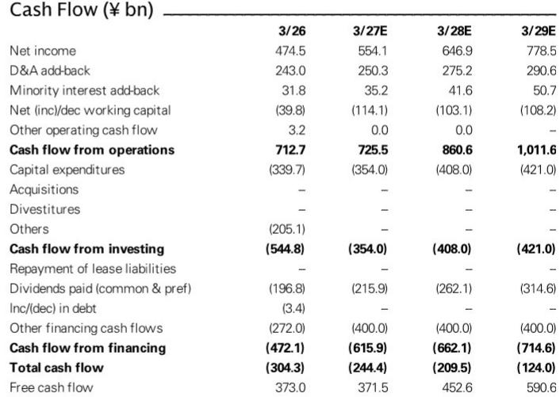
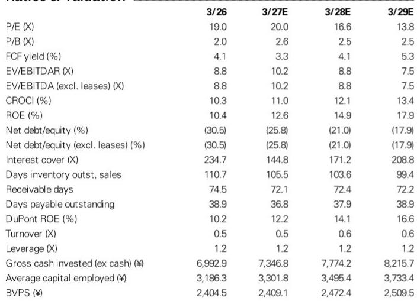
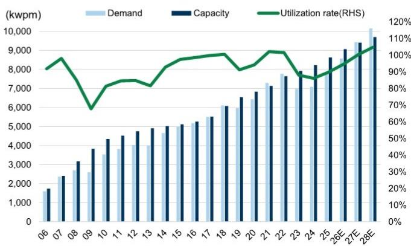

# Shin-Etsu Chemical’s Cyclical PVC Headwind Is Real, But Its Semiconductor Materials Surge Will Overwhelm It by FY3/28

Shin-Etsu Chemical’s Q1 results for FY3/27 revealed a company at a clear inflection point. The stock dropped 8.3% between the earnings announcement and late July, underperforming the TOPIX by nearly 10 percentage points. The trigger was straightforward: the PVC business environment from Q2 onward has become markedly more challenging than previously expected, forcing a 5% cut to FY3/27 operating profit forecasts. Yet this selloff masks a more consequential structural shift already underway.

The cyclical Infrastructure segment, which contributed an average of 42% of company-wide operating profit over the past five years, is projected to account for only 18% over FY3/27–29. This is not a temporary dip. It is a permanent rebalancing of Shin-Etsu’s earnings architecture. Meanwhile, the Electronics Materials business—driven by silicon wafers, photoresists, and magnetic materials—is projected to deliver a 19% compound annual growth rate in operating profit from FY3/26 through FY3/29. The market’s reflexive de-rating on PVC weakness is missing the bigger story.

At 17x FY3/28 P/E, the stock sits within its 10-year historical range of 14–21x, but the composition of earnings is transforming. The multiple deserves recalibration as semiconductor and AI-related profits become the dominant driver. The strategic question for observers is not whether PVC will recover—it may not, in a meaningful way—but whether the growth trajectory in advanced materials is durable enough to offset the drag and then some. The evidence from the report suggests it is.

## The PVC Profit Contribution Is Shrinking Structurally, Not Cyclically, and Observers Should Stop Modeling a Mean Reversion

The downgrade to Infrastructure segment forecasts is severe: operating profit cuts of 26%, 25%, and 26% for FY3/27, FY3/28, and FY3/29, respectively. This is not a one-quarter miss. The underlying driver is intensifying price competition from Chinese carbide-based PVC production and naphtha-based producers in Asia, combined with sluggish demand and growing risk of market corrections in North America from July onward due to supply-demand imbalance.

The key insight is structural, not cyclical. Chinese PVC capacity additions are not a temporary glut. They represent a permanent shift in global cost curves, driven by coal-based feedstock advantages that Japanese naphtha-based producers cannot match on price. Shin-Etsu’s historical profitability in PVC was built on its integrated production model and North American cost advantage. That advantage is eroding as Chinese overcapacity exports deflation into Asian and even North American markets.

The arithmetic is stark. Over the past five years, Infrastructure contributed 42% of operating profit. Over the next three years, that figure drops to 18%. Even if PVC pricing stabilizes, the segment’s relative weight in the portfolio will continue to decline because the growth in Electronics Materials is accelerating at a much faster rate. Observers who anchor on historical segment contributions risk mispricing the company. The company is no longer a diversified chemical conglomerate with a PVC tail. It is becoming a semiconductor materials company with a PVC headwind.

## AI-Driven 300mm Wafer Demand Is Broader Than GPU-Linked Narratives Suggest, and Bonded Wafers Add a Structural Volume Multiplier

Management estimates that AI-related applications now account for nearly 30% of 300mm wafer demand. This is a critical data point because it reframes the wafer cycle. The conventional view ties wafer demand primarily to GPU and HBM production for AI training. But management explicitly notes that AI-driven demand is increasingly spreading to memory, power management ICs, and supporting logic semiconductors. This broadening matters for volume sustainability.

Equally important is the emergence of bonded wafers for applications such as CMOS Bonded on Array (CBA) in 3D NAND, which now account for nearly 10% of total 300mm wafer demand. Bonded wafers require multiple wafers per device, effectively creating a volume multiplier. As advanced semiconductor architectures shift toward heterogeneous integration and stacked designs, the number of wafers consumed per finished chip increases. This is not a one-time boost. It is a structural increase in wafer intensity per unit of semiconductor output.

The report also highlights rapidly increasing demand for process wafers—dummy monitor and test wafers required for new product ramps and production-line qualifications. This is a near-term indicator that capacity additions across the semiconductor supply chain are accelerating, which in turn drives additional wafer consumption before any revenue is generated from final chips. For Shin-Etsu, process wafers represent high-margin, low-complexity volume that improves utilization rates across the entire fab network.

Taken together, these three drivers—broadening AI demand, bonded wafer adoption, and process wafer growth—suggest that 300mm wafer demand is entering a multiyear expansion phase that is more diversified and more durable than the GPU-centric cycle of 2023–2024.

## Disciplined Capacity Investment by Japanese Wafer Suppliers Creates a Structural Pricing Tailwind from FY3/29

Shin-Etsu management has reiterated that capacity additions will remain disciplined and primarily tied to customer commitments under long-term agreements. The company retains some brownfield expansion capacity, but greenfield investments will only proceed when contract negotiations justify them. This cautious stance is echoed by SUMCO’s president, who stated in a late July interview that wafer manufacturers should not rush capacity expansion at the expense of quality.

The strategic implication is clear: the two dominant Japanese suppliers of advanced silicon wafers are both signaling supply discipline. In a market where AI-driven demand is accelerating, this creates the conditions for sustained supply tightness. Observers should expect a favorable seller’s market to persist, which supports pricing power.

The report explicitly expects meaningful wafer price increases to become more visible from FY3/29 onward. This timing is driven by Shin-Etsu’s relatively long contract durations compared to peers. As existing contracts roll off and new negotiations incorporate tighter supply conditions, price realization will improve. In the interim, earnings growth is supported by higher shipment volumes, improving utilization rates, and a richer product mix from advanced-node products.

The confidence in this trajectory is reflected in the modest forecast cuts for FY3/28 and FY3/29—only 2% and less than 1%, respectively—despite the severe PVC downgrade. The semiconductor materials business is absorbing the blow and then some.

## Photoresists, Rare-Earth Magnets, and Optical Fiber Preforms Are Entering a Multi-Product Growth Cycle with High Incremental Margins

The report raises earnings forecasts from FY3/27 onward for photoresists, photomask blanks, rare-earth magnets, encapsulation materials, and optical fiber preforms. This is not a single-product story. It is a broad-based acceleration across multiple advanced materials categories.

Photoresists are the standout. Beyond advanced EUV and ArF resists, multilayer materials are seeing substantial growth driven by leading-edge GPUs and HBM. The new Isesaki plant ramp-up is well-timed, and the report notes attractive incremental margins. This is critical: photoresist manufacturing has high fixed costs and significant learning-curve benefits. As volumes scale, margin expansion should outpace revenue growth.

Rare-earth magnets face a potential bottleneck in heavy rare-earth procurement, but the company is actively working with customers to reduce or eliminate heavy rare-earth content while simultaneously implementing price increases. This dual strategy—cost reduction and price increases—is a textbook response to input constraints. Demand from HEVs, HDDs, and semiconductor manufacturing equipment remains healthy, providing a diversified end-market base.

Optical fiber preforms are now experiencing demand that exceeds production capacity, prompting consideration of further expansion. This is a high-value business with significant barriers to entry. The fact that Shin-Etsu is contemplating capacity additions in this segment, while remaining cautious on wafer capacity, signals where management sees the strongest risk-adjusted returns.

## A Decision Framework for Observers: Three Conditions to Monitor That Will Determine Whether the Thesis Plays Out

For observers evaluating Shin-Etsu, the core thesis rests on three conditions. Each is observable and falsifiable, providing a clear monitoring framework rather than a black-box forecast.

First, wafer pricing must inflect upward from FY3/29 as long-term contracts reset. The report explicitly forecasts this, but it depends on sustained demand growth and continued supply discipline from Japanese wafer producers. Observers should track quarterly commentary on contract negotiations and average selling prices. If pricing inflects earlier or more sharply than expected, the upside to FY3/29 estimates could be material.

Second, the PVC headwind must not deepen beyond current expectations. The report already embeds a 25–26% reduction in Infrastructure segment profit across the forecast period. If Chinese PVC exports intensify or North American demand deteriorates further, the drag could exceed current assumptions. Observers should monitor PVC spreads and Chinese export volumes as leading indicators.

Third, photoresist and advanced materials growth must sustain its current trajectory. The new Isesaki plant ramp-up and multilayer material adoption are the key drivers. If GPU demand cycles or HBM adoption slows, the photoresist growth rate could decelerate. Conversely, if AI server motherboard CCL applications qualify for quartz cloth encapsulation materials, that would represent upside beyond current forecasts.

These three conditions are not equally weighted. The wafer pricing inflection is the most consequential because it determines the durability of the 19% CAGR in Electronics Materials operating profit. The PVC headwind is manageable as long as it does not widen. The advanced materials cycle is already visible and accelerating.

## The Valuation Case Rests on Earnings Composition Change, Not Cyclical Timing

At 17x FY3/28 P/E, Shin-Etsu is not optically cheap. But the multiple must be assessed against the changing earnings mix. The cyclical Infrastructure segment, which historically commanded a lower multiple due to its commodity exposure, is shrinking to 18% of profits. The Electronics Materials segment, which deserves a premium multiple due to its secular growth and high barriers to entry, is expanding to become the dominant profit driver.

By FY3/29, operating profit is forecast to reach ¥1,065 billion, implying a 13.8x P/E on that year’s earnings. The free cash flow yield improves to 5.3%. Return on equity rises from 10.4% in FY3/26 to 17.9% in FY3/29. These are not distressed cyclical recovery numbers. They are the financial profile of a company undergoing a structural earnings upgrade.

The market’s focus on the PVC downgrade is understandable but backward-looking. The forward-looking story is about a semiconductor materials company that is benefiting from the most significant technology investment cycle in decades, with pricing power, supply discipline, and a product portfolio aligned with AI infrastructure buildout. The stock’s correction has created an entry point for observers who can look through the PVC noise to the earnings transformation underneath.

*For informational purposes only. Portions may be generated, translated, summarized, or edited with AI assistance based on source materials and may contain omissions or errors. Please verify independently. This is not professional advice.*

For informational purposes only. Portions may be generated, translated, summarized, or edited with AI assistance based on source materials and may contain omissions or errors. Please verify independently. This is not professional advice.

