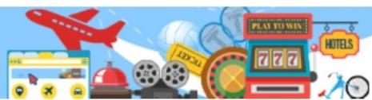
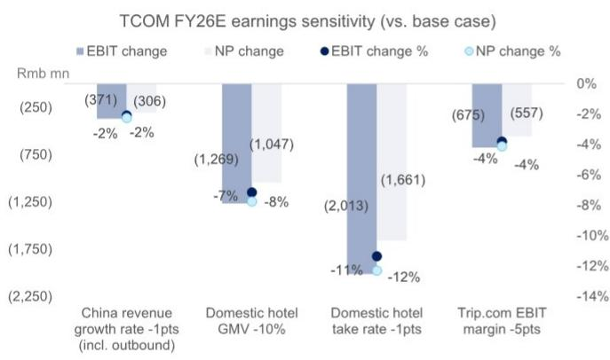
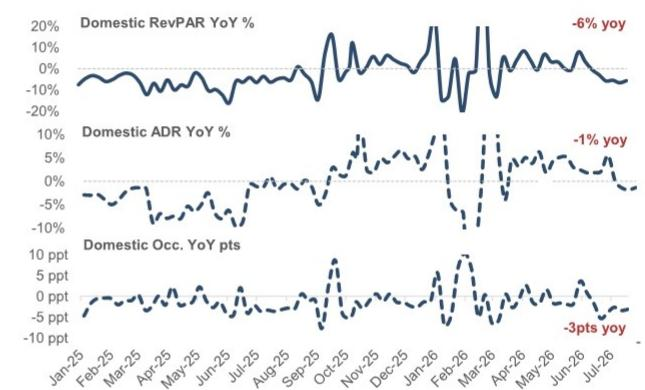
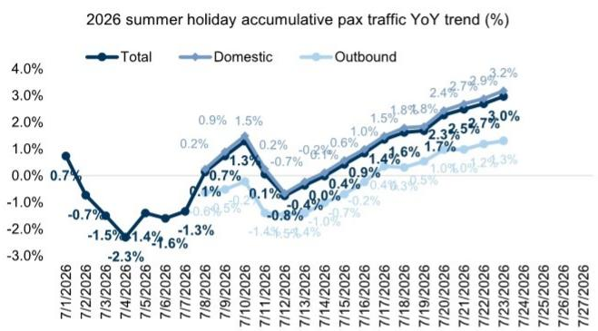
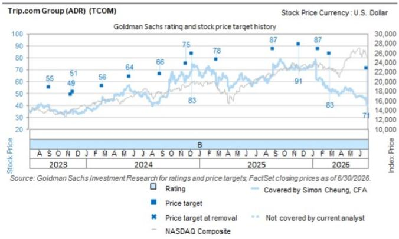
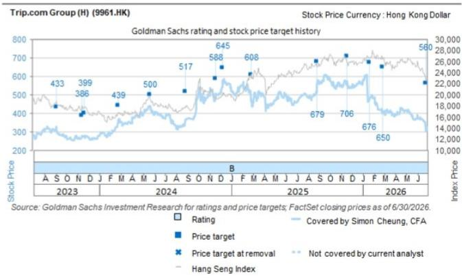

# Trip.com Group (TCOM): 管理层电话会议要点：业务模式转型需1-2个季度完全体现；预计酒店佣金率不受影响；维持积极看法

## 亚洲休闲行业洞察：博彩、航空、免税、海南、酒店、OTA与休闲消费崛起

Simon Cheung, CFA
+852-2978-6102 | simon.cheung@gs.com
GS (Asia) L.L.C.

Alpha Wang
+852-2978-1984 | alpha.wang@gs.com
GS (Asia) L.L.C.

在中国国家市场监督管理总局（SAMR）宣布完成对携程为期6个月的反垄断调查，并处以51.79亿元人民币一次性罚款后（详见7月25日SAMR公告及我们7月27日的报告），公司召开了电话会议。高级管理层（CEO孙洁、CFO王肖璠）详细介绍了公司为整改反垄断行为而实施的19项措施，并讨论了相关的财务影响。公司重申完全接受监管机构的决定和处罚，并强调调查已结束，无任何未决事项。我们注意到，部分运营调整（如停止自动调价助手及特牌酒店整理版合作要求）已反映在2Q26的指引中。

Leah Pan
+852-2978-6972 | leah.pan@gs.com
GS (Asia) L.L.C.

Zhaoheng Chen
+852-2978-0901 | zhaoheng.chen@gs.com
GS (Asia) L.L.C.

尽管向新的商户分层合作模式（类似于Booking.com的基础/优选/优选+分级计划及可选附加服务等）的过渡可能在2H26对运营和GMV产生一定影响，但公司预计其有效酒店佣金率不会受到实质性冲击。目前携程的佣金率与其他国内OTA差异不大（FY25年携程约9.2%，美团约8.5%）。公司认为，其竞争力更多取决于为酒店合作伙伴提供的价值主张，即可预测的预订量、优质/高消费用户群体、可靠的24/7客户服务等。正如我们此前报告（1月19日）所讨论的，美团和阿里巴巴在2021年调查结束后2-3年内，其国内外卖和电商市场的佣金率保持相对稳定。在OTA领域，尽管有新进入者试图通过低价竞争（如京东的零佣金、抖音最初4.5%的佣金），携程/同程的酒店佣金率基本保持不变。同样，在海外，Booking.com的佣金率多年来也未因监管机构对其行业惯例的法律争议而受到太大影响。

从我们今日与读者的交流来看，虽然许多人对6个月调查结束后消除了一个不确定性因素感到欣慰，但对我们积极看法也存在一些不同意见，包括：（1）2H26盈利可能面临进一步下行风险——除了上述向新酒店分层模式过渡的短期影响外，根据STR数据，国内酒店行业RevPar趋势已从4-5月的同比+3-4%放缓至6月的同比-1%和7月至今的-6%，尽管国内航空流量从5月/6月的-6%/-7%明显恢复至7月至今的+3%（图表3）；（2）关于美团、飞猪及其他竞争对手可能加大竞争力度以争夺GMV份额的消息；（3）考虑到国内消费/互联网公司远期市盈率已收缩至12-13倍，该股估值提升空间有限。如图表5所示，我们目前预测FY26E携程收入增长+8%，EBIT下降-2%，假设：（1）2H26E收入同比稳定增长+5%（vs. 1Q/2Q26的+17%/+5%），其中国内旅游收入同比下降-3%，出境旅游收入同比增长+4%，Trip.com平台收入同比增长+45-50%；（2）EBIT利润率同比下降3.1-3.2个百分点，考虑到不利的收入结构变化（亏损的Trip.com平台占比提升）带来的约1个百分点稀释——尽管Trip.com本身的EBIT亏损率预计将收窄。随后FY27E预计收入同比增长+11%，EBIT增长+13%。按当前价格计算，该股FY26E/FY27E市盈率分别为11.6倍/10倍，较Booking.com的17倍/14倍有30%以上的折让。敏感性分析显示，国内酒店GMV每下降-10%，国内酒店佣金率每下降-1个百分点，将分别使我们的FY26E EBIT预测下降-7%和-11%。我们还强调了其EBIT/盈利对国内收入增长和Trip.com EBIT利润率假设的敏感性（图表1）。

总体而言，考虑到携程在1月份已停止运营监管机构认定的两项做法（即酒店加入"特牌"的整理版合作要求及所有其他酒店的"最低价平台"要求），读者对调查结果可能不会感到意外。虽然业务模式转型的影响可能需要1-2个季度才能完全反映在财务数据中，但我们认为估值已反映了对其长期增长轨迹的诸多悲观预期——我们对此仍保持信心，尤其是考虑到公司通过Trip.com平台在亚洲其他地区的快速扩张。维持积极看法，调整预测（FY26E-FY28E每股收益下调1-24%），12个月目标价US$70/HK$545（此前为US$71/HK$560），已考虑一次性罚款及最新行业旅游趋势。

## 电话会议问答环节摘要及要点：

### 1. 随着SAMR决定的公布，监管风险是否已完全消除？

公司认为SAMR调查的结束是携程国内业务实践的一个重要里程碑。携程完全接受该决定，并将及时全面地落实整改措施。携程将此视为进一步加强治理框架、支持在线旅游业务长期发展的机遇。公司还致力于通过基于服务质量和用户体验的行业竞争，为业务合作伙伴和用户创造长期价值。与全球其他领先的科技和平台公司一样，公司将在为股东、行业和社会创造价值的同时，与监管机构进行建设性合作。

### 2. 取代原有一二级委托分销计划的新方案是什么？对携程的ADR和佣金率有何影响？

根据其在5个关键领域的19项措施，携程将采用新的多层次合作框架，并引入新的流量分配机制，以促进更大的灵活性、透明度和共同业务增长。在G2战略（全球化与高品质）下，公司将致力于通过帮助酒店合作伙伴触达广泛的优质休闲/商务旅客，并在入境旅游、银发旅游以及赛事驱动旅游等多种旅游场景中创造增量需求，为其构建长期价值。公司预计其ADR将主要由市场供需驱动，并认为这些措施不会从根本上改变这一动态。同样，其佣金率不应出现结构性变化，但可能会因产品组合、促销活动和合作伙伴激励计划而出现正常波动。

### 3. 哪些运营调整已反映在2Q26指引中？未来几个季度读者应预期哪些额外财务影响？

公司已于3月停止"自动调价助手"，其影响已反映在2Q26指引/展望中。同时，停止一二级委托分销计划以及其他过渡进展，可能会在未来几个季度带来业绩波动。加之持续的宏观环境不确定性，公司目前对2H26的可见性仍然有限。

### 4. 罚款的财务影响如何？是否会影响携程的运营和资本配置？

从会计角度看，携程将在2Q26确认一次性费用51.79亿元人民币及1.22亿元人民币的抵消收入。其资本配置优先级保持不变。考虑到近期股价相对承压以及公司在1Q业绩会上对回购的承诺和评论，我们认为公司今年迄今已动用部分资金进行股份回购的可能性有所增加。

图表1：携程FY26E盈利对国内业务的敏感性

来源：公司数据，GS全球投资研究

图表2：国内酒店RevPar周度追踪

来源：STR，GS全球投资研究

图表3：暑期航空流量追踪

注：暑期为7月1日至8月31日
来源：DAST，GS全球投资研究

图表4：国内经济舱票价追踪

来源：DAST，GS全球投资研究

图表5：Trip.com集团FY26E/FY27E预测摘要

<table><tr><td>人民币百万元</td><td>1Q26</td><td>2Q26E</td><td>3Q26E</td><td>4Q26E</td><td>2026E</td><td>2027E</td></tr><tr><td>总净收入</td><td>16,208</td><td>15,606</td><td>19,315</td><td>16,190</td><td>67,318</td><td>74,892</td></tr><tr><td>国内</td><td>9,824</td><td>9,248</td><td>11,559</td><td>9,283</td><td>39,914</td><td>42,356</td></tr><tr><td>酒店</td><td>4,637</td><td>4,494</td><td>5,699</td><td>4,117</td><td>18,947</td><td>20,030</td></tr><tr><td>交通</td><td>2,372</td><td>1,563</td><td>1,820</td><td>1,512</td><td>7,266</td><td>7,236</td></tr><tr><td>打包旅游及其他</td><td>2,815</td><td>3,192</td><td>4,040</td><td>3,654</td><td>13,701</td><td>15,091</td></tr><tr><td>出境</td><td>2,436</td><td>2,291</td><td>2,865</td><td>2,247</td><td>9,839</td><td>10,846</td></tr><tr><td>纯国际</td><td>3,947</td><td>4,067</td><td>4,891</td><td>4,660</td><td>17,566</td><td>21,689</td></tr><tr><td>Trip.com</td><td>2,896</td><td>3,018</td><td>3,486</td><td>4,098</td><td>13,498</td><td>18,897</td></tr><tr><td>Skyscanner</td><td>1,051</td><td>1,049</td><td>1,405</td><td>562</td><td>4,068</td><td>2,792</td></tr><tr><td colspan="7"></td></tr><tr><td>同比%</td><td></td><td></td><td></td><td></td><td></td><td></td></tr><tr><td>总收入</td><td>17%</td><td>5%</td><td>5%</td><td>5%</td><td>8%</td><td>11%</td></tr><tr><td>国内</td><td>10%</td><td>-2%</td><td>-3%</td><td>-3%</td><td>1%</td><td>6%</td></tr><tr><td>酒店</td><td>12%</td><td>4%</td><td>2%</td><td>1%</td><td>5%</td><td>6%</td></tr><tr><td>交通</td><td>-5%</td><td>-28%</td><td>-28%</td><td>-27%</td><td>-21%</td><td>0%</td></tr><tr><td>打包旅游及其他</td><td>23%</td><td>8%</td><td>7%</td><td>8%</td><td>12%</td><td>10%</td></tr><tr><td>出境</td><td>15%</td><td>4%</td><td>4%</td><td>4%</td><td>7%</td><td>10%</td></tr><tr><td>纯国际</td><td>42%</td><td>27%</td><td>31%</td><td>26%</td><td>28%</td><td>23%</td></tr><tr><td>Trip.com</td><td>65%</td><td>45%</td><td>45%</td><td>49%</td><td>50%</td><td>40%</td></tr><tr><td colspan="7"></td></tr><tr><td>EBIT（非GAAP）</td><td>4,636</td><td>4,379</td><td>5,863</td><td>2,847</td><td>17,725</td><td>20,073</td></tr><tr><td>同比</td><td>15%</td><td>-6%</td><td>-4%</td><td>-11%</td><td>-2%</td><td>13%</td></tr><tr><td>EBIT利润率</td><td>28.6%</td><td>28.1%</td><td>30.4%</td><td>17.6%</td><td>26.3%</td><td>26.8%</td></tr><tr><td>利润率同比变化</td><td>-0.6ppt</td><td>-3.4ppt</td><td>-3.1ppt</td><td>-3.2ppt</td><td>-2.6ppt</td><td>0.5ppt</td></tr><tr><td colspan="7"></td></tr><tr><td>净利润（非GAAP）</td><td>3,905</td><td>319</td><td>5,821</td><td>3,456</td><td>13,501</td><td>19,977</td></tr><tr><td>同比</td><td>-7%</td><td>-94%</td><td>n.m.</td><td>-1%</td><td>n.m.</td><td>48%</td></tr><tr><td colspan="7"></td></tr><tr><td>每股收益（港元）</td><td></td><td></td><td></td><td></td><td>20.1</td><td>29.7</td></tr><tr><td>每股收益（美元）</td><td></td><td></td><td></td><td></td><td>3.0</td><td>4.4</td></tr><tr><td colspan="7"></td></tr><tr><td>9961.HK 股价（港元）</td><td></td><td></td><td></td><td></td><td>355.6</td><td></td></tr><tr><td>TCOM 股价（美元）</td><td></td><td></td><td></td><td></td><td>44.9</td><td></td></tr><tr><td colspan="7"></td></tr><tr><td>9961.HK 市盈率</td><td></td><td></td><td></td><td></td><td>11.7</td><td>10.1</td></tr><tr><td>TCOM 市盈率</td><td></td><td></td><td></td><td></td><td>11.6</td><td>10.0</td></tr></table>

价格截至2026年7月27日/2026年7月24日（ADR）。
来源：Datastream，公司数据，GS全球投资研究

## 目标价风险与方法论 – Trip.com集团

估值方法：我们对Trip.com（TCOM/9961.HK）持积极看法，12个月目标价US$70/HK$545，基于分部加总估值法，核心旅游业务按FY26E 16倍市盈率估值，联营公司按其GS 12个月目标价或当前市值估值。

主要下行风险：鉴于其在国内OTA行业的主导地位，存在监管风险；竞争加剧风险；出境游复苏慢于预期风险。

<table><tr><td>TCOM</td><td>12个月目标价：$70.00</td><td>股价：$44.77</td><td>潜在空间：56.4%</td></tr><tr><td>9961.HK</td><td>12个月目标价：HK$545.00</td><td>股价：HK$355.60</td><td>潜在空间：53.3%</td></tr></table>

<table><tr><td>积极</td><td colspan="5">GS预测</td></tr><tr><td></td><td></td><td>12/25</td><td>12/26E</td><td>12/27E</td><td>12/28E</td></tr><tr><td>市值：285亿美元</td><td>收入（人民币百万元）新</td><td>62,409.0</td><td>67,318.3</td><td>74,892.0</td><td>83,356.1</td></tr><tr><td>企业价值：239亿美元</td><td>收入（人民币百万元）旧</td><td>62,409.0</td><td>67,887.0</td><td>76,957.3</td><td>86,371.0</td></tr><tr><td>3个月日均交易量：1.473亿美元</td><td>EBITDA（人民币百万元）</td><td>18,888.0</td><td>18,554.5</td><td>20,958.8</td><td>23,791.3</td></tr><tr><td rowspan="2">中国亚洲休闲</td><td>每股收益（人民币）新</td><td>45.59</td><td>20.08</td><td>30.64</td><td>35.73</td></tr><tr><td>每股收益（人民币）旧</td><td>45.59</td><td>26.44</td><td>30.84</td><td>36.04</td></tr><tr><td>并购排名：3</td><td>市盈率（倍）</td><td>10.4</td><td>15.1</td><td>9.9</td><td>8.5</td></tr><tr><td rowspan="3">租赁包含在净债务及企业价值中？是</td><td>市净率（倍）</td><td>1.9</td><td>1.1</td><td>1.0</td><td>0.9</td></tr><tr><td>股息回报表现（%）</td><td>0.0</td><td>0.0</td><td>0.0</td><td>0.0</td></tr><tr><td>CROCI（%）</td><td>50.1</td><td>31.2</td><td>48.1</td><td>58.0</td></tr><tr><td></td><td></td><td>3/26</td><td>6/26E</td><td>9/26E</td><td>12/26E</td></tr><tr><td></td><td>每股收益（人民币）</td><td>5.73</td><td>0.47</td><td>8.54</td><td>5.14</td></tr></table>

来源：公司数据，GS预测，FactSet。价格截至2026年7月27日收盘。

## 披露附录

## Reg AC

本人Simon Cheung, CFA，特此证明本报告中表达的所有观点均准确反映本人对相关公司及其证券的个人观点。本人还证明，本人的薪酬中没有任何部分直接或间接与本报告中表达的具体建议或观点相关。

除非另有说明，本报告封面所列人员均为GS全球投资研究部分析师。

撰稿作者：Simon Cheung, CFA GS (Asia) L.L.C.，Alpha Wang GS (Asia) L.L.C.，Leah Pan GS (Asia) L.L.C.，Zhaoheng Chen GS (Asia) L.L.C.。

除非另有说明，本报告撰稿作者披露中列出的个人均为GS全球投资研究部分析师。

## GS因子概况

GS因子概况通过将关键属性与市场（即我们评级的股票池）及其行业同行进行比较，为股票提供投资背景。所描绘的四个关键属性是：增长、财务回报、倍数（如估值）和综合（增长、财务回报和倍数的综合）。增长、财务回报和倍数是通过对每只股票的特定指标使用标准化排名来计算的。然后将指标的标准化排名进行平均，并转换为相关属性的百分位数。每个指标的具体计算可能因财年、行业和地区而异，但标准方法如下：

增长基于股票的前瞻性销售增长、EBITDA增长和每股收益增长（对于金融股，仅每股收益和销售增长），百分位数越高表示增长公司越高。财务回报基于股票的前瞻性ROE、ROCE和CROCI（对于金融股，仅ROE），百分位数越高表示财务回报越高的公司。倍数基于股票的前瞻性市盈率、市净率、价格/股息（P/D）、EV/EBITDA、EV/FCF和EV/债务调整后现金流（DACF）（对于金融股，仅市盈率、市净率和P/D），百分位数越高表示股票交易倍数越高。综合百分位数计算为增长百分位数、财务回报百分位数和（100% - 倍数百分位数）的平均值。

财务回报和倍数使用GS分析师对未来至少三个季度后的财年末的预测。增长使用对未来至少七个季度后的财年与未来至少三个季度后的财年相比的输入（所有指标均基于每股）。

有关我们如何计算GS因子概况的更详细说明，请联系您的GS代表。

## 并购排名

在我们的全球覆盖范围内，我们使用并购框架审视股票，考虑定性因素和定量因素（可能因行业和地区而异），以纳入某些公司可能被收购的可能性。然后我们分配并购排名，作为对我们评级覆盖下的公司从1到3进行评分的方法，其中1表示公司成为收购目标的高概率（30%-50%），2表示中等概率（15%-30%），3表示低概率（0%-15%）。对于排名为1或2的公司，按照我们标准部门指南，我们将并购组成部分纳入目标价。并购排名为3被视为不重要，因此不计入我们的目标价，并且可能在研究中讨论或不讨论。

## Quantum

Quantum是GS的专有数据库，提供详细的财务报表历史、预测和比率。它可用于对单一公司进行深入分析，或比较不同行业和市场的公司。

## 披露信息

Trip.com集团（ADR）和Trip.com集团（H）的评级相对于其覆盖范围内的其他公司：亚朵生活控股、首旅酒店集团、中国旅游集团中免（A股）、中国旅游集团中免（H股）、银河娱乐集团、马来西亚云顶、新加坡云顶、华住集团（ADR）、华住集团（H股）、江原乐园、美高梅中国、新濠国际发展、新濠博亚娱乐、金界控股、澳博控股、新秀丽集团、金沙中国、上海锦江国际酒店、香格里拉亚洲、石基信息、宋城演艺、同程旅行控股、Trip.com集团（ADR）、Trip.com集团（H股）、永利澳门

## 公司特定监管披露

以下披露涉及GS集团（及其附属机构，"GS"）与本研究中提及的GS全球投资研究所覆盖公司之间的关系。

GS在过去12个月内因投资银行服务获得报酬：Trip.com集团（ADR）（$44.77）和Trip.com集团（H股）（HK$355.60）

GS预计在未来3个月内寻求因投资银行服务获得报酬：Trip.com集团（ADR）（$44.77）和Trip.com集团（H股）（HK$355.60）

GS在过去12个月内因非投资银行服务获得报酬：Trip.com集团（ADR）（$44.77）和Trip.com集团（H股）（HK$355.60）

GS在过去12个月内与以下公司存在投资银行服务客户关系：Trip.com集团（ADR）（$44.77）和Trip.com集团（H股）（HK$355.60）

GS在过去12个月内与以下公司存在非投资银行证券相关服务客户关系：Trip.com集团（ADR）（$44.77）和Trip.com集团（H股）（HK$355.60）

GS在过去12个月内与以下公司存在非证券服务客户关系：Trip.com集团（ADR）（$44.77）和Trip.com集团（H股）（HK$355.60）

GS做市该证券或其衍生品：Trip.com集团（ADR）（$44.77）和Trip.com集团（H股）（HK$355.60）

## 评级/投资银行关系分布

GS投资研究全球股票覆盖范围

<table><tr><td rowspan="2"></td><td colspan="3">评级分布</td><td colspan="3">投资银行关系</td></tr><tr><td>积极</td><td>中性</td><td>谨慎</td><td>积极</td><td>中性</td><td>谨慎</td></tr><tr><td>全球</td><td>50%</td><td>34%</td><td>16%</td><td>65%</td><td>59%</td><td>43%</td></tr></table>

截至2026年7月1日，GS全球投资研究对3,104只股票进行了投资评级。GS将股票分配为各区域投资清单上的积极和谨慎；未如此分配的股票被视为中性。此类分配相当于FINRA规则要求的上述披露目的的积极、持有和谨慎。请参见下文"评级、覆盖范围和相关定义"。投资银行关系图表反映了每个评级类别中GS在过去十二个月内提供过投资银行服务的公司百分比。

## 目标价和评级历史图表

所示目标价应结合所有先前发布的GS报告（可能包含或不包含目标价）以及公司、行业和金融市场的发展情况来考虑。

所示目标价应结合所有先前发布的GS报告（可能包含或不包含目标价）以及公司、行业和金融市场的发展情况来考虑。

## 目标价历史表格

## Trip.com集团（H股）（9961.HK）

Trip.com集团（ADR）（TCOM）

<table><tr><td>报告日期</td><td>目标价（$）</td><td>收盘价（$）</td><td>报告日期</td><td>目标价（HK$）</td><td>收盘价（HK$）</td></tr><tr><td>27-Jul-26</td><td>70.00</td><td>44.77</td><td>27-Jul-26</td><td>545.00</td><td>355.60</td></tr><tr><td>25-Jun-26</td><td>71.00</td><td>40.49</td><td>25-Jun-26</td><td>560.00</td><td>315.00</td></tr><tr><td>26-Feb-26</td><td>83.00</td><td>52.27</td><td>26-Feb-26</td><td>650.00</td><td>400.40</td></tr><tr><td>19-Jan-26</td><td>87.00</td><td>61.77</td><td>19-Jan-26</td><td>676.00</td><td>470.40</td></tr><tr><td>18-Nov-25</td><td>91.00</td><td>72.44</td><td>18-Nov-25</td><td>706.00</td><td>564.50</td></tr><tr><td>28-Aug-25</td><td>87.00</td><td>75.03</td><td>28-Aug-25</td><td>679.00</td><td>552.00</td></tr><tr><td>25-Feb-25</td><td>78.00</td><td>57.30</td><td>25-Feb-25</td><td>608.00</td><td>462.00</td></tr><tr><td>08-Dec-24</td><td>83.00</td><td>69.07</td><td>08-Dec-24</td><td>645.00</td><td>542.00</td></tr><tr><td>19-Nov-24</td><td>75.00</td><td>62.74</td><td>19-Nov-24</td><td>588.00</td><td>506.00</td></tr><tr><td>27-Aug-24</td><td>66.00</td><td>45.97</td><td>27-Aug-24</td><td>517.00</td><td>366.40</td></tr><tr><td>21-May-24</td><td>64.00</td><td>55.83</td><td>21-May-24</td><td>500.00</td><td>440.00</td></tr><tr><td>22-Feb-24</td><td>56.00</td><td>44.67</td><td>22-Feb-24</td><td>439.00</td><td>355.60</td></tr><tr><td>21-Nov-23</td><td>51.00</td><td>32.78</td><td>21-Nov-23</td><td>399.00</td><td>275.60</td></tr><tr><td>14-Nov-23</td><td>49.00</td><td>35.36</td><td>14-Nov-23</td><td>386.00</td><td>272.00</td></tr><tr><td>05-Sep-23</td><td>55.00</td><td>38.26</td><td>05-Sep-23</td><td>433.00</td><td>304.00</td></tr></table>

表格中显示的目标价未针对公司行动进行调整。

## 监管披露

## 美国法律法规要求的披露

请参见上述公司特定监管披露，了解本报告中提及的公司所需的任何以下披露：待处理交易中的主承销商或联合主承销商；1%或以上所有权；特定服务的报酬；客户关系类型；先前期间的主承销/联合主承销公开发行；董事职位；对于股票证券，做市和/或专家角色。GS可能作为本金交易本讨论的发行人的债务证券（或相关衍生品）。

以下是额外的必要披露：所有权和重大利益冲突：GS政策禁止其分析师、向分析师报告的专业人员及其家庭成员持有分析师覆盖范围内的任何公司的证券。分析师薪酬：分析师的薪酬部分基于GS的盈利能力，其中包括投资银行收入。分析师作为高级职员或董事：GS政策通常禁止其分析师、向分析师报告的人员或其家庭成员在分析师覆盖范围内的任何公司担任高级职员、董事或顾问。非美国分析师：非美国分析师可能不是GS & Co. LLC的关联人员，因此可能不受FINRA规则2241或FINRA规则2242关于与主题公司沟通、公开露面以及交易分析师所覆盖证券的限制。

## 美国以外司法管辖区法律和法规要求的额外披露

以下披露是所指示司法管辖区要求的，除非已根据美国法律法规在上文作出。澳大利亚：GS Australia Pty Ltd及其附属公司不是澳大利亚的授权存款机构（如1959年银行法（联邦）中定义的术语），并且在澳大利亚不提供银行服务或开展银行业务。本研究及其任何访问仅适用于澳大利亚公司法含义内的"批发客户"，除非GS另有约定。在制作研究报告时，GS Australia全球投资研究部门的成员可能会参加由研究报告主题公司和实体主办或组织的实地考察和其他会议。在某些情况下，如果GS Australia认为在实地考察或会议的具体情况下适当且合理，此类实地考察或会议的费用可能部分或全部由相关发行人承担。如果本文档的内容包含任何金融产品建议，则仅为一般性建议，由GS在未考虑客户的目标、财务状况或需求的情况下编制。客户在根据任何此类建议采取行动之前，应考虑该建议是否适合其自身的目标、财务状况和需求。某些GS Australia和New Zealand利益披露以及GS澳大利亚卖方研究独立性政策声明的副本可在以下网址获取：https://www.goldmansachs.com/disclosures/australia-new-zealand/index.html。巴西：有关CVM决议第20号相关的披露信息，请访问https://www.gs.com/worldwide/brazil/area/gir/index.html。在适用的情况下，根据CVM决议第20号第20条定义，本研究报告内容的主要负责巴西注册分析师为本报告开头指定的第一作者，除非文本末尾另有说明。加拿大：此信息仅供您参考，在任何情况下均不应被解释为GS & Co. LLC为在加拿大购买证券而进行的广告、要约或招揽。GS & Co. LLC未在加拿大任何司法管辖区根据适用的加拿大证券法注册为交易商，通常不允许交易加拿大证券，并且可能被禁止在加拿大的某些司法管辖区销售某些证券和产品。如果您希望在加拿大交易任何加拿大证券或其他产品，请联系GS Canada Inc.（GS集团公司的附属公司）或其他注册的加拿大交易商。香港：可向GS (Asia) L.L.C.索取本研究中提及的所覆盖公司证券的进一步信息。印度：可从GS (India) Securities Private Limited获取本研究中提及的主题公司或公司的进一步信息，研究分析师 - SEBI注册号INH000001493，地址：10th Floor, Ascent-Worli, Sudam Kalu Ahire Marg, Worli, Mumbai-400 025, India，企业识别号U74140MH2006FTC160634，电话+91 22 6616 9000，传真+91 22 6616 9001。GS可能实益拥有本研究报告提及的主题公司或公司1%或以上的证券（如1956年印度证券合同（监管）法第2(h)条所定义）。SEBI的注册和NISM的认证绝不保证中介机构的业绩，也不向读者提供任何回报保证。GS (India) Securities Private Limited合规官和读者投诉联系详情、年度合规审计报告副本以及其他相关信息和披露可在此链接找到：https://www.goldmansachs.com/worldwide/india/research-analyst。日本：见下文。韩国：本研究及其任何访问仅适用于金融服务和资本市场法含义内的"专业读者"，除非GS另有约定。可从GS (Asia) L.L.C.首尔分行获取本研究中提及的主题公司或公司的进一步信息。新西兰：GS New Zealand Limited及其附属公司不是新西兰的"注册银行"或"存款接受者"（如1989年新西兰储备银行法所定义）。本研究及其任何访问适用于2008年金融顾问法定义的"批发客户"，除非GS另有约定。某些GS Australia和New Zealand利益披露的副本可在以下网址获取：https://www.goldmansachs.com/disclosures/australia-new-zealand/index.html。俄罗斯：在俄罗斯联邦分发的研究报告不是俄罗斯立法定义的广告，而是不以产品推广为主要目的的信息和分析，并且不提供俄罗斯评估活动立法意义上的评估。研究报告不构成俄罗斯法律法规定义的个人化研究交流，不针对特定客户，并且是在未分析客户的财务状况、投资概况或风险概况的情况下编制的。GS不对客户或任何其他人基于本研究报告可能做出的任何投资决定承担任何责任。新加坡：GS (Singapore) Pte.（公司编号：198602165W），受新加坡金融管理局监管，接受对本研究的法律责任，应就本研究引起或与之相关的
