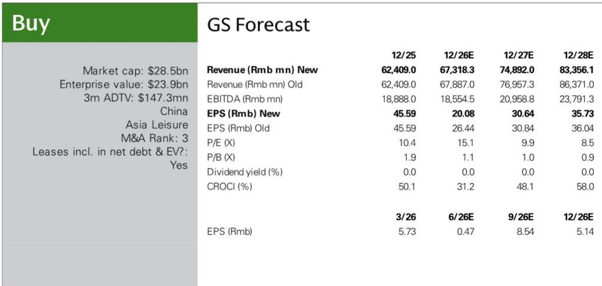
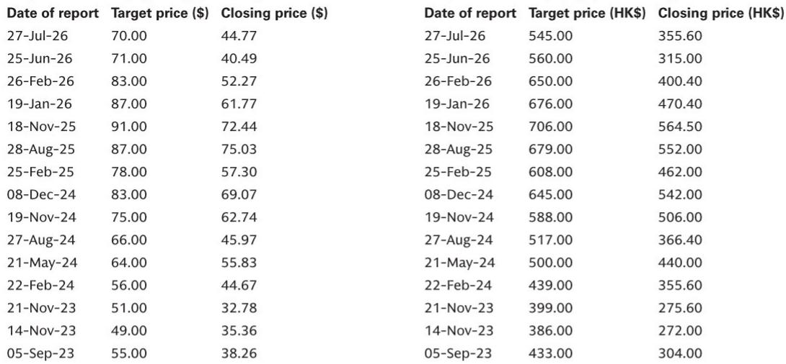

# Trip.com的监管结案是战略调整，而非挫折——市场已消化这一过渡

中国国家市场监督管理总局已结束对携程集团为期六个月的反垄断调查，处以一次性罚款51.79亿元人民币，并要求实施19项整改措施。公司完全接受裁决，已停止两项受争议的做法——自动调价助手和高端酒店整理版合作项目，并将运营影响纳入2026年第二季度指引。对于观察者而言，关键问题不在于罚款是否影响盈利——确实有影响，数字也很清楚——而在于后续的结构性变化是否会永久损害携程的竞争壁垒、酒店变现率及其长期增长轨迹。从公司自身披露、中国平台经济的历史先例以及当前估值倍数来看，答案是否定的。该公司报价为11.6倍远期市盈率，比Booking.com低30%，已反映了对国内旅游增长和利润率压缩的悲观情景。未来一到两个季度将揭示商业模式转型的完整财务影响，但战略方向——转向透明、多层次的合作框架，并通过Trip.com加速国际扩张——对长期价值创造是净利好。

## 监管处罚消除了多年悬而未决的问题，运营调整已纳入指引

市场监管总局调查的结束是一个里程碑，其具体的财务和运营影响现已基本可知。一次性罚款51.79亿元人民币将在2026年第二季度确认为费用，同时还有1.22亿元人民币的抵销收入。这是一项一次性、非经常性支出。对前瞻性分析更重要的是，两项强制性的运营变更——取消自动调价助手和终止一二线委托分销整理版项目——已于2026年3月停止。它们对收入和总成交量的影响已纳入公司在调查结束前发布的第二季度指引。这意味着从报告角度来看，监管调整最具破坏性的阶段已经过去。接下来是向新的商家分层合作模式过渡，管理层将其描述为结构上类似于Booking.com的基础/优选/优选+分层计划，并附带可选的附加提升功能。这一过渡需要一到两个季度才能完全反映在财务结果中，并可能在2026年下半年带来适度的业绩波动。但公司明确表示，预计不会对其有效酒店变现率产生重大影响。这一说法并非仅仅是断言，而是基于比较数据。携程的酒店变现率在2025财年为9.2%，而美团为8.5%。差距很小，公司的竞争定位取决于价值主张——可预测的预订量、高端用户访问和全天候服务——而非强制性的排他性条款。

## 历史先例和结构性动态表明，即使在监管干预后，变现率仍具韧性

读者担心整改措施将引发变现率结构性下降，这种担忧可以理解，但现有证据并不支持。当2021年中国对美团和阿里巴巴的反垄断调查结束时，两家公司在餐饮外卖和电商领域的变现率在随后两到三年内保持相对稳定。具体到在线旅游代理领域，尽管有新进入者——京东采用零变现率模式和抖音最初4.5%的费率——试图压低价格，携程和同程的酒店变现率基本保持不变。在中国以外，Booking.com的变现率多年来并未因行业惯例的监管法律纠纷而受到实质性影响。模式是一致的：平台市场的监管干预往往针对特定的反竞争行为，而非中介服务的基本经济逻辑。酒店仍然需要分销渠道，而携程仍然提供高意向旅客。变现率是价值创造的函数，而非合同强制的结果。公司新的分层模式为酒店提供了更多选择合作级别和流量分配的灵活性，从长远来看甚至可能提高合作伙伴满意度和留存率，降低流向竞争对手的风险。读者需要关注的关键敏感性不仅是变现率本身，而是国内酒店总成交量和变现率的组合。国内酒店总成交量每减少10%，2026财年息税前利润将减少7%；国内酒店变现率每下降一个百分点，息税前利润将减少11%。这些风险虽然重大但可控，且已反映在估值中。

## 近期盈利逆风真实存在，但集中在国内旅游和Trip.com的利润率稀释

2026年下半年的前景确实偏软。公司自身的预测显示，下半年国内旅游收入同比下降3%，出境旅游收入仅增长4%，Trip.com国际平台增长45%至50%，但处于亏损状态，整体息税前利润率被稀释约一个百分点。2026财年总收入预计增长8%，息税前利润预计下降2%。息税前利润率预计同比下降2.6个百分点，原因是收入结构向利润率较低的Trip.com平台转移以及过渡期的运营成本。国内每间可售房收入数据确认了逆风：根据STR数据，在4月和5月同比增长3%至4%之后，中国酒店每间可售房收入在6月转为负值，为负1%，并在7月进一步恶化至负6%。国内航空交通量显示出更令人鼓舞的复苏——从5月和6月同比负6%和负7%回升至7月正3%——但航空交通量与酒店每间可售房收入之间的分化表明，旅客飞行更多但在住宿上花费更少，这一模式与宏观环境下的价值导向消费行为一致。公司承认，由于宏观环境的不确定性，下半年的可见度有限。这是一个诚实的评估，而非危险信号。盈利对国内收入增长和Trip.com利润率假设的敏感性很高，读者应预期季度波动。但中期轨迹——2027财年收入增长11%和息税前利润增长13%——意味着一旦过渡稳定且国际平台成熟，运营杠杆将恢复。

## 观察框架：决定市场重新定价的三个变量

当前估值为能够区分周期性噪音和结构性变化的观察者提供了清晰的切入点。该公司报价为2026财年预估市盈率的11.6倍和2027财年预估市盈率的10倍，分别比Booking.com的17倍和14倍低30%以上。这一折价反映了三个不同的关注点：监管悬而未决、国内旅游放缓以及来自美团和飞猪的竞争威胁。第一个问题已经消除。第二个是周期性逆风，已反映在共识预期中。第三个是长期存在的风险，但从未演变为实质性的变现率冲击。观察者应关注三个变量，以评估未来六到十二个月市场是否重新定价。首先，分层模式过渡的速度：如果公司能够在一到两个季度内完成推广而不失去酒店合作伙伴或总成交量大幅下降，结构性变现率下降的风险将在很大程度上被证伪。其次，国内酒店每间可售房收入的轨迹：如果7月的疲软被证明是基数效应扭曲而非持续下滑，国内收入可能比当前预测更快稳定。第三，Trip.com的亏损比率：如果国际平台息税前亏损收窄速度快于预期，利润率稀释逆风将缓解，2027财年合并息税前利润增长轨迹将更加清晰。公司的资本配置优先级保持不变，且由于报价处于低位，股份回购是可能的资本运用方式，为报价提供支撑。对于12个月视野的观察者而言，当前水平的风险回报比呈不对称上行态势。

## 国际平台是抵消国内成熟期的结构性增长引擎

携程故事中最被低估的元素是其纯国际平台的快速扩张，预计2026年下半年收入同比增长45%至50%，2027财年增长40%。该板块目前处于亏损状态，但其增长率正在加速，其可寻址市场——包括东南亚、日本和韩国在内的亚洲其他地区——规模庞大且分散。公司的G2战略——全球化和高品质——并非口号，而是一项深思熟虑的资本配置决策，即利用当前国内现金流建设一个能够在亚洲客源市场与Booking.com和Expedia竞争的多国在线旅游代理平台。收入结构向Trip.com转移将继续稀释近期利润率，但这种稀释是一种投资，而非永久性损害。随着平台达到规模，亏损比率将收窄，增量收入将以更高利润率转化为息税前利润。当前估值对这一期权价值赋予零价值。只关注国内减速和监管处罚的观察者正在错过将定义携程下一个增长周期的结构性转变。公司执行这一国际扩张的能力——2026年第一季度Trip.com收入同比增长65%所证明——是长期股东总回报最重要的变量。监管结案消除了国内干扰，使管理层能够完全专注于这一机遇。

*仅供参考。部分内容可能基于源材料通过AI辅助生成、翻译、总结或编辑，可能存在遗漏或错误。请独立核实。这不构成任何专业建议。*

仅供参考。部分内容可能基于源材料通过AI辅助生成、翻译、总结或编辑，可能存在遗漏或错误。请独立核实。这不构成任何专业建议。

