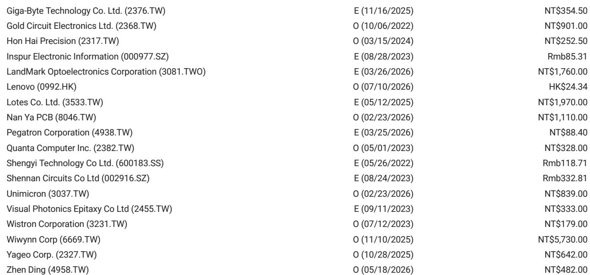
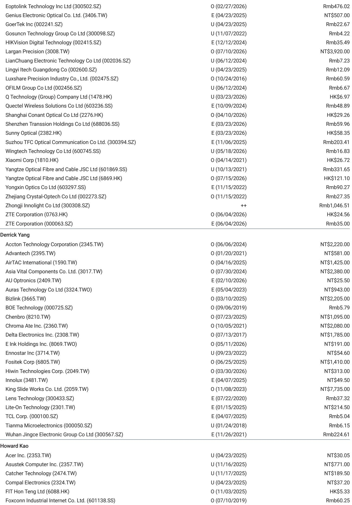

# 大中华科技硬件：亚太玻璃基先进封装进展观察

2026年7月，蓝思科技宣布与英特尔合作开发玻璃基板，成为显示供应链企业切入先进封装的最新案例。某研究机构在一份报告中梳理了多家企业的进度表，并指出玻璃基板在成本、电气性能和热膨胀匹配方面具有优势，但量产仍需时间。

报告认为，玻璃基板在先进封装中的机会正吸引越来越多参与者。随着芯片和封装尺寸持续增大，显示面板企业希望将自身在玻璃制程上的积累迁移至这一新领域。当前主要方向是玻璃核心基板，而非其他玻璃封装形式。

## 1. 蓝思科技与英特尔合作，产线计划2026年底就绪

蓝思科技已与英特尔就玻璃核心基板及TGV（玻璃通孔）技术达成合作。调研显示，其试点产线预计在2026年底建成，有意义的批量出货可能从2027年下半年开始。报告还提到，蓝思科技可能正在与韩国其他潜在客户推进类似项目。

## 2. 群创与台积电、Ibiden合作，量产时间落在2028年后

群创正在与台积电和日本Ibiden共同开发玻璃核心基板项目。根据渠道信息，该项目的量产时间预计在2028年下半年或2029年。这一时间表比蓝思科技晚约一年，反映出不同企业在技术成熟度和客户验证节奏上的差异。

## 3. 京东方与无晶圆厂客户合作，2027年建产能

京东方正在与国内和北美的无晶圆厂客户合作开发玻璃基板。报告指出，如果进展顺利，京东方计划在2027年建设产能，2028年开始量产。此外，京东方有意完成整个玻璃核心ABF基板制程，这意味着其目标不仅是提供玻璃基板，而是覆盖从玻璃加工到最终基板成品的全链条。

> **观察评论：** 京东方选择全制程路线，与蓝思科技和群创的“组件级”参与形成对比。这种策略差异将影响各家在价值链中的议价能力和资本投入规模。

## 4. 友达聚焦低轨卫星天线与Micro LED光学模块

友达的策略与其他几家不同。报告显示，友达计划将玻璃基技术用于低轨卫星天线模块和Micro LED光学模块，而非直接参与计算芯片的先进封装。报告未给出友达的具体量产时间表，说明其进展仍处于早期阶段。

## 5. 技术挑战集中在制程控制，而非设备能力

报告指出，玻璃基板在先进封装中面临的技术门槛主要来自制程控制，而非设备能力。显示面板企业过去处理的玻璃精度和密度要求远低于先进封装所需。如果这些企业能持续提升良率，报告认为它们有望在量产阶段占据较大的价值份额。

> **观察评论：** 良率是决定玻璃基板能否从“技术可行”走向“宏观环境可行”的关键变量。目前各家仍处于试产和验证阶段，真正的竞争将在2027-2029年量产窗口期展开。

For informational purposes only. Portions may be generated,translated,summarized,or edited with AI assistance based on source materials and may contain omissions or errors. Please verify independently. This is not investment,legal,tax,accounting,or other professional advice.

For informational purposes only. Portions may be generated,translated,summarized,or edited with AI assistance based on source materials and may contain omissions or errors. Please verify independently. This is not investment,legal,tax,accounting,or other professional advice.

