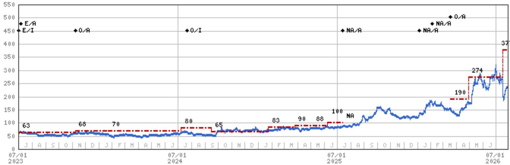
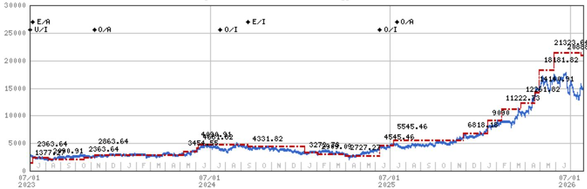
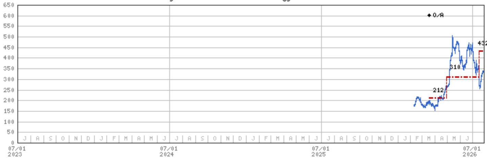

# MS：大中华区科技半导体-亚太云端半导体与英特尔财报关联

英特尔2026年第二季度财报沟通释放了一个对亚太半导体产业链有直接影响的信号：x86服务器CPU在AI基础设施中的角色正被客户重新评估，需求加速而非节奏变化。MS在最新报告中指出，英特尔数据中心与AI业务（DCAI）的客户需求正在加速，企业客户越来越认识到x86 CPU在AI基础设施中的关键作用。这一判断对大中华区云端半导体公司形成正面关联，尤其是信骅科技和澜起科技。

报告引用了英特尔管理层的几个具体数字。DCAI业务在第二季度获得了额外的战略客户订单和长期协议，当前挑战已从获取需求转向扩大供给以满足客户订单。英特尔的定制ASIC业务目前年化收入已达20亿美元，管理层预计近期将升至40亿美元。服务器CPU的全球行业展望被上调，英特尔预计今明两年将实现强劲的两位数增长，且动能将延续至2028年。

> **KC评论：** 英特尔作为x86服务器CPU的最大供应商，其供给瓶颈和订单可见度是衡量整个云端半导体需求温度的关键指标。当一家上游厂商说“现在的问题是怎么造得够快”而不是“怎么卖得出去”，下游配套芯片公司的订单能见度通常也会同步改善。

## 1. 供给约束成为行业主导挑战，而非需求不足

报告明确提到，晶圆、存储器和基板的行业性供给紧张仍是当前云端半导体面临的主导挑战。这与过去两年市场普遍担心的需求节奏变化形成对比。英特尔管理层在沟通中强调，客户持续释放强劲且可持续的支出信号，驱动因素正是AI计算需求。供给约束而非需求仍在调整成为瓶颈，意味着产业链中具备产能保障或与上游关系紧密的公司可能获得阶段性优势。

## 2. 大中华区云端半导体公司的关联逻辑

MS认为，英特尔的正面反馈直接利好其覆盖的大中华区云端半导体公司。信骅科技作为服务器管理芯片（BMC）供应商，其出货量与服务器出货量高度相关。澜起科技则受益于服务器内存接口芯片需求，以及中国数据中心半导体本地化趋势。报告在估值假设中明确纳入了云端资本支出增长、DRAM接口技术迁移以及澜起科技在中国数据中心半导体本地化中的强势地位。这些假设与英特尔传递的行业信号方向一致。

## 3. 一个可复用的观察框架：从上游CPU厂商的供给语言判断下游需求

英特尔沟通中关于“供给约束”和“长期协议”的表述，提供了一个判断云端半导体需求真实强度的框架。当一家上游CPU厂商的叙事从“客户预算调整”转向“我们签了更多长期协议、现在要解决产能”，这通常意味着下游客户的采购计划已经转化为不可撤销的订单承诺。读者可以关注这类供给端信号，而非仅依赖终端市场的月度出货数据，因为后者往往滞后于上游的订单可见度变化。

报告同时列出了两家公司的估值假设与不确定性因素。信骅科技的成本股权假设为9.8%，中期增长率21.4%，终端增长率5.5%。澜起科技的成本股权假设为8.4%，中期增长率19.3%，终端增长率4%。不确定性因素中，云端需求节奏变化和规格迁移速度低于预期被列为共同的节奏变化不确定性。这些条件本身并不构成预测，但提供了理解报告判断边界的基础。

For informational purposes only. Portions may be generated,translated,summarized,or edited with AI assistance based on source materials and may contain omissions or errors. Please verify independently. This is not investment,legal,tax,accounting,or other professional advice.

For informational purposes only. Portions may be generated,translated,summarized,or edited with AI assistance based on source materials and may contain omissions or errors. Please verify independently. This is not investment,legal,tax,accounting,or other professional advice.

