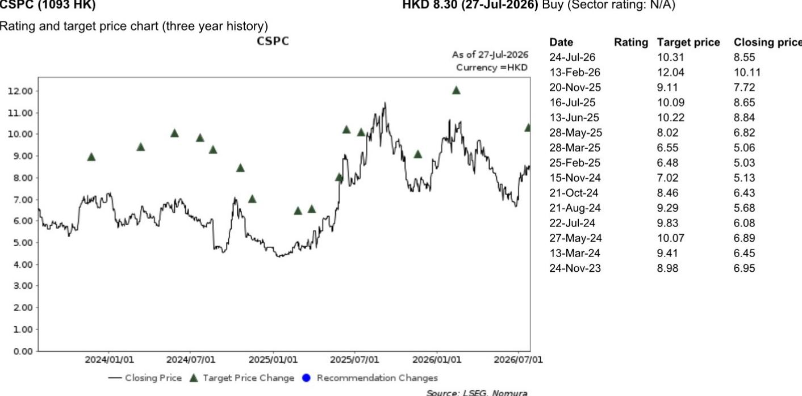

# NOM：石药集团正面业务与近期数据观察

7月27日相关市场收盘后，石药集团（CSPC，1093 HK）发布正面盈利预警。公司预计2026年上半年归母净利润达59亿至62亿元人民币，较上年同期的25.5亿元大幅增长。NOM标的随即发布快评，指出这一增长主要来自与阿斯利康在肽类药物合作中确认的约57.4亿元首付款收入，而非核心业务的持续改善。

这份快评的核心判断是：CSPC上半年成品药销售增速符合预期，但剔除一次性合作收入后，经常性收益出现明显下滑，需要读者在最终中报披露后进一步关注其背后原因。

## 1. 成品药销售增速高于NOM预期，但相对值仍有限

NOM估算，CSPC上半年成品药销售收入同比增长约10%，达到约50亿元人民币。这一数字高于NOM此前预期的46亿元，显示出公司核心药品业务在集采和市场竞争环境下仍保持一定韧性。

但需注意，50亿元的成品药收入仅占上半年总利润预警中位数60.5亿元的约83%。这意味着，如果没有阿斯利康合作首付款的确认，公司上半年的收入结构将完全不同。

> **KC评论：** 成品药销售超预期是正面信号，但50亿元的收入体量相对于公司整体市值和此前市场预期而言，并未构成质变。真正改变上半年利润表的是那笔57.4亿元的合作收入，它让净利润数字看起来跃升了一个台阶。

## 2. 剔除合作收入后，经常性收益可能同比下滑

NOM在报告中做了一个关键拆解：假设合作收入适用20%税率，扣除这部分后，CSPC第二季度经常性收益约为4.48亿至7.48亿元人民币，同比可能下降43%至5%。这个区间跨度较大，反映出不确定性。

NOM认为，经常性收益走弱可能来自两个原因：一是公司为推进更多后期临床试验而增加了研发支出；二是大宗原料药业务表现疲软，影响了整体盈利。

这一判断值得关注。CSPC过去几年一直在推进创新药转型，研发投入的持续增长是转型期的正常现象。但原料药业务的疲软则可能反映出行业层面的供需变化或公司在该板块的竞争地位变化。

## 3. 合作收入确认节奏对单季度利润影响显著

从时间维度看，CSPC上半年归母净利润中位数约为60.5亿元，而2025年上半年仅为25.5亿元。但更值得关注的是季度间的分布：NOM估算第二季度归母净利润为50.4亿至53.4亿元，而第一季度仅为约5.9亿元（由上半年中位数减去第二季度估算得出）。

这种季度间的剧烈波动，完全由合作收入的确认时点驱动。对于一家以药品销售为主业的公司而言，这种收入结构的变化意味着读者在评估其内在价值时，需要将一次性合作收入与经常性业务分开看待。NOM在报告中明确表示，对成品药销售超预期持正面态度，但同时建议关注最终中报中经常性收益表现不佳的具体原因。

## 4. 估值框架依赖DCF模型，合作收入并非长期驱动因素

，假设加权平均资本成本为9.7%，终端增长率为3.5%。以7月27日收盘价8.30港元计算，当前报价对应2026年预期摊薄每股收益0.47港元的约15.8倍市盈率。

值得注意的是，DCF模型的估值逻辑依赖于公司长期自由现金流的创造能力，而非单次合作收入。阿斯利康合作首付款虽然大幅提升了当期利润，但并未改变NOM对公司长期价值的核心假设。报告中也列出了主要节奏变化不确定性：恩必普（NBP）销售进一步下滑、新药销售爬坡慢于预期、对外授权交易规模或进度不及预期。

对于关注中国创新药企的读者而言，这份快评提供了一个观察框架：当一家公司出现大额合作收入时，需要区分“一次性收益”和“经常性收益”，并关注后者是否在研发投入和业务结构调整中保持健康。CSPC的最终中报将提供更完整的答案。

For informational purposes only. Portions may be generated,translated,summarized,or edited with AI assistance based on source materials and may contain omissions or errors. Please verify independently. This is not investment,legal,tax,accounting,or other professional advice.

For informational purposes only. Portions may be generated,translated,summarized,or edited with AI assistance based on source materials and may contain omissions or errors. Please verify independently. This is not investment,legal,tax,accounting,or other professional advice.

