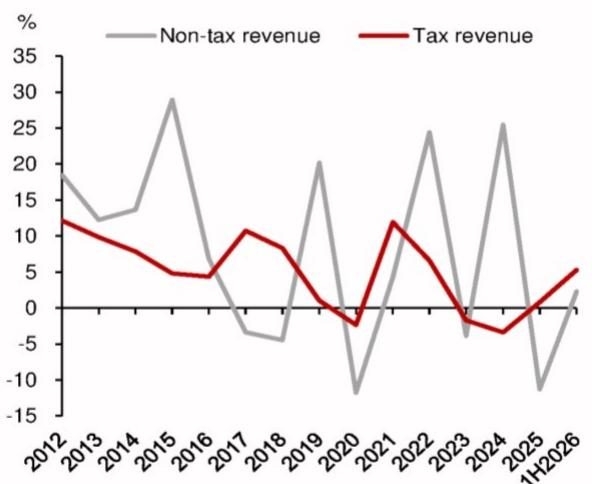
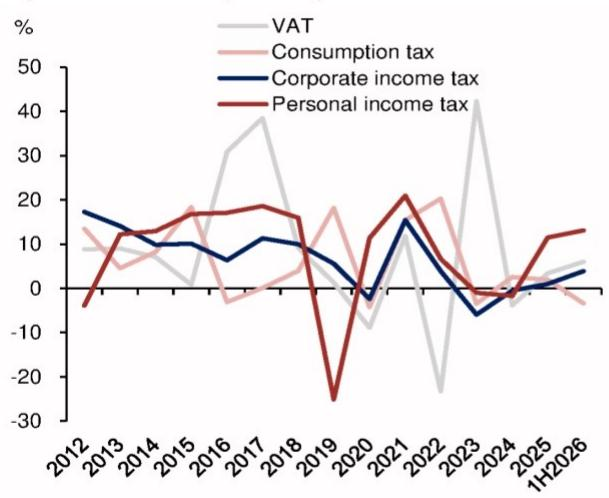
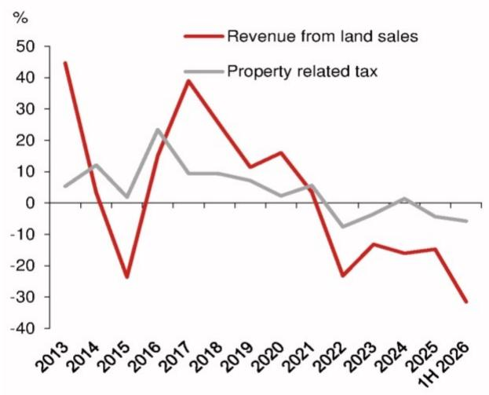
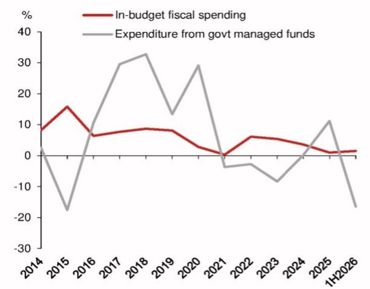

# Asia Insights

宏观环境 - 亚洲（除日本外）

## 上半年财政政策观察

财政部上周发布了6月财政数据。考虑到月度数据的波动性，我们使用上半年数据来观察更广泛的趋势。根据我们的估算，包含土地出让收入等预算外收入的广义财政收入增速，从2025年的-2.9%回升至上半年的1.0%，主要得益于税收收入增长加快，这既与价格回升有关，也与税收征管力度加强有关。然而，广义财政支出转为负增长，从2025年的3.7%降至上半年的-2.9%，部分受到政府债券发行节奏较慢的影响。按季度来看，与一季度相比，二季度财政收入改善更为明显，同时财政支出恶化程度也更为显著。

## 预计下半年财政政策将有所调整

财政收入增速加快而支出增速放缓，会减弱财政脉冲效应；这也有助于解释二季度整体增长数据的表现。预计下半年将通过加快政府债券发行和部署8000亿元新政策融资工具来加大财政支出力度。假设全年政府债券净发行额度全部使用完毕，预计下半年政府债券净融资（不含债务置换）将达到6.80万亿元，占全年额度的57%，超过2025年下半年的5.75万亿元。

## 七月政治局会议：大规模财政刺激可能性不大

预计在本周的政治局会议上将维持宽松的政策基调，这与7月13日总理李强主持的座谈会精神一致。然而，增量财政政策措施的规模可能有限，原因有三：第一，出口增长强劲，尽管主要受人工智能相关商品价格快速上涨推动，但可能缓解了对整体增长的担忧。第二，考虑到3月全国人大会议设定的财政预算，下半年财政支出有望回升。第三，认识到以旧换新等短期政策会产生透支效应，不能过于频繁使用。第四，政策制定者关注财政刺激可能带来的潜在影响以及地方政府债务的反弹。

## 上半年财政收入增长改善

根据我们的估算，广义财政收入增速从2025年的-2.9%回升至上半年的1.0%，主要受预算内财政收入推动，而政府性基金收入增速则进一步收缩。预算内财政收入从2025年的-1.7%升至上半年的4.7%，高于3月全国人大会议设定的全年2.2%的目标（图1）。税收收入增速从2025年的0.8%升至2026年上半年的5.3%，主要受增值税和企业所得税收入增长推动，分别从2025年的3.4%和1.0%升至2026年上半年的6.0%和3.9%（图2）。非税收入增速也从2025年的-11.3%回升至上半年的2.3%，得益于低基数效应以及包括采矿权在内的国有资源有偿使用收入增加。

上半年其他主要税种收入表现出现明显分化。受人工智能超级周期推动，证券交易印花税增速从2025年的57.8%跃升至2026年上半年的97.3%。个人所得税收入增速从2025年的11.5%小幅升至上半年的13.1%，得益于对境外收入和网络直播收入加强税收征管，以及市场行情回暖带来的资本利得税收入增加。相比之下，消费税收入增速转为负值，从2025年的2.0%降至上半年的-3.4%，受到以旧换新政策透支效应导致零售额增速放缓以及房地产行业持续调整背景下消费者信心偏弱的影响。

## 研究分析师

亚洲宏观环境

Hannah Liu - NIHK
hannah.liu@NOM.com
+852 2252 1082

Jing Wang - NIHK
jing.wang@NOM.com
+852 2252 1011

Ting Lu - NIHK
ting.lu@NOM.com
+852 2252 1306

## 上半年与房地产相关收入进一步恶化

与房地产相关的税收收入增速从2025年的-4.4%恶化至上半年的-5.8%，房地产调整仍在持续（图3）。虽然部分大城市二手房交易有所改善，但未能完全抵消其他城市的疲软。土地出让收入从2025年的-14.7%骤降至上半年的-31.5%。土地出让收入恶化拖累政府性基金收入增速从2025年的-7.0%降至2026年上半年的-21.6%，低于3月全国人大会议设定的政府性基金全年收入增长0.6%的目标。与房地产相关收入的持续恶化可能加剧地方政府的财政压力。

## 近期增值税和企业所得税增长的可持续性存疑

我们认为上半年增值税和企业所得税的增长主要受外部因素而非国内基本面改善推动。全球油价上涨暂时提振了上游企业的收入和利润，其中许多是大型国有企业，税收合规率较高。然而，作为主要的石油净进口国，贸易条件的恶化最终可能挤压大多数国内生产者和消费者，长期来看可能侵蚀税基。

## 上半年财政支出增速转负

根据我们的估算，广义财政支出转为负增长，从2025年的3.7%降至2026年上半年的-2.9%。预算内财政支出上半年仅增长1.5%，略高于2025年的1.0%，是2020年以来上半年财政支出增速最慢的一年，远低于全国人大会议设定的全年财政支出增长4.4%的目标。预算外支出放缓更为明显，政府性基金支出增速从2025年的11.3%骤降至上半年的-16.4%。二季度降幅进一步加深，从一季度的3.1%降至-31.0%，受到土地出让收入大幅下降导致地方政府财政压力的影响。

按预算内财政支出的主要类别来看，基础设施支出合计增速上半年仍为负值，为-4.8%，较2025年的-7.8%改善有限。按季度来看，基础设施支出放缓在二季度加剧，在一季度下降1.8%后，二季度下降7.9%。医疗卫生支出是主要支出类别中增长最快的，从2025年的5.7%升至上半年的10.8%，得益于生育补贴的前置发放。其他公共福利支出趋势不一，教育支出增速从2025年的3.2%降至上半年的0.6%，而社会保障和就业支出增速从2025年的6.7%小幅升至上半年的7.6%。

## 下半年财政支出有望回升

根据我们的估算，上半年政府债券净发行总额达到6.64万亿元，占3月全国人大会议设定的13.89万亿元年度政府债券额度的48%（图5），低于2025年上半年的7.25万亿元。剔除用于债务置换的特殊再融资债券（不贡献增量财政支出），上半年政府债券净发行额为5.09万亿元，仅占全年额度的43%，落后于2025年上半年的6.09万亿元。假设全年债券额度全部使用完毕，预计下半年剔除债务置换的政府债券净发行额将升至6.80万亿元，超过2025年下半年的5.75万亿元。考虑到政府债券发行量预计增加以及新政策融资工具的实施，预计下半年财政支出增速将回升。

图1：税收和非税收入年度增速

注：2022-23年税收收入已剔除大规模增值税留抵退税造成的扭曲。
来源：Wind，NOM全球宏观环境研究。

图2：主要税种收入增速

来源：Wind，NOM全球宏观环境研究。

图3：与房地产相关收入增速

来源：Wind，NOM全球宏观环境研究。

图4：财政支出年度增速

来源：Wind，NOM全球宏观环境研究。

图5：上半年政府债券融资回顾

<table><tr><td>政府债券净发行</td><td>2026年额度 人民币亿元</td><td>2026年上半年</td><td>占比</td></tr><tr><td>中央一般国债</td><td>5,090</td><td>2,120</td><td>42%</td></tr><tr><td>中央特别国债</td><td>1,300</td><td>572</td><td>44%</td></tr><tr><td>用于银行注资的中央特别国债</td><td>300</td><td>0</td><td>0%</td></tr><tr><td>中央政府债券</td><td>6,690</td><td>2,692</td><td>40%</td></tr><tr><td>地方一般债券</td><td>800</td><td>330</td><td>41%</td></tr><tr><td>地方专项债券</td><td>4,400</td><td>2,070</td><td>47%</td></tr><tr><td>用于债务置换的特殊再融资债券</td><td>2,000</td><td>1,548</td><td>77%</td></tr><tr><td>地方政府债券</td><td>7,200</td><td>3,948</td><td>55%</td></tr><tr><td>合计</td><td>13,890</td><td>6,640</td><td>48%</td></tr><tr><td>合计（剔除用于债务置换的地方专项债券）</td><td>11,890</td><td>5,092</td><td>43%</td></tr></table>

来源：Wind，NOM全球宏观环境研究。

图6：主要财政指标

<table><tr><td>主要财政指标</td><td>单位</td><td>2026年6月</td><td>2026年5月</td><td>2026年二季度</td><td>2026年一季度</td><td>2026年上半年</td><td>2025年</td><td>2024年</td></tr><tr><td>预算内收入增速</td><td>同比%</td><td>8.7</td><td>6.6</td><td>7.3</td><td>2.4</td><td>4.7</td><td>-1.7</td><td>1.3</td></tr><tr><td>税收收入</td><td>同比%</td><td>10.8</td><td>6.8</td><td>8.6</td><td>2.2</td><td>5.3</td><td>0.8</td><td>-3.4</td></tr><tr><td>增值税</td><td>同比%</td><td>4.9</td><td>7.9</td><td>7.4</td><td>4.9</td><td>6.0</td><td>3.4</td><td>-3.8</td></tr><tr><td>企业所得税</td><td>同比%</td><td>29.7</td><td>3.3</td><td>11.3</td><td>-5.6</td><td>3.9</td><td>1.0</td><td>-0.5</td></tr><tr><td>房地产相关税收</td><td>同比%</td><td>-12.3</td><td>-2.6</td><td>-5.3</td><td>-6.3</td><td>-5.8</td><td>-4.4</td><td>0.0</td></tr><tr><td>消费税</td><td>同比%</td><td>-5.3</td><td>-2.0</td><td>-2.0</td><td>-4.4</td><td>-3.4</td><td>2.0</td><td>2.6</td></tr><tr><td>个人所得税</td><td>同比%</td><td>17.0</td><td>12.4</td><td>16.4</td><td>10.5</td><td>13.1</td><td>11.5</td><td>-1.7</td></tr><tr><td>证券交易印花税</td><td>同比%</td><td>145.3</td><td>145.9</td><td>118.2</td><td>78.3</td><td>97.3</td><td>57.8</td><td>-29.1</td></tr><tr><td>非税收入</td><td>同比%</td><td>2.9</td><td>5.6</td><td>1.6</td><td>2.9</td><td>2.3</td><td>-11.3</td><td>25.4</td></tr><tr><td>政府性基金收入增速</td><td>同比%</td><td>-31.1</td><td>-20.5</td><td>-26.5</td><td>-16.2</td><td>-21.6</td><td>-7.0</td><td>-12.2</td></tr><tr><td>土地出让收入</td><td>同比%</td><td>-42.2</td><td>-35.8</td><td>-38.0</td><td>-24.4</td><td>-31.5</td><td>-14.7</td><td>-16.0</td></tr><tr><td>预算内支出增速</td><td>同比%</td><td>4.0</td><td>-1.6</td><td>0.2</td><td>2.6</td><td>1.5</td><td>1.0</td><td>3.6</td></tr><tr><td>基础设施</td><td>同比%</td><td>-0.5</td><td>-11.3</td><td>-7.9</td><td>-1.8</td><td>-4.8</td><td>-7.8</td><td>7.3</td></tr><tr><td>医疗卫生</td><td>同比%</td><td>8.8</td><td>10.7</td><td>9.3</td><td>12.1</td><td>10.8</td><td>5.7</td><td>-9.1</td></tr><tr><td>教育</td><td>同比%</td><td>5.4</td><td>-0.5</td><td>1.6</td><td>-0.3</td><td>0.6</td><td>3.2</td><td>2.0</td></tr><tr><td>社会保障和就业</td><td>同比%</td><td>13.2</td><td>1.3</td><td>5.9</td><td>9.0</td><td>7.6</td><td>6.7</td><td>5.6</td></tr><tr><td>科学技术</td><td>同比%</td><td>2.6</td><td>13.0</td><td>4.9</td><td>-3.7</td><td>1.3</td><td>4.8</td><td>5.7</td></tr><tr><td>环境保护</td><td>同比%</td><td>-15.7</td><td>-19.1</td><td>-19.8</td><td>-1.1</td><td>-10.3</td><td>6.1</td><td>-1.4</td></tr><tr><td>政府性基金支出增速</td><td>同比%</td><td>-44.0</td><td>-11.2</td><td>-31.0</td><td>3.1</td><td>-16.4</td><td>11.3</td><td>0.2</td></tr><tr><td>财政收支差额</td><td>人民币亿元</td><td>-887</td><td>-201</td><td>-919</td><td>-1,309</td><td>-2,228</td><td>-2,333</td><td>-1,887</td></tr><tr><td>财政收支差额（12个月滚动合计）</td><td>人民币亿元</td><td>-6,793</td><td>-6,843</td><td>-6,793</td><td>-7,182</td><td>-6,793</td><td>-7,135</td><td>-6,491</td></tr></table>

注：*指剔除增值税留抵退税后的财政收入。
来源：Wind，NOM全球宏观环境研究。

## 附录A-1

本报告由NOM International (Hong Kong) Ltd. (NIHK) 编制。详见NOM集团实体免责声明。

## 分析师认证

我们，Hannah Liu、Jing Wang和Ting Lu，特此证明：(1) 本研究报告中所表达的观点准确反映了我们对本研究报告涉及的任何或所有标的证券或发行人的个人观点；(2) 我们的薪酬中没有任何部分直接或间接与本研究报告中所表达的具体建议或观点相关；(3) 我们的薪酬中没有任何部分与NOM Securities International, Inc.、NOM International plc或任何其他NOM集团公司进行的任何特定投资银行业务交易挂钩。

## 重要披露

## 研究报告在线获取及利益冲突披露

NOM集团研究报告可在www.NOMnow.com/research、Bloomberg、Capital IQ、Factset、LSEG上获取。

重要披露内容可访问 http://go.NOMnow.com/research/m/Disclosures 阅读，或向NOM Securities International, Inc.索取。如网站访问遇到问题，请发送邮件至 grpsupport@NOM.com 寻求帮助。

编制本报告的分析师的薪酬基于多种因素，包括公司的总收入，其中一部分来自投资银行业务活动。除非另有说明，本报告首页列出的非美国分析师未在FINRA规则下注册/具备研究分析师资格，可能不是NSI的关联人员，且可能不受FINRA Rule 2241关于与所覆盖公司沟通、公开露面以及研究分析师账户持有证券交易等限制的约束。

NOM Global Financial Products Inc. (NGFP)、NOM Derivative Products Inc. (NDP) 和 NOM International plc. (NIplc) 已在美国商品期货交易委员会和美国国家期货协会注册为掉期交易商。NGFP、NDPI和NIplc主要从事掉期及其他衍生品交易，其中任何一项均可能成为本报告的主题。

## 免责声明

本出版物包含由第1页确定的NOM集团实体编制，以及（如适用）一个或多个NOM集团实体（其员工及其各自隶属关系在第1页或本出版物其他地方注明）参与贡献的材料。本文中使用的术语"NOM集团"指NOM Holdings, Inc.及其关联公司和子公司，包括：(a) NOM Securities Co., Ltd. ('NSC')，日本东京；(b) NOM Financial Products Europe GmbH ('NFPE')，德国；(c) NOM International plc ('NIplc')，英国；(d) NOM Securities International, Inc. ('NSI')，美国纽约；(e) NOM International (Hong Kong) Ltd. ('NIHK')，香港；(f) NOM Financial Investment (Korea) Co., Ltd. ('NFIK')，韩国（在韩国金融投资协会注册的NOM分析师信息可在KOFIA内网 http://dis.kofia.or.kr 查询）；(g) NOM Singapore Ltd. ('NSL')，新加坡（注册号197201440E，受新加坡金融管理局监管）；(h) NOM Australia Ltd. ('NAL')，澳大利亚（ABN 48 003 032 513），受澳大利亚证券和投资委员会监管，持有澳大利亚金融服务牌照号246412；(i) NOM Securities Malaysia Sdn. Bhd. ('NSM')，马来西亚；(j) NIHK, Taipei Branch ('NITB')，台湾；(k) NOM Financial Advisory and Securities (India) Private Limited ('NFASL')，印度孟买（注册地址：Ceejay House, Level 11, Plot F, Shivsagar Estate, Dr. Annie Besant Road, Worli, Mumbai- 400 018, India；电话：91 22 4037 4037，传真：91 22 4037 4111；CIN号：U74140MH2007PTC169116，证券经纪业务SEBI注册号：INZ000255633；商人银行业务SEBI注册号：INM000011419；研究业务SEBI注册号：INH000001014 - 合规官：Pratiksha Tondwalkar女士，电话：91 22 40374904，投诉邮箱：investorgrievancesra@NOM.com 网页：链接

关于印度上市公司或由印度NFASL研究分析师撰写的报告：(i) 证券市场投资存在市场风险。投资前请仔细阅读所有相关文件。(ii) SEBI的注册和NISM的认证均不保证中介机构的业绩，也不向读者提供任何回报保证。(iii) NFASL提供研究服务的条款和条件已在NFASL网页上披露。

(l) NOM Fiduciary Research & Consulting Co., Ltd. ('NFRC')，日本东京。(m) NOM Orient International Securities Co., Ltd ("NOI")，是NOM集团、东方国际（集团）有限公司和上海黄浦投资控股（集团）有限公司共同控股的合资企业。根据中华人民共和国法律（就本文件而言，不包括香港、澳门和台湾），NOI在中国境内获准提供证券研究和研究交流，并独立于NOM集团其他成员运营；特别是，NOI在中国证券中的权益不会向任何其他NOM集团实体披露或与其持仓合并，其他NOM集团实体在中国证券中的权益也不会向NOI披露或与其持仓合并。研究报告首页上NOI旁边印有的个人姓名表明该个人受雇于NOI，根据研究合作协议为NIHK提供研究协助。研究报告首页上员工姓名旁的'NSFSPL'表明该个人受雇于NOM Structured Finance Services Private Limited，根据公司间协议为某些NOM实体提供协助。研究报告首页上个人姓名旁的'Verdhana'表明该个人受雇于PT Verdhana Sekuritas Indonesia ('Verdhana')，根据研究合作协议为NIHK提供研究协助，Verdhana及该个人均未在印度尼西亚境外获得许可。

本材料：(I) 仅供您个人参考，我们不寻求基于此材料采取任何行动；(II) 不构成在任何司法管辖区出售或招揽购买任何证券的要约，若在该等司法管辖区此类要约或招揽属非法行为；(III) 除与NOM集团相关的披露外，基于我们认为可靠的来源信息，但未经NOM集团独立核实。

除与NOM集团相关的披露外，NOM集团不对本文件的公平性、准确性、完整性、正确性、可靠性、适用于任何特定目的或适销性作出任何明示或暗示的保证、陈述或承诺，并且在法律/法规允许的最大范围内，不承担因使用本文件及相关数据而采取（或决定不采取）任何行动而产生的任何责任（无论是因疏忽或其他原因，以及全部或部分）。在法律/法规允许的最大范围内，NOM集团特此排除所有保证和其他承诺，并且NOM集团不对因使用、误用或分发本材料或其中包含的信息或以其他方式与之相关而产生的任何损失（无论是因疏忽或其他原因，以及全部或部分）承担责任。

本材料中表达的意见或估计为截至原始发表日期的最新意见，其中包含的信息（包括意见和估计）如有变更，恕不另行通知。然而，NOM集团明确表示不承担任何更新或修订本文件的义务。本文中的任何评论或陈述均为作者的观点，可能与NOM集团内部其他方的观点不同。客户应考虑本报告中的任何建议或推荐是否适合其特定情况，并在适当时寻求专业建议，包括税务建议。NOM集团不提供税务建议。

在适用法律/法规允许的范围内，NOM集团及/或其高级职员、董事、员工和关联方可能以委托人、代理人或其他身份进行交易，或持有本文提及的发行人或证券的多头或空头头寸，或买卖基于此的证券、商品或工具、期权或其他衍生工具。NOM集团公司也可能担任发行人金融工具的市场做市商或流动性提供者（根据英国适用法规的定义）。如果市场做市商活动符合美国或其他司法管辖区特定法律法规的定义，将在具体的发行人披露中单独说明。

本文档可能包含从第三方获得的信息，包括但不限于信用评级机构的评级。NOM集团特此明确否认对本文档中包含的或与之相关的任何从第三方获得的信息的原创性、公平性、准确性、完整性、正确性、适销性或适用于特定目的的所有陈述、保证或承诺，并且不承担（无论是因疏忽或其他原因，以及全部或部分）因使用或误用任何从第三方获得的信息而产生的任何直接、间接、附带、示范性、补偿性、惩罚性、特殊或后果性损害、成本、费用、法律费用或损失（包括收入或利润损失及机会成本）的责任。禁止以任何形式复制和分发第三方内容，除非事先获得相关第三方的书面许可。第三方内容提供者不（明示或暗示）保证任何信息（包括评级）的公平性、准确性、完整性、正确性、及时性或可用性，并且不对因使用或误用此类内容而产生的任何错误或遗漏（无论是否疏忽）负责。第三方内容提供者不提供任何明示或暗示的保证，包括任何适销性或适用于特定目的或用途的保证。第三方内容提供者不承担（无论是因疏忽或其他原因，以及全部或部分）因使用或误用其内容（包括评级）而产生的任何直接、间接、附带、示范性、补偿性、惩罚性、特殊或后果性损害、成本、费用、法律费用或损失（包括收入或利润损失及机会成本）的责任。信用评级是意见陈述，而非事实陈述或购买、持有或出售证券的建议。它们不涉及证券的适合性或证券用于投资目的的适合性，不应作为研究交流依赖。本文档中的任何MSCI来源信息均为MSCI Inc.的专有财产。未经MSCI事先书面许可，不得以任何形式复制、转载、再传播、再分发或使用本信息及任何其他MSCI知识产权，包括创建任何金融产品和任何指数。本信息按"原样"提供。用户承担使用本信息的全部风险。MSCI、其关联方及任何参与或相关计算或编制信息的第三方特此明确否认对本文档或其中包含的信息或以其他方式与之相关的任何原创性、公平性、准确性、完整性、正确性、适销性或适用于特定目的的所有陈述、保证或承诺。在不限制前述规定的前提下，MSCI、其任何关联方或任何参与或相关计算或编制信息的第三方在任何情况下均不承担任何形式的任何损害责任。MSCI和MSCI指数是MSCI及其关联方的服务标志。

Russell/NOM日本股票指数的知识产权属于NOM Fiduciary Research & Consulting Co., Ltd. ("NFRC") 和 FTSE Russell ("Russell")。NFRC和Russell不保证指数的公平性、准确性、完整性、正确性、可靠性、有用性、适销性、适销性或适合性，并且不对任何指数用户及/或其关联方使用该指数所进行的商业活动或服务负责。

读者应将本文档视为其做出投资决策的单一因素，因此，本报告不应被视为识别或暗示与任何投资决策相关的所有直接或间接风险。NOM集团制作多种不同类型的研究产品，包括但不限于基本面分析和定量分析；一种研究产品中包含的建议可能因时间跨度、方法论或其他因素的不同而与其他类型研究产品中的建议不同。NOM集团以多种不同方式发布研究产品，包括在NOM集团门户网站上发布和/或直接向客户分发。不同客户群体可能根据其个人需求从研究部门获得不同的产品和服务。

本文中呈现的数字可能涉及过往表现或基于过往表现的模拟，这些并非未来或可能表现的可靠指标。如果信息包含对未来表现和业务前景的预期、预测或指示，此类预测可能并非未来或可能表现的可靠指标。此外，模拟基于模型和简化假设，可能过度简化且不能反映未来的回报分布。本文档中为说明目的创建和发布的任何数字、策略或指数，不旨在作为欧洲基准法规定义的"基准"使用。某些证券受汇率波动影响，可能对投资的价值、价格或收入产生不利影响。

关于固定收益研究：建议分为两类：战术性建议，通常持续最多三个月；或战略性建议，通常持续6-12个月。然而，交易建议可能随时根据情况变化进行审查。交易建议还提供"止损"水平；一旦触及，将自动关闭交易建议。建议中显示的价格和回报表现是在提交发布时获取的，基于当时指示性的Bloomberg、LSEG或NOM价格和回报表现。显示的价格和回报表现不一定是可以执行交易建议的价格。

本文所述的证券可能未根据1933年美国证券法（"1933年法案"）注册，在这种情况下，除非已根据1933年法案注册，或符合1933年法案注册要求的豁免条件，否则不得在美国或向美国人士发售或出售。除非管辖法律另有规定，任何交易应通过您所在司法管辖区的NOM实体执行。

本文档已获批准在英国作为投资研究由NIplc分发。NIplc由审慎监管局授权，并受金融行为监管局和审慎监管局监管。NIplc是伦敦证券交易所成员。本文档不构成英国适用法规意义上的个人推荐，也未考虑个别读者的特定投资目标、财务状况或需求。本文档仅面向英国适用法规意义上的"合格交易对手"或"专业客户"，因此不得向"零售客户"再分发。

本文档已获批准在欧洲经济区作为投资研究由NOM Financial Products Europe GmbH ("NFPE") 分发。NFPE是一家根据德国法律组建的有限责任公司，在法兰克福/美因河畔法院商业登记处注册，注册号HRB 110223。NFPE由德国联邦金融监管局授权和监管。

本文档已获NIHK批准在香港由NIHK分发。NIHK受香港证券及期货事务监察委员会监管。本文档仅面向香港适用法规意义上的"专业读者"，因此不得向非"专业读者"人士再分发。

本文档已获批准在澳大利亚由NAL分发。NAL受澳大利亚ASIC授权和监管。

本文档也已获批准在马来西亚由NSM分发。

在新加坡，本文档由NSL分发。NSL是根据《财务顾问法》（第110章）定义的豁免财务顾问，并受新加坡金融管理局监管。NSL可根据《财务顾问条例》第32C条的规定，分发其外国关联公司制作的本文档。本文档面向《证券及期货法》（第289章）定义的认可读者、专家读者或机构读者。如果本文档的接收者不是认可读者、专家读者或机构读者，NSL仅在法律要求的范围内对此类接收者承担本文档内容的法律责任。新加坡的本文档接收者应就本文档引起或与之相关的事项联系NSL。本文档旨在广泛分发。它未考虑任何特定个人的特定投资目标、财务状况或特殊需求。接收者在承诺购买任何证券之前，应考虑其特定的投资目标、财务状况或特殊需求，包括根据其认为合适的方式，通过单独约定寻求独立财务顾问关于投资适合性的建议。除非1933年法案S条例的规定禁止，本材料在美国由美国注册经纪交易商NSI分发，NSI根据1934年美国证券交易法Rule 15a-6的规定对其内容承担责任。编制本文档的实体允许NOM集团内其独立运营的关联公司向其客户提供此类文件的副本。

本文档未获批准向沙特阿拉伯王国（"沙特阿拉伯"）的"授权人士"、"豁免人士"或"机构"（由资本市场管理局定义）或阿拉伯联合酋长国（"阿联酋"）的"市场交易对手"或"专业客户"（由迪拜金融服务局定义）或卡塔尔国（"卡塔尔"）的"市场交易对手"或"商业客户"（由卡塔尔金融中心监管局定义）以外的人士分发。未经授权的人士不得将本文档或其任何副本带入、传输或分发至沙特阿拉伯、阿联酋或卡塔尔，或向沙特阿拉伯境内的"授权人士"、"豁免人士"或"机构"、阿联酋的"市场交易对手"或"专业客户"、卡塔尔的"市场交易对手"或"商业客户"以外的人士分发。未能遵守这些限制可能构成违反阿联酋、沙特阿拉伯或卡塔尔法律。

关于涉及台湾上市公司或由台湾研究分析师撰写的报告：

本文档仅供参考。您应独立评估投资风险，并对您的投资决策全权负责。未经NOM集团书面授权，不得复制或引用本报告的任何部分。根据台湾《证券商受托买卖有价证券管理规则》及/或其他适用法律法规，您不得向他人（包括但不限于关联方、关联公司及任何其他第三方）提供本报告，或从事任何可能涉及利益冲突的与本报告相关的活动。关于NOM International (Hong Kong) Ltd., Taipei Branch不可执行的证券/工具的信息仅供信息参考，不构成建议或招揽交易此类证券/工具。

本材料不得在印度尼西亚境内分发，或以构成印度尼西亚共和国法律下公开发售的方式传递给印度尼西亚共和国领土内的人士或印度尼西亚公民（无论其居住地或所在地）或印度尼西亚的实体或居民。本文档中提及的证券不得在印度尼西亚境内，或以构成印度尼西亚共和国法律下公开发售的方式，向印度尼西亚公民（无论其居住地或所在地）或印度尼西亚的实体或居民发售或出售。

研究报告首页上NOI旁边印有的个人姓名表明本文档是NOI在中国境内发布的研究报告的翻译版本。在所有其他情况下，本文档由未在中国境内获得证券研究许可的NOM集团或其子公司或关联公司（统称"离岸发行人"）编制。本研究报告未获批准在中国境内分发。任何A股相关分析（如有）并非为在中国境内居住或注册的任何人士制作。接收者不应依赖本研究报告中包含的任何信息做出投资决策，离岸发行人不对此承担任何责任。未经NOM集团成员事先书面同意，不得以任何形式（I）复制、影印、复印或复制本材料的任何部分；或（II）再传播、再发布或再分发本材料。如果本文档通过电子传输方式分发，例如电子邮件，则无法保证此类传输安全无误，因为信息可能被拦截、损坏、丢失、销毁、延迟到达或不完整，或包含病毒。因此，发送方不对因电子传输而产生的本文档内容中的任何错误或遗漏（无论是因疏忽或其他原因，以及全部或部分）承担责任。如需验证，请索取纸质版本。

## NOM Securities Co., Ltd.

在关东财务局注册的金融工具公司（注册号第142号）

会员协会：日本证券业协会；日本投资管理协会；日本金融期货协会；第二类金融工具业协会；日本证券型代币发行协会。

NOM集团通过其合规政策和程序（包括但不限于利益冲突、中国墙和保密政策）以及通过维护中国墙和员工培训来管理与研究报告制作相关的冲突。

关于本文件中包含的任何研究交流所使用的方法或模型的更多信息，可联系NOM研究分析师获取。披露信息可应要求提供，披露信息可在NOM披露网页获取：

http://go.NOMnow.com/research/m/Disclosures

版权所有 © 2026 NOM International (Hong Kong) Ltd., Hong Kong。保留所有权利。
