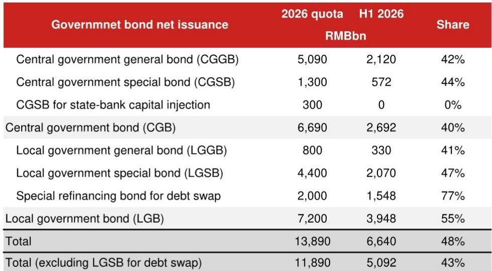

# NOM：研究主题与行业变化观察

NOM最新研报基于上半年财政数据提出一个值得关注的判断：中国财政政策在上半年实际呈现仍在调整态势，收入增速回升而支出增速转负，这一组合部分解释了二季度GDP增速节奏变化。报告预计下半年政府债券发行将提速，财政支出有望回暖，但7月政治局会议推出大规模增量刺激的可能性有限。

报告使用“广义财政收入”口径，将土地出让收入等预算外收入纳入计算。上半年广义财政收入同比增长1.0%，较2025年全年的-2.9%明显改善，主要得益于税收收入增速加快。税收增长背后有两个驱动因素：再通胀效应和更严格的税收征管执行。增值税和企业所得税增速分别回升至6.0%和3.9%，但报告认为这一改善主要由外部因素驱动——全球油价上涨暂时提振了上游国企的利润和税基，而中国作为净石油进口国，贸易条件仍在调整长期可能侵蚀税基。

与收入端形成对比的是，广义财政支出上半年同比转为-2.9%，而2025年全年为增长3.7%。支出调整部分源于政府债券发行节奏偏慢。二季度支出出现变化幅度较一季度更为明显，政府性产品支出同比降幅从一季度的3.1%扩大至-31.0%。基础设施支出上半年同比仍为-4.8%，二季度降幅扩大至-7.9%。医疗保健支出是主要类别中增长最快的，上半年达10.8%，受生育补贴前置发放支撑。

> **KC评论：** 收入改善、支出调整的组合意味着财政脉冲为负，对总需求的支撑减弱。报告隐含的逻辑是，上半年财政实际是在“抽水”，而不是“放水”。这一点对理解二季度宏观环境动能变化比单一的赤字率数字更有解释力。

土地相关收入是财政调整的核心影响因素。上半年房地产相关税收同比-5.8%，较2025年全年的-4.4%进一步出现变化。土地出让收入同比降幅从-14.7%扩大至-31.5%，影响政府性产品收入降至-21.6%，远低于全年0.6%的增长目标。报告认为，房地产相关收入的持续出现变化可能加剧地方政府的财政不确定性。

## 1. 上半年政府债券净融资进度慢于去年同期

报告测算，上半年政府债券净融资6.64万亿元，占全年13.89万亿元额度的48%，低于2025年上半年的7.25万亿元。剔除用于债务置换的特殊再融资债券后，净融资额为5.09万亿元，仅占全年额度的43%，同样落后于去年同期的6.09万亿元。这意味着上半年财政支出的调整并非额度不足，而是发行节奏偏慢所致。

## 2. 下半年政府债券净融资预计达6.8万亿元

假设全年债券额度全部使用，报告预计下半年剔除债务置换后的政府债券净融资将达6.80万亿元，超过2025年下半年的5.75万亿元。加上8000亿元新政策性融资工具的部署，报告认为下半年财政支出增速有望回升。这一判断的关键前提是：全年额度能否真正用满，以及地方政府在土地收入锐减后的执行能力。

## 3. 7月政治局会议增量政策规模可能有限

报告列出四个理由：出口增长强劲，即使主要由AI相关商品价格驱动，也可能缓解决策层对整体增长的担忧；二季度财政预算已设定，下半年支出自然回升；以旧换新等短期政策存在透支效应，不宜频繁使用；决策层对财政刺激的潜在副作用和地方债务反弹保持警惕。报告认为政策基调将保持宽松，但增量规模有限。

## 4. 增值税和企业所得税改善的可持续性存疑

报告特别指出，上半年增值税和企业所得税的改善主要来自上游企业，这些企业多为大型国企，纳税合规率较高。但中国作为净石油进口国，油价上涨带来的贸易条件出现变化最终会挤压大部分国内生产者和消费者。这一判断意味着，上半年税收改善的结构性基础并不牢固，如果外部价格因素消退，税收增速可能再次承压。

对于关注中国宏观环境的读者，这份报告提供了一个观察框架：财政脉冲的方向比赤字规模更能反映实际政策力度。上半年收入升、支出降的组合，叠加土地收入持续出现变化，形成了事实上的调整。下半年能否通过加快债券发行扭转这一态势，取决于额度使用效率和地方政府的执行能力。报告对7月政治局会议的判断相对审慎，认为大规模刺激的概率不高。

For informational purposes only. Portions may be generated,translated,summarized,or edited with AI assistance based on source materials and may contain omissions or errors. Please verify independently. This is not investment,legal,tax,accounting,or other professional advice.

For informational purposes only. Portions may be generated,translated,summarized,or edited with AI assistance based on source materials and may contain omissions or errors. Please verify independently. This is not investment,legal,tax,accounting,or other professional advice.

