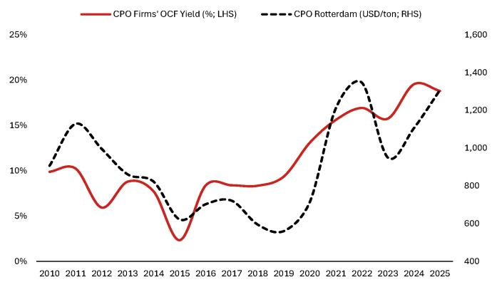
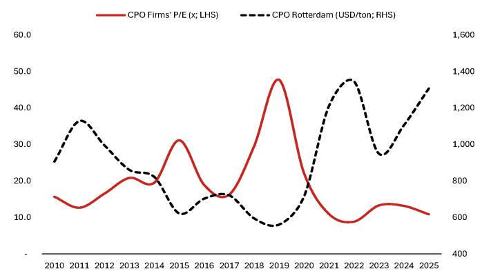
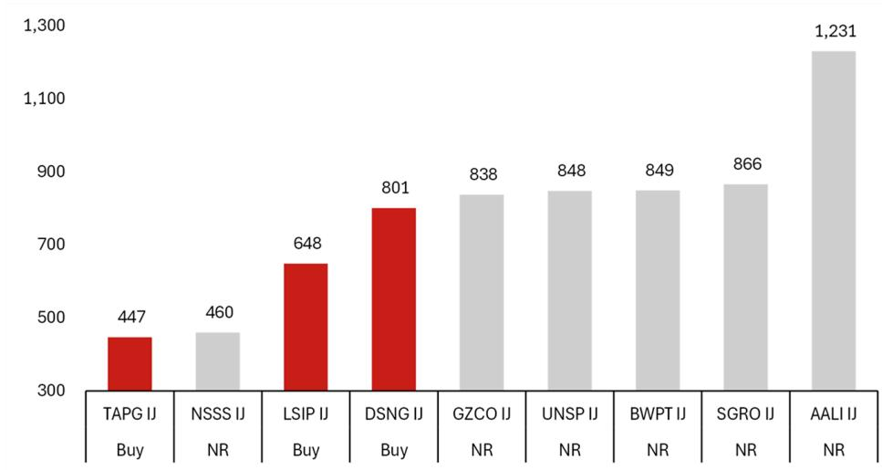
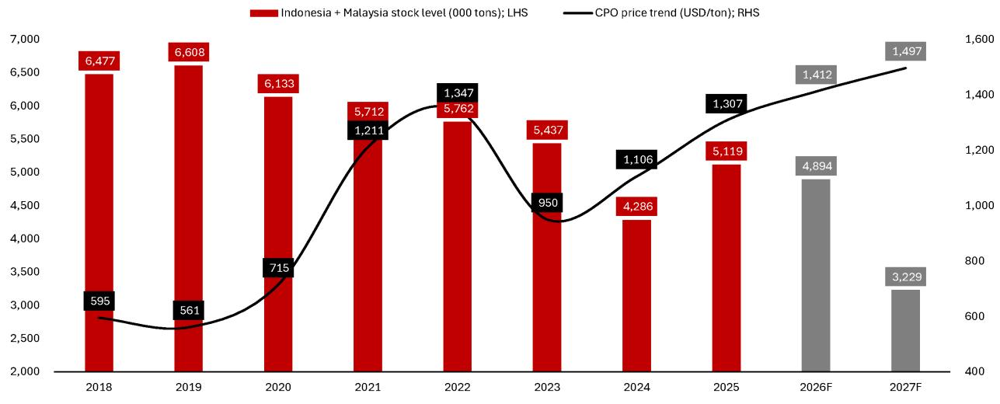
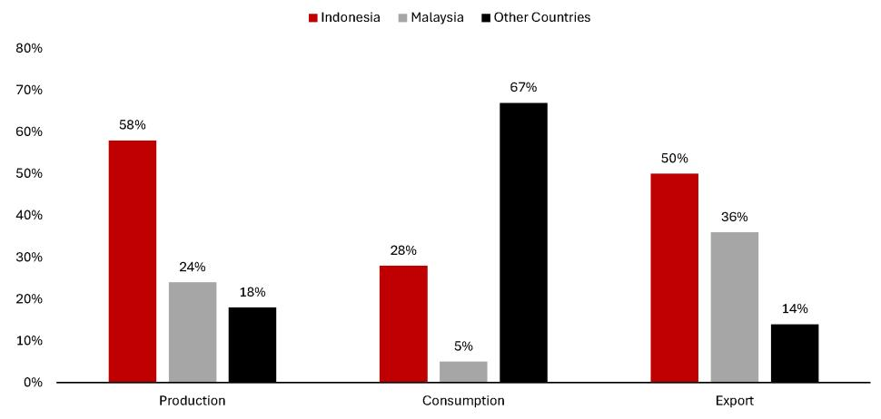
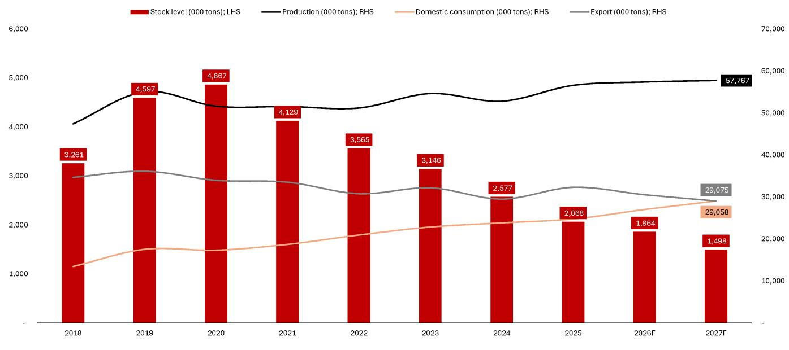
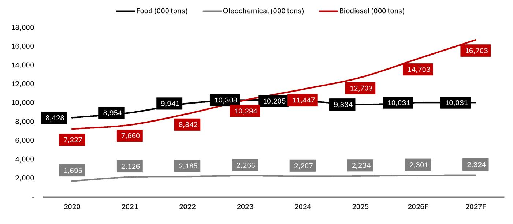
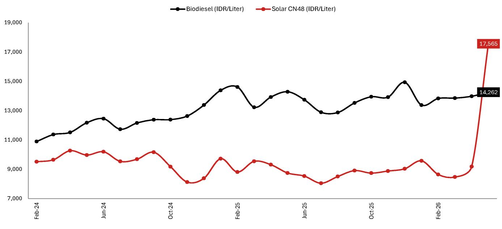
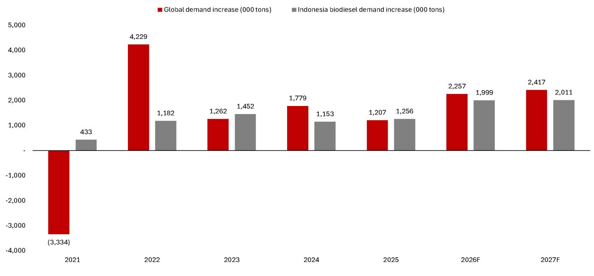
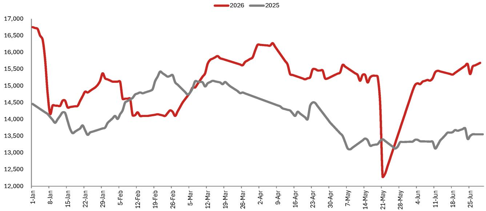

EQUITY: AGRI-RELATED

## Supercycle zone

Continued inventory depletion to boost CPO prices

Production likely to be flat or decline

We believe global crude palm oil (CPO) production is either going to be stagnant or decline in the medium term, even without the Middle East war disruption. Our main thesis is CPO yield erosion will continue, as plantation age profile is heavily skewed towards older trees in Indonesia and Malaysia (which together account for ~85% of global CPO production, see Fig. 6). We think that Indonesia, as the largest producer globally, has been too slow in replanting its smallholder's plantation (small-scale farmers – 45% of Indonesia's total plantation area); at this acute stage, we believe cost incurred to rejuvenate smallholder farmers' plantations would be massive, given the large accumulated area. On top of that, there is a shortage of quality palm oil seeds, suggesting Indonesia's CPO production may suffer long-term production yield pressure, unless the government reopens large new plantation areas. We also believe the confiscated plantation lands under SOE might produce less harvest yields due to inefficient operations, given the lack of skilled manpower. Currently, the confiscated lands are close to 1mn ha, or an estimated ~8% of total Indonesia planted area. Additional production yield pressure would also come from expensive fertilizer prices as smallholder farmers are most likely to reduce fertilizer usage. The same might happen to other crops (i.e. soybean and sunflower), which would translate to a lower global vegetable oil yield as well. Moreover, El Nino – one of investors' biggest concerns and has been slowly strengthening towards 2H26F – could put further pressure on production, although we expect a lagged yield impact (i.e. to 2027F)

## Accelerating Biofuel expansion

Indonesia's biodiesel program is the biggest factor to influence global CPO prices as it has historically contributed $>65\%$ of global incremental CPO demand, according to USDA. We estimate Indonesia's B50 implementation will add $\sim 4\mathrm{mn}$ tons of demand (vs. 4.7mn tons estimated global demand in 2026F and 2027F), likely pushing CPO prices to new highs. We believe the Indonesia government might expand the biodiesel program to beyond B50 given its main goal is to eliminate diesel fuel imports. With narrowing spreads between biodiesel and diesel fuel, we believe the country's CPO fund budget can afford to subsidize B50 with a minimal levy hike. Conservatively, we assume CPO fund would need to raise the levy by another $2.5 - 5\%$ to run the B50 mandate, which is still accretive for upstream producers as CPO price hikes will compensate for a higher levy. Additional demand booster also comes from energy scarcity amid geopolitical tension, forcing more countries to accelerate biofuel blending such as Malaysia, Brazil, the Philippines, and the US (see Fig. 17-18). Therefore, demand for overall vegetable oils should structurally increase, in our view.

## Structurally high CPO prices

We believe CPO prices are entering a supercycle, with high prices sustaining in the long run, and likely even longer than the commodity boom cycle 15 years ago. We also believe CPO companies could generate higher profits and accumulate more cashflow than in the past. We forecast the average CPO Rotterdam price to reach USD1,412/ton in 2026F and USD1,497/ton in 2027F versus USD1,307/ton in 2025, and expect domestic prices to witness a similar rising trend.

Our view of a multiyear CPO price expansion is based on our assumptions that: 1) demand structurally would exceed supply – we estimate Indonesia and Malaysia total CPO inventory will reach <4mn tons in 2026/27F, the lowest in the past decade; 2) other vegetable oil prices would remain elevated, supporting CPO prices – driven by less

## Research Analysts

Indonesia Research Team
Raghavendra Divekar, CFA - NSM
raghavendra.divekar@NOM.com
+603 2027 6893

## Onshore expert

Sandy Ham (sandy.ham@verdhana.id),

Samuel Christian
(samuel.christian@verdhana.id),

Jody Wijaya (jody.wijaya@verdhana.id),

Nayla Yasmin
(nayla.yasmin@verdhana.id),

The onshore experts, who are employed by PT Verdhana Sekuritas Indonesia (“Verdhana”) and are not licensed outside Indonesia, have contributed to the content of this report under a partnership agreement between NOM and Verdhana.

Production Complete: 2026-07-27 09:01 UTC

fertilizer usage and higher biofuel blending amid geopolitical tension; and 3) no optimal substitute for CPO products.

## Top picks

In terms of top picks, we select CPO names that have: 1) high production yields; 2) low cash cost; and 3) improved dividend yield. Our top picks are in the order of Triputra Agro Persada (TAPG IJ [BUY – TP 2,500]; it has a high production yield, the lowest cash cost amongst peers, and the highest dividend yield in ASEAN) > Dharma Satya Nusantara (DSNG IJ [BUY – TP 2,100]; high production yield and deleveraging advantages) > London Sumatra Indonesia (LSIP IJ [BUY – TP 2,450]; has one of the cheapest valuations).

We value Indonesia plantation firms at an average 25% discount to peers in Malaysia, which we believe already reflected market concerns about export-agency uncertainty and the associated widened Indo-Malaysia CPO price discount; we therefore see these risks as highly priced in at current levels. On the export-governance front, we do not see the role of Danantara Sumberdaya Indonesia (DSI) (unlisted), Indonesia's export body that monitors exports and verifies agents, posing a material harm to the CPO ecosystem. We expect DSI to stay as a monitoring intermediary rather than becoming a sole trader, and we deem it unlikely to become a fully monopsony model to be enforced as it would risk disrupting trading activity, compressing local CPO prices, and inflicting losses on farmers, the knock-on effects of which would likely weigh on the Rupiah, widen Indonesia's trade deficit, and ultimately pressure the government's political standing. In a worst-case scenario (i.e. the government experiments with the sole trader model), we expect a period of turbulence, although we believe a quick policy correction would follow if damage to farmer incomes and the Rupiah becomes apparent.

Fig. 1: Stocks for action

<table><tr><td rowspan="2">Company</td><td rowspan="2">Ticker</td><td rowspan="2">Rating</td><td colspan="2">Target Px (IDR)</td><td rowspan="2">Last Px (IDR)21-Jul</td><td rowspan="2">Upside(%)</td><td colspan="2">Target P/E (x)</td><td colspan="2">Implied P/E (x)</td></tr><tr><td>Old</td><td>New</td><td>Old</td><td>New</td><td>FY26F</td><td>FY27F</td></tr><tr><td>Triputra Agro Persada</td><td>TAPG IJ</td><td>Buy (~)</td><td>2,700</td><td>2,500 (▼)</td><td>1,610</td><td>55%</td><td>13.0</td><td>12.0 (▼)</td><td>7.6</td><td>6.9</td></tr><tr><td>Dharma Satya Nusantara</td><td>DSNG IJ</td><td>Buy (initiation)</td><td>-</td><td>2,100</td><td>1,230</td><td>71%</td><td>-</td><td>10.0</td><td>5.8</td><td>5.2</td></tr><tr><td>London Sumatera</td><td>LSIP IJ</td><td>Buy (initiation)</td><td>-</td><td>2,450</td><td>1,340</td><td>83%</td><td>-</td><td>8.0</td><td>4.4</td><td>4.2</td></tr></table>

Source: Bloomberg Finance L.P., company data, NOM estimates

## How we value Indonesia CPO stocks

We argue that CPO prices should rise higher than 2010-2020 levels as the current weakness in supply is more acute while demand from biodiesel continues to rise, which should push CPO prices into a strong upcycle. Moreover, other vegetable oil substitutes have similar supply and demand dynamics and should support CPO prices. Indeed, CPO prices have sustainably stayed above USD1,000/ton since 2023 (vs. an average cash cost of USD770/ton), delivering large profitability for CPO players. We use a conservative target multiple of 8-12x PE to value Indonesia CPO stocks, compared to 21x average ASEAN P/E in 2010-2020), also at a 25% discount to Malaysia CPO stocks on average, as we incorporate higher risks of potential unfavourable government policies and ESG discount. Our three preferred CPO stocks are TAPG > DSNG > LSIP.

We choose TAPG as our top pick, in view of its: 1) high productivity, backed by a relatively young plantation age profile of ~15 years old; 2) lowest cash cost among domestic listed companies, thanks to its operational excellence; and 3) has the highest dividend yield. The company has the capability to pay high dividend as it has largely completed its infrastructure buildout and is in a significant net cash position.

DSNG is our second pick. The company also has a similar plantation age profile, and hence is producing high output. The company is also gradually reducing debt, boosting its NPAT further. However, management is actively developing downstream businesses and accelerating its replanting program, which could put a cap on its dividend payout ratio.

Our third preferred stock is LSIP despite its older plantation age profile, but its cash cost remains very efficient compared to peers, in our view. Besides, we think LSIP's current valuation is inexpensive.

These three stocks are domestic CPO players, not exporters; thus, we believe it would be more relevant to use Indonesia final local CPO prices to analyze their businesses.

Downside risks to our investment views are mainly unfavourable government policies, especially if DSI (Indonesia export body) acts as sole trader. But we view this scenario as unlikely as a monopsony model is not feasible. Even if the government were to experiment on this model, it would only be temporary as the authorities will likely change the policy considering the significant damage inflicted on farmers income and the Rupiah. Therefore, in this report, we assume DSI would act only as an agent to monitor and supervise the sector.

Fig. 2: ASEAN CPO firms' operating cashflow (OCF) yield improvement aligns with CPO price movement  
  
Source: Company data, NOM

Fig. 3: ASEAN CPO firms' valuation (P/E) versus CPO price  
  
Source: Company data, NOM

Fig. 4: CPO peer comparison  
Indonesia CPO stocks under our coverage have better growth and cheaper valuations than the regional peer average

<table><tr><td rowspan="2">Company</td><td rowspan="2">Bloomberg Ticker</td><td rowspan="2">M Cap US$ mn</td><td rowspan="2">Rating</td><td rowspan="2">Target Price LC</td><td rowspan="2">Last Price 21-Jul-26</td><td rowspan="2">Upside (%)</td><td colspan="2">NPAT Growth (%)</td><td colspan="2">P/E (x)</td><td colspan="2">P/B (x)</td><td colspan="2">ROE (%)</td><td colspan="2">Dividend Yield (%)</td></tr><tr><td>FY26F</td><td>FY27F</td><td>FY26F</td><td>FY27F</td><td>FY26F</td><td>FY27F</td><td>FY26F</td><td>FY27F</td><td>FY26F</td><td>FY27F</td></tr><tr><td colspan="17">Malaysia</td></tr><tr><td>SD Guthrie</td><td>SDG MK</td><td>11,144</td><td>Buy</td><td>7.20</td><td>6.59</td><td>9%</td><td>7%</td><td>2%</td><td>16.5</td><td>16.1</td><td>2.1</td><td>2.0</td><td>13.2</td><td>12.6</td><td>3.0</td><td>3.0</td></tr><tr><td>Johor Plantations Group</td><td>JPG MK</td><td>1,229</td><td>Buy</td><td>2.20</td><td>2.01</td><td>9%</td><td>-4%</td><td>-2%</td><td>15.5</td><td>15.5</td><td>1.6</td><td>1.5</td><td>10.8</td><td>10.1</td><td>3.5</td><td>3.5</td></tr><tr><td>IOI Corporation</td><td>IOI MK</td><td>6,901</td><td>Neutral</td><td>4.60</td><td>4.49</td><td>2%</td><td>1%</td><td>-1%</td><td>18.0</td><td>18.0</td><td>2.1</td><td>2.0</td><td>12.1</td><td>11.3</td><td>2.7</td><td>2.9</td></tr><tr><td>Kuala Lumpur Kepong</td><td>KLK MK</td><td>5,730</td><td>Neutral</td><td>24</td><td>21.02</td><td>14%</td><td>79%</td><td>8%</td><td>15.8</td><td>14.7</td><td>1.6</td><td>1.5</td><td>10.1</td><td>10.4</td><td>3.8</td><td>4.3</td></tr><tr><td>Genting Plantations</td><td>GENP MK</td><td>1,250</td><td>Not Rated</td><td>na</td><td>5.70</td><td>na</td><td>2%</td><td>0%</td><td>14.1</td><td>14.0</td><td>1.0</td><td>0.9</td><td>7.1</td><td>6.9</td><td>4.2</td><td>4.4</td></tr><tr><td>Sarawak Oil Palms</td><td>SOP MK</td><td>1,138</td><td>Not Rated</td><td>na</td><td>5.12</td><td>na</td><td>8%</td><td>2%</td><td>9.5</td><td>9.3</td><td>1.0</td><td>0.9</td><td>11.2</td><td>10.6</td><td>3.4</td><td>3.5</td></tr><tr><td>Average</td><td></td><td></td><td></td><td></td><td></td><td></td><td>15.2%</td><td>1.6%</td><td>14.9</td><td>14.6</td><td>1.6</td><td>1.5</td><td>10.7</td><td>10.3</td><td>3.4</td><td>3.6</td></tr><tr><td colspan="17">Singapore</td></tr><tr><td>Wilmar International</td><td>WIL SP</td><td>18,927</td><td>Neutral</td><td>3.50</td><td>3.91</td><td>-10%</td><td>11%</td><td>11%</td><td>12.1</td><td>11.2</td><td>1.1</td><td>1.1</td><td>7.1</td><td>7.6</td><td>5.6</td><td>6.0</td></tr><tr><td>First Resources</td><td>FR SP</td><td>4,309</td><td>Not Rated</td><td>na</td><td>3.59</td><td>na</td><td>9%</td><td>2%</td><td>12.3</td><td>12.4</td><td>3.0</td><td>2.7</td><td>22.6</td><td>21.5</td><td>5.5</td><td>6.0</td></tr><tr><td>Average</td><td></td><td></td><td></td><td></td><td></td><td></td><td>10.2%</td><td>6.8%</td><td>12.2</td><td>11.8</td><td>2.0</td><td>1.9</td><td>14.8</td><td>14.6</td><td>5.5</td><td>6.0</td></tr><tr><td colspan="17">Indonesia</td></tr><tr><td>Triputra Agro Persada</td><td>TAPG IJ</td><td>1,793</td><td>Buy</td><td>2,500</td><td>1,610</td><td>55%</td><td>13%</td><td>11%</td><td>7.6</td><td>6.9</td><td>2.7</td><td>2.6</td><td>36.5</td><td>38.6</td><td>13.0</td><td>14.3</td></tr><tr><td>Dharma Satya Nusantara</td><td>DSNG IJ</td><td>723</td><td>Buy</td><td>2,100</td><td>1,230</td><td>71%</td><td>21%</td><td>11%</td><td>5.8</td><td>5.2</td><td>1.0</td><td>0.9</td><td>18.0</td><td>17.5</td><td>5.1</td><td>6.7</td></tr><tr><td>London Sumatera</td><td>LSIP IJ</td><td>513</td><td>Buy</td><td>2,450</td><td>1,340</td><td>83%</td><td>11%</td><td>5%</td><td>4.4</td><td>4.2</td><td>0.6</td><td>0.5</td><td>14.1</td><td>13.5</td><td>6.9</td><td>7.2</td></tr><tr><td>Astra Agro Lestari</td><td>AALI IJ</td><td>697</td><td>Not Rated</td><td>na</td><td>6,450</td><td>na</td><td>9%</td><td>4%</td><td>7.2</td><td>6.9</td><td>0.5</td><td>0.5</td><td>6.7</td><td>5.7</td><td>5.6</td><td>5.5</td></tr><tr><td>Average</td><td></td><td></td><td></td><td></td><td></td><td></td><td>13.4%</td><td>7.7%</td><td>6.3</td><td>5.8</td><td>1.2</td><td>1.1</td><td>18.8</td><td>18.8</td><td>7.6</td><td>8.4</td></tr></table>

Note: Bloomberg consensus estimates for Not rated stocks  
Source: Bloomberg Finance L.P., NOM estimates

Fig. 5: CPO companies cash cost comparison (USD/ton) (2025)  
TAPG has most efficient cash cost owing to operational excellence and productive yield.  
  
Source: Company data, NOM

## Risks that could undermine our thesis

\- Assigning DSI as a sole trader can disrupt the supply chain of the CPO industry, such as weakening local CPO prices significantly. In terms of operation, we believe implementing a monopsony model in the CPO industry will bring extreme high risks, given lack of capability in terms of human resources, infrastructures, and capital. Politically, it also produces additional complexity as there are many conflicts of interests and law enforcements issues. An instant implementation of a sole trader model would immediately destroy local CPO prices as export trading activities will deteriorate in a rapid pace, resulting in massive losses for farmers, and at the same time damage government popularity significantly, in our view. This policy will also widen trade deficit considerably, as well as weaken the Rupiah and Indonesia's fiscal position. All in all, we think the total damage would be too big. That said, logically, the government should maintain DSI's role as a monitoring agent only, not as a sole trader. Currently, with DSI acting as a monitoring agent, it does not pose significant harm to the CPO ecosystem, in our view. However, in a worst-case scenario, that is, if the government experiments with the policy and forces a monopsony model immediately, we risk seeing significant economic turbulence. Nonetheless, if such were to happen, we believe the government will do a quick correction and fix the issue fast, as it understands the huge damage inflicted especially on farmers' wealth.

\- If the government decides to cut biodiesel mandate blending requirements, we believe the demand for CPO locally will deteriorate substantially, which would then disrupt CPO prices. Note that currently Indonesia CPO demand mostly comes from the biodiesel program. However, we think the probability of this happening is low, as this programs politically benefits the government, especially given that the program is pushing CPO prices higher, supporting farmers' income and reducing import dependency that aligns with Indonesia's energy self-sufficiency plan. Imposing a higher levy to support the biodiesel expansion program is also futile, in our view, as it will be fully compensated by increased CPO prices.

\- With a tight fiscal position, there is a possibility of the government imposing a new tax on the natural resources industry, including CPO. Any additional expenses for CPO firms will drag down earnings directly. Hence, we put a substantial valuation discount on Indonesia CPO stocks due to uncertainty risks associated with government policies.

## Significant drop in CPO inventory

We project CPO inventory levels in Indonesia and Malaysia (combined account for ~85% of total global supply) to erode in a rapid pace in 2026-27F. We estimate the combined CPO inventory level of Indonesia and Malaysia will reach below 4mn tons by 2027F, the lowest in the past one decade. Based on our projection, Indonesia may experience the biggest drop in inventory level. We believe the deterioration of CPO inventory level will be caused by three major factors: 1) structural pressure on CPO production yields. Indonesia and Malaysia's plantation age profile continues to decline, with mature trees producing lower harvest yields. Indonesia, as the largest global CPO producer, cannot afford to rejuvenate its smallholder plantation (45% of total plantation areas) due to very high costs and lack of quality palm oil seeds. We also believe the inefficient operation of confiscated land under SOE will result in lower harvest yields. These confiscated lands are currently close to 1mn ha or equivalent to 8% of total Indonesia planted areas. Additional production pressure may come from expensive fertilizer prices as smallholder farmers are likely to cut fertilizer usage. The same could also happen to other crops; 2) biofuel mandate expansion. Indonesia's B50 implementation would be the main booster for global demand, in our view. In addition, the recent energy scarcity issue is forcing many countries to increase their biofuel blending to strengthen their energy security; and 3) the rise of other vegetable oil prices to support CPO demand. Other crops such as soybean and sunflower oil may also face lower production yields in the future owing to rising fertilizer costs. On top of that, more countries have expanded their biofuel programs, boosting demand for vegetable oils. Higher vegetable oil prices, as product substitutes, will help to sustain CPO prices. With El Nino developing in 2026, this is also disrupting production yields. Fundamentally, a lower inventory level should translate to a higher CPO price; hence, companies with a higher production yield would benefit the most. We believe TAPG and DSNG would witness superior revenue and earnings growth, given their relatively young plantation age profile and operational excellence, while LSIP also should enjoy improved profitability.

Fig. 6: Indonesia + Malaysia inventory level (85% of global supply) decline structurally, driving up CPO prices

Demand (biodiesel expansion globally) exceeds supply (aging tree profile, lower yield due to less fertilizer usage, and inefficient confiscated land) on a bigger scale, additional pressure may come from potential El Nino effect; thus, stock level should erode further.  
  
Source: GAPKI, MPOB, Company note, NOM estimates

Fig. 7: CPO production, consumption, and export contribution to total global Indonesia is a clearly the dominant player globally  
  
Source: USDA, NOM

We forecast Indonesia's CPO inventory levels to continue to deteriorate as domestic demand rapidly increases, owing to the biodiesel program expansion. We expect the B50 implementation to consume a big proportion of the country's exports, and that domestic demand is likely to match its exports size by 2027F. Meanwhile, we project production to remain stagnant as smallholders (account for ~45% of Indonesia's total plantation areas) have a higher concentration of older trees with low productivity and there is no clear directives/discipline regarding replanting. Given the accumulated number of unproductive trees over the years, we believe starting a replanting program for smallholder farmers is too late, especially considering the huge cost to be incurred. On top of that, we learn that there is not enough good quality palm oil seeds for such large replanting. Moreover, given the current energy scarcity issue, farmers also are likely to reduce fertilizer usage due to expensive costs, which should erode production yields 1-2 years later, based on our calculations. We understand there are about 1mn ha of productive confiscated lands under SOE management. These lands are likely to have low maintenance and low operational state due to lack of skilled labours, which are resulting in lower harvest yields. In our view, to reverse the production trend, the government needs to add new proper plantations; however, we believe execution would be extremely difficult, given limited budget and lack of skilful labours.

Fig. 8: Indonesia Inventory level has declined steeply  
Strong domestic consumption led by biodiesel program expansion while production remains stagnant, resulting in lower inventory structurally  
  
Source: GAPKI, NOM estimates

We think the Indonesia government will continue to develop biodiesel blending mandate beyond B50 as its main priority is to reduce energy import dependency although it might not be economically viable. A biodiesel program will consume most of the country's export proportion while we also expect the government to maintain its domestic market obligation (DMO) for cooking oil (to maintain cooking oil supply). We note that CPO for cooking oil supply currently hover at 9mn tons. Therefore, we should see a structural declining export trend in the future.

Fig. 9: Indonesia palm oil domestic demand breakdown
Biodiesel demand continues to expand  
  
Source: GAPKI, NOM estimates

Based on our conservative projections, ceteris paribus, we believe Indonesia's CPO funds can still afford to run B50 with a minimal levy hike of 2.5%-5%. However, given the ongoing geopolitical tension in the Middle East, we believe at the current stage, the Palm Oil Plantation Fund Management Agency does not need to raise levies to raise CPO fund, as the size of subsidies for Indonesia's biodiesel programs could be much lower, given the gap between oil price and CPO price is narrowing. Even if oil cost surpasses CPO prices, we believe the fund will not be used for subsidies for biodiesel; hence, the biodiesel program becomes more sustainable. In terms of timeline, the government has gradually started the B50 mandate in July-26 gradually, but the government must use up the remaining B40 fuel first. Thus, we expect that the full implementation of B50 will be in 2027E.

Fig. 10: CPO fund budget forecast  
Economically, B50 implementation seems feasible, in our view

<table><tr><td>IDR tn</td><td>2021</td><td>2022</td><td>2023</td><td>2024</td><td>2025F (B40)</td><td>2026F (B50 in 2H)</td><td>2027F (B50)</td></tr><tr><td>Beginning Balance</td><td>9.6</td><td>25.7</td><td>25.1</td><td>37.6</td><td>35.4</td><td>18.9</td><td>16.5</td></tr><tr><td>Revenue</td><td>72.5</td><td>35.7</td><td>34.6</td><td>28.4</td><td>33.2</td><td>45.4</td><td>67.0</td></tr><tr><td>Biodiesel Expenditure</td><td>(52.0)</td><td>(34.7)</td><td>(18.3)</td><td>(29.4)</td><td>(47.4)</td><td>(45.5)</td><td>(61.8)</td></tr><tr><td>Other Expenditures</td><td>(1.5)</td><td>(1.6)</td><td>(2.6)</td><td>(2.3)</td><td>(2.3)</td><td>(2.3)</td><td>(2.3)</td></tr><tr><td>Surplus</td><td>19.0</td><td>(0.6)</td><td>13.7</td><td>(3.3)</td><td>(16.5)</td><td>(2.4)</td><td>2.9</td></tr><tr><td>Adjustment</td><td>(2.9)</td><td>-</td><td>(1.2)</td><td>1.1</td><td>-</td><td>-</td><td>-</td></tr><tr><td>Ending Balance</td><td>25.7</td><td>25.1</td><td>37.6</td><td>35.4</td><td>18.9</td><td>16.5</td><td>19.4</td></tr><tr><td colspan="8">Assumption</td></tr><tr><td colspan="5">Biodiesel consumption growth (%)</td><td>5.0</td><td>3.0</td><td>3.0</td></tr><tr><td colspan="5">Subsidy spread (IDR)</td><td>6,000</td><td>5,000</td><td>6,000</td></tr><tr><td colspan="5">CPO price (USD/ton)</td><td>950</td><td>1,045</td><td>1,097</td></tr><tr><td colspan="5">USD/IDR</td><td>16,465</td><td>17,400</td><td>17,800</td></tr><tr><td colspan="5">Average levy rate (%)</td><td>8.2%</td><td>10.7%</td><td>15.7%</td></tr></table>

Source: BPDPKS, NOM estimates

Fig. 11: Biodiesel price versus diesel fuel price trend  
  
Source: Ditjen EBTKE, NOM

As illustrated in Fig. 12, Indonesia's biodiesel expansion has significantly driven up global demand, which has also pushed up prices. The implementation of B50 in 2H26 is likely to further push up CPO prices as CPO inventory will erode faster than before. We also see a very low likelihood of the biodiesel program being revoked, as the government wants to eliminate diesel fuel imports, and hence, expanding the biodiesel program beyond B50 becomes more feasible.

Fig. 12: Indonesia biodiesel expansion drives up global demand  
  
Source: GAPKI, NOM estimates

Tracking Indonesia's domestic CPO price trend, we note the average price hovers at IDR15,900/kg YTD 2026 (vs. IDR14,100/kg in 2025). The domestic price trend generally moves in tandem with the international price despite some time lag. We think that monitoring domestic price movement is more relevant for TAPG, DSNG, and LSIP, since they are only selling CPO domestically. Given current high CPO prices, domestic CPO firms should enjoy margin expansion.

Fig. 13: Domestic CPO price trend (IDR/kg)

Domestic price tends to move in tandem with international price. We note that this price movement is more relevant for domestic players such as TAPG, DSNG, and LSIP; currently the average local price is hovering at levels higher than in previous years.

  
Source: GAPKI, NOM

In 2025, lower exports resulted in higher CPO inventory levels in Malaysia. By 2027F, we expect inventory levels to decline owing to increased domestic consumption as the government plans to expand the national biodiesel blending program to B15 or even B20. In terms of production, we believe the older age profile of trees will lead to lower production yields. In addition, a
