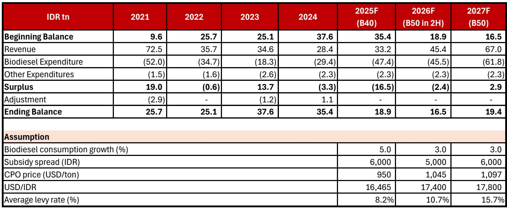
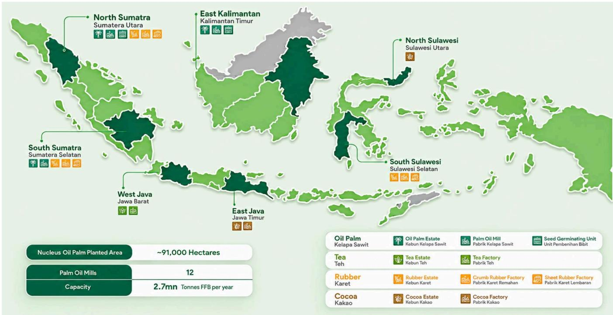
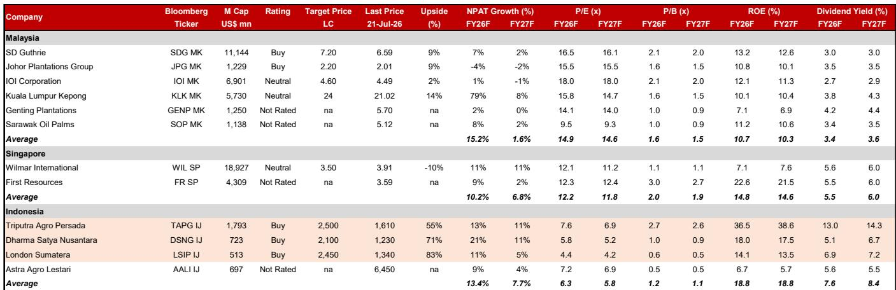

# 棕榈油供应结构变化引发市场持续关注

全球粗棕榈油价格正进入一个持续性的市场周期，而非短暂的价格波动。某国际研究机构报告预测，鹿特丹粗棕榈油价格将从2025年的每吨1307美元，升至2026年的每吨1412美元，2027年达到每吨1497美元。推动这一趋势的并非短期天气事件或地缘政治冲击，而是供需之间的结构性不匹配，且这种不匹配正在每个季节中加剧。印度尼西亚和马来西亚合计生产全球约85%的粗棕榈油，正面临一个产量天花板，即使价格激励也无法迅速突破。与此同时，需求正被主要市场在政策上不可逆转的激进生物燃料强制掺混要求所重塑。

传统上，市场参与者对粗棕榈油的观察框架一直是周期性的：当厄尔尼诺威胁产量时看涨，当降雨回归时看跌。这一框架现已过时。三种结构性力量正在汇聚，形成一个可能超越15年前大宗商品繁荣周期的价格扩张。首先是老化种植园的产量下降，这些种植园无法大规模重新种植。其次是生物柴油掺混的加速，特别是在印度尼西亚，无论价格如何，都增加了数百万吨的需求。第三是缺乏具有成本竞争力的替代品，这意味着其他植物油无法在不涨价的情况下填补缺口。

结果是，预计到2027年，印度尼西亚和马来西亚的库存水平将降至400万吨以下，为十年来最低。对于理解背后机制的研究者而言，这不是一个短期交易机会，而是一个具有可识别受益方和来自政策干预的重大下行风险的结构性研究主题。

## 老化种植园与重植停滞永久性限制供应增长

粗棕榈油供应最重要的结构性限制并非土地可用性，而是树龄。印度尼西亚和马来西亚的种植园树龄结构严重偏向于产量下降的老树。在印度尼西亚，小农户经营着约45%的种植面积，政府在更新其老化林方面进展缓慢。需要更新的累积面积如此之大，以至于修复成本将非常高昂，并且优质棕榈油种子严重短缺。

这不是一个高价格能迅速解决的问题。一棵棕榈树需要三到四年才能首次收获，大约七年才能达到最高产量。即使明天开始加速重植，对产量的影响也要到2030年代初才能感受到。在此期间，现有树木继续老化并失去生产力。

加剧供应压力的是，被没收的种植园土地现在由国有企业低效运营。这些土地总计近100万公顷，约占印度尼西亚总种植面积的8%。报告指出，由于缺乏熟练劳动力和运营效率低下，这些国企运营的种植园可能产量较低。综合来看，树龄结构、重植停滞和国企低效对印度尼西亚的生产构成了难以逆转的结构性拖累。

此外，昂贵的肥料价格正促使小农户减少使用量，这直接降低了每公顷产量。同样的动态也影响着大豆和向日葵等其他油籽作物，这意味着全球植物油领域面临类似的供应侧压力。历史上被市场参与者视为短期催化剂的厄尔尼诺天气模式，正缓慢增强，预计在2026年下半年影响更为明显。虽然对产量的影响预计会滞后，可能影响2027年的生产，但风险在于它会使本已紧张的供应状况雪上加霜。

## 印度尼西亚生物燃料政策是全球植物油需求的较强驱动力

粗棕榈油市场周期的需求侧由一股力量主导：印度尼西亚的生物柴油计划。根据美国农业部数据，印度尼西亚历史上贡献了全球粗棕榈油增量需求的65%以上。该国计划实施B50政策，要求柴油燃料中掺混50%的生物柴油，预计将增加约400万吨的需求。这一数字应与2026年和2027年全球总需求增长估计的470万吨进行比较。换句话说，印度尼西亚的B50政策单独就约占全球需求增长的85%。

印度尼西亚政府的主要动机并非环境因素，而是消除柴油燃料进口的战略目标。这一政治必要性使生物柴油计划比典型的补贴驱动计划更具持久性。随着生物柴油和柴油之间的价差缩小，该国的粗棕榈油基金预算可以仅通过最低限度的附加费增加来补贴B50。报告保守估计，该基金需要将附加费提高2.5%至5%来运行该政策，但这一成本对上游生产商来说是完全可补偿的，因为粗棕榈油价格上涨将足以抵消更高的附加费。

印度尼西亚也有可能将政策扩展到B50以上。逻辑很简单：如果目标是消除柴油进口，并且B50在财政上可行，那么转向B60或更高就成为自然延伸。报告没有明确模拟这一情景，但方向是清晰的。

在印度尼西亚之外，其他国家也在因地缘政治紧张和能源短缺而加速自身的生物燃料掺混计划。马来西亚、巴西、菲律宾和美国都在增加其基于植物油的燃料政策。这不是一个协调的政策转变，而是对同一结构性关切——能源安全——的趋同回应。累积效应是所有植物油需求的增加，而粗棕榈油是最大且最具成本竞争力的原料。

## 市场周期论点基于三个相互强化的假设

报告的市场周期论点并非单一预测，而是一个建立在三个相互强化假设之上的框架。第一个假设是需求将结构性超过供应。印度尼西亚和马来西亚的粗棕榈油总库存预计到2027年将降至400万吨以下，为十年来最低。印度尼西亚预计将经历最大的库存下降，原因是上述生产限制和生物柴油的需求拉动。

第二个假设是其他植物油价格将保持高位，这反过来支撑粗棕榈油价格。这不是一个循环论证。较低的肥料使用量正在降低全球油籽作物的产量。较高的生物燃料掺混正在增加对所有植物油的需求。当豆油和葵花籽油昂贵时，粗棕榈油成为全球市场的边际供应来源，其价格受到替代品成本的支撑。

第三个假设是，在近期到中期内，没有粗棕榈油产品的理想替代品。粗棕榈油具有独特的物理特性，使其成为生物柴油最高效的原料，以及食品和工业应用中最具成本效益的油。其他油只能以更高的成本或较差的性能替代粗棕榈油，这意味着粗棕榈油价格可以在需求破坏发生之前显著上涨。

这三个假设相互强化。生物柴油的更高需求推高粗棕榈油价格，这使得其他植物油在消费者转换时变得更贵，这反过来进一步支撑粗棕榈油价格。老化种植园的较低供应意味着任何需求增长都直接转化为库存消耗，而不是生产响应。结果是一个没有自然上限的价格周期，直到需求破坏变得严重，而证据表明需求破坏的阈值远高于当前价格。

## 市场周期中的定位决策框架

对于希望在此市场周期中定位的机构研究者，报告提供了一个基于三个标准的公司选择框架：高产量、低现金成本和改善的股息率。这些标准并非随意设定，它们反映了在价格上涨环境中粗棕榈油生产的具体经济学。

高产量是最重要的变量，因为它决定了价格上涨中有多少转化为收益。一家拥有年轻种植园树龄结构的公司，例如Triputra Agro Persada的平均树龄约为15年，每公顷将比树龄较老的公司生产更多果实。这种产量优势会随时间累积，因为公司可以在不扩大种植面积的情况下捕捉全部价格上涨。

低现金成本是第二个关键变量。报告指出，自2023年以来，粗棕榈油价格持续保持在每吨1000美元以上，而平均现金成本为每吨770美元。一家在同行中现金成本最低的公司，如TAPG，每销售一吨就能产生更宽的利润空间。在价格上涨的市场周期中，低成本生产商的利润扩张会被放大。

改善的股息率是第三个标准，它反映了资本配置策略的转变。已完成基础设施建设并处于净现金状态的公司，如TAPG，有能力将现金返还给股东，而不是再投资于产能扩张。在市场周期中，这会产生复合效应：更高的收益导致更高的股息，吸引更多研究者，从而支撑公司报价。

报告的首选公司依次为Triputra Agro Persada、Dharma Satya Nusantara和London Sumatra Indonesia。TAPG在东盟地区提供最高的产量、最低的成本和最高的股息率。DSNG拥有类似的年轻种植园树龄结构，并受益于去杠杆化，尽管其下游投资和重植计划可能限制股息增长。LSIP在这三家公司中估值最低，尽管种植园树龄较老，但其现金成本仍然高效。

估值框架对马来西亚粗棕榈油同行应用了25%的折扣，反映了与印度尼西亚出口治理不确定性和ESG关切相关的风险。报告认为，这些风险在当前水平已被定价。这三家公司2026财年的隐含市盈率在4.4倍至7.6倍之间，而马来西亚同行的平均值为14.9倍。如果市场周期论点按预期发展，这一折扣创造了安全边际。

## 单一贸易商风险真实但不太可能实现，最坏情况是暂时的

粗棕榈油市场周期论点最重大的下行风险是政府政策，特别是印度尼西亚出口机构Danantara Sumberdaya Indonesia可能被指定为粗棕榈油出口的单一贸易商。单一贸易商模式将创造一个垄断买方，可能压低当地粗棕榈油价格，扰乱交易活动，并给农民造成损失。连锁效应可能削弱印尼盾，扩大印度尼西亚的贸易逆差，并给政府的政治地位带来压力。

报告对此风险的分析是审慎且基于数据的。它指出，DSI目前作为监测中介机构运作，而非单一贸易商，这一角色不会对粗棕榈油生态系统造成实质性损害。报告认为完全的垄断买方模式不太可能，因为运营挑战极大：DSI缺乏管理整个出口链的人力资源、基础设施和资本。在政治上，考虑到利益冲突和执法问题，复杂性甚至更大。

然而，报告并未完全忽视这一风险。在最坏情况下，如果政府尝试单一贸易商模式，报告预计会有一段动荡期，但认为随后会迅速进行政策修正。理由是，对农民收入和印尼盾的损害将迅速显现，政府将面临立即逆转政策的政治压力。报告的基本情景是DSI仍作为监测代理，报告未在其价格预测中模拟单一贸易商情景。

对于研究者而言，这意味着政策风险是二元且不对称的。如果实施单一贸易商模式，损害将是严重但暂时的。如果不实施，即基本情景，市场周期论点将在没有这一拖累的情况下展开。当前的估值折扣已纳入这一风险，这意味着如果风险未实现，随着折扣缩小，这些公司可能获得重新定价。

*仅供参考。部分内容可能基于源材料通过AI辅助生成、翻译、总结或编辑，可能存在遗漏或错误。请独立核实。这不构成任何专业建议。*

仅供参考。部分内容可能基于源材料通过AI辅助生成、翻译、总结或编辑，可能存在遗漏或错误。请独立核实。这不构成任何专业建议。

