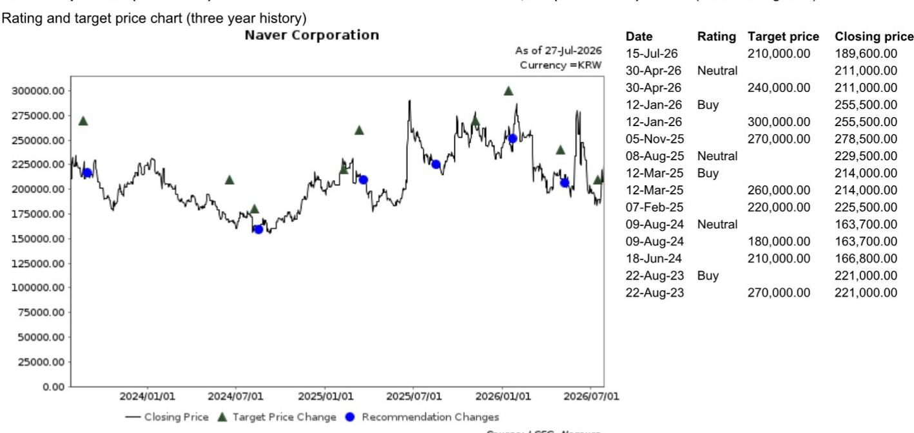
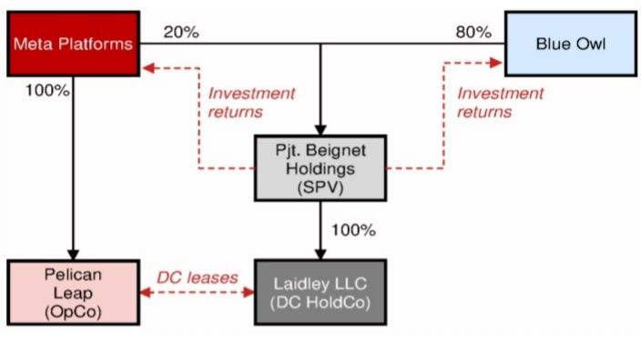
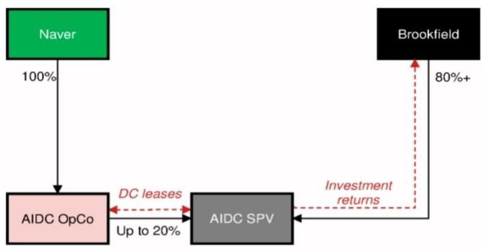

# Naver的资产负债表外AIDC策略：解决一个资本问题，却带来三个新挑战

Nvidia已同意投资10亿美元，收购Naver约4.5%的普通股，前提是这家韩国互联网巨头能获得至少90亿美元的外部计算基础设施资金。如今，通过与Brookfield的整理版合作，这一条件已达成。Brookfield将设立一个资产负债表外的特殊目的载体（SPV），为Naver在GAK世宗的人工智能数据中心扩建提供资金，目标是在2028年前将容量提升至200兆瓦。这一结构设计精巧，但执行层面存在不确定性。

该交易将Naver最紧迫的财务风险——因AIDC建设可能带来的数十亿美元资产负债表杠杆——转化为可预测的经营租赁支出。通过将房地产、电力基础设施和Nvidia GPU资产置于Brookfield持有多数股权的SPV中，Naver避免了合并项目债务，否则这些债务将压低其净资产回报率并引发信用评级担忧。这与Meta与Blue Owl在其超大规模数据中心园区中采用的结构逻辑相同，代表了资本高效型AI基础设施扩张的新模式。

然而，这一解决Naver资产负债表问题的框架，同时引入了三种结构性风险，读者需在评估资本效率提升的同时加以权衡。第一，1吉瓦的管道中大部分容量尚未获得明确需求承诺。第二，剩余800兆瓦的资本回收挑战，在利率环境不确定的情况下，还需约400亿美元的额外融资。第三，资产负债表外结构本身隐含的隐性债务风险，其中对Brookfield的残值担保可能重新引入SPV原本旨在避免的杠杆。

## Brookfield SPV结构消除资产负债表杠杆，但将风险转移至收入确定性

Naver方法的核心财务创新在于将资产所有权与运营控制权分离。根据拟议框架，Brookfield将持有拥有物理基础设施的SPV的多数股权，而Naver则签订长期容量租赁协议，将资本支出转化为运营支出。这直接回应了市场对Naver的AIDC建设将迫使其在合并资产负债表上吸收100亿美元或更多项目债务的担忧——此举本会使其债务权益比率承压，并可能触发信用评级机构的降级审查。

该结构借鉴了Meta-Blue Owl合资企业模式，后者已成为超大规模数据中心融资的参考模型。在该安排中，Blue Owl为基础设施建设提供资金，而Meta则担保长期租赁付款，使Meta能够以反映Blue Owl信用状况而非自身信用状况的资本成本获得资产负债表外容量。Naver试图进行同样的套利，但有一个关键区别：Meta的租赁义务由其自身广告收入现金流支持，这些现金流既庞大又可预测。而Naver必须依赖来自超大规模租户的分租收入来履行其对SPV的付款义务。

这一区别之所以重要，是因为SPV的贷款人将根据Naver租赁承诺的强度来承销项目，而非终端用户的潜在需求。如果Naver与Brookfield的SPV就200兆瓦容量签订15年租约，无论其是否成功将该容量分租给超大规模企业，都必须支付这些款项。资产负债表风险已转化为收入风险，而收入风险最终比杠杆更难对冲。

## 长期商业可行性取决于超大规模分租承诺，但尚未在大规模上得到验证

Naver表示，其即将与主要超大规模租户就初始200兆瓦阶段签署合同。这令人鼓舞，但不足以支撑整体论点。公司的长期愿景是扩展至1吉瓦的AIDC容量，而SPV结构的经济性只有在Naver能够使整个投资组合的利用率保持在盈亏平衡点以上时才成立。鉴于租赁付款的高固定成本性质——无论计算利用率如何，Naver都需向SPV支付预定金额——任何持续的低订阅期都将直接损害运营利润率。

需求可见性挑战因韩国数据中心市场的竞争动态而加剧。多家国内和全球参与者正在该地区同时建设AIDC容量，在建设窗口期存在供应过剩的风险。Naver在获取GAK世宗站点方面的先发优势是真实的，但这并不能保证超大规模企业会以能为Naver股东带来足够回报的条件承诺1吉瓦的容量。公司实际上是在押注AI计算需求将持续增长，以在固定租赁义务变得沉重之前吸收这些容量。

与Meta的比较再次具有启发性。Meta的Blue Owl合资企业规模旨在满足Meta自身AI工作负载和广告基础设施的内部计算需求。需求是自有的，因为Meta既是承租方又是终端用户。相比之下，Naver是中间商：它从SPV租赁容量，再分租给第三方超大规模企业。这引入了Meta结构所不具备的交易对手风险、定价风险和利用率风险。Naver模式的成功不仅取决于其建设数据中心的能力，更取决于其以高于自身租赁成本的价格出售数据中心容量的能力。

## 超越200兆瓦的扩展需要在不稳定的融资条件下反复进行资本回收

当前100亿美元的框架仅覆盖到2028年的首个200兆瓦阶段。达到1吉瓦目标将需要额外400亿美元或更多的资本，Brookfield及其他潜在私募股权合作伙伴必须通过连续几轮项目融资来筹集。这不是一次性的融资，而是一系列融资，每轮都受制于当时的利率环境、信贷市场状况以及读者对数据中心敞口的兴趣。

该模型对利率的敏感性不容低估。数据中心项目融资通常采用浮动利率债务，然后转换为固定利率敞口，而债务成本直接决定了Naver必须向SPV支付的租赁付款。如果利率在2020年代末期保持高位，后续阶段的租赁成本将高于初始200兆瓦部分，从而压缩Naver的分租利润率，除非超大规模企业的定价也相应上升。在当前披露的结构中，没有自动传导机制。

此外，1吉瓦计划中嵌入的资本回收假设，假定Brookfield及其他基础设施读者将在多个基金周期内保持对韩国AIDC敞口的兴趣。私募股权基础设施基金有固定的投资期限和回报目标。如果初始200兆瓦阶段因利用率不足或定价压力而产生低于预期的回报，为后续阶段筹集资金将变得更加困难。Naver实际上是在要求市场预先承诺一个尚未在大规模上证明其经济可行性的资本结构。

## 残值担保可能通过隐性债务重新引入资产负债表杠杆

资产负债表外结构中最微妙但可能最重大的风险是残值担保问题。在Meta-Blue Owl模式中，基础设施赞助商通常要求承租方提供针对资产过时的下行保护——尤其是GPU硬件，其使用寿命短于其所在的房地产和电力基础设施。如果Naver向Brookfield提供Nvidia GPU资产的残值担保，该担保的经济实质可能需要作为或有负债进行披露。

审计机构和信用评级机构在识别具有债务经济特征的资产负债表外义务方面已变得越来越成熟。如果Naver担保Brookfield在租赁期结束时能从GPU处置中收回最低价值，并且该担保被认为很可能被触发，那么在信用分析中它可能被视为隐性债务。这将在一定程度上抵消SPV结构旨在实现的资产负债表收益。

对于GPU资产而言，这一风险尤为突出，因为AI加速器的折旧周期不确定且可能很快。如果Nvidia发布新架构，使当前一代GPU在训练工作负载中的价值降低，租赁终止时的残值可能低于担保水平。届时Naver将需要向Brookfield支付现金以弥补差额，从而产生该结构本意要避免的那种资产负债表负债。此类担保的会计处理将是读者在12周谈判窗口期内SPV条款最终确定时需要关注的关键披露事项。

## 评估Naver AIDC策略及其结构性风险的决策框架

对于评估Naver当前状况的读者而言，核心问题是资产负债表外结构是创造还是破坏股东价值。以下框架涵盖了关键决策节点。

第一个变量是分租执行速度。如果Naver在Brookfield SPV关闭前，从超大规模企业获得至少80%初始200兆瓦容量的坚定、长期分租承诺，则收入风险将大幅缓解。如果分租协议仍处于意向书阶段或覆盖容量不足50%，则对SPV的固定租赁义务将产生负利差，从数据中心上线那一刻起就会对盈利构成压力。

第二个变量是后续融资轮的利率路径。如果10年期韩国国债回报表现在2028年前保持在3.5%以下，剩余800兆瓦的项目债务成本将是可控的，Naver的分租利润率可以维持。如果回报表现升至4.5%以上，增量租赁成本将要么压缩利润率，要么迫使Naver以高于市场出清水平的价格定价容量，从而接受较低的利用率。

第三个变量是最终SPV文件中残值担保的结构。如果Naver的义务仅限于标准租赁终止付款，而没有特定的GPU残值支持，则隐性债务风险较低。如果协议包含硬件的最低价值担保，读者必须量化该或有负债，并评估其是否改变了Naver资产负债表的有效杠杆状况。

第四个变量是AI计算需求增长相对于行业容量增加的速度。如果全球超大规模资本支出在2028年前继续以每年30%或更高的速度增长，Naver的1吉瓦管道很可能找到租户。如果AI投资周期放缓或转向需要不同硬件配置的推理工作负载，GAK世宗的具体GPU配置对潜在分租方的吸引力可能会下降。

这些变量中的每一个在方向影响上都是二元的，但在幅度上是连续的。当前状况反映了这些条件带来的不确定性。乐观情景需要分租执行方面取得可见进展，并且明确披露残值担保的结构以避免隐性债务处理。悲观情景则可能出现在与Brookfield的12周谈判产生将重大风险通过或有义务转移回Naver资产负债表的条款时。

*仅供参考。部分内容可能基于源材料通过AI辅助生成、翻译、总结或编辑，可能存在遗漏或错误。请独立核实。本文不构成任何专业建议。*

仅供参考。部分内容可能基于源材料通过AI辅助生成、翻译、总结或编辑，可能存在遗漏或错误。请独立核实。本文不构成任何专业建议。

