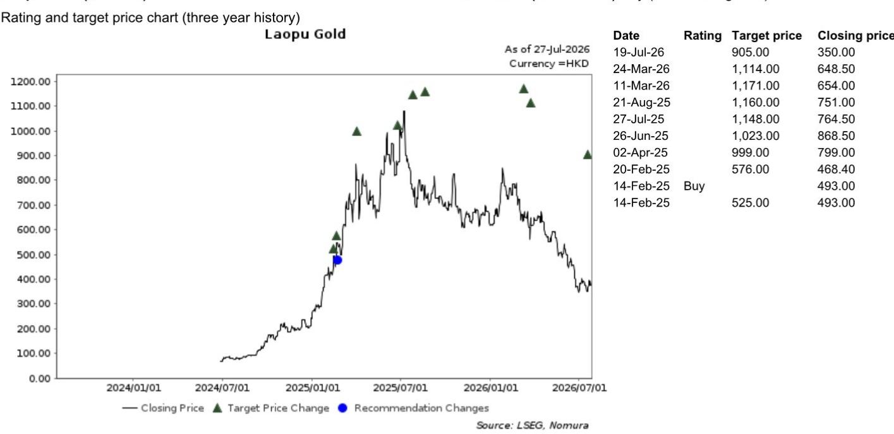
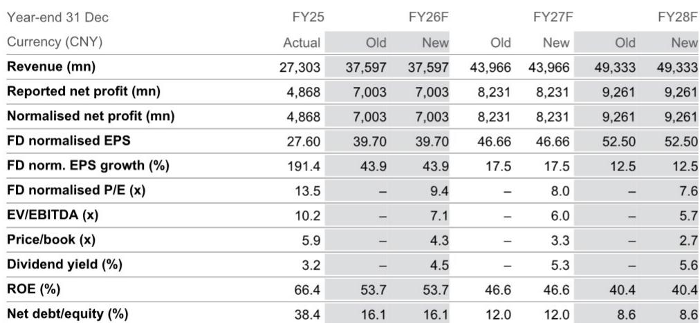
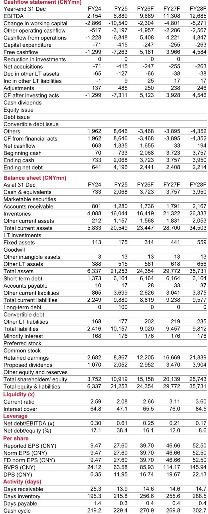

# 老铺黄金：季度收入波动背后的品牌韧性观察

老铺黄金发布2026年上半年业绩预告，收入同比增长60-66%，达到198亿至205亿元人民币，调整后净利润增长83-85%，达到43亿至44亿元人民币。然而，这些整体数据背后隐藏着一个更值得关注的故事：仅第二季度，收入同比下降约30%，调整后盈利下降约23-25%。乍看之下，一家远期估值仅9.4倍的公司出现季度收入下滑，似乎印证了增长逻辑的转变。该公司股价三个月内下跌30.5%，十二个月内下跌48.1%。

但这种解读可能并不准确。市场反应可能已经过度偏离基本面，正如某全球研究机构报告所指出的，即使在第二季度数据偏弱之后，其盈利预测也未作调整。关键的战略问题不在于老铺是否面临挑战——显然存在——而在于这些挑战是结构性的还是周期性的，以及市场反应是否已经充分消化了这些因素。

两个问题的答案指向同一方向。第二季度的疲软源于两个可识别的、暂时性的因素：2026年上半年现货黄金价格持续偏弱，以及老铺在2月底实施的产品提价。这两个因素均未损害公司的长期品牌建设战略。黄金价格周期终将趋于稳定，届时老铺目前正在进行的运营优化——精品店升级、VIP客户群拓展、针对性产品推出——将再次在收入端显现。市场正在将一个周期性停顿视为结构性断裂。而这正是理性观察者应当关注的时刻。

## 第二季度收入下滑完全归因于两个暂时性因素，而非品牌价值丧失

理解第二季度收入同比下降约30%的原因，需要区分因果关系与相关性。老铺的上半年盈利预告显示上半年收入增长60-66%，这意味着仅第一季度就实现了强劲增长。第二季度则出现明显反转。两个因素推动了这一反转。

首先，2026年上半年黄金价格持续偏弱。老铺的商业模式对黄金价格方向具有特定敏感性：当价格下跌时，消费者会推迟非必需珠宝购买，预期价格进一步下跌。这不是需求破坏问题，而是时机问题。消费者对老铺产品的潜在需求依然存在，但购买决策被推迟。其次，老铺在2026年2月底提高了产品价格。在黄金价格偏软的环境下提价形成了双重压力：消费者面临更高的珠宝相对价格，同时基础商品价格发出等待信号。两者结合足以解释季度收入下降30%，而无需归因于任何更深层次的品牌侵蚀。

该研究机构维持至2028财年的盈利预测不变，进一步强化了这一解读。如果收入疲软是结构性的——如果老铺正在失去市场份额或品牌吸引力减弱——分析师本应下调远期预测。但他们没有。2026财年收入预测维持在376亿元人民币，2027财年为440亿元人民币，2028财年为493亿元人民币。从2025财年实际收入273亿元人民币到2028财年预测值，隐含的年复合增长率约为22%。这不是一个陷入困境的品牌，而是一个经历暂时性需求停顿的品牌。

## 老铺在周期中持续投资门店升级与VIP客户拓展，将在金价稳定时产生复合效应

公司第二季度表现中最具启发性的部分，是管理层实际采取的行动，而非收入数据所显示的内容。尽管销售放缓，老铺仍坚持其运营改善计划。它继续升级精品店网络，包括搬迁和扩建深圳万象天地、上海国金中心商场和上海恒隆广场的门店。这些并非表面调整。更大的店面面积使老铺能够同时服务更多客户，并创造差异化的购物体验，从而支撑溢价定价。

战略逻辑清晰明了。老铺正将自己定位为中国高端消费品牌之一，而非大宗黄金珠宝销售商。这一定位需要能够彰显专属性和工艺的实体空间。当黄金价格稳定、被推迟的需求回归时，升级后的门店将捕获更大份额的反弹。公司还在培育其VIP客户群体，这提供了对短期金价波动敏感度较低的经常性收入基础。这些投资在短期内成本较高，在疲软季度中不易察觉，但正是构建持久竞争优势所需的那类支出。

该研究机构分析指出，老铺2026年上半年的调整后净利润率提升至21-22%，高于2025财年的18.4%。这一利润率扩张发生在第二季度收入下降的背景之下。这表明老铺的成本纪律和定价能力依然完好。一家能够在收入下降时改善利润率的公司，并非处于困境之中；而是一家具有运营杠杆的公司，当需求回归时，这种杠杆将放大上行空间。

## 当前估值已反映一种不太可能实现的永久性增长损失

截至2026年7月27日收盘价396.40港元，老铺的远期十二个月正常化市盈率为9.4倍。自2024年6月上市以来，其平均远期市盈率为20.3倍。当前股价不到历史平均估值的一半。隐含的128%上行空间并非激进的预测，而是均值回归。

估值收缩反映了市场将第二季度疲软外推至永续的倾向。但该研究机构的财务模型讲述了不同的故事。正常化每股收益预计将从2025财年的27.60元人民币增长至2026财年的39.70元、2027财年的46.66元和2028财年的52.50元。这代表2026财年每股收益增长43.9%，2027财年增长17.5%，2028财年增长12.5%。基于2027财年盈利的远期市盈率为8.0倍，基于2028财年盈利为7.6倍。一家拥有两位数盈利增长和7.6倍市盈率的公司，其定价反映了一种基础业务并不支持的结构性衰退。

股息回报表现进一步强化了价值逻辑。按当前价格计算，2026财年隐含股息回报表现为4.5%，2027财年升至5.3%，2028财年升至5.6%。对于一家在2025财年实现66.4%净资产回报表现、且预计至2028财年净资产回报表现保持在40%以上的公司而言，当前估值所包含的安全边际异常宽泛。市场实际上在为一种最坏情景定价，而该研究机构未变的预测明确否定了这种情景。

## 观察者的决策框架：区分黄金价格敏感性与品牌价值

观察老铺的核心分析挑战，在于区分公司固有的黄金价格敏感性与潜在品牌价值。这两股力量在短期内方向相反，但在更长时间维度上趋于一致。一个实用的决策框架涉及三个问题。

第一，未来两到四个季度现货黄金价格的预期走势如何？如果金价持续偏弱，老铺的收入将继续面临挑战。但该研究机构的论点是，这种疲软已反映在股价中，任何金价稳定都将触发重新定价。风险是不对称的：金价进一步走弱的下行空间有限，因为股价已处于受压估值水平，而金价稳定的上行空间则相当可观。

第二，老铺的品牌地位是在增强还是减弱？证据指向增强。公司正在投资于优质地段、扩大门店面积、发展VIP客户基础。2026年上半年利润率在收入下降的情况下仍有所改善，表明老铺的定价能力并未削弱。一个能够在需求停顿期间提价并改善利润率的品牌，是一个拥有真正消费者基础的品牌。

第三，对于一家盈利年增长17.5%、毛利率38.7%、净资产回报表现46.6%的中国消费品牌，合理的估值倍数是多少？当前9.4倍的远期市盈率意味着市场将老铺视为周期性大宗商品业务，不包含品牌溢价。如果老铺成功实现其成为高端消费品牌的战略，该估值倍数应向其历史平均的20倍靠拢。

该研究机构分析指出了三个关键下行风险：金价显著走弱、高于预期的时尚风险、以及弱于预期的宏观环境。这些都是真实的风险，在任何决策中都应予以重视。但当前估值已经反映了一个所有三个风险同时发生的情景。对于观察者而言，问题在于他们是否相信品牌建设战略最终将克服这些周期性挑战。老铺的运营投资、利润率轨迹以及未变的分析师预测所提供的证据表明，答案是肯定的。

*仅供参考。部分内容可能基于源材料通过AI辅助生成、翻译、总结或编辑，可能存在遗漏或错误。请独立核实。本文不构成任何专业建议。*

仅供参考。部分内容可能基于源材料通过AI辅助生成、翻译、总结或编辑，可能存在遗漏或错误。请独立核实。本文不构成任何专业建议。

