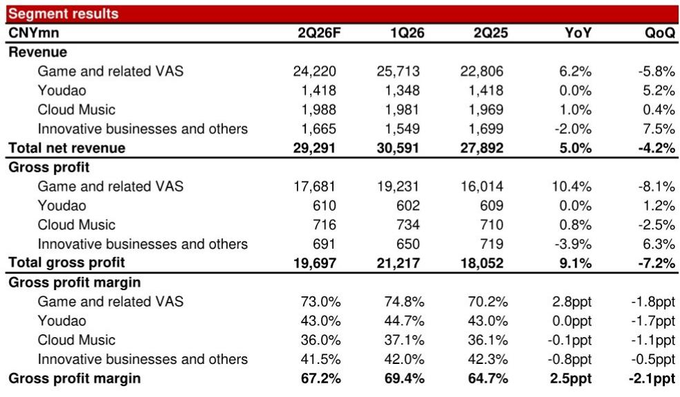
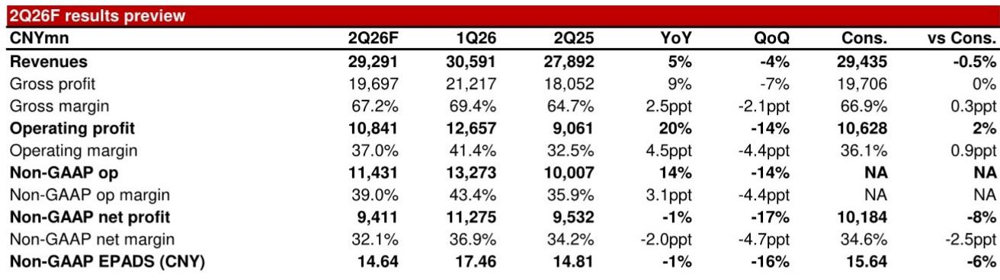
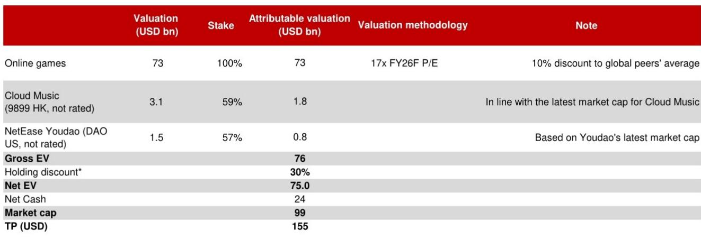

# 网易核心业务持续增强，投资组合影响报表利润

网易即将发布的2026财年第二季度业绩，关注点并非营收或运营利润率——这些指标预计将优于市场预期。真正的焦点在于，公司持有的阿里巴巴和拼多多股份产生了6.63亿元人民币的按市值计价损失，这可能导致非GAAP净利润比市场预期的102亿元低8%。对于关注基础业务的观察者而言，这形成了一个关键区分：运营引擎正全力运转，而非核心的金融资产头寸对利润表造成了可见但暂时的拖累。

本季度的动态引出了一个超越网易本身的策略性问题。在众多中国互联网公司持有大量且波动较大的同行股权的情况下，观察者应如何将运营表现与投资组合的干扰区分开来？答案并非忽视投资损失，而是将其置于一个重视经常性盈利能力而非按市值计价波动的框架中。网易第二季度的表现为此提供了一个典型案例。

公司在线游戏及增值服务板块预计将实现6%的同比增长，尽管面临高基数效应和新品发布相对平静的季度。这一增长得益于经典IP的韧性：PC版《梦幻西游》、《蛋仔派对》和《梦幻西游》手游。这些产品不仅维持了收入，还推动了收入结构向利润率更高的自研PC游戏倾斜。游戏板块毛利率预计同比提升2.8个百分点至73%，带动综合毛利率升至67.2%，较市场预期高出0.3个百分点。

运营利润最能体现这种增长势头。GAAP运营利润预计同比增长20%至108亿元，比市场预期的106亿元高出2%。运营利润率预计扩大4.5个百分点至37%，这既反映了毛利率的扩张，也体现了严格的费用控制。这并非营收增长掩盖成本上升的故事，而是源于产品组合和运营效率的结构性利润率改善。

## 投资组合带来透明但真实的利润压力

第二季度运营利润与净利润之间的差异，几乎完全由网易股权投资按市值计价的会计处理方式解释。公司持有阿里巴巴和拼多多这两家中国最大互联网公司的股份。在两家公司股价面临下行压力的季度，会计准则要求网易确认这些头寸的未实现损失。预计6.63亿元的损失并非现金流出，但根据GAAP和非GAAP标准，它确实是对报告净利润的一项真实扣减。

这并非新现象。中国互联网公司之间经常存在交叉持股，这些持股源于早期的战略投资、IPO配售或二级市场购买。这些头寸的波动可能导致报告净利润出现显著的季度性波动，而这些波动与持有者的运营健康状况关系不大。对网易而言，这一影响足以使非GAAP净利润降至约94亿元，比市场预期的102亿元低8%。仅关注净利润线的分析师会看到不及预期，而将运营利润与投资收益分开看待的分析师则会看到超预期。

对观察者而言，关键在于这种压力既是透明的，也是可逆的。这些损失是按市值计价，而非减值驱动。如果阿里巴巴和拼多多的股价在后续季度回升，相同的会计机制将产生收益。波动是对称的。挑战在于，季度盈利势头通常以报告净利润为评判标准，即使基础业务表现优异，头条数据的不及预期也可能形成负面叙事。

## 《破碎之地》并非吸引人的，但填补了关键增长缺口

网易近期发布的新游戏《破碎之地》表现符合内部预期。该游戏预计每月产生2至3亿元的总流水。按任何合理标准衡量，这都是一个成功的发布。但它并非像《梦幻西游》手游那样重新定义公司增长轨迹的超级吸引人的。这一区别对于观察者如何校准预期至关重要。

一款每月产生2至3亿元总流水的游戏是收入的重要贡献者，但不足以单独加速公司的增长率。《破碎之地》的真正意义在于，在公司经典产品仍表现良好但自然成熟之际，它填补了发布管线的空白。该游戏的发布有助于稳定收入基础，并为2026财年下半年的加速增长奠定基础，届时可能有更多产品进入管线。

市场对“稳健但非惊艳”发布的反应具有参考价值。如果观察者期待吸引人的，符合预期的表现可能被解读为失望。但正确的框架是将《破碎之地》视为一款衔接产品，在重大发布之间维持增长势头。公司能在没有吸引人的的情况下实现6%的游戏收入增长，这本身就证明了其现有产品组合的持久性。当下一款重要产品到来时，增长率将从更高的基数上复合增长。

## 区分运营质量与投资组合干扰的分析框架

对于分析网易或任何持有大量股权的中国互联网公司的观察者而言，第二季度业绩提供了一个评估表现的模板。该框架包含三个层次。

首先，将运营利润作为衡量业务健康状况的主要指标。运营利润排除了投资收益、利息收入和其他非运营项目。它反映了公司从其核心游戏、音乐及其他业务板块中创造利润的能力。在网易的案例中，运营利润同比增长20%，利润率扩大4.5个百分点，这是一个明确的积极信号。

其次，将按市值计价的投资损益视为估值中的非经常性项目，即使它们每个季度都会出现。这些项目的波动性意味着不应将其年化或外推为正常化的盈利能力。正确的方法是以非GAAP运营利润作为估值基础，然后按当前市场价值加减投资组合，而非按其季度利润影响。

第三，评估投资组合的质量和流动性。网易持有的阿里巴巴和拼多多股份是大盘、流动性强的股票。按市值计价的损失是透明的，可以独立验证。这与持有估值不透明的非流动性私募公司股份或复杂结构化产品有本质区别。透明度降低了隐藏减值的风险。

应用此框架分析网易，可以得出清晰的结论。公司的运营业务价值高于当前市场价格所暗示的水平。2026财年13倍的远期市盈率低于当前价格119.55美元所对应的17倍倍数。这一折价部分反映了市场对投资组合波动的不安。但对于能够区分两者的观察者而言，这一折价代表着机会。

## 2026财年下半年：运营势头能否克服投资组合压力

《破碎之地》的发布预计将加速2026财年下半年的游戏增长，但投资组合仍将是一个不确定因素。阿里巴巴和拼多多股价的走势取决于宏观因素、监管动态以及公司自身表现，这些完全不在网易的控制范围内。押注网易并非押注这些股票的复苏，而是押注游戏管线、利润率扩张以及公司创造自由现金流的能力。

自由现金流创造是一个被低估的关键因素。网易预计在2026财年将产生超过600亿元的自由现金流。公司拥有净现金头寸，并维持了40%的股息支付率。运营势头、现金创造能力和合理估值的结合，为能够看透季度噪音的观察者创造了有利的风险回报特征。

2026财年第二季度将被记住的，不是头条净利润不及预期，而是网易核心业务正在结构性改善的证明。运营利润率扩张、游戏产品组合的韧性以及严格的成本管理，都是早于本季度并可能持续的趋势。投资损失是一种干扰，但它是可以被量化、建模并搁置一旁的干扰。对观察者而言，真正的问题是，他们是否愿意以因一个既暂时又透明的因素而产生的折价，来关注一个表现良好的业务。

*仅供参考。部分内容可能基于源材料通过AI辅助生成、翻译、总结或编辑，可能存在遗漏或错误。请独立核实。本文不构成专业建议。*

仅供参考。部分内容可能基于源材料通过AI辅助生成、翻译、总结或编辑，可能存在遗漏或错误。请独立核实。本文不构成专业建议。

