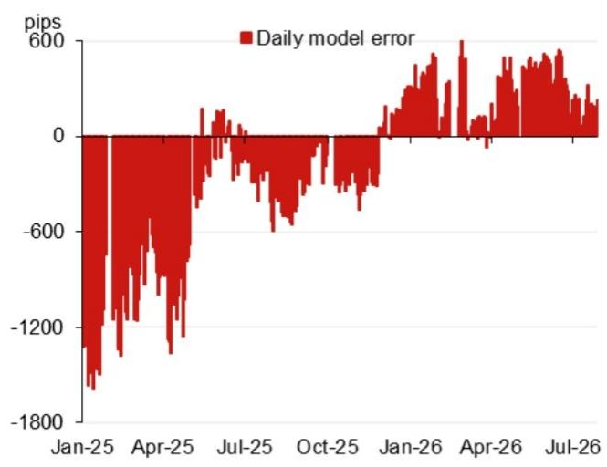
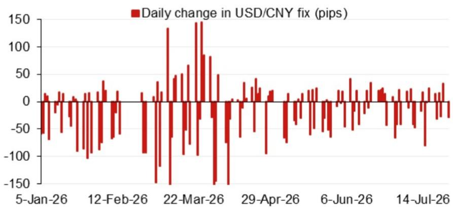

# 宏观观察 - 亚洲（除日本外）

## 模型参考值：6.7724

模型参考值：6.7724，此前为6.7911（较前次官方收盘参考值有所变化）。

## 研究团队

含逆周期因子的模型参考值：6.7802（较前次参考值有所变化）。

亚洲宏观策略
Craig Chan - NSL
Vicky Chen - NSL
Manthan Shingala - NSL

图1：对参考值变化贡献最大的前4项隔夜因素（不含逆周期因子）  
  
来源：NOM

图2：近期模型偏差（不含逆周期因子调整）  
  
来源：Bloomberg, NOM

图3：每日参考值变动  
  
来源：Bloomberg, NOM

图4：事件日历

| 日期 | 事件 | 地点 | 备注 |
|------|------|------|------|
| 2026年7月下旬 | 经济工作会议 | 中国 | 会议通常包含对宏观工作的部署 |
| 2026年8月中旬 | 第二季度货币政策报告 | | |
| 2026年9月24日 | 国事访问 | 美国华盛顿特区 | |
| 2026年9月下旬 | 货币政策委员会会议 | | |
| 2026年10月1-7日 | 国庆黄金周假期 | 中国 | |

来源：Bloomberg, NOM

## 附录A-1

本报告由NOM Singapore Ltd. (NSL) 编制。

详见NOM集团实体免责声明。

## 分析师声明

我们，Craig Chan, Wee Choon Teo, Vicky Chen 和 Manthan Shingala，特此声明：(1) 本研究报告中所表达的观点准确反映了我们个人对相关标的的看法；(2) 我们的薪酬中没有任何部分直接或间接与本研究报告中的具体观点相关；(3) 我们的薪酬不与任何特定交易业务挂钩。

## 重要披露

## 研究报告在线获取及利益冲突披露

NOM集团研究报告可通过www.NOMnow.com/research、Bloomberg、Capital IQ、Factset、LSEG获取。

重要披露信息可于http://go.NOMnow.com/research/m/Disclosures查阅。

编制本报告的分析师薪酬基于公司总收入等因素，其中部分来自相关业务活动。除非另有说明，本报告列出的非美国分析师未在FINRA规则下注册/取得研究分析师资格。

NOM Global Financial Products Inc. (NGFP)、NOM Derivative Products Inc. (NDP) 和 NOM International plc. (NIplc) 已在美国商品期货交易委员会和国家期货协会注册为掉期交易商。

## 美国额外披露要求

自营交易：NOM Securities International, Inc及其关联公司通常作为固定收益证券（或相关衍生品）的自营交易商。分析师互动：固定收益研究分析师定期与销售和交易部门人员沟通，以获取流动性和定价信息。

## 估值方法 - 固定收益

NOM的固定收益策略师通过提供交易观点来表达对证券价格和市场的看法。这些观点可包括相对价值、方向性、资产配置或上述组合。分析框架包括但不限于：

- 基本面分析：评估证券价格是否偏离其宏观或微观基本面。
- 价格变动的定量分析。
- 技术因素：如监管变化、市场风险偏好变化、评级行动、一级市场活动和供需考量。

交易观点的时间框架可变。战术性观点通常短于三个月，战略性观点通常长于三个月。

根据欧盟市场滥用监管法规，NOM全球固定收益研究发布的评级分布如下：

52%被赋予买入（或同等）评级；其中50%的发行人曾接受NOM集团的重要服务。
0%被赋予中性（或同等）评级。
48%被赋予卖出（或同等）评级；其中50%的发行人曾接受NOM集团的重要服务。
截至2026年6月30日。

## 免责声明

本出版物包含由NOM集团实体（见第1页）编制的材料。术语"NOM集团"指NOM Holdings, Inc.及其关联公司和子公司，包括：(a) NOM Securities Co., Ltd. (NSC) 东京，日本；(b) NOM Financial Products Europe GmbH (NFPE)，德国；(c) NOM International plc (NIplc)，英国；(d) NOM Securities International, Inc. (NSI)，纽约，美国；(e) NOM International (Hong Kong) Ltd. (NIHK)，香港；(f) NOM Financial Investment (Korea) Co., Ltd. (NFIK)，韩国；(g) NOM Singapore Ltd. (NSL)，新加坡；(h) NOM Australia Ltd. (NAL)，澳大利亚；(i) NOM Securities Malaysia Sdn. Bhd. (NSM)，马来西亚；(j) NIHK, Taipei Branch (NITB)，台湾；(k) NOM Financial Advisory and Securities (India) Private Limited (NFASL)，印度；(l) NOM Fiduciary Research & Consulting Co., Ltd. (NFRC)，东京，日本；(m) NOM Orient International Securities Co., Ltd (NOI)。

本材料：(I) 仅供您私人参考，我们不据此征求任何行动；(II) 不构成在任何司法管辖区内的买卖要约或招揽；(III) 除与NOM集团相关的披露外，基于我们认为可靠的来源信息，但未经NOM集团独立验证。

除与NOM集团相关的披露外，NOM集团不对本文件的公平性、准确性、完整性、正确性、可靠性或适用于任何特定目的作出任何明示或暗示的保证，并且在法律允许的最大范围内，不承担因使用本文件而产生的任何责任。

本文件中表达的观点或估计为原始发布日期的当前观点，如有变更，恕不另行通知。NOM集团明确表示没有义务更新或修订本文件。

NOM集团及其高级职员、董事、员工和关联方，在适用法律和法规允许的范围内，可能以自营、代理或其他方式交易本文件提及的证券、商品或工具。

本文件可能包含从第三方获得的信息，包括但不限于信用评级机构的评级。NOM集团明确否认对第三方信息的任何保证，并且不承担任何相关责任。

读者应将本文件视为做出决策的单一因素，不应将其视为识别所有直接或间接风险的依据。NOM集团制作多种类型的研究产品，包括基本面分析和定量分析；不同类型研究产品中的建议可能因时间范围、方法论或其他因素而有所不同。

本文件中的数字可能涉及过往表现或基于过往表现的模拟，这些并非未来表现的可靠指标。如果信息包含对未来表现和业务前景的预期、预测或指示，此类预测可能不是未来表现的可靠指标。

关于固定收益研究：建议分为两类：战术性（通常持续最多三个月）或战略性（通常持续6-12个月）。然而，交易建议可能随时根据情况变化进行审查。建议中显示的价格和回报表现基于提交发布时的指示性价格。

本文件所述的证券可能未根据美国1933年证券法注册，在此情况下，除非符合注册要求或豁免条件，否则不得在美国或向美国人发行或出售。

本文件已获批准在英国作为投资研究由NIplc分发。NIplc由审慎监管局授权，并由金融行为监管局和审慎监管局监管。

本文件已获批准在欧洲经济区作为投资研究由NOM Financial Products Europe GmbH (NFPE) 分发。

本文件已由NIHK批准在香港分发。本文件仅面向"专业读者"。

本文件已获批准在澳大利亚由NAL分发。

本文件已获批准在马来西亚由NSM分发。

在新加坡，本文件由NSL分发。NSL是《财务顾问法》定义的豁免财务顾问。本文件面向认可、专家或机构读者。

本文件不适用于沙特阿拉伯、阿联酋或卡塔尔的非授权人士。

对于涉及台湾上市公司或由台湾研究分析师编制的报告：本文件仅供参考。您应独立评估风险并对投资决策负责。

本材料不得在印度尼西亚分发。

本材料不得在中国分发。A股相关分析（如有）不面向位于或注册于中国的人士。

未经NOM集团成员事先书面同意，不得以任何形式复制、再分发本材料。

如果本文件通过电子传输方式分发，则无法保证传输的安全性或无误性。

NOM集团通过合规政策和程序（包括利益冲突、中国墙和保密政策）以及中国墙维护和员工培训来管理研究生产中的冲突。

有关本文件中任何建议所使用的方法或模型的更多信息，可联系NOM研究分析师获取。

版权 © 2026 NOM Singapore Ltd., Singapore。保留所有权利。
