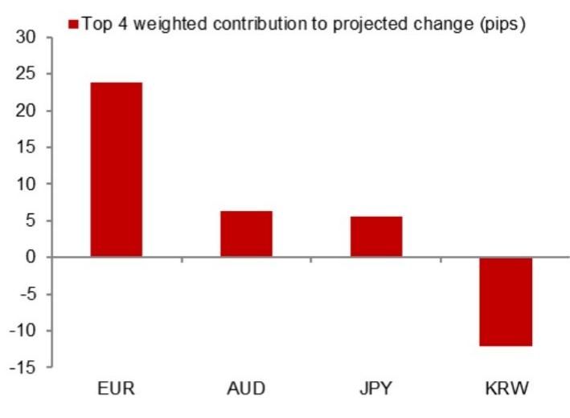

# The PBoC Is Tightening the USD/CNY Fix Faster Than the Model Implies, Signaling a Shift in Currency Management Strategy

The People's Bank of China's daily USD/CNY fixing has moved 187 pips lower in the latest model projection to 6.7724, a meaningful adjustment from the previous forecast of 6.7911. But the more revealing number is the counter-cyclical factor-adjusted projection of 6.7802, which sits 109 pips below the previous official fix. This gap between the unadjusted model and the adjusted fix is not noise. It is a deliberate policy signal. The PBoC is using its counter-cyclical factor to lean against depreciation pressure more aggressively than the underlying model mechanics would suggest, and the timing of this shift matters. The upcoming calendar of political and policy events — a late July Politburo meeting on economic work, a mid-August monetary policy report, and President Xi's state visit to Washington in late September — creates a window in which currency stability becomes a strategic priority, not just a technical target. For anyone managing Asia ex-Japan FX exposure, the implication is clear: the PBoC is signaling that it will absorb more near-term depreciation pressure to prevent disorderly moves, and the cost of betting against that resolve is rising.

## The Counter-Cyclical Factor Is Being Used as a Preemptive Stabilization Tool, Not a Reactive One

The difference between the unadjusted model projection of 6.7724 and the counter-cyclical factor-adjusted projection of 6.7802 is 78 pips. That spread represents the PBoC's discretionary intervention in the fixing mechanism. Historically, the counter-cyclical factor has been deployed during periods of one-way depreciation expectations to slow the pace of renminbi weakness. But the current usage is notable because it is occurring at a time when the unadjusted model itself is already projecting a stronger fix. The PBoC is not merely dampening depreciation momentum. It is actively engineering a fixing that is stronger than what the overnight market contributions would imply. This is a preemptive calibration. By setting the fix higher, the PBoC raises the cost of shorting the renminbi in the onshore market, because the daily trading band is anchored to a stronger midpoint. The signal is directed at both domestic and offshore participants: the authorities are willing to use the full toolkit to manage expectations ahead of a dense period of political and diplomatic engagements.

## The July Politburo Meeting Creates a Binding Constraint on Currency Volatility

The late July Politburo meeting for economic work is the first major event on the calendar, and it sets the tone for the rest of the third quarter. This meeting typically produces a readout that includes a to-do list for the economy and clues to the priorities of top leaders. In a period where China's economic recovery faces headwinds from weak domestic demand and external trade frictions, the Politburo is unlikely to tolerate a sharp renminbi depreciation that would amplify capital outflow fears and complicate import cost dynamics. The fixing trajectory ahead of this meeting therefore becomes a policy instrument, not just a market outcome. The PBoC will want to enter the meeting with a stable currency backdrop to avoid having exchange rate volatility dominate the economic narrative. The 109-pip downward adjustment in the counter-cyclical factor fix relative to the previous official level is consistent with this objective. It creates a buffer: even if market forces push the spot rate weaker, the fixing anchors expectations and limits the speed of adjustment. For investors, this means the window for betting on a rapid renminbi depreciation is narrowing, not widening, as the meeting approaches.

## The Q2 Monetary Policy Report Will Provide the Intellectual Framework for the Fixing Strategy

In mid-August, the PBoC will release its monetary policy report for the second quarter of 2026. This document is not just a retrospective. It is the central bank's most detailed public articulation of its policy framework, including its exchange rate management philosophy. The counter-cyclical factor adjustments we are observing now will almost certainly be rationalized in this report as part of a broader strategy to maintain the renminbi's "basic stability" against a basket of currencies. The report will also provide the analytical justification for why the PBoC is willing to absorb short-term depreciation pressure. Investors should read the forthcoming report for any language shifts around the concept of "two-way flexibility" versus "orderly adjustment." If the report emphasizes the latter, it will confirm that the PBoC sees the current fixing trajectory as a deliberate policy choice, not a reaction to market conditions. The report will also clarify whether the PBoC views the counter-cyclical factor as a temporary measure or a structural feature of the fixing mechanism. Either way, the document will serve as the intellectual anchor for the fixing strategy through the rest of the third quarter.

## President Xi's State Visit to the US in Late September Raises the Diplomatic Stakes for Currency Policy

The late September state visit to Washington is the most consequential event on the calendar for renminbi policy. Currency issues have historically been a flashpoint in US-China economic relations, and a sharp renminbi depreciation ahead of a presidential visit would invite political scrutiny and potentially retaliatory measures. The PBoC has strong incentives to ensure that the renminbi does not become a source of bilateral tension during the visit. This means the fixing trajectory between now and late September is likely to remain biased toward stability, even if the economic data deteriorates. The counter-cyclical factor adjustments we are seeing in July are the early stages of this diplomatic calibration. By setting a stronger fix now, the PBoC builds a cushion that allows it to absorb any negative shocks without breaching politically sensitive levels. The visit also creates a deadline: after late September, the PBoC may have more latitude to allow the renminbi to adjust if the diplomatic outcome is favorable or if the economic outlook shifts. But for the next two months, the fixing is likely to remain a tool of statecraft, not just monetary policy.

## A Decision Framework for Positioning Around the Fixing Regime

For investors managing Asia ex-Japan FX exposure, the current environment requires a framework that distinguishes between three distinct phases. The first phase runs from now through the late July Politburo meeting. In this phase, the PBoC's counter-cyclical factor adjustments are likely to continue or even intensify, as the authorities aim to enter the meeting with a stable currency. The risk of a sudden fix weakening is low. The second phase covers the period between the Politburo meeting and the state visit, encompassing the Q2 monetary policy report. In this phase, the PBoC will have more data on the economic trajectory and may adjust the pace of its counter-cyclical factor usage depending on whether growth momentum improves or deteriorates. The key variable to watch is not the spot rate but the spread between the unadjusted model projection and the adjusted fix. A widening spread signals that the PBoC is leaning harder against depreciation pressure. A narrowing spread signals that the authorities are becoming more comfortable with market-driven adjustments. The third phase begins after the state visit. If the diplomatic engagement is constructive, the PBoC may allow more two-way flexibility in the fixing. If it is not, the currency could become a pressure valve for broader tensions. The framework is not about predicting the level of USD/CNY. It is about reading the PBoC's intent through the counter-cyclical factor, which is the most direct and timely signal of policy preferences available to market participants. Investors who treat the fixing as a mechanical function of market inputs will miss the strategic dimension. Those who read it as a policy instrument can position ahead of the inflection points.

*For informational purposes only. Portions may be generated, translated, summarized, or edited with AI assistance based on source materials and may contain omissions or errors. Please verify independently. This is not investment, legal, tax, accounting, or other professional advice.*

For informational purposes only. Portions may be generated, translated, summarized, or edited with AI assistance based on source materials and may contain omissions or errors. Please verify independently. This is not investment, legal, tax, accounting, or other professional advice.

