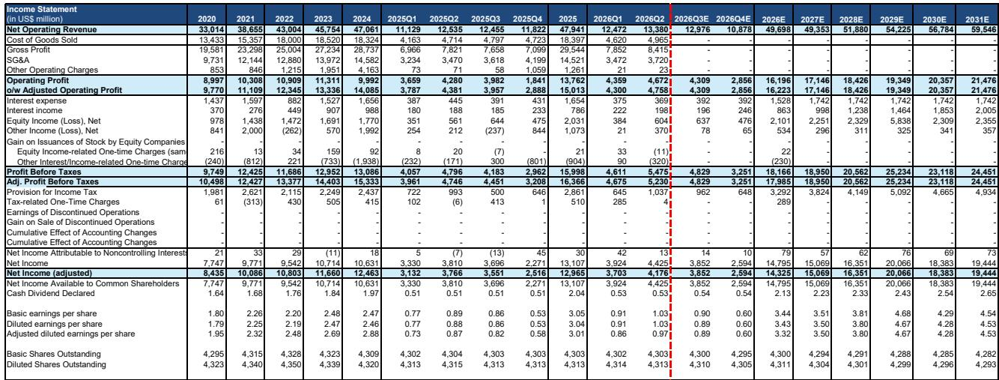
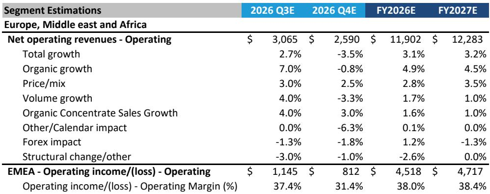
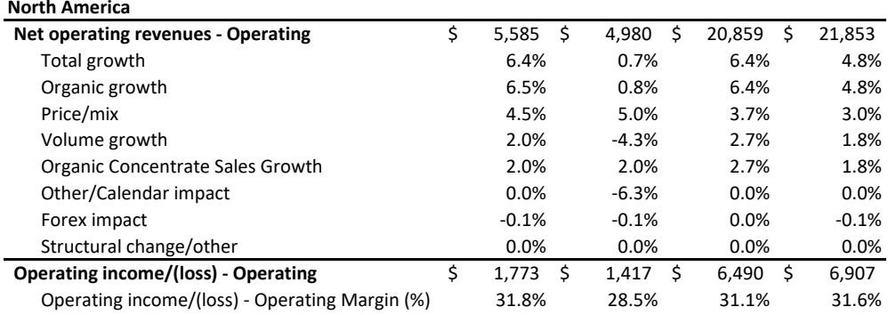

# Bernstein：可口可乐二季度业绩回顾

可口可乐在2026年第二季度交出了一份让市场意外的成绩单。Bernstein研报显示，公司当季有机销售额增长6.0%，远超市场预期的3.5%，而驱动这一超预期的核心动力来自全球销量——单位箱量同比增长5%。这一数字在消费类公司中并不常见，尤其是考虑到同期北美和欧洲市场仍面临消费者支出不确定性、墨西哥消费税以及大宗商品通胀等多重因素。

当季每股收益0.97美元，比市场共识高出0.04美元。营业利润率35.6%，同样高于预期的35.1%。公司随后将全年有机增长指引上调至区间上限5%。报告发布后，报价收于88美元，当日涨幅约5%。

> **KC评论：** 这份研报最值得注意的不是超预期本身，而是超预期的来源。当季销量增长5%是核心变量，而非单纯依赖提价。这意味着可口可乐在消费者购买力承压的环境下，仍能通过品牌和渠道能力推动实际消费量增长，这种“量驱动”的业绩质量通常比“价驱动”更具可持续性。

## 1. 全球各区域呈现不同增长模式

从区域拆分看，北美市场有机增长7%，其中销量贡献3%，价格/产品组合贡献4%。北美营业利润率从31.3%提升至32.7%。拉丁美洲有机增长5%，但销量仅增1%，价格贡献3%，营业利润率高达63.8%。亚太地区有机增长2%，但销量增长11%，价格/产品组合则下降9%，反映出该区域以量换价的策略。欧洲、中东和非洲有机增长3%，销量和价格各贡献1%。

Bernstein认为，当季部分增长受益于一次性因素，包括去年同期的低基数以及世界杯赛事拉动。但报告同时指出，这些短期因素并不能完全解释可口可乐在全球多个市场同时实现销量增长的能力。

## 2. 功能性饮料和蛋白品类成为结构性增长点

研报特别提到，可口可乐在功能性饮料（包括运动饮料和蛋白饮品）领域拥有“有说服力的产品组合”。从美国零售数据看，当季运动饮料品类销量同比增长3.5%，可口可乐在该品类的市场份额为24.6%，同比提升0.6个百分点。Fairlife蛋白奶产品销售额同比增长10.3%，市场份额达31.8%。

这些数据表明，可口可乐的增长并不完全依赖传统碳酸饮料。在碳酸饮料品类中，公司市场份额为38.2%，同比提升1.1个百分点，但功能性饮料和乳制品品类的增速更快，且单价更高——Fairlife每盎司售价0.18美元，是碳酸饮料（0.06美元）的三倍。

> **KC评论：** 读者在评估可口可乐时，往往关注其全球分销网络的防御属性，但容易被忽略的是产品组合升级带来的结构性增长。Fairlife和运动饮料的增速远高于公司整体，且单价更高，这意味着随着高价值品类占比提升，公司整体利润率有持续改善的空间。

## 3. 估值框架调整反映行业资金轮动

Bernstein将目标市盈率从24.0倍上调至25.5倍。报告解释，这一调整部分反映了近期必需消费品板块的资金轮动——研报发布当日，必需消费品板块整体上涨约2%，其中约2个百分点的涨幅可归因于板块资金流入，而非公司基本面单独驱动。

但报告同时认为，当前估值水平进一步扩张的空间有限。基于对未来两年每股收益的预测（2026年3.32美元，2027年3.50美元），25.5倍市盈率已处于历史区间偏高水平。Bernstein对2027年每股收益的预测比市场共识低约0.7%，显示其对中期盈利增速的判断相对保守。

## 4. 一个可复用的观察框架：区分量价驱动与资金驱动

这份研报提供了一个分析消费品公司的实用框架。当一家公司业绩超预期时，需要区分三个层次：第一，超预期是来自销量还是价格，前者通常反映品牌真实需求，后者可能受通胀或产品组合变化影响；第二，利润率改善是经营效率提升的结果，还是成本下降或一次性因素；第三，报价上涨是基本面驱动，还是板块资金轮动的副产品。

可口可乐当季的案例中，三个层次都有清晰信号：销量超预期、利润率改善、但部分涨幅来自板块资金流入。这种拆解方式可以帮助读者更准确地判断业绩的可持续性，以及当前估值是否已经充分反映了这些变化。

For informational purposes only. Portions may be generated,translated,summarized,or edited with AI assistance based on source materials and may contain omissions or errors. Please verify independently. This is not investment,legal,tax,accounting,or other professional advice.

For informational purposes only. Portions may be generated,translated,summarized,or edited with AI assistance based on source materials and may contain omissions or errors. Please verify independently. This is not investment,legal,tax,accounting,or other professional advice.

