# Asian Autos: BYD's Kei-car BEV 'Racco' Arrives - Observations on Japan's Auto Market

## Overview

On July 28, BYD launched the Racco, its first Kei-car BEV in Japan. After subsidies, the model is priced below JPY 2 mn, making it one of the more competitively priced BEVs in the market, although BYD adopted a more cautious pricing strategy than some had anticipated. The company is targeting annual sales of 10K units. With 2026 increasingly viewed as a potential inflection point for BEV adoption in Japan, the launch of the Racco could mark an important development. In this report, we revisit the key question: how significantly could Racco reshape Japan's auto landscape, and could it help accelerate the EV transition?

## BYD's 'Racco' starts at JPY 1,995k after subsidies

BYD's Racco is the company's first Kei-car BEV developed specifically for Japan and is positioned in the highly popular super-height wagon (SHW) segment. The model is offered in three grades - 200, 300 Plus, and 300 Premium - with prices ranging from JPY 2,145k to JPY 2,497k. After applying the JPY 150k CEV subsidy, the entry-grade Racco 200 is available at a purchase price of JPY 1,995k, making it one of the more competitively priced BEVs in Japan. The Racco offers a WLTC driving range of 210 km for the 200 grade and up to 320 km for the 300 Plus and 300 Premium, while also featuring a wide range of user-friendly features.

## Japan's Kei-car market, accounting for ~40% of total sales

Japan's Kei-car market accounts for 40% of vehicle sales, supported by favorable tax treatment and ownership costs. Despite Japan's auto demand shrinking to below 5 mn units, Kei-car demand has remained relatively stable at around 1.7 mn units annually. The market is dominated by Suzuki and Daihatsu, which together account for nearly 70% of sales, while the SHW segment, where BYD's Racco is positioned, represents the largest category.

## 2026 increasingly seen as a potential inflection point for BEV adoption in Japan

Japan's BEV adoption remains at an early stage, but new model launches and enhanced government subsidies are increasingly positioning 2026 as a potential inflection point. The number of Kei-car BEV models in Japan is set to more than double in 2026 vs 2025. Against this backdrop, the BYD Racco is priced more than 10% below existing Kei-car BEVs on average despite being positioned in the larger SHW segment. Combined with a decent driving range, the model appears well positioned for market acceptance.

## Can BYD Racco make a meaningful impact on Japan's auto market?

BYD's presence in Japan remains limited, with only 3.7k units sold in 2025. While its entry into Japan's Kei-car market, the country's most price-sensitive segment, appears strategically sound, achieving its 10k-unit sales target would raise its overall/Kei-car market share to 0.3%/0.6%. The Racco's competitive pricing, spacious SHW packaging, and EV-specific advantages could help attract customers considering models such as the Honda N-BOX, Suzuki Spacia, and Daihatsu Tanto/Move, while also supporting broader BEV adoption over time. That said, the Racco is not expected to materially disrupt the market in the near term, given Japanese consumers' preference for domestic brands and BYD's limited sales and service network. However, given the importance of the N-BOX, Japan's best-selling model, to Honda's domestic sales, successful market penetration by the Racco could be a factor worth monitoring for Honda.

## BERNSTEIN TICKER TABLE

<table><tr><td rowspan="2"></td><td colspan="4">28 Jul 2026</td><td rowspan="2">TTMRel.</td><td colspan="4">Reported EPS</td><td colspan="3">Reported P/E (x)</td></tr><tr><td>Rating</td><td>Cur</td><td>Closing Price</td><td>Price Target</td><td>Cur</td><td>2025A</td><td>2026E</td><td>2027E</td><td>2025A</td><td>2026E</td><td>2027E</td></tr><tr><td>Ticker</td><td></td><td></td><td></td><td></td><td></td><td></td><td></td><td></td><td></td><td></td><td></td><td></td></tr><tr><td>7269.JP (Suzuki)</td><td>O</td><td>JPY</td><td>2,078.50</td><td>2,550.00</td><td>23.4%</td><td>JPY</td><td>227.69</td><td>234.71</td><td>255.99</td><td>9.1</td><td>8.9</td><td>8.1</td></tr><tr><td>7203.JP (Toyota)</td><td>O</td><td>JPY</td><td>3,008.00</td><td>4,200.00</td><td>7.2%</td><td>JPY</td><td>295.25</td><td>308.93</td><td>367.29</td><td>10.2</td><td>9.7</td><td>8.2</td></tr><tr><td>7267.JP (Honda)</td><td>M</td><td>JPY</td><td>1,612.00</td><td>1,300.00</td><td>(2.8)%</td><td>JPY</td><td>(106.06)</td><td>161.84</td><td>147.24</td><td>(15.2)</td><td>10.0</td><td>10.9</td></tr><tr><td>7270.JP (Subaru)</td><td>U</td><td>JPY</td><td>2,680.00</td><td>2,350.00</td><td>(6.8)%</td><td>JPY</td><td>125.50</td><td>222.96</td><td>249.75</td><td>21.4</td><td>12.0</td><td>10.7</td></tr><tr><td>7201.JP (Nissan)</td><td>U</td><td>JPY</td><td>337.40</td><td>350.00</td><td>2.2%</td><td>JPY</td><td>(152.58)</td><td>4.78</td><td>53.06</td><td>(2.2)</td><td>70.5</td><td>6.4</td></tr><tr><td>7261.JP (Mazda)</td><td>U</td><td>JPY</td><td>1,182.50</td><td>1,000.00</td><td>23.1%</td><td>JPY</td><td>55.64</td><td>116.61</td><td>142.17</td><td>21.3</td><td>10.1</td><td>8.3</td></tr><tr><td>1211.HK (BYD)</td><td>O</td><td>HKD</td><td>90.00</td><td>136.00</td><td>(29.7)%</td><td>CNY</td><td>3.58</td><td>4.90</td><td>6.90</td><td>21.7</td><td>15.8</td><td>11.3</td></tr><tr><td>002594.CH (BYD)</td><td>O</td><td>CNY</td><td>93.35</td><td>124.00</td><td>(16.9)%</td><td>CNY</td><td>3.58</td><td>4.90</td><td>6.90</td><td>26.1</td><td>19.0</td><td>13.5</td></tr><tr><td>JPL</td><td></td><td></td><td>--</td><td></td><td></td><td></td><td></td><td></td><td></td><td></td><td></td><td></td></tr><tr><td>ASIAX</td><td></td><td></td><td>--</td><td></td><td></td><td></td><td></td><td></td><td></td><td></td><td></td><td></td></tr></table>

O - Outperform, M - Market-Perform, U - Underperform, NR - Not Rated, CS - Coverage Suspended

Source: Bloomberg, Bernstein estimates and analysis.

## DETAILS

## BYD'S KEI-CAR BEV 'RACCO' ARRIVES - OBSERVATIONS ON JAPAN'S AUTO MARKET

On July 28, BYD launched the Racco, its first Kei-car BEV in Japan (Exhibit 1). Priced at a competitive sub-JPY 2 million level after government subsidies, the model offers a notable value proposition for Japanese consumers, although BYD adopted a more cautious pricing strategy than some had originally anticipated. BYD has set a sales target of 10,000 units for the Racco. With 2026 increasingly viewed as a potential inflection point for BEV adoption in Japan, the launch of the Racco could represent an important development for the industry. In this report, we revisit the key question: how significant an impact could BYD's new Kei-car have on Japan's automotive landscape, and could it help accelerate the country's transition to EVs?

## BYD'S RACCO STARTS AT JPY 1,995K AFTER SUBSIDIES

BYD's Racco is the company's first Kei-car BEV developed specifically for the Japanese market, marking an important milestone in its efforts to strengthen its presence in Japan. Importantly, the model is positioned within the super-height wagon segment, the largest and most popular category in Japan's Kei-car market, where practicality, spacious interiors, and family-oriented features have historically driven strong demand. The Racco is offered in three grades - 200, 300 Plus, and 300 Premium - with prices ranging from JPY 2,145k to JPY 2,497k. Following the application of the JPY 150k government subsidy available for the model, the entry-grade version is expected to be priced at an effective JPY 1,995k for consumers, making it one of the more attractively priced BEVs in the Japanese market (Exhibit 2).

The entry-grade 200 is equipped with a 22.4 kWh Blade Battery delivering a WLTC range of 210 km, while the 300 Plus and 300 Premium feature a larger 35.84 kWh battery providing up to 320 km of WLTC range. All variants are powered by a front-mounted electric motor producing 47 kW (64 PS) and 160 Nm of torque and support both AC and DC charging. In addition to its battery technology, BYD has equipped the Racco with a relatively comprehensive feature set for the Kei-car market, including powered sliding doors with hands-free operation, a digital instrument cluster, touchscreen infotainment system, Apple CarPlay and Android Auto connectivity, NFC smartphone key functionality, battery pre-heating, V2L capability on higher-grade models, and a variety of family-oriented convenience features.

The vehicle also incorporates a suite of ADAS technologies, including autonomous emergency braking, forward collision warning, lane-keeping assistance, adaptive cruise control, and other ADAS functions designed to enhance everyday usability and safety. Measuring 3,395 mm in length, 1,475 mm in width, and 1,800 mm in height, the cabin accommodates four passengers and offers a highly flexible interior layout, with cargo capacity expanding to a substantial volume when the rear seats are folded. Overall, BYD appears to be positioning the Racco as a value-for-money BEV, with its competitive pricing likely to be the model's key differentiator. Coupled with a long driving range, advanced connectivity, comprehensive safety features, and strong everyday practicality, the Racco offers a compelling package for cost-conscious Japanese consumers, in our view.

## EXHIBIT 1: BYD's Racco starts at JPY 1,995k after subsidies

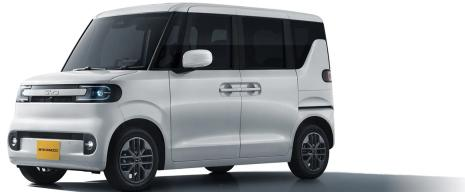

Source: Company website

EXHIBIT 2: The Racco is offered in three trims - the 200, 300 Plus, and 300 Premium

<table><tr><td>OEM</td><td>BYD</td><td>BYD</td><td>BYD</td></tr><tr><td>Model</td><td>RACCO</td><td>RACCO</td><td>RACCO</td></tr><tr><td>Edition</td><td>200</td><td>300 Plus</td><td>300 Premium</td></tr><tr><td>Model type</td><td>Super-Height Wagon</td><td>Super-Height Wagon</td><td>Super-Height Wagon</td></tr><tr><td>Sales price (JPY k)</td><td>2,145</td><td>2,398</td><td>2,497</td></tr><tr><td>L x W x H (m)</td><td>3.4 x 1.5 x 1.8</td><td>3.4 x 1.5 x 1.8</td><td>3.4 x 1.5 x 1.8</td></tr><tr><td>Cubic meter (m3)</td><td>9.0</td><td>9.0</td><td>9.0</td></tr><tr><td>Vehicle weight (kg)</td><td>1,160</td><td>1,220</td><td>1,230</td></tr><tr><td>Fast charging time (min)</td><td>30</td><td>30</td><td>30</td></tr><tr><td>EV Range (km)</td><td>210</td><td>320</td><td>320</td></tr><tr><td>Battery capacity (kWh)</td><td>22.4</td><td>35.8</td><td>35.8</td></tr><tr><td>Electric Mileage (km/kWh)</td><td>9.4</td><td>8.9</td><td>8.9</td></tr><tr><td>Price (JPY k) / m3</td><td>238.3</td><td>266.4</td><td>277.4</td></tr><tr><td>Price (JPY k)/ Electric Mileage</td><td>228.8</td><td>268.6</td><td>279.7</td></tr></table>

Source: BYD, Bernstein analysis

## JAPAN'S KEI-CAR MARKET, ACCOUNTING FOR ~40% OF TOTAL AUTO SALES

## Japan's unique Kei-car standard

The Kei-car standard that BYD's Racco complies with is a unique vehicle category in Japan, characterized by strict restrictions on vehicle dimensions and powertrain output (Exhibit 3). Specifically, these cars must have an engine displacement of 660 cc or less, a length of no more than 3.4 meters, a width within 1.48 meters, and a height up to 2.0 meters. This classification positions Kei-cars as smaller and more economical compared to regular passenger vehicles. Historically, the standard was established in 1949, initially limiting engine displacement to 250 cc, but it has since expanded to the current 660 cc limit. Due to their compact size and fuel efficiency, Kei-cars are highly convenient for urban use, and they benefit from favorable tax treatments—such as lower acquisition tax, vehicle tax, and weight tax—making their ownership and maintenance costs significantly cheaper than those of standard cars. Additionally, insurance premiums and inspection fees for Kei-cars tend to be relatively low. Overall, the Kei-car standard is well integrated into Japan's transportation environment and economic conditions, contributing to reduced environmental impact and alleviating traffic congestion.

The Kei-car market, originally centered around small passenger models such as compact sedans and hatchbacks, as well as commercial models like trucks and vans—reflecting its roots in affordability and functionality—has evolved through gradual expansions in engine displacement and dimension regulations, resulting in a wide variety of model segments available today (Exhibit 4, Exhibit 5). However, in recent years, the Japanese Kei-car market has offered a wide range of segment models—comparable to those in the global automobile market—including more spacious height wagons and super-height wagons that reflect consumer needs in Japan, SUVs with added value such as enhanced off-road capability, and sports models focused on driving performance and design for niche customer segments.

EXHIBIT 3: The Kei-car standard sets limits on vehicle dimensions and powertrain output, offering owners favorable benefits in ownership and maintenance costs

<table><tr><td>Type</td><td>Kei-car (minicar)</td><td>Registration car (Normal PV)</td></tr><tr><td>Size</td><td>Length ≤ 3.4m, Width ≤ 1.48m, Height ≤ 2.0 m</td><td>Compact car: Width ≤ 1.7 m, Height ≤ 3.8m, no length limitStandard car: Height ≤ 3.8m, no width/length limit</td></tr><tr><td>Engine displacement</td><td>Up to 660 cc</td><td>Compact car: up to 2,000 ccStandard car: no upper limit</td></tr><tr><td>Power output capacity*</td><td>Up to 64 hp (47kW)</td><td>No upper limit</td></tr><tr><td>Seating capacity</td><td>Up to 4 occupants</td><td>Up to 10 occupants</td></tr><tr><td>Annual automobile tax</td><td>JPY 10,800 (private use)</td><td>&gt;JPY 25,000 (depending on the engine displacement)</td></tr><tr><td>Weight tax*</td><td>JPY 6,600 - 8,800</td><td>JPY 8,200 - 75,600</td></tr><tr><td>Environmental performance tax</td><td>Up to 2% of taxable purchase price</td><td>Up to 3% of taxable purchase price</td></tr><tr><td>Highway toll rates</td><td>~20% discount vs. registered vehicle</td><td>Standard rates</td></tr><tr><td>License plate</td><td>Yellow</td><td>Green</td></tr></table>

Note: Power output limits are self imposed by each manufacturer.  
Source: Keikenkyo, Zenkeijikyo, Ministry of Land, Infrastructure, Transport and Tourism of Japan, AIRIA, Bernstein analysis

EXHIBIT 4: Diverse segments in the Kei-car market #1

<table><tr><td></td><td>Super-height wagon</td><td>Height wagon</td><td>SUV</td></tr><tr><td>Image</td><td>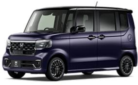N-BOX (Honda)</td><td>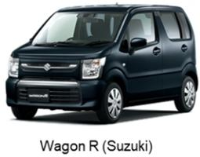</td><td>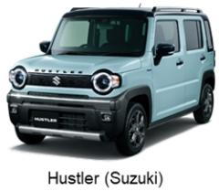</td></tr><tr><td>Key characteristics</td><td>The best-selling Kei-car segmentTallest Kei-car segment (~1.8 m height)Equipped with sliding doors for easy entry and spacious interiorsPrioritizes comfort and practicality for families and elderly drivers</td><td>Slightly lower roof (1.65–1.75 m)Usually without sliding doors, focusing on lightweight and fuel efficiencyLower-priced alternative to super-height wagons</td><td>Raised ground clearance and SUV-style designEmphasizes active lifestyle, outdoor use, and youthful appealGrowing popularity among younger users</td></tr><tr><td>Flagship models</td><td>N-BOX (Honda)Spacia (Suzuki)Tanto (Daihatsu)Roox (Nissan)eK Space (MMC)Racco (BYD)</td><td>Wagon R (Suzuki)Move (Daihatsu)Dayz (Nissan)N-ONE e: (Honda, BEV)Sakura (Nissan, BEV)ek X EV (MMC, BEV)</td><td>Hustler (Suzuki)Taft (Daihatsu)</td></tr></table>

Source: Company websites, Bernstein analysis

EXHIBIT 5: Diverse segments in the Kei-car market #2

<table><tr><td></td><td>Hatchback</td><td>Kei Van/1-Box/Cab-van</td><td>Sports/Open-top</td></tr><tr><td>Image</td><td>[IMAGE]Alto Lapin (Suzuki)</td><td>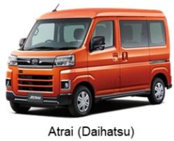</td><td>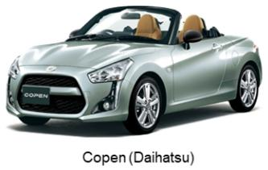</td></tr><tr><td>Key characteristics</td><td>Standard kei passenger car layout (5-door hatchback)Compact, economical, easy to handle for city drivingCore segment for entry-level ownership</td><td>Box-shaped vehicles designed for cargo and commercial usePrioritizes loading capacity; often rear-wheel-driveUsed for delivery, maintenance, and welfare applications</td><td>Performance-oriented, design-driven segmentUsually 2-seaters with lightweight bodies and low center of gravityNiche but with a loyal enthusiast base</td></tr><tr><td>Flagship models</td><td>Alto (Suzuki)Alto Lapin (Suzuki)Mira e:S (Daihatsu)</td><td>Atrai (Daihatsu)Every (Suzuki)Clipper Van (Nissan)</td><td>Copen (Daihatsu)S660 (Honda, discontinued)</td></tr></table>

Source: Company websites, Bernstein analysis

## Developments in Japan's Kei-car market, sustained growth in market share over the long term

The Japanese automobile market peaked around the 1990s and has since gradually declined to a level below 5 mn units. Meanwhile, demand for Kei-cars has remained relatively stable, with their market share continuing to expand over the long term (Exhibit 6). The Kei-car market grew to about 2.3 mn units at its peak in 2014, followed by a gradual decline. However, aside from 2024, which was impacted by certification fraud issues involving Daihatsu (Toyota's wholly owned subsidiary), a leading Kei-car maker, the market has remained stable in recent years at around 1.7 mn units. Accordingly, the share of Kei-cars in the overall Japanese automobile market has been steadily increasing over the long term. In 2025, the share stood at ~37%, and in recent years it has generally remained at a level of ~40%. Meanwhile, the super-height wagon segment, where BYD's Racco is positioned, is the largest category within Japan's Kei-car market and has remained a key growth area, with sales volumes steadily increasing over the past several years (Exhibit 7). In 2025, the super-height wagon segment lead the current Kei-car market with a ~39% share, followed by the height wagon segment at ~20%.

EXHIBIT 6: While the overall Japanese automobile market continues a gradual decline, the share of Kei-cars has been steadily increasing over the long term, maintaining a relatively stable volume  
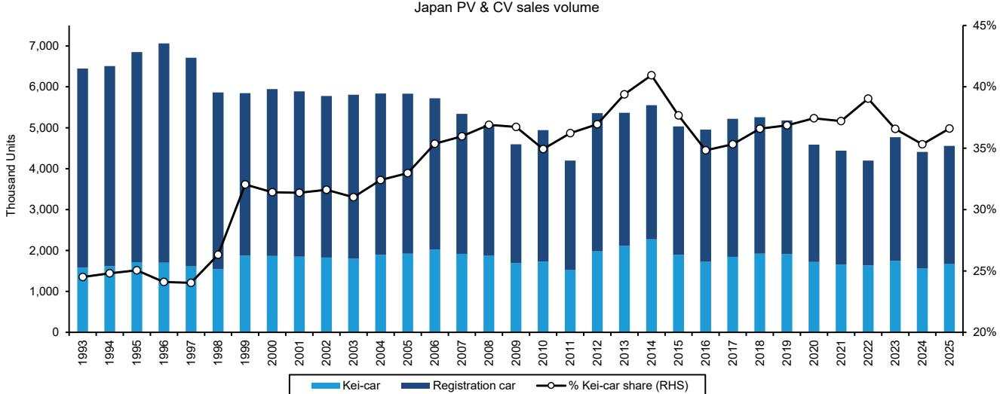  
Source: JADA, Marklines, Bernstein analysis

EXHIBIT 7: In the current Kei-car market, the super-height wagon segment holds the largest market share  
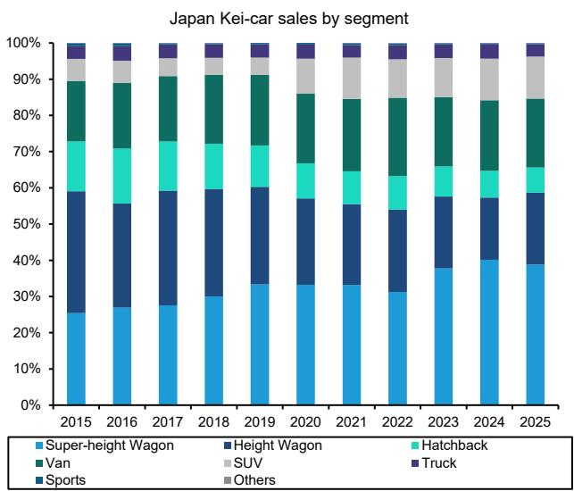  
Source: Marklines, Bernstein analysis

## Suzuki and Daihatsu dominate the Kei-car market, with Honda also maintaining a strong presence

All Japanese passenger car makers are active in the Kei-car market, but Suzuki and Daihatsu dominate the market, with Honda, Nissan, and Mitsubishi (MMC, not covered) trailing behind. Among the Kei-car manufacturers, Suzuki, the current market leader, has consistently maintained stable sales around 500K-600K units (Exhibit 8). Daihatsu, its main competitor, experienced a sharp 38% YoY drop in 2024 due to a shipment halt caused by the certification fraud issue, but volume have rebounded sharply since 2025. Honda's sales, driven largely by its N-Series, have hovered around 300K units, while Nissan's sales have remained near 200K units. MMC has maintained a steady sales volume of between 50k and 70k units. In addition, other automakers like Toyota, Mazda, and Subaru also provide Kei-car lineups to cater to specific customer needs. However, their current offerings mainly consist of models supplied through OEM agreements with other automakers.

Over the past decade, the market shares of the major players have remained largely stable (Exhibit 9). Suzuki and Daihatsu, the two largest manufacturers, have each held just over 30% of the market, together controlling nearly 70% of the Kei-car segment. Honda has followed with around 20%, Nissan holding about 10%, and MMC maintaining roughly a 3% share. In 2025, Suzuki maintained the largest share of the Kei-car market at 34%, followed by Daihatsu with 31%, Honda at 17%, Nissan at 10%, and MMC at 4% (Exhibit 10). The 2025 Kei-car sales rankings by model were dominated by super-height models such as Honda's N-BOX, Suzuki's Spacia, and Daihatsu's Tanto and Move (Exhibit 11). At the top, Honda's N-BOX stands out as the flagship model of the N-Series, which revitalized the company's Kei-car business in the 2010s. Both Suzuki and Daihatsu, the market leaders, offer a broad lineup that cover various segments such as SUVs and height wagons. Notably, Suzuki's Hustler, currently ranked 6th, was launched in 2014 as a unique blend of height wagon and SUV, carving out a new niche and earning strong praise. Additionally, Suzuki's Jimny, although a Kei-car, is a true four-wheel-drive vehicle and remains highly popular to this day.

EXHIBIT 8: Suzuki's sales have remained steady at 500K-600K units, while Daihatsu has recently seen a decline due to the certification fraud issue  
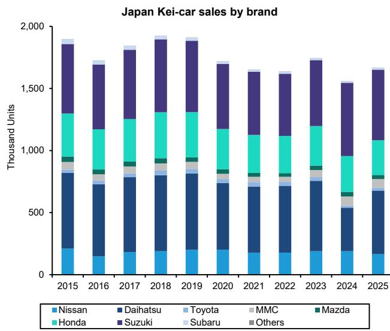  
Source: Marklines, Bernstein analysis

EXHIBIT 9: Except for 2024, when Daihatsu was impacted by the certification fraud issue, the market shares of automakers have generally remained stable  
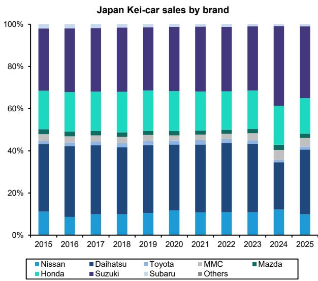  
Source: Marklines, Bernstein analysis

EXHIBIT 10: Suzuki & Daihatsu together hold just <70% market share, with Honda also maintaining a strong presence

Japan Kei-Car Market Share (2025)

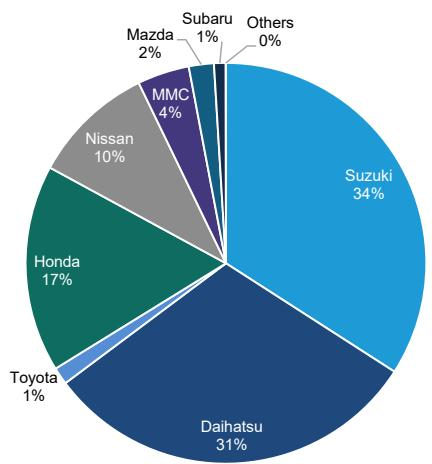  
Source: JLMVMA, Bernstein analysis

EXHIBIT 11: Honda's N-BOX is the top-selling model, while Suzuki and Daihatsu provide a diverse lineup of models

<table><tr><td>#</td><td>Automaker</td><td>Model</td><td>Segment</td><td>Sales Unit (YTD)</td><td>YoY growth</td></tr><tr><td>1</td><td>Honda</td><td>N-BOX</td><td>SHW</td><td>102,419</td><td>-1.0%</td></tr><tr><td>2</td><td>Suzuki</td><td>Spacia</td><td>SHW</td><td>83,229</td><td>-1.3%</td></tr><tr><td>4</td><td>Daihatsu</td><td>Tanto</td><td>SHW</td><td>62,419</td><td>-4.5%</td></tr><tr><td>3</td><td>Daihatsu</td><td>Move</td><td>SHW</td><td>63,272</td><td>24.4%</td></tr><tr><td>5</td><td>Nissan</td><td>Roox</td><td>SHW</td><td>53,173</td><td>44.1%</td></tr><tr><td>6</td><td>Suzuki</td><td>Hustler</td><td>SUV</td><td>47,004</td><td>-0.4%</td></tr><tr><td>7</td><td>MMC</td><td>Delica Mini</td><td>SHW</td><td>32,415</td><td>12.0%</td></tr><tr><td>8</td><td>Suzuki</td><td>Wagon R</td><td>Height Wagon</td><td>32,160</td><td>-16.4%</td></tr><tr><td>9</td><td>Daihatsu</td><td>Mira</td><td>Hatchback</td><td>29,385</td><td>0.2%</td></tr><tr><td>10</td><td>Suzuki</td><td>Alto</td><td>Hatchback</td><td>25,742</td><td>-15.3%</td></tr><tr><td>11</td><td>Nissan</td><td>Dayz</td><td>Height Wagon</td><td>21,583</td><td>-4.7%</td></tr><tr><td>12</td><td>Daihatsu</td><td>Taft</td><td>SUV</td><td>21,246</td><td>-23.7%</td></tr><tr><td>13</td><td>Suzuki</td><td>Jimny</td><td>SUV</td><td>15,974</td><td>-40.8%</td></tr><tr><td>14</td><td>Suzuki</td><td>Every Wagon</td><td>Van</td><td>11,915</td><td>18.7%</td></tr><tr><td>15</td><td>Honda</td><td>N-ONE</td><td>Height Wagon</td><td>9,571</td><td>33.0%</td></tr></table>

Note: SHW (Super-Height Wagon)
Source: JLMVMA, Bernstein analysis

## Average price of Kei-cars ranging JPY ~1.8 mn

Kei-cars are fundamentally designed to be economical and affordable, which is the core purpose of this category and market. Accordingly, the average price of a Kei-car is JPY ~1.8 mn, considerably lower than that of regular passenger vehicles (Exhibit 12). However, with the expansion of segments and diversification of models, the price range has become quite broad. Among non-BEVs - which still tend to be relatively expensive within the Kei-car market - the super-height wagon stands out with the highest price range, between JPY 1.8-2.1 mn. Additionally, height wagons, which have a lower overall height, typically range in price roughly JPY 1.6-2 mn. SUVs average around JPY 1.8 mn, while hatchbacks, the most affordable passenger cars, usually fall approximately JPY 1.2-1.4 mn. Moreover, consistent with common trends in the automotive market, vehicle prices tend to rise with increasing size (Exhibit 13).

EXHIBIT 12: Average price of Kei-cars ranging JPY ~1.8 mn  
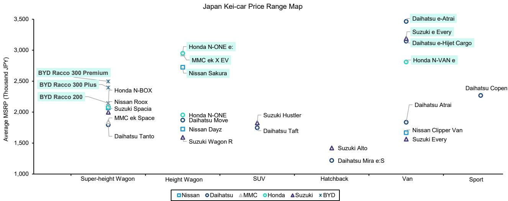  
Source: Company websites, Bernstein analysis

EXHIBIT 13: Even among Kei-cars, larger models tend to be associated with higher prices  
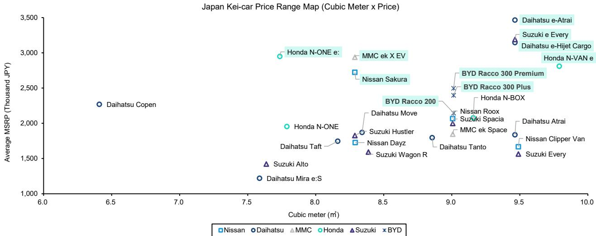  
Source: Company websites, Bernstein analysis

## 2026 INCREASINGLY SEEN AS A POTENTIAL INFLECTION POINT FOR BEV ADOPTION IN JAPAN

Despite the global acceleration in the shift toward BEVs over recent years, their adoption in Japan has been at a relatively early stage. However, accelerating BEV model launches across automakers and enhanced government subsidies are expected to provide a meaningful boost, with 2026 increasingly viewed as a potential inflection point for BEV adoption in Japan. Indeed, BEVs' share of total vehicle sales in Japan rose steadily from 3.0% in March, before the increase in CEV subsidies, to 3.2% in May, and 3.8% in June. While penetration remains modest compared with other developed markets, the recent trend suggests that the market may be starting to move beyond the very early-adoption phase. The same pattern is evident in the Kei-car BEV segment, where BEV share within overall Kei-car sales expanded from 1.3% in March to 1.9% in June (Exhibit 14). Although the base remains small, the combination of richer model offerings and stronger policy support appears to be gradually improving consumer acceptance of BEVs in Japan.

2026 is shaping up to be a year of accelerating new Kei-car BEV model launches in Japan. By the end of 2025, the number of Kei-car BEVs available in the Japanese market remained limited (Exhibit 15). In the passenger vehicle segment, offerings consisted primarily of Nissan's Sakura and Mitsubishi's eK X EV, both launched in 2022, as well as Honda's N-ONE e:, which entered the market in September 2025. In the commercial vehicle segment, Honda's N-VAN e: was the only major Kei-car BEV offering following its launch in 2024. Since the start of 2026, however, the pace of new model introductions has accelerated noticeably (Exhibit 16). Daihatsu launched the commercial e-Hijet Cargo and e-Atrai in February, followed by Suzuki's e- Every, while BYD is set to enter the passenger vehicle segment with the launch of the Racco, a super-height wagon Kei-car
