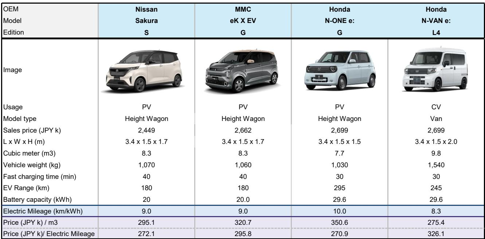
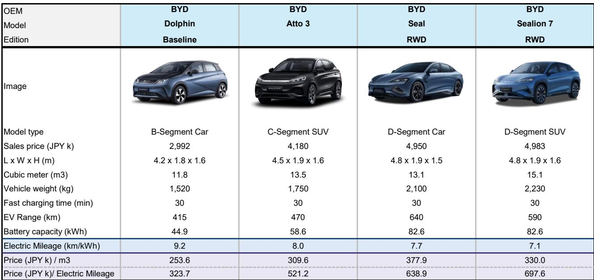
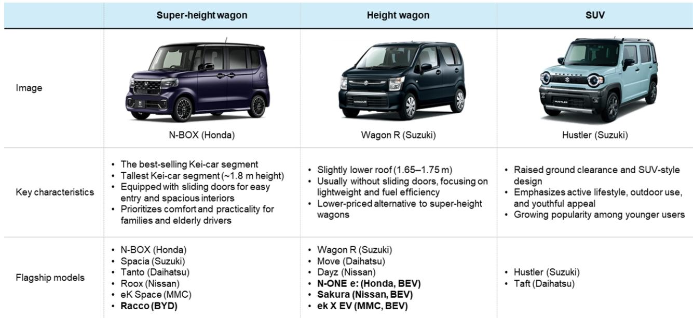

# Bernstein：比亚迪轻自动车BEVRacco进入日本市场

7月28日，比亚迪在日本推出其首款轻自动车纯电动车型“Racco”。扣除相关补贴后，入门版实际售价降至199.5万日元，成为日本市场定价较有竞争力的纯电动车之一。Bernstein研报指出，这一价格策略比其此前预期更为谨慎。比亚迪为该车型设定的年销量目标为1万辆。

日本轻自动车市场约占全国汽车销量的40%，年需求稳定在170万辆左右。该市场由铃木和大发主导，两者合计份额接近70%。Racco定位的超高顶旅行车是轻自动车中最大的细分品类。Bernstein认为，2026年日本纯电动车渗透率可能迎来变化节点，新车型投放和补贴政策是主要推动因素。Racco的上市恰逢这一窗口期。

> **KC评论：** Bernstein的测算显示，即便Racco完成1万辆年销目标，比亚迪在整体日本汽车市场的份额也仅为0.3%，在轻自动车市场约为0.6%。这一量级对现有格局的冲击有限，但对比亚迪自身而言，是进入日本最核心价格敏感市场的战略落子。

## 1. Racco的定价与配置在轻自动车BEV中具备竞争力

Racco提供三个配置等级：200、300 Plus和300 Premium，售价区间为214.5万至249.7万日元。扣除15万日元相关补贴后，入门版实际支付价低于200万日元。该车型搭载比亚迪刀片电池，200版配备22.4千瓦时电池，WLTC续航210公里；300版配备35.84千瓦时电池，续航320公里。全系标配电动侧滑门、数字仪表盘、触控信息娱乐系统、Apple CarPlay和Android Auto连接功能，以及包括自动紧急制动、车道保持辅助、自适应巡航在内的ADAS套件。

Bernstein对比了Racco与现有轻自动车BEV的价格。Racco的定价比同类产品平均低10%以上，且其超高顶旅行车车身尺寸（长3.4米、宽1.48米、高1.8米）提供了更大的内部空间。报告认为，这一价格与空间的组合是Racco的核心差异化优势。

## 2. 日本轻自动车市场结构对BEV渗透构成结构性约束

日本轻自动车市场并非单一同质市场。Bernstein将其划分为超高顶旅行车、高顶旅行车、SUV、两厢车、厢式货车和运动型六个细分品类。Racco进入的超高顶旅行车是最大的细分市场，代表车型包括本田N-BOX、铃木Spacia和大发Tanto。这些车型以燃油动力为主，消费者对价格和品牌忠诚度较高。

日本轻自动车享有显著的成本优势：年汽车税仅为1.08万日元，远低于普通乘用车的2.5万日元以上；高速公路通行费享受约20%折扣；保险和年检费用也相对较低。这些制度性优势使得燃油轻自动车的全生命周期成本已经较低，BEV的燃料节省空间被大幅压缩。Bernstein认为，这是日本BEV渗透率长期偏低的结构性原因之一。

## 3. 2026年BEV车型供给弹性较高，但消费者偏好仍是关键变量

报告指出，2026年日本轻自动车BEV车型数量将较2025年有所增加。Racco的加入使这一供给侧的竞争更加充分。然而，日本消费者对本土品牌的偏好、比亚迪目前仅有的销售和服务网络覆盖范围，以及轻自动车用户对价格的高度敏感，都是Racco实现销量目标需要克服的障碍。

Bernstein认为，Racco的竞争对象主要是本田N-BOX、铃木Spacia和大发Tanto/Move的潜在客户。如果Racco能够吸引部分这些车型的消费者，对高度依赖N-BOX的本田国内销售可能构成一定影响。但报告明确表示，短期内不预期Racco对日本汽车市场产生实质性冲击。

> **KC评论：** Bernstein对铃木和丰田给出跑赢评级，对本田给出市场表现评级。这一评级框架背后隐含的判断是：Racco的竞争不确定性主要落在本田的国内轻自动车业务上，而对铃木和丰田的影响相对有限。读者在评估日本汽车公司时，需要区分各公司在轻自动车市场的敞口差异。

## 4. 观察框架：从三个维度评估Racco的市场影响

Bernstein的分析框架可以提炼为三个观察维度。第一是销量爬坡速度：Racco能否在上市后12个月内接近1万辆的年化销售目标，是检验其市场接受度的直接指标。第二是价格体系变化：如果Racco迫使本田、铃木或大发调整N-BOX、Spacia等主力车型的定价或配置，说明竞争不确定性开始传导。第三是经销商网络扩张：比亚迪在日本的门店数量目前有限，若其加速开店计划，将提升Racco的触达能力，但也意味着更高的运营投入。

这三个维度相互关联。销量不及预期可能延缓网络扩张，而网络不足又反过来制约销量。Bernstein的报告没有给出明确的时间表，但指出2026年将是观察这些变量是否形成正向循环的关键年份。

For informational purposes only. Portions may be generated,translated,summarized,or edited with AI assistance based on source materials and may contain omissions or errors. Please verify independently. This is not investment,legal,tax,accounting,or other professional advice.

For informational purposes only. Portions may be generated,translated,summarized,or edited with AI assistance based on source materials and may contain omissions or errors. Please verify independently. This is not investment,legal,tax,accounting,or other professional advice.

