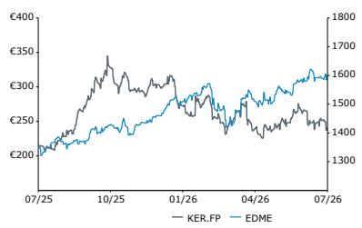

# Global Luxury Goods

## Kering SA

**Rating**

Market-Perform

**Price Target**

KER.FP

270.00 EUR (220.00 OLD)

Luca Solca
+41 582 723 126
luca.solca@bernsteinsg.com

Maria Meita
+44 20 7170 0540
maria.meita@bernsteinsg.com

Yi-Peng Khoo, CFA
+44 20 7676 6822
yi-peng.khoo@bernsteinsg.com

Eric Chen, CFA
+852 2123 2628
eric.chen@bernsteinsg.com

## Kering: Highlights from the 1H26 conference call

Kering reported its 1H26 results today. This report contains key points from its investor conference call. Results Quick Take: Kering: 1H26 beats expectations

Management expressed confidence in their strategic direction. Gucci appears to be progressing in 2Q26A. An acceleration in 2H26E is anticipated, supported by a wave of new products arriving in stores in late July, with further momentum expected through the remainder of 2H26. Saint Laurent and Bottega Veneta are showing growth; Balenciaga and McQueen are in a recovery phase. Jewelry is performing well, while Eyewear remains strong. A notable improvement in margins, achieved through fixed cost efficiencies and an accelerated network optimization (see Global Luxury Goods: Retail Network Dynamics - China), provides additional support.

Luca De Meo and his executive team have taken a practical approach. Optimizing Kering's underperforming store network is supporting EBIT%. Gucci's updated and more realistic approach to pricing, product, and positioning appears to be a key factor in its revenue stabilization. We had previously noted Gucci's willingness to adjust pricing on the Mercato Tote. Luca de Meo's comment on exponential price elasticity behavior suggests that pricing realism may be a significant performance driver at this time. Meeting customers where they are, rather than relying solely on creativity to elevate them, is not necessarily negative - provided genuine brand appeal develops from faster brand momentum. There is a substantial audience of 'luxury orphans' that Kering (and accessible luxury players) can serve.

## Research Implications

We leave this call with a more constructive view than before, even if our Group FY26E top-line forecasts are largely unchanged, with higher growth at Gucci offset by lower growth at other divisions. On Gucci, stronger brand momentum driven by new collections could partially offset tougher comparable periods. We project Gucci retail comparable growth of -1% in 3Q26E. On margins, management reiterated guidance for sequential improvement in 2H, despite historical seasonality. We remain open to potential cost efficiencies and operating leverage at Jewelry and Eyewear, and now see Group EBIT% at 12.8% in FY26, with EBIT improvements extending to outer years. Our FY26 EPS forecasts rise by +8.6%, landing +5% above current consensus. We now value Kering on a 1.8x target relative P/E (up from 1.7x previously, and equivalent to a 23x NTM+1 P/E), to arrive at an updated price target of €270. Kering's turnaround appears to be progressing; current valuations,

<table><tr><td>Close Date</td><td></td><td></td><td>28 Jul 2026</td></tr><tr><td>KER.FP Close Price (EUR)</td><td></td><td></td><td>250.50</td></tr><tr><td>Price Target (EUR)</td><td></td><td></td><td>270.00</td></tr><tr><td>Upside/(Downside)</td><td></td><td></td><td>8%</td></tr><tr><td>52-Week Range</td><td></td><td colspan="2">352.76/207.05</td></tr><tr><td>EDME</td><td></td><td></td><td>--</td></tr><tr><td>FYE</td><td></td><td></td><td>Dec</td></tr><tr><td>Div Yield</td><td></td><td></td><td>1.2%</td></tr><tr><td>Market Cap (EUR) (M)</td><td></td><td></td><td>30,917</td></tr><tr><td>EV (EUR) (M)</td><td></td><td></td><td>45,969</td></tr><tr><td>Performance</td><td>YTD</td><td>1M</td><td>6M</td></tr><tr><td>Absolute (%)</td><td>(16.4)</td><td>(6.2)</td><td>(5.5)</td></tr><tr><td>EDME (%)</td><td></td><td></td><td></td></tr><tr><td>Relative (%)</td><td></td><td></td><td></td></tr><tr><td colspan="4">Source: Bloomberg, Bernstein estimates and analysis.</td></tr></table>

Price Performance, 1YR

<table><tr><td>Adjusted EPS</td><td>F25A</td><td>F26E</td><td>F27E</td><td>Financials</td><td>F25A</td><td>F26E</td><td>F27E</td><td>CAGR</td><td>Valuation Metrics</td><td>F25A</td><td>F26E</td><td>F27E</td></tr><tr><td>KER.FP (EUR)</td><td>4.35</td><td>6.66</td><td>9.93</td><td>Revenues (M)</td><td>14,675</td><td>14,628</td><td>15,491</td><td>--</td><td>Adjusted P/E (x)</td><td>57.6</td><td>37.6</td><td>25.2</td></tr><tr><td>OLD</td><td>--</td><td>6.13</td><td>9.86</td><td></td><td></td><td></td><td></td><td></td><td></td><td></td><td></td><td></td></tr></table>

Source: Bloomberg, Bernstein estimates and analysis.

## DETAILS

## BUSINESS UPDATE

- First quarter of growth after 12 consecutive quarters of negative performance

- Full price vs Off price: Performance in 2Q was not driven by off-price sales, with full-price growth being robust. Continuing to close some outlet stores

• Wholesale guidance: Aim to stay roughly flat in 2H26

- OPEX: Reduction mainly driven by fixed costs, management now expects a full-year reduction in OPEX (previously guided to flat OPEX)

- Note that OPEX fell by -3% on constant currency terms, with FX evolution likely having an impact on 2H OPEX reduction

- A&P expected to remain around 9% of revenues - brand investment will not be reduced

- Corporate costs excluding the reduction in rental revenues attributable to real estate assets which have now been exited are roughly stable

- Margins: Reiterated expectations that 2H26 margins will be sequentially higher than 1H26 margins

• Commentary on near-term trading:

• 3Q26 currently looks flattish on a Group basis, due to a tougher comparable base

- Management reiterates its aim to deliver positive growth on a FY basis

- Management emphasizes that the recovery at Gucci will not be linear, pointing to significant newness at Gucci in 4Q26, with Primavera and Cruise in the market at that time

- Product Architecture: Gucci is actively looking at various ways to reposition itself, with new collections competitively priced. Not above repositioning some products downward. Price changes have had a large "exponential" impact on volumes - we note that this may be a reference to price adjustments on the Mercato Tote bag (see Global Luxury Goods: The Handbag Price & Mix Barometer - Diverging LFL price and product changes in 2Q26) among others.

- Inventory reductions: Continuing to guide to a €1bn reduction in F&LG inventories by end-2026

- Aided by a faster inventory turnover and replenishment cycle

- Net Store Closures: Kering has closed 84 net stores in 1H26, versus its plan to close more than 100 in FY26. Originally planned to close around 100 stores in 2027, 50 in 2028 and 30 in 2029

• No share buybacks planned

## COMMENTARY BY DIVISION

## FASHION AND LEATHER GOODS

- Saint Laurent: Returned to growth in 1H, with accelerating retail momentum in 2Q

- Saw strong performance in RTW, footwear and men's collections, with good traction in North America and Western Europe

- Innovative pipeline set to launch in early-2027 - hero leather goods and menswear expansion

- Bottega Veneta: Strong growth engine; acceleration in retail across most markets

• Strong leather goods momentum, acceleration flagged in NA, JP, KR and Western Europe

- Balenciaga: Undergoing a creative transition, performance remains mixed

• Leather goods grew DD in 2Q (City, Rodeo); strong performance in South Korea

• Alexander McQueen: 20 net store closures in 1H26. Restructuring in progress.

- Brioni: Continued strong growth; Maestria bespoke offering grew $>30\%$ , now represents $25\%$ of store sales

## OF WHICH: GUCCI

• Retail trends across all regions improved, with notable strength in North America; also improvement across all nationalities

• Leather goods returned to growth, driven by successful launches including Borsetto and Paparazzo.

- Newness continues to accelerate, with La Famiglia in January, the Gucci Generation in April and Primavera which is rolling out across the second-half of July. Primavera is the first fully developed collection under Demna

- Gucci Racing conceived as a new platform for sportswear, experiences and to enhance cultural relevance

- Brand equity remains strong in North America, which has helped drive positive traction on newness. Where brand equity is weaker / eroded (i.e. China), the results seem to have been more subdued. The turnaround in China will take more time

## KERING JEWELLERY

- Boucheron: Exceptional growth in Japan and APAC; wholesale performance impacted by the internalization of Emerati franchisees

• Pomellato: Strong growth in Japan and NA

- Qeelin: Strong APAC growth, particularly in South Korea; less dynamic wholesale in 2H26 given significant deliveries at the start of the year

- DoDo: Faced tougher comps and softer performance

## KERING EYEWEAR

• Strong growth from: Cartier, Bottega Veneta, Maui Jim, Lindberg, and the Valentino eyewear launch

## COMMENTARY BY GEOGRAPHY

## NORTH AMERICA

• American spending was strong both domestically and abroad, up HSD

• Gucci has resonated well with American customers

• Supported by a clear wealth effect in the region

## EUROPE

• European spending turned positive in 2Q, strong local spending supported retail performance in Western Europe

• Western Europe saw improving tourist flows QoQ

## APAC EX. JP

- Chinese spending remained negative, but marked an improvement from 1Q, with a sequential improvement from both onshore and offshore spending

- Korean spending was an important contributor to performance at BV, Balenciaga and Gucci

- Spending in Mainland China was still down, while the Rest of Asia and South Korea delivered strong retail performance; China remains challenging but improved sequentially

## JAPAN

- Japanese spending improved sequentially, but remained weak relative to the other nationalities

• Japan saw strong growth from Boucheron, Pomellato, and Bottega Veneta

## REST OF THE WORLD

- Middle Eastern spending remained negative. The region represents 5% of Group sales, and represented a -1% drag in 2Q top-line, in-line with the 1Q impact

EXHIBIT 1: Global Luxury Goods - OSG Breakdown

<table><tr><td rowspan="2">Company</td><td rowspan="2">Division</td><td colspan="2">Bernstein - New</td><td colspan="2">Bernstein - Old</td><td colspan="2">New vs. Old (bps)</td><td colspan="2">Consensus</td><td colspan="2">New vs. Consensus</td></tr><tr><td>2026</td><td>2027</td><td>2026</td><td>2027</td><td>2026</td><td>2027</td><td>2026</td><td>2027</td><td>2026</td><td>2027</td></tr><tr><td rowspan="6">LVMH</td><td>Group</td><td>3.6%</td><td>6.2%</td><td>3.1%</td><td>6.2%</td><td>55</td><td>-3</td><td>2.6%</td><td>4.8%</td><td>108</td><td>134</td></tr><tr><td>Wines &amp; Spirits</td><td>3.5%</td><td>2.0%</td><td>0.6%</td><td>2.0%</td><td>284</td><td>0</td><td>3.5%</td><td>3.9%</td><td>0</td><td>-194</td></tr><tr><td>Fashion &amp; Leather Goods</td><td>2.4%</td><td>7.0%</td><td>2.4%</td><td>7.0%</td><td>0</td><td>0</td><td>0.7%</td><td>4.5%</td><td>166</td><td>247</td></tr><tr><td>Perfumes &amp; Cosmetics</td><td>1.1%</td><td>5.0%</td><td>2.8%</td><td>5.0%</td><td>-174</td><td>0</td><td>0.3%</td><td>3.9%</td><td>77</td><td>108</td></tr><tr><td>Watches &amp; Jewelry</td><td>7.7%</td><td>5.0%</td><td>4.4%</td><td>5.0%</td><td>333</td><td>0</td><td>7.3%</td><td>6.5%</td><td>40</td><td>-150</td></tr><tr><td>Selective Retailing</td><td>5.2%</td><td>7.0%</td><td>4.8%</td><td>7.0%</td><td>47</td><td>0</td><td>4.4%</td><td>5.1%</td><td>87</td><td>188</td></tr><tr><td rowspan="4">Richemont</td><td>Group</td><td>14.8%</td><td>10.1%</td><td>8.9%</td><td>6.9%</td><td>590</td><td>318</td><td>9.0%</td><td>7.2%</td><td>584</td><td>289</td></tr><tr><td>Jewellery Maisons</td><td>18.1%</td><td>12.0%</td><td>10.5%</td><td>7.5%</td><td>765</td><td>450</td><td>10.0%</td><td>8.1%</td><td>811</td><td>390</td></tr><tr><td>Specialist Watchmakers</td><td>4.9%</td><td>4.0%</td><td>5.2%</td><td>6.0%</td><td>-25</td><td>-200</td><td>4.0%</td><td>4.7%</td><td>95</td><td>-70</td></tr><tr><td>All Other Businesses</td><td>5.8%</td><td>4.0%</td><td>4.0%</td><td>4.0%</td><td>178</td><td>0</td><td>5.0%</td><td>4.5%</td><td>78</td><td>-52</td></tr><tr><td rowspan="6">Kering</td><td>Group</td><td>1.8%</td><td>5.7%</td><td>2.2%</td><td>5.7%</td><td>-43</td><td>1</td><td>2.6%</td><td>6.2%</td><td>-83</td><td>-49</td></tr><tr><td>Fashion &amp; Leather Goods</td><td>0.0%</td><td>5.2%</td><td>0.4%</td><td>5.2%</td><td>-36</td><td>1</td><td>0.5%</td><td>5.8%</td><td>-47</td><td>-57</td></tr><tr><td>Of which, other F&amp;LG</td><td>1.8%</td><td>4.5%</td><td>3.4%</td><td>4.5%</td><td>-156</td><td>0</td><td>3.7%</td><td>5.4%</td><td>-185</td><td>-91</td></tr><tr><td>Of which, Gucci</td><td>-2.0%</td><td>6.0%</td><td>-2.9%</td><td>6.0%</td><td>81</td><td>0</td><td>-2.7%</td><td>5.9%</td><td>65</td><td>12</td></tr><tr><td>Kering Jewelry</td><td>16.2%</td><td>8.0%</td><td>17.3%</td><td>8.0%</td><td>-112</td><td>0</td><td>22.5%</td><td>10.2%</td><td>-628</td><td>-219</td></tr><tr><td>Kering Eyewear</td><td>6.4%</td><td>7.5%</td><td>6.8%</td><td>7.5%</td><td>-38</td><td>0</td><td></td><td></td><td></td><td></td></tr><tr><td rowspan="3">Moncler</td><td>Group</td><td>7.1%</td><td>7.6%</td><td>7.7%</td><td>7.6%</td><td>-60</td><td>1</td><td>6.8%</td><td>5.9%</td><td>29</td><td>164</td></tr><tr><td>Moncler</td><td>6.8%</td><td>6.8%</td><td>7.7%</td><td>6.8%</td><td>-85</td><td>-1</td><td>6.9%</td><td>6.3%</td><td>-9</td><td>47</td></tr><tr><td>Stone Island</td><td>8.8%</td><td>9.2%</td><td>7.8%</td><td>9.3%</td><td>102</td><td>-12</td><td>7.1%</td><td>5.9%</td><td>170</td><td>331</td></tr><tr><td rowspan="4">Burberry</td><td>Group</td><td>5.6%</td><td>6.3%</td><td>6.1%</td><td>6.3%</td><td>-45</td><td>0</td><td>4.8%</td><td>5.9%</td><td>86</td><td>36</td></tr><tr><td>Retail</td><td>5.8%</td><td>6.5%</td><td>6.2%</td><td>6.5%</td><td>-42</td><td>0</td><td>4.6%</td><td>5.9%</td><td>121</td><td>64</td></tr><tr><td>Wholesale</td><td>6.5%</td><td>5.0%</td><td>5.0%</td><td>5.0%</td><td>147</td><td>0</td><td>7.5%</td><td>6.0%</td><td>-100</td><td>-105</td></tr><tr><td>Licensing</td><td>-3.0%</td><td>6.0%</td><td>8.0%</td><td>6.0%</td><td>-1100</td><td>0</td><td>-1.4%</td><td>4.2%</td><td>-156</td><td>178</td></tr><tr><td rowspan="3">Swatch Group</td><td>Group</td><td>9.1%</td><td>3.6%</td><td>9.1%</td><td>3.6%</td><td>0</td><td>0</td><td>4.9%</td><td>4.3%</td><td>428</td><td>-76</td></tr><tr><td>Watches &amp; Jewelry</td><td>9.5%</td><td>3.5%</td><td>9.5%</td><td>3.5%</td><td>0</td><td>0</td><td>5.0%</td><td>4.4%</td><td>449</td><td>-89</td></tr><tr><td>Electronic Systems</td><td>3.0%</td><td>5.0%</td><td>3.0%</td><td>5.0%</td><td>0</td><td>0</td><td>4.7%</td><td>4.3%</td><td>-167</td><td>67</td></tr></table>

Source: Company reports, Visible Alpha, Bernstein estimates and analysis

EXHIBIT 2: Global Luxury Goods - EBIT% Breakdown

<table><tr><td rowspan="2">Company</td><td rowspan="2">Division</td><td colspan="2">Bernstein - New</td><td colspan="2">Bernstein - Old</td></tr><tr><td>2026</td><td>2027</td><td>2026</td><td>2027</td></tr><tr><td rowspan="6">LVMH</td><td>LVMH Group</td><td>22.0%</td><td>23.1%</td><td>21.7%</td><td>23.2%</td></tr><tr><td>Wines &amp; Spirits</td><td>19.0%</td><td>21.0%</td><td>17.4%</td><td>21.0%</td></tr><tr><td>Fashion &amp; Leather Goods</td><td>34.8%</td><td>36.5%</td><td>34.8%</td><td>36.5%</td></tr><tr><td>Perfumes &amp; Cosmetics</td><td>8.8%</td><td>9.5%</td><td>8.5%</td><td>9.5%</td></tr><tr><td>Watches &amp; Jewelry</td><td>15.0%</td><td>16.0%</td><td>14.2%</td><td>16.0%</td></tr><tr><td>Selective Retailing</td><td>10.0%</td><td>10.0%</td><td>9.4%</td><td>10.0%</td></tr><tr><td rowspan="6">Kering</td><td>Kering Group</td><td>12.8%</td><td>14.6%</td><td>12.0%</td><td>14.5%</td></tr><tr><td>Fashion &amp; Leather Goods</td><td>15.1%</td><td>16.9%</td><td>14.1%</td><td>16.8%</td></tr><tr><td>Of which, other F&amp;LG</td><td>12.4%</td><td>13.5%</td><td>11.3%</td><td>13.5%</td></tr><tr><td>Of which, Gucci</td><td>18.0%</td><td>20.5%</td><td>17.3%</td><td>20.5%</td></tr><tr><td>Kering Jewelry</td><td>6.6%</td><td>6.5%</td><td>4.5%</td><td>5.0%</td></tr><tr><td>Kering Eyewear</td><td>20.9%</td><td>21.0%</td><td>16.1%</td><td>17.0%</td></tr><tr><td>Moncler</td><td>Moncler Group</td><td>29.8%</td><td>30.2%</td><td>29.4%</td><td>29.8%</td></tr><tr><td>Swatch Group</td><td>Swatch Group</td><td>6.3%</td><td>9.0%</td><td>6.5%</td><td>9.0%</td></tr><tr><td colspan="2"></td><td>2027</td><td>2028</td><td>2027</td><td>2028</td></tr><tr><td rowspan="3">Richemont</td><td>Richemont Group</td><td>23.0%</td><td>24.2%</td><td>20.9%</td><td>21.9%</td></tr><tr><td>Jewellery Maisons</td><td>32.1%</td><td>32.5%</td><td>30.0%</td><td>30.3%</td></tr><tr><td>Specialist Watchmakers</td><td>6.0%</td><td>7.8%</td><td>5.0%</td><td>7.8%</td></tr><tr><td>Burberry</td><td>Burberry Group</td><td>8.8%</td><td>11.5%</td><td>9.4%</td><td>11.7%</td></tr></table>

Source: Company reports, Bloomberg, Bernstein analysis and estimates

<table><tr><td colspan="2">Consensus</td></tr><tr><td>2026</td><td>2027</td></tr><tr><td>21.9%</td><td>22.6%</td></tr><tr><td>19.1%</td><td>20.1%</td></tr><tr><td>34.6%</td><td>35.2%</td></tr><tr><td>9.0%</td><td>9.5%</td></tr><tr><td>15.2%</td><td>16.2%</td></tr><tr><td>10.1%</td><td>10.6%</td></tr><tr><td>13.1%</td><td>15.2%</td></tr><tr><td>15.3%</td><td>17.0%</td></tr><tr><td>12.5%</td><td>13.8%</td></tr><tr><td>18.4%</td><td>20.4%</td></tr><tr><td>4.2%</td><td>6.0%</td></tr><tr><td>16.8%</td><td>17.9%</td></tr><tr><td>29.4%</td><td>29.6%</td></tr><tr><td>5.0%</td><td>7.9%</td></tr><tr><td>2027</td><td>2028</td></tr><tr><td>21.3%</td><td>22.5%</td></tr><tr><td>30.8%</td><td>31.8%</td></tr><tr><td>5.1%</td><td>7.1%</td></tr><tr><td>9.7%</td><td>12.3%</td></tr></table>

<table><tr><td colspan="2">New vs. Consensus</td></tr><tr><td>2026</td><td>2027</td></tr><tr><td>12</td><td>54</td></tr><tr><td>-13</td><td>93</td></tr><tr><td>22</td><td>135</td></tr><tr><td>-20</td><td>-3</td></tr><tr><td>-21</td><td>-22</td></tr><tr><td>-8</td><td>-60</td></tr><tr><td>-26</td><td>-65</td></tr><tr><td>-18</td><td>-12</td></tr><tr><td>-5</td><td>-32</td></tr><tr><td>-32</td><td>10</td></tr><tr><td>235</td><td>55</td></tr><tr><td>409</td><td>310</td></tr><tr><td>44</td><td>56</td></tr><tr><td>135</td><td>116</td></tr><tr><td>2027</td><td>2028</td></tr><tr><td>173</td><td>169</td></tr><tr><td>127</td><td>65</td></tr><tr><td>91</td><td>68</td></tr><tr><td>-94</td><td>-87</td></tr></table>

EXHIBIT 3: Where We Stand

<table><tr><td colspan="9">WHERE WE STAND</td></tr><tr><td rowspan="2">(In reporting currency, in millions)</td><td colspan="3">Revenue - Bernstein View</td><td colspan="3">YoY Change - Bernstein (%)</td><td colspan="2">vs. Consensus (%)</td></tr><tr><td>2025</td><td>2026</td><td>2027</td><td>2025</td><td>2026</td><td>2027</td><td>2026</td><td>2027</td></tr><tr><td>LVMH Moet Hennessy Louis Vuitton</td><td>80,807</td><td>81,418</td><td>86,447</td><td>-5%</td><td>1%</td><td>6%</td><td>1%</td><td>2%</td></tr><tr><td>Kering</td><td>14,675</td><td>14,628</td><td>15,491</td><td>-15%</td><td>0%</td><td>6%</td><td>0%</td><td>-1%</td></tr><tr><td>Hermes International</td><td>16,002</td><td>16,820</td><td>18,593</td><td>5%</td><td>5%</td><td>11%</td><td>0%</td><td>2%</td></tr><tr><td>Essilorluxottica</td><td>28,491</td><td>30,796</td><td>33,196</td><td>7%</td><td>8%</td><td>8%</td><td>1%</td><td>-1%</td></tr><tr><td>Cie Financiere Richemont</td><td>22,420</td><td>25,535</td><td>28,106</td><td>5%</td><td>14%</td><td>10%</td><td>2%</td><td>4%</td></tr><tr><td>Swatch Group</td><td>6,280</td><td>6,603</td><td>6,840</td><td>-7%</td><td>5%</td><td>4%</td><td>1%</td><td>-1%</td></tr><tr><td>Moncler Spa</td><td>3,132</td><td>3,302</td><td>3,538</td><td>1%</td><td>5%</td><td>7%</td><td>1%</td><td>1%</td></tr><tr><td>Burberry Group Plc</td><td>2,420</td><td>2,576</td><td>2,738</td><td>-2%</td><td>6%</td><td>6%</td><td>1%</td><td>1%</td></tr><tr><td>Prada S.P.A.</td><td>5,718</td><td>6,264</td><td>6,621</td><td>5%</td><td>10%</td><td>6%</td><td>-2%</
