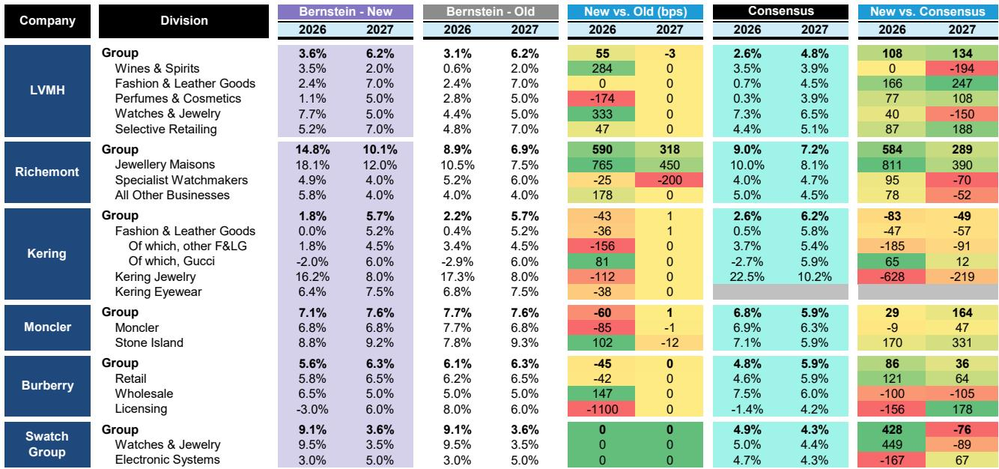
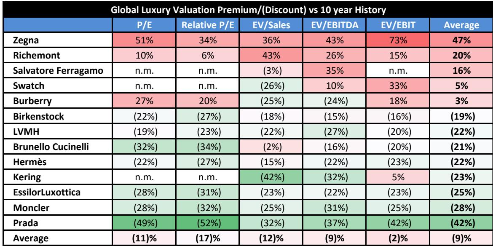
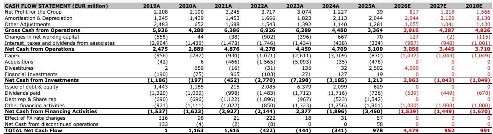

# Kering's Turnaround Is Working Because It Chose Price Realism Over Brand Ambition

After 12 consecutive quarters of negative performance, Gucci posted its first quarter of growth in 2Q26. That single data point would be noteworthy on its own. What makes it strategically significant is *how* it happened. Gucci did not return to growth through a sudden burst of creative genius, a viral marketing campaign, or a macroeconomic tailwind. It returned to growth because management made a deliberate, controversial, and analytically sound decision: it cut prices on key products and accepted that the brand would move down-market to meet customers, rather than attempting to pull customers upward through aspirational pricing.

This is not the standard luxury playbook. For decades, the dominant strategy in high-end fashion has been to raise prices, restrict supply, and elevate brand positioning to capture the most affluent consumers. Kering's experience now challenges that orthodoxy. The company's 1H26 results, detailed in a recent investor call, reveal a turnaround that is moving in the right direction, but one that rests on a fragile foundation: price elasticity, not brand desirability, is driving the early recovery. The question for observers is whether this strategy can generate sustainable momentum or whether it risks trapping Gucci in a lower-tier positioning from which it cannot easily escape.

The implications extend beyond Kering. If Gucci's price cuts can unlock exponential volume growth, as management described on the call, then the entire accessible luxury segment may need to reconsider its pricing architecture. The "luxury orphans" that Kering's CEO Luca De Meo referenced on the call—consumers who desire luxury goods but have been priced out of the top tier—represent a large, underserved demographic. The company that learns to serve them profitably could reshape the competitive landscape.

## Gucci's Return to Growth Was Driven by Price Cuts, Not Creative Rebirth, and That Changes the Risk Profile

The most important revelation from Kering's 1H26 conference call was management's explicit acknowledgment that price changes have had a "large, exponential" impact on volumes. This is a direct reference to the decision to lower prices on the Mercato Tote bag, among other products. The language is precise: exponential. It suggests that demand is far more sensitive to price than the industry historically assumed, at least at Gucci's current positioning.

This creates a strategic tension that observers must understand. On one hand, the price cuts worked. Gucci's leather goods returned to growth, driven by successful launches including the Borsetto and Paparazzo lines. North American spending was strong, and retail trends improved across all regions. The company reported that full-price growth was robust, and the recovery was not driven by off-price sales. Management explicitly stated that the 2Q performance was not a result of outlet channel dumping.

On the other hand, the recovery is geographically uneven. Brand equity remains strong in North America, which helped drive positive traction on newness. But where brand equity is weaker or eroded—specifically in China—the results have been more subdued. Management acknowledged that the turnaround in China will take more time. This asymmetry matters. It suggests that price cuts can revive demand in markets where the brand is still healthy, but they cannot repair damaged brand equity in markets where trust has been lost.

The implication for observers is that Gucci's recovery is not yet self-sustaining. It depends on a continued flow of competitively priced newness, which will arrive with the Primavera collection in late July and the Cruise collection in 4Q26. If those collections fail to resonate, the price-driven volume gains could reverse. Management emphasized that the recovery will not be linear, pointing specifically to a tougher comparable base in 3Q26, which currently looks flattish on a group basis. This is not a smooth upward trajectory. It is a volatile, collection-by-collection grind.

## The Store Closure Program Is the Most Underappreciated Driver of Margin Improvement

Kering closed 84 net stores in 1H26, compared to its full-year plan to close more than 100. The company originally planned to close around 100 stores in 2027, 50 in 2028, and 30 in 2029. It is now running well ahead of that schedule. This is not a minor operational adjustment. It is a structural transformation of the retail network that directly supports the margin improvement management has guided for.

The logic is straightforward. Underperforming stores generate low revenue per square foot, consume fixed costs, and drag on brand perception. Closing them eliminates the fixed cost burden without sacrificing meaningful revenue. Management reported that operating expenses fell by 3% on a constant currency basis, with the reduction driven mainly by fixed costs. They now expect a full-year reduction in OPEX, having previously guided to flat OPEX. This is a material upgrade to the cost outlook.

The impact on margins is already visible. Kering's group EBIT margin is now forecast at 12.8% for FY26, up from the previous estimate of 12.0%. Gucci's EBIT margin is expected to reach 18.0%, up from 17.3%. These improvements come despite revenue that is essentially flat year-over-year. The company is squeezing more profit from a smaller, more efficient network.

But there is a limit to how much this strategy can deliver. Store closures are a one-time efficiency gain, not a recurring source of margin expansion. Once the network is clean, further margin improvement must come from revenue growth and operating leverage. Management reiterated guidance for a sequential improvement in 2H margins, despite historical seasonality, which suggests they see further cost opportunities in the second half. Beyond that, the margin story depends on Gucci's ability to sustain its revenue recovery. If the top line falters, the margin gains from store closures will be exhausted, and the company will have no further buffer.

## Jewellery and Eyewear Are Becoming the Structural Growth Anchors That Offset Gucci's Volatility

While all attention is on Gucci's turnaround, Kering's other divisions are quietly delivering strong, consistent performance. Kering Jewellery is booming, with Boucheron showing exceptional growth in Japan and APAC, Pomellato growing strongly in Japan and North America, and Qeelin delivering strong APAC growth, particularly in South Korea. Kering Eyewear remains strong, with growth coming from Cartier, Bottega Veneta, Maui Jim, Lindberg, and the Valentino eyewear launch.

These divisions matter for two reasons. First, they provide revenue diversification. Jewellery and Eyewear are growing at rates that far exceed the Fashion and Leather Goods division. The OSG breakdown shows Kering Jewellery growing at 16.2% in FY26, compared to 0.0% for Fashion and Leather Goods. Eyewear is growing at 6.4%. These businesses are not subject to the same brand volatility as Gucci, and they serve different customer segments with different purchase cycles.

Second, they are becoming margin contributors. Kering Eyewear's EBIT margin is now forecast at 20.9% for FY26, up from 16.1% previously. That is a 480-basis-point improvement driven by operating leverage and cost efficiencies. Jewellery margins are also improving, from 4.5% to 6.6%. While these margins are still below Gucci's 18.0%, the trajectory is positive, and the growth rates are higher.

The strategic implication is that Kering is becoming a more balanced portfolio. If Gucci stumbles again, the company will not be as exposed as it was in 2024. The Jewellery and Eyewear divisions can absorb some of the shock. This is a meaningful structural improvement that reduces the risk profile of the company. It also supports the argument for a higher valuation multiple, which is exactly what the analyst did by raising the target relative P/E from 1.7x to 1.8x, equivalent to a 23x NTM+1 P/E.

## A Decision Framework for Observers: Four Conditions That Must Hold for the Turnaround to Succeed

The evidence from the 1H26 call is encouraging but incomplete. Observers need a clear framework to assess whether the turnaround is on track or at risk of stalling. Based on the data and management commentary, four conditions must hold for the recovery to be sustainable.

First, the price-volume trade-off must remain favorable. Management described the impact of price changes as "exponential," which implies that each percentage point of price reduction generates more than one percentage point of volume increase. This is a highly favorable elasticity. But it is not guaranteed to persist. As Gucci cuts prices, it risks training customers to wait for discounts, which would destroy the full-price business. The fact that management emphasized full-price growth in 2Q is reassuring, but this dynamic must be monitored quarter by quarter.

Second, new collections must sustain momentum. The Primavera collection, which is the first fully developed collection under creative director Demna, is rolling out in late July. The Cruise collection arrives in 4Q26. These are not incremental product updates. They are the first major tests of the new creative direction. If they fail, the recovery will stall. Management's confidence that 4Q26 will be strong is based on these collections, not on underlying demand trends.

Third, the Chinese market must stabilize. Chinese spending remained negative in 1H26, though it improved sequentially. Management acknowledged that the turnaround in China will take more time. This is the single biggest risk to the recovery. China is the largest luxury market in the world, and Gucci's brand equity there is weaker than in North America. If Chinese consumers do not respond to the new collections and price positioning, the recovery will be capped.

Fourth, the cost efficiency program must not damage the brand. Management stated that A&P spending will remain around 9% of revenues, and brand investment will not be sacrificed. This is the right decision. But as the company closes stores and reduces fixed costs, it must ensure that the remaining network is adequately staffed, merchandised, and marketed. A leaner network is only better if it is also more effective.

If all four conditions hold, the analyst's forecast of -2.0% Gucci retail comp growth in FY26, improving to +6.0% in FY27, is achievable. If any one condition fails, the recovery could stall, and the current valuation of 23x forward P/E would be difficult to justify.

## The "Luxury Orphans" Thesis Is Real, but It Requires a Different Kind of Brand Management

De Meo's reference to "luxury orphans" is the most strategically provocative idea from the call. He is describing consumers who want luxury goods but have been priced out of the market by years of aggressive price increases across the industry. These consumers are not looking for the highest-status items. They are looking for well-made, desirable products at prices that feel reasonable relative to the value received.

Serving this segment is not the same as serving the ultra-wealthy. It requires a different product architecture, a different pricing strategy, and a different retail experience. Gucci's willingness to reposition some products downward, as evidenced by the Mercato Tote price cut, is a direct acknowledgment of this reality. The company is actively looking at various ways to reposition itself, with new collections competitively priced.

This strategy carries reputational risk. Luxury brands that chase volume risk diluting their exclusivity. But there is a counterargument: if the brand can generate genuine desirability through faster brand momentum, then lower prices do not necessarily mean lower status. The key is that the products must feel like they belong at the new price point. They cannot feel like discounted leftovers.

The early evidence is mixed. Gucci's leather goods returned to growth, and the Borsetto and Paparazzo launches were successful. But the recovery in China remains subdued, suggesting that price cuts alone are not enough to rebuild brand equity in a market where trust has been damaged. The "luxury orphans" thesis may work well in North America, where the brand is still healthy, but it may be insufficient in China, where the brand needs a deeper repositioning.

For observers, the implication is that Kering's turnaround is real but fragile. The company has stabilized revenue, improved margins, and demonstrated that price elasticity can work in its favor. But the recovery depends on a continued flow of successful new collections, a stabilization in China, and a disciplined cost program that does not damage the brand. If all of these come together, the company's current valuation of 23x forward P/E could prove reasonable. If any element falters, the downside risk is significant.

*For informational purposes only. Portions may be generated, translated, summarized, or edited with AI assistance based on source materials and may contain omissions or errors. Please verify independently. This is not professional advice.*

For informational purposes only. Portions may be generated, translated, summarized, or edited with AI assistance based on source materials and may contain omissions or errors. Please verify independently. This is not professional advice.

