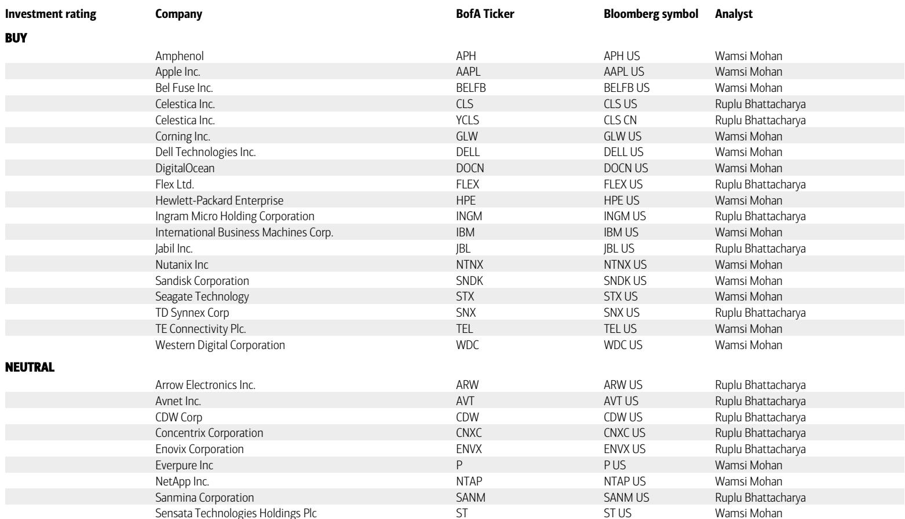
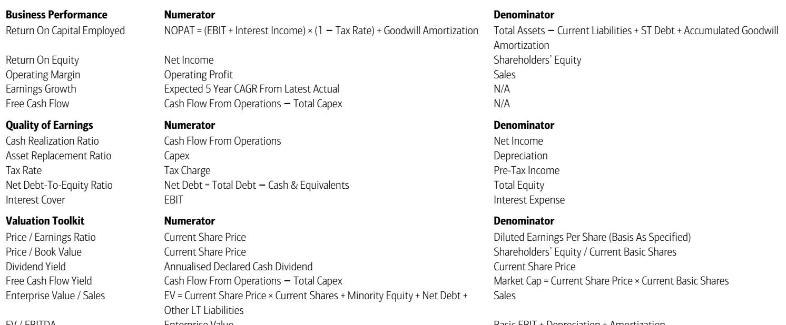
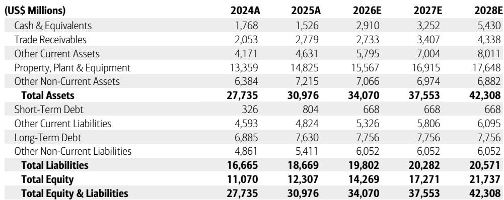

# Corning's AI Optical Boom Is Real, but the Market Is Pricing It as If the Build-Out Has No End

Corning's fiscal second quarter delivered a clear signal: enterprise optical revenue surged 65% year-over-year, with generative AI contributions nearly doubling from the prior year. The company's optical capacity is running at levels that exceed what its factories can supply. Yet the stock fell after the print. The reason is not that the AI thesis is broken. It is that the market had already priced the stock at more than 60 times forward earnings -- nearly three times its five-year median multiple of 22 times -- and the third-quarter revenue guide of $4.9 billion to $5.0 billion came in slightly below consensus. When a stock trades at a valuation that assumes perfection, a guide that is merely good rather than spectacular becomes a disappointment.

The tension in Corning today is between a structurally powerful multi-year growth story and a valuation that leaves no room for even modest execution hiccups. Enterprise optical demand is real, accelerating, and capacity-constrained. Margins are expanding. Solar revenue grew 90% year-over-year. But the carrier business is soft, capital expenditure is stepping up meaningfully in the second half, and the timing of next-generation optical technologies such as scale-up and co-packaged optics remains uncertain. The bull case hinges on whether Corning can sustain its premium multiple long enough for earnings to catch up. The bear case is that the multiple itself is the risk.

The correct framing for observers is not whether Corning is a good company. It is whether the current price adequately compensates for the risks embedded in a build-out cycle that, by its nature, will not last forever.

## Enterprise Optical Revenue Is Growing Faster Than Capacity, but That Creates a Different Kind of Risk

The headline number from the quarter was enterprise optical revenue growth of 65% year-over-year, with Gen AI contributions nearly doubling. Management commentary indicated that demand is exceeding available capacity, and the company is seeing accelerating adoption of high-density connectorized content. This is not a demand story that requires interpretation. It is a demand story that is straining physical limits.

The nuance that matters for observers is that enterprise revenue today reflects only scale-out demand -- the initial wave of fiber and connectivity deployment in data centers. The next phases, scale-up and co-packaged optics, represent additional revenue pools that have not yet materialized in the numbers. Management continues to expect upside from these later stages, but the timing remains uncertain. The report explicitly notes that scale-up and CPO timing is "uncertain." That is a material caveat for a stock trading at the valuation multiples Corning commands.

There is a second structural risk embedded in the enterprise optical growth story. The report states that enterprise optical growth is increasingly tied to long-term agreements. LTAs provide revenue visibility and volume commitments, which are positive for planning. But they also limit upside if pricing accelerates in a tight market. If Corning locks in prices today under LTAs and the spot market for optical components tightens further, the company will capture less of the upside than a pure spot-market exposure would deliver. The LTAs are an insurance policy for hyperscalers, not for Corning's margin expansion.

The implication is clear: enterprise optical is the strongest near-term driver, but its contribution to earnings per share may be more linear than the stock's multiple suggests.

## Margins Are Expanding on Mix and Pricing, but the Capital Expenditure Cycle Is a Near-Term Headwind

Operating margins grew 184 basis points year-over-year and 70 basis points sequentially. The report attributes this to higher-margin fiber content and a slight benefit from pricing. The margin trajectory is consistent with a company that is selling more value-added products into a capacity-constrained market. That is the good news.

The less visible dynamic is what margins will look like as the capital expenditure cycle accelerates. The report indicates that capex is stepping up materially in the second half to $2 billion for fiscal 2026, up from a prior estimate of $1.7 billion. That increase reflects capacity expansions to meet the very demand that is driving revenue. But capacity expansions carry a lag. The cash outflow happens now; the revenue benefit comes later. Free cash flow in 2027 is forecast to decline to $1.68 billion from $2.21 billion in 2026, before rebounding to $3.41 billion in 2028. That is a 24% decline in free cash flow in the middle of a supposed growth super-cycle.

For a company trading at nearly 30 times EV/EBITDA on trailing numbers, a free cash flow dip in the near term is a vulnerability. The market will tolerate a cash flow trough if it believes the subsequent recovery is large and certain. But the recovery depends on timing assumptions around scale-up and CPO adoption that management itself describes as uncertain.

## The Carrier Business and Glass Innovations Are Structural Offsets That Limit the Upside Case

Not every segment is participating in the AI-driven growth story. Carrier revenue was soft in the second quarter, reflecting pull-ins that occurred in the first quarter. The carrier business is cyclical and tied to telecom capital spending, which has been uneven across regions. There is no catalyst in the near-term outlook to suggest a meaningful carrier recovery.

Glass Innovations, which includes the company's specialty glass business and the Gorilla Glass franchise, is also facing headwinds. The report notes that Glass Innovations will see "continued muted growth" in the second half due to the overall hand-held industry environment. Even the launch of a foldable device from a major OEM in the third quarter is not expected to change the trajectory. The handset market is mature, replacement cycles are lengthening, and Corning's glass content gains are incremental rather than transformative.

These segments are not existential threats to the company. They are diversifications that reduce single-point-of-failure risk. But they are also anchors on the growth rate. When the enterprise optical business is growing at 65% year-over-year, the overall company revenue growth is still only 17% at the high end of the third-quarter guide. The non-optical segments dilute the headline number, and they do so at a time when the stock's valuation is predicated on optical carrying the entire load.

## A Decision Framework for Observers: Three Scenarios and What Each Implies for Entry and Exit

The analyst's calendar 2028 earnings per share estimate of $6.46 is itself an analytical signal. The analyst did not cut earnings estimates meaningfully -- the 2028 EPS estimate moved from $6.50 to $6.46. The concern is around the sustainability of data center build-out. That is the key variable.

Observers should evaluate Corning through three scenarios.

Scenario one: the data center build-out continues at its current pace through 2028, scale-up and CPO adoption begin to contribute in 2027, and Corning executes on its capacity expansion without major cost overruns. In this case, the earnings trajectory to $6.46 per share is achievable, and a 31x multiple on those earnings may prove conservative. This is the bull case, and it implies the stock is undervalued at current levels.

Scenario two: the build-out pace moderates as hyperscalers digest their existing capacity, scale-up and CPO timelines slip by 12 to 18 months, and the carrier business remains flat. In this case, 2028 earnings may come in below $6.00, and the multiple may compress further as the market re-rates the sustainability of optical revenue growth. This scenario would put the stock at a lower valuation.

Scenario three: a cyclical downturn in data center capital spending occurs before the end of the decade, as has happened in every prior technology infrastructure cycle. In this case, the earnings decline would be sharp, and the multiple would collapse toward the five-year median of 22 times. This is the tail risk that the current valuation does not discount.

The decision framework is not about which scenario is most likely. It is about whether the current price offers adequate compensation for the range of outcomes. At 61 times trailing earnings, the stock is priced for scenario one. The margin of safety for scenario two or three is near zero.

## The Optical Super-Cycle Is Real, but the Stock's Multiple Already Reflects Full Certainty

Corning is executing well in its most important growth segment. Enterprise optical revenue is accelerating, margins are expanding, and the company is investing to meet demand that is exceeding current capacity. The multi-year thesis remains intact, and the report's perspective reflects that conviction.

But the valuation argument has shifted. The stock's premium multiple was justified when the AI optical story was emerging and the market was assigning a high uncertainty discount. Now that the revenue is visible and the growth rate is confirmed, the multiple should theoretically compress toward a more sustainable level. That is the key observation.

Observers who consider Corning at current levels are not betting on the company's execution. They are betting that the data center build-out will continue uninterrupted for years, that the carrier and glass businesses will not deteriorate further, and that the market will maintain a valuation premium that is historically unprecedented for this stock. That is a narrow path to outperformance, and it leaves no room for the normal frictions of a multi-year capital cycle.

The report's final substantive point is that confidence in the sustainability of the build-out declined. That is the most honest statement in the document. The optical super-cycle is real. The question is whether the market is mistaking a cyclical upswing for a permanent state.

*For informational purposes only. Portions may be generated, translated, summarized, or edited with AI assistance based on source materials and may contain omissions or errors. Please verify independently. This is not professional advice.*

For informational purposes only. Portions may be generated, translated, summarized, or edited with AI assistance based on source materials and may contain omissions or errors. Please verify independently. This is not professional advice.

