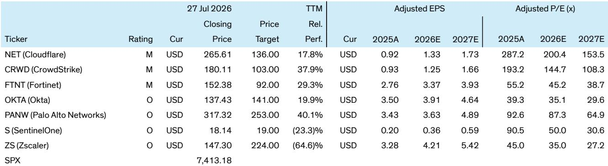

# Bernstein：美国中小盘软件与网络安全CISO交流会，预算趋势与AI影响

网络安全预算增速持续跑赢整体IT支出，但驱动因素已从合规与威胁响应转向AI。Bernstein近期举办了一场由三位来自保险、制造和医疗软件行业的CISO参与的闭门交流会，讨论内容显示，AI既是安全支出的最大催化剂，也正在迫使安全团队重新设计身份管理、运营模式和供应商策略。

这份讨论记录的核心信号是：安全负责人不再将AI视为一个新兴趋势，而是开始围绕“AI将定义未来威胁环境与技术环境”这一假设来重构安全项目。预算分配、身份边界、运营自动化和供应商整合，都在这一逻辑下被重新评估。

## 1. 身份成为新安全边界，非人类身份管理成为焦点

三位CISO一致认为，远程办公、AI代理和自主工作流已从根本上改变了访问管理需求。讨论焦点正从员工/客户账户转向独立AI代理的身份分配——如何为数据、系统和应用访问分配身份，并应用最小权限、时间受限的访问治理框架。

保险行业CISO表示，其组织约6000名员工中绝大多数远程办公，今年安全预算将增加12%至15%，主要投向AI相关领域。制造行业CISO则指出，50,000名员工分布在29个国家，在预算基本持平的环境下，必须优先研究内部数据分类、基于角色的访问控制和最小权限执行，以应对非人类身份的激增。

> **KC观察：** 非人类身份（如AI代理、自动化脚本、服务账户）的管理需求正在快速增长，但许多企业的身份治理框架仍以人为中心设计。这份讨论提醒读者，身份安全市场的发展逻辑可能从“保护员工登录”转向“管理机器与代理的权限生命周期”。

## 2. 安全运营正向自动化迁移，传统SIEM角色弱化

参与者一致认为，AI赋能的攻击者正在加速威胁节奏，人类速度的响应已不再足够。组织正在积极评估Agentic SOC平台和自主响应能力，以减少调查时间、提升韧性，并接近机器速度运行。

讨论显示，能够跨安全支柱（如端点、网络、云、身份）提供整合检测、威胁情报、编排和响应能力的“瑞士型”初创公司（如Torq、Tines）更受青睐。传统SIEM正变得越来越不具战略意义，相对于Agentic ITDR/SOC模型而言。

制造行业CISO特别提到，其组织正在评估能够跨多个安全支柱提供自动化编排的平台，因为单一支柱的自动化无法应对AI驱动的复杂攻击链。

## 3. 供应商整合发生在关键支柱层面，而非端到端

预算有限环境下，CISO正在评估遗留平台、重新审视现有安全堆栈，并倾向于从现有供应商处添加功能，因为附加模块通常比引入全新独立产品更具成本效益。

但整合并非端到端。参与者普遍倾向于在“核心支柱”（如身份、端点、网络、Web安全、云安全和邮件）内保留专门领导者。CrowdStrike、Wiz、Palo Alto和Okta因创新而频繁受到关注，而一些在AI和现代身份需求方面进化较慢的供应商则引发讨论。

医疗软件行业CISO指出，其组织正在评估是否将端点安全从现有供应商迁移到更专注于AI检测的平台，因为传统端点方案在应对AI生成的恶意软件时表现需要提升。

## 4. AI治理成为新的研究热点，但重点在护栏而非限制

组织正在努力平衡AI采用与控制可见性。安全负责人报告称，员工在多个LLM上的实验急剧增加，引发了对数据输入模型、代理可访问的系统、可执行的操作以及如何监控和审计这些操作的关注。

研究方向是AI治理——通过集中式AI路由器或端点、网络和数据层控制，提供对提示词、代理行为、数据访问和潜在风险的可见性。讨论较少涉及限制AI使用，更多是关于建立数据保护、访问权限和代理自主性的护栏。

保险行业CISO表示，其组织正在评估多个AI治理平台，以了解员工如何使用不同LLM，并确保敏感数据不会通过提示词泄露。制造行业CISO则强调，数据分类是AI治理的前提，没有准确的数据标签，任何访问控制都是盲目的。

这份讨论记录的核心价值不在于提供具体的预算数字或供应商信息，而在于揭示了一个正在发生的结构性变化：网络安全战略的底层逻辑正在被AI重写。预算分配、身份管理、运营模式、供应商选择和风险管理，都将以AI为视角重新审视。对于关注网络安全市场的读者而言，理解这一变化的节奏和方向，可能比追踪季度收入数字更为重要。

For informational purposes only. Portions may be generated,translated,summarized,or edited with AI assistance based on source materials and may contain omissions or errors. Please verify independently. This is not investment,legal,tax,accounting,or other professional advice.

For informational purposes only. Portions may be generated,translated,summarized,or edited with AI assistance based on source materials and may contain omissions or errors. Please verify independently. This is not investment,legal,tax,accounting,or other professional advice.

