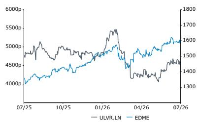

European Food
Unilever

Rating
Outperform

Price Target

ULVR.LN 5,800.00 GBp

UNA.NA 66.90 EUR

Callum Elliott, CFA, ACA
+44 20 7676 7183
callum.elliott@bernsteinsg.com

Victoria Nice, CFA
+44 20 7762 5862
victoria.nice@bernsteinsg.com

Henry Dennis
+44 20 7676 6776
henry.dennis@bernsteinsg.com

Simran Cheema
+44 20 7676 6705
simran.cheema@bernsteinsg.com

## Unilever (ULVR.LN) 1H/2Q26: Light at the end of the tunnel?

Unilever reported its 1H/2Q26 results this morning with a strong set of numbers. After a challenging eighteen months in the wake of the unexpected removal of former CEO Hein Schumacher, and the volatility induced by the spin-off of ice-cream and Foods sale, these much stronger than expected results seem likely to drive a significant uptick in positivity today, and perhaps even induce investors to look beyond the noise of the ongoing Foods sale process.

Q2 Organic sales growth at +5.8%, led by +5.5% volume growth. The group delivers a stark acceleration in volume and sales growth for the second quarter, up from +3.8% and +2.9% in Q1, respectively. This stark acceleration is dramatically ahead of consensus' forecasts, which had put OSG at 4.1%, and had foreseen a slowdown in volume growth for the quarter. We can't remember the last time one of our Staples coverage companies beat consensus volume estimates by 300+bps! Importantly, at a divisional level, the strength is driven by the HPC business that will remain in the wake of the Foods sale. "HPCCo" delivers an impressive +7.6% OSG, and beats on organic volume growth by over 400bps, with all HPC divisions much stronger than expected. By contrast, we expect that there will be some questions around performance of the Foods business, which is the only blot on the metaphorical copy book this quarter. On a regional basis, both developed and emerging markets see acceleration in the quarter, but India (+10%) and LatAm (+8.9%) are both notably strong, and North America sees a return to strong volume growth in the quarter following a couple of quarters of weakness. Margins are broadly in-line with expectations, leading to EBIT/EPS around 1% ahead of consensus.

Following the very strong Q2, FY Guidance is raised. Previously management had steered OSG to the bottom end of the long-term 4-6% range, with volume volumes at around 2%. Now volume growth guidance is raised to around 3%, and the emphasis on the low-end of the 4-6% range is removed. 2H growth is expected to be in the 4-5% range, and more skewed to pricing, which makes sense in the current cost environment we think.

On net, the big volume acceleration is exactly what Staples investors have been impatiently waiting for over the past two years, and whilst there may be some questions about its sustainability, we expect it to drive a positive share price reaction today.

<table><tr><td>Adjusted EPS</td><td>F25A</td><td>F26E</td><td>F27E</td></tr><tr><td>ULVR.LN (EUR)</td><td>3.08</td><td>3.23</td><td>3.45</td></tr><tr><td>UNA.NA (EUR)</td><td>3.08</td><td>3.23</td><td>3.45</td></tr></table>

Source: Bloomberg, Bernstein estimates and analysis.

<table><tr><td>Close Date</td><td></td><td></td><td colspan="2">27 Jul 2026</td></tr><tr><td>ULVR.LN Close Price (GBp)</td><td></td><td></td><td colspan="2">4,627.00</td></tr><tr><td>Price Target (GBp)</td><td></td><td></td><td colspan="2">5,800.00</td></tr><tr><td>Upside/(Downside)</td><td></td><td></td><td colspan="2">25%</td></tr><tr><td>52-Week Range</td><td></td><td colspan="3">5,525.00/4,068.00</td></tr><tr><td>EDME</td><td></td><td></td><td colspan="2">--</td></tr><tr><td>FYE</td><td></td><td></td><td colspan="2">Dec</td></tr><tr><td>Div Yield</td><td></td><td></td><td colspan="2">3.5%</td></tr><tr><td>Market Cap (GBP) (M)</td><td></td><td></td><td colspan="2">99,678</td></tr><tr><td>EV (GBp) (M)</td><td></td><td></td><td colspan="2">141,785</td></tr><tr><td>Performance</td><td>YTD</td><td>1M</td><td>6M</td><td>12M</td></tr><tr><td>Absolute (%)</td><td>(4.8)</td><td>0.6</td><td>(4.9)</td><td>(3.4)</td></tr><tr><td>EDME (%)</td><td></td><td></td><td></td><td></td></tr><tr><td>Relative (%)</td><td></td><td></td><td></td><td></td></tr><tr><td colspan="5">Source: Bloomberg, Bernstein estimates and analysis.</td></tr></table>

Price Performance, 1YR

<table><tr><td>Valuation Metrics</td><td>25A</td><td>26E</td><td>27E</td></tr><tr><td>EV/EBITDA (x)</td><td>13.9</td><td>13.8</td><td>12.9</td></tr><tr><td>Adjusted P/E (x)</td><td>17.6</td><td>16.8</td><td>15.7</td></tr><tr><td>Div Yield (%)</td><td>3.4</td><td>3.6</td><td>3.8</td></tr></table>

## KEY NUMBERS:

Q2 Group organic growth of +5.8% came in +171bps ahead of consensus at +4.1%.

Q2 Group sales of EUR 13,046 million was +1.3% ahead of consensus at EUR 12,880 million.

EXHIBIT 1: ULVR Q2 sales summary versus consensus and Bernstein expectations

<table><tr><td>ULVR Q2 sales summary</td><td>2Q25</td><td>2Q26</td><td>YoY Δ</td><td>Consensus 2Q26</td><td>Δ</td><td>Bernstein 2Q26</td><td>Δ</td></tr><tr><td>Group (EUR m)</td><td>12,567</td><td>13,046</td><td>3.8%</td><td>12,880</td><td>1.3%</td><td>12,992</td><td>0.4%</td></tr><tr><td>Group (organic growth)</td><td>3.1%</td><td>5.8%</td><td>+270 bps</td><td>4.1%</td><td>+171 bps</td><td>4.3%</td><td>+153 bps</td></tr><tr><td>Price growth</td><td>2.1%</td><td>0.2%</td><td>-190 bps</td><td>1.7%</td><td>-148 bps</td><td>1.5%</td><td>-132 bps</td></tr><tr><td>Volume growth</td><td>1.1%</td><td>5.5%</td><td>+440 bps</td><td>2.4%</td><td>+310 bps</td><td>2.8%</td><td>+275 bps</td></tr><tr><td>Sales FX impact</td><td>-6.1%</td><td>-2.4%</td><td>+370 bps</td><td>-2.2%</td><td>-18 bps</td><td>-1.6%</td><td>-77 bps</td></tr><tr><td>Sales M&amp;A impact</td><td>-2.3%</td><td>0.6%</td><td>+290 bps</td><td>0.7%</td><td>-7 bps</td><td>0.8%</td><td>-20 bps</td></tr></table>

Prior year sales and growth stated ex. Ice Cream.  
Source: Company reports, Visible Alpha consensus, Bernstein analysis and estimates

EXHIBIT 2: Unilever H1 result summary vs consensus and Bernstein estimates

<table><tr><td>Unilever H1 result summary</td><td>2025 H1</td><td>2026 H1</td><td>YoY Δ</td><td>Consensus 1H26</td><td>Δ</td><td>Bernstein 1H26</td><td>Δ</td></tr><tr><td>Group Sales (€ m)</td><td>25,506</td><td>25,623</td><td>0.5%</td><td>25,475</td><td>0.6%</td><td>25,554</td><td>0.3%</td></tr><tr><td>Group Underl. Op. Profit (€ m)</td><td>5,148</td><td>5,193</td><td>0.9%</td><td>5,169</td><td>0.5%</td><td>5,148</td><td>0.9%</td></tr><tr><td>Group Underl. OPM (%)</td><td>20.2%</td><td>20.3%</td><td>8 bps</td><td>20.3%</td><td>-2 bps</td><td>20.1%</td><td>12 bps</td></tr><tr><td>Diluted Underlying EPS (€)</td><td>1.59</td><td>1.61</td><td>1.3%</td><td>1.59</td><td>1.3%</td><td>1.60</td><td>0.4%</td></tr></table>

PY sales and operating profit stated ex. Ice Cream. PY EPS as reported.
Source: Company reports, Visible Alpha consensus, Bernstein analysis and estimates

EXHIBIT 3: ULVR Q2 sales by product div. versus consensus and Bernstein expectations

<table><tr><td>ULVR Q2 sales by product div.</td><td>2Q25</td><td>2Q26</td><td>YoY Δ</td><td>Consensus 2Q26</td><td>Δ</td><td>Bernstein 2Q26</td><td>Δ</td></tr><tr><td>Group (EUR m)</td><td>12,567</td><td>13,046</td><td>3.8%</td><td>12,880</td><td>1.3%</td><td>12,992</td><td>0.4%</td></tr><tr><td>Beauty &amp; Wellbeing</td><td>3,219</td><td>3,403</td><td>5.7%</td><td>3,290</td><td>3.4%</td><td>3,377</td><td>0.8%</td></tr><tr><td>Personal Care</td><td>3,296</td><td>3,535</td><td>7.3%</td><td>3,492</td><td>1.2%</td><td>3,392</td><td>4.2%</td></tr><tr><td>Home Care</td><td>2,865</td><td>3,009</td><td>5.0%</td><td>2,938</td><td>2.4%</td><td>2,997</td><td>0.4%</td></tr><tr><td>Foods</td><td>3,187</td><td>3,099</td><td>-2.8%</td><td>3,159</td><td>-1.9%</td><td>3,227</td><td>-4.0%</td></tr><tr><td>Group (organic growth)</td><td>3.1%</td><td>5.8%</td><td>+270 bps</td><td>4.1%</td><td>+171 bps</td><td>4.3%</td><td>+153 bps</td></tr><tr><td>Beauty &amp; Wellbeing</td><td>3.4%</td><td>8.1%</td><td>+470 bps</td><td>4.6%</td><td>+353 bps</td><td>4.3%</td><td>+380 bps</td></tr><tr><td>Personal Care</td><td>4.5%</td><td>5.9%</td><td>+140 bps</td><td>4.9%</td><td>+103 bps</td><td>4.9%</td><td>+100 bps</td></tr><tr><td>Home Care</td><td>1.8%</td><td>9.1%</td><td>+730 bps</td><td>5.3%</td><td>+379 bps</td><td>5.5%</td><td>+360 bps</td></tr><tr><td>Foods</td><td>2.8%</td><td>0.2%</td><td>-260 bps</td><td>2.2%</td><td>-198 bps</td><td>2.5%</td><td>-230 bps</td></tr><tr><td>Group (Price Growth)</td><td>2.1%</td><td>0.2%</td><td>-190 bps</td><td>1.7%</td><td>-148 bps</td><td>1.5%</td><td>-132 bps</td></tr><tr><td>Beauty &amp; Wellbeing</td><td>2.4%</td><td>1.1%</td><td>-130 bps</td><td>1.7%</td><td>-62 bps</td><td>1.6%</td><td>-50 bps</td></tr><tr><td>Personal Care</td><td>4.3%</td><td>-0.9%</td><td>-520 bps</td><td>2.5%</td><td>-336 bps</td><td>2.4%</td><td>-330 bps</td></tr><tr><td>Home Care</td><td>0.4%</td><td>0.5%</td><td>+10 bps</td><td>1.5%</td><td>-105 bps</td><td>1.0%</td><td>-50 bps</td></tr><tr><td>Foods</td><td>1.0%</td><td>0.2%</td><td>-80 bps</td><td>1.1%</td><td>-93 bps</td><td>1.0%</td><td>-80 bps</td></tr><tr><td>Group (Volume Growth)</td><td>1.1%</td><td>5.5%</td><td>+440 bps</td><td>2.4%</td><td>+310 bps</td><td>2.8%</td><td>+275 bps</td></tr><tr><td>Beauty &amp; Wellbeing</td><td>1.0%</td><td>6.9%</td><td>+590 bps</td><td>2.8%</td><td>+409 bps</td><td>2.7%</td><td>+420 bps</td></tr><tr><td>Personal Care</td><td>0.2%</td><td>6.8%</td><td>+660 bps</td><td>2.4%</td><td>+442 bps</td><td>2.5%</td><td>+430 bps</td></tr><tr><td>Home Care</td><td>1.3%</td><td>8.6%</td><td>+730 bps</td><td>3.7%</td><td>+487 bps</td><td>4.5%</td><td>+410 bps</td></tr><tr><td>Foods</td><td>1.7%</td><td>-0.1%</td><td>-180 bps</td><td>1.0%</td><td>-113 bps</td><td>1.5%</td><td>-160 bps</td></tr></table>

Prior year sales and growth stated ex. Ice Cream.  
Source: Company reports, Visible Alpha consensus, Bernstein analysis and estimates

EXHIBIT 4: Unilever H1 results vs consensus and Bernstein estimates

<table><tr><td>Unilever H1 results</td><td>2025 H1</td><td>2026 H1</td><td>YoY Δ</td><td>Consensus 1H26</td><td>Δ</td><td>Bernstein 1H26</td><td>Δ</td></tr><tr><td>Group Sales (€ m)</td><td>25,506</td><td>25,623</td><td>0.5%</td><td>25,475</td><td>0.6%</td><td>25,554</td><td>0.3%</td></tr><tr><td>Beauty &amp; Wellbeing</td><td>6,489</td><td>6,509</td><td>0.3%</td><td>6,405</td><td>1.6%</td><td>6,480</td><td>0.4%</td></tr><tr><td>Personal Care</td><td>6,545</td><td>6,817</td><td>4.2%</td><td>6,775</td><td>0.6%</td><td>6,670</td><td>2.2%</td></tr><tr><td>Home Care</td><td>5,904</td><td>5,992</td><td>1.5%</td><td>5,919</td><td>1.2%</td><td>5,974</td><td>0.3%</td></tr><tr><td>Foods</td><td>6,568</td><td>6,305</td><td>-4.0%</td><td>6,376</td><td>-1.1%</td><td>6,431</td><td>-2.0%</td></tr><tr><td>Group Underl. Op. Profit (€ m)</td><td>5,148</td><td>5,193</td><td>0.9%</td><td>5,169</td><td>0.5%</td><td>5,148</td><td>0.9%</td></tr><tr><td>Beauty &amp; Wellbeing</td><td>1,256</td><td>1,269</td><td>1.0%</td><td>1,231</td><td>3.1%</td><td>1,251</td><td>1.5%</td></tr><tr><td>Personal Care</td><td>1,444</td><td>1,513</td><td>4.8%</td><td>1,518</td><td>-0.3%</td><td>1,467</td><td>3.1%</td></tr><tr><td>Home Care</td><td>915</td><td>944</td><td>3.2%</td><td>921</td><td>2.5%</td><td>938</td><td>0.7%</td></tr><tr><td>Foods</td><td>1,533</td><td>1,467</td><td>-4.3%</td><td>1,492</td><td>-1.7%</td><td>1,492</td><td>-1.7%</td></tr><tr><td>Group Underl. OPM (%)</td><td>20.2%</td><td>20.3%</td><td>8 bps</td><td>19.3%</td><td>93 bps</td><td>20.1%</td><td>12 bps</td></tr><tr><td>Beauty &amp; Wellbeing</td><td>19.4%</td><td>19.5%</td><td>14 bps</td><td>19.2%</td><td>26 bps</td><td>19.3%</td><td>20 bps</td></tr><tr><td>Personal Care</td><td>22.1%</td><td>22.2%</td><td>13 bps</td><td>22.3%</td><td>-14 bps</td><td>22.0%</td><td>19 bps</td></tr><tr><td>Home Care</td><td>15.5%</td><td>15.8%</td><td>26 bps</td><td>15.5%</td><td>22 bps</td><td>15.7%</td><td>6 bps</td></tr><tr><td>Foods</td><td>23.3%</td><td>23.3%</td><td>-7 bps</td><td>23.5%</td><td>-22 bps</td><td>23.2%</td><td>7 bps</td></tr></table>

PY sales and operating profit stated ex. Ice Cream.  
Source: Company reports, Visible Alpha consensus, Bernstein analysis and estimates

EXHIBIT 5: ULVR Q2 sales by region versus consensus

<table><tr><td>ULVR Q2 sales by region</td><td>2Q25</td><td>2Q26</td><td>YoY Δ</td><td>Consensus 2Q26</td><td>Δ</td><td>Bernstein 2Q26</td><td>Δ</td></tr><tr><td>Group (EUR m)</td><td>12,567</td><td>13,046</td><td>3.8%</td><td>12,880</td><td>1.3%</td><td></td><td></td></tr><tr><td>APA - Asia Pacific / Africa</td><td>5,531</td><td>5,694</td><td>2.9%</td><td>5,639</td><td>1.0%</td><td></td><td></td></tr><tr><td>Americas</td><td>4,680</td><td>5,067</td><td>8.3%</td><td>4,953</td><td>2.3%</td><td></td><td></td></tr><tr><td>Europe</td><td>2,356</td><td>2,285</td><td>-3.0%</td><td>2,369</td><td>-3.5%</td><td></td><td></td></tr><tr><td>Group (organic growth)</td><td>3.1%</td><td>5.8%</td><td>+270 bps</td><td>4.1%</td><td>+171 bps</td><td></td><td></td></tr><tr><td>APA - Asia Pacific / Africa</td><td>4.0%</td><td>8.8%</td><td>+480 bps</td><td>5.8%</td><td>+303 bps</td><td></td><td></td></tr><tr><td>Americas</td><td>2.8%</td><td>5.7%</td><td>+290 bps</td><td>5.1%</td><td>+64 bps</td><td></td><td></td></tr><tr><td>Europe</td><td>1.8%</td><td>-1.3%</td><td>-310 bps</td><td>0.4%</td><td>-174 bps</td><td></td><td></td></tr><tr><td>Group (Price Growth)</td><td>2.1%</td><td>0.2%</td><td>-190 bps</td><td>1.7%</td><td>-148 bps</td><td></td><td></td></tr><tr><td>APA - Asia Pacific / Africa</td><td>1.7%</td><td>1.5%</td><td>-20 bps</td><td>2.2%</td><td>-68 bps</td><td></td><td></td></tr><tr><td>Americas</td><td>3.5%</td><td>-0.5%</td><td>-400 bps</td><td>1.7%</td><td>-218 bps</td><td></td><td></td></tr><tr><td>Europe</td><td>-0.1%</td><td>-1.6%</td><td>-150 bps</td><td>0.9%</td><td>-251 bps</td><td></td><td></td></tr><tr><td>Group (Volume Growth)</td><td>1.1%</td><td>5.5%</td><td>+440 bps</td><td>2.4%</td><td>+310 bps</td><td></td><td></td></tr><tr><td>APA - Asia Pacific / Africa</td><td>2.2%</td><td>7.2%</td><td>+500 bps</td><td>3.6%</td><td>+364 bps</td><td></td><td></td></tr><tr><td>Americas</td><td>-0.7%</td><td>6.2%</td><td>+690 bps</td><td>3.3%</td><td>+286 bps</td><td></td><td></td></tr><tr><td>Europe</td><td>1.9%</td><td>0.3%</td><td>-160 bps</td><td>-0.5%</td><td>+77 bps</td><td></td><td></td></tr></table>

Prior year sales and growth stated ex. Ice Cream.  
Source: Company reports, Visible Alpha consensus, Bernstein analysis and estimates

## INVESTMENT IMPLICATIONS

We rate Unilever Outperform with a Price Target of GBp 5,800.00 / EUR 66.90.

## BERNSTEIN TICKER TABLE

<table><tr><td></td><td colspan="4">27 Jul 2026</td><td rowspan="2">TTMRel.</td><td colspan="4">Adjusted EPS</td><td colspan="3">EV/EBITDA (x)</td></tr><tr><td>Ticker</td><td>Rating</td><td>Cur</td><td>Closing Price</td><td>Price Target</td><td>Cur</td><td>2025A</td><td>2026E</td><td>2027E</td><td>2025A</td><td>2026E</td><td>2027E</td></tr><tr><td>ULVR.LN (Unilever)</td><td>O</td><td>GBp</td><td>4,627.00</td><td>5,800.00</td><td>(3.4)%</td><td>EUR</td><td>3.08</td><td>3.23</td><td>3.45</td><td>13.9</td><td>13.8</td><td>12.9</td></tr><tr><td>UNA.NA (Unilever)</td><td>O</td><td>EUR</td><td>54.10</td><td>66.90</td><td>(1.8)%</td><td>EUR</td><td>3.08</td><td>3.23</td><td>3.45</td><td>13.9</td><td>13.8</td><td>12.9</td></tr><tr><td>EDME</td><td></td><td></td><td>--</td><td></td><td></td><td></td><td></td><td></td><td></td><td></td><td></td><td></td></tr></table>

O - Outperform, M - Market-Perform, U - Underperform, NR - Not Rated, CS - Coverage Suspended  
Source: Bloomberg, Bernstein estimates and analysis.

## I. REQUIRED DISCLOSURES

References to "Bernstein" or the "Firm" in these disclosures relate to the following entities: Bernstein Institutional Services LLC (April 1, 2024 onwards), Bernstein & Co., LLC (pre April 1, 2024), Bernstein Autonomous LLP, BSG France S.A. (April 1, 2024 onwards), Bernstein (Hong Kong) Limited 盛博香港有限公司, Bernstein (Canada) Limited, Bernstein (India) Private Limited (SEBI registration no. INH000006378), Bernstein (Singapore) Private Limited, Bernstein Japan KK (サンフォード・C・バーンスタイン株式会社) and analysts employed by SG Africa Technologies & Services to produce Bernstein under a Global Services Agreement in place between Bernstein and SG.

Bernstein is part of a joint venture between SG (SG) and AllianceBernstein, L.P. (AB). Unless specifically noted otherwise, for purposes of these disclosures, references to Bernstein's “affiliates” relate to both SG and AB and their respective affiliates.

## VALUATION METHODOLOGY

## Unilever

We set a GBp 5,800 Price Target for the ULVR listing using an EV/EBITDA multiple of 12.8x against our forward NTM+1 EBITDA estimate of EUR 12,015, whilst also making adjustments for minority stakes in some its emerging market businesses.

We currency convert the GBP 58.00 to EUR 66.90 for the UNA listing.

## RISKS

## Unilever

Downside risk to our rating (or price target) include:

(1) Emerging market economies grow slower than expected

(2) No improvement in performance from new structure

(3) Exceptional/restructuring costs increase in size

(4) Competitiveness continues to worsen, or fails to improve

## RATINGS DEFINITIONS, BENCHMARKS AND DISTRIBUTION

## EQUITY RATINGS DEFINITIONS

## Bernstein brand

The Bernstein brand rates stocks based on forecasts of relative performance for the next 12 months versus the S&P 500 for stocks listed on the U.S. and Canadian exchanges, versus the Bloomberg Europe Developed Markets Large and Mid Cap Price Return Index EUR (EDME) for stocks listed on the European exchanges and emerging markets exchanges outside of the Asia Pacific region, versus the Bloomberg Japan Large and Mid Cap Price Return Index USD (JPL) for stocks listed on the Japanese exchanges, and versus the Bloomberg Asia ex-Japan Large and Mid Cap Price Return Index (ASIAX) for stocks listed on the Asian (ex-Japan) exchanges -unless otherwise specified.

The Bernstein brand has three categories of ratings:

\- Outperform: Stock will outpace the market index by more than 15 pp

• Market-Perform: Stock will perform in line with the market index to within +/-15 pp

• Underperform: Stock will trail the performance of the market index by more than 15 pp

Coverage Suspended: Coverage of a company under the Bernstein brand has been suspended. Ratings and price targets are suspended temporarily, are no longer current, and should therefore not be relied upon.

Not Rated: A rating assigned when the stock cannot be accurately valued, or the performance of the company accurately predicted, at the present time. The covering analyst may continue to publish research reports on the company to update investors

on events and developments.

Not Covered (NC) denotes companies that are not under coverage.

Bernstein brand stock ratings are based on a 12-month time horizon.

## Autonomous brand – common stocks

The Autonomous brand rates common stocks as indicated below. As our benchmarks we use the Bloomberg Europe 600 Financials Price Return Index (E600BK) and Bloomberg Europe Dev Mkt Financials Large and Mid Cap Price Ret Index EUR (EDMFI) index for developed European banks and Payments, the Bloomberg Europe 600 Insurance Price Return Index (E600IN) for European insurers, the S&P 500 and S&P Financials for US banks and Payments coverage, S5LIFE for US Insurance, the S&P Insurance Select Industry (SPSIINS) for US Non-Life Insurers coverage, the Bloomberg Emerging Markets Financials Large, Mid and Small Cap Price Return Index (EMLSF) for emerging market banks and insurers and Payments, and the Bloomberg Japan Financials Large & Mid Cap Price Return Index (JPFILM) for Japanese Financials. Ratings are stated relative to the sector (not the market).

The Autonomous brand has three categories of common stock ratings:

\- Outperform (OP): Stock will outpace the relevant index by more than 10 pp

\- Neutral (N): Stock will perform in line with the market index to within +/-10 pp

• Underperform (UP): Stock will trail the performance of the relevant index by more than 10 pp

Coverage Suspended: Coverage
