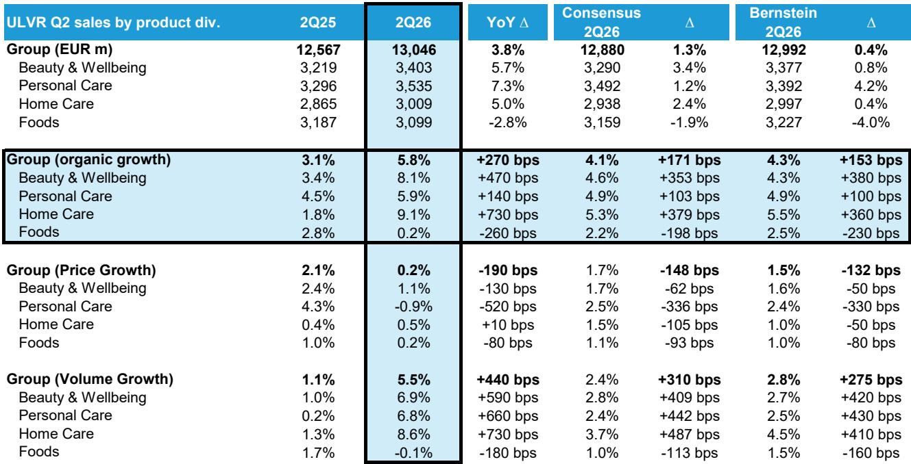
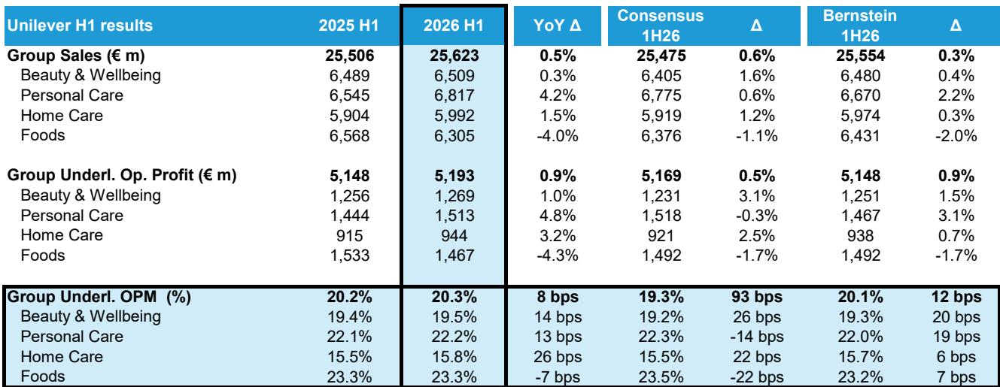
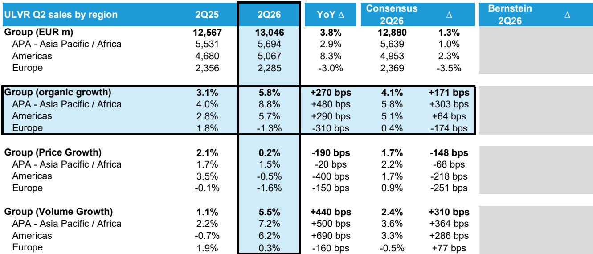

# Unilever’s Volume Breakout Proves the Turnaround Is Real—But the Foods Sale Will Define the Next Phase

Unilever just delivered what its long-suffering observers have been waiting for: a volume acceleration that dramatically exceeds expectations. In the second quarter of 2026, the company reported organic sales growth of 5.8%, powered by 5.5% volume growth—a performance that beat consensus by 171 basis points on the top line and by a staggering 310 basis points on volume. This is not a marginal beat. It represents the first genuine evidence that the strategic overhaul initiated under former CEO Hein Schumacher and continued by his successor is translating into operational traction. For a company that spent the past eighteen months navigating leadership upheaval, the ice cream demerger, and the ongoing sale of its Foods division, these numbers carry disproportionate weight. They signal that the core Home and Personal Care (HPC) business—the entity that will remain after the portfolio reshuffle—is gaining momentum when it matters most.

The timing is critical. Observer patience with consumer staples has been fraying as volume growth remained elusive across the sector. Unilever itself had guided toward the bottom end of its 4-6% long-term organic growth range, with volumes expected around 2%. The Q2 outcome shatters that cautious framing. Volume growth of 5.5% versus consensus expectations of 2.4% is the kind of divergence that forces a re-rating of the entire case. The question is no longer whether Unilever can stabilize its top line, but whether this momentum is durable and how the Foods divestiture will reshape the risk-return profile.

Equally important is what this means for the segments that will define Unilever's future. The HPC divisions—Beauty & Wellbeing, Personal Care, and Home Care—collectively delivered 7.6% organic sales growth, with volumes beating consensus by over 400 basis points. Every single HPC division outperformed expectations. This is not a story of one division carrying the load. It is broad-based operational improvement across the portfolio that will remain post-Foods. That breadth matters because it reduces the risk that the current quarter's strength is a one-off driven by inventory restocking, promotional timing, or a single category tailwind.

## The Volume Acceleration Is Unprecedented in Recent Staples History and Refutes the Narrative of Secular Stagnation

For context, beating consensus volume estimates by more than 300 basis points is virtually unheard of in the consumer staples coverage universe. Analysts who track these companies for a living explicitly expected a slowdown in volume growth from Q1's 1.1% to around 2.4% in Q2. Instead, volume growth accelerated to 5.5%. That is not a forecast error; it is a structural surprise. The last time a major staples company delivered a volume beat of this magnitude, it was accompanied by a fundamental shift in either market share trends or category dynamics.

What makes this beat particularly significant is that it occurred against a backdrop of near-zero price growth. Group pricing contributed only 0.2% to organic growth in Q2, down from 2.1% in the prior year period. This means the volume acceleration is not being purchased through aggressive discounting or price-driven promotion. The company grew volumes by 5.5% while effectively holding prices flat. In an inflationary environment where many competitors have relied on price increases to sustain revenue growth, Unilever's ability to generate volume-led growth suggests genuine improvement in brand equity, product innovation, or distribution effectiveness.

At a divisional level, the pattern is consistent. Beauty & Wellbeing posted 8.1% organic growth on 6.9% volume growth, beating consensus volume expectations by 409 basis points. Personal Care delivered 5.9% organic growth on 6.8% volume growth, a 442 basis point beat. Home Care achieved 9.1% organic growth on 8.6% volume growth, beating by 487 basis points. The only blemish is Foods, which posted 0.2% organic growth and negative volume growth of 0.1%, missing consensus by 198 basis points. That underperformance is consistent with the strategic rationale for selling the division, but it also underscores the importance of executing the divestiture cleanly.

## The Raised Guidance Removes the Floor Under the Stock but Raises the Bar for Second-Half Execution

Following the Q2 results, management raised full-year guidance in a meaningful way. Previously, the company had steered organic sales growth toward the bottom end of the 4-6% long-term range, with volume growth around 2%. The new guidance raises volume growth to approximately 3% and removes the emphasis on the low end of the 4-6% range. This is a de facto upgrade to the midpoint of the range, implying organic sales growth of roughly 5% for the full year.

The implied second-half trajectory is instructive. Management expects H2 growth to be in the 4-5% range, with a greater contribution from pricing. That makes sense given the current cost environment, where input cost pressures are re-emerging in certain categories. The shift toward pricing in the second half is not a negative signal; it reflects the natural lag between cost increases and shelf-price adjustments. What matters is that volume growth remains positive even as pricing re-enters the mix. If Unilever can sustain volume growth in the 2-3% range while adding 2% or more from pricing, the full-year outcome will comfortably exceed the original guidance.

The risk, however, is that the second half faces tougher comparables. The volume acceleration in Q2 was so dramatic that sustaining the absolute level of growth will require continued execution against a higher baseline. Observers should watch for any deceleration in volume trends as the year progresses, particularly in the Americas region, where North America returned to strong volume growth after several quarters of weakness. That recovery is encouraging, but its durability has not been tested against a full year of data.

## The HPC Business Is Now the Story, and Its Breadth Reduces Single-Point Dependency

The most strategically important insight from these results is that the HPC business is firing on all cylinders. With the Foods sale proceeding, the remaining entity will be a pure-play HPC company with exposure to Beauty & Wellbeing, Personal Care, and Home Care. The Q2 performance across these three divisions is remarkably consistent: all three beat consensus volume estimates by more than 400 basis points, and all three delivered organic growth above 5.9%.

This breadth is not accidental. It suggests that the operational improvements Unilever has been implementing—portfolio rationalization, brand reinvestment, supply chain optimization—are having a systemic effect rather than benefiting a single category. Beauty & Wellbeing, which includes premium skincare and health brands, has long been a growth driver. The surprise is Home Care, a category often viewed as commoditized and low-growth, delivering 9.1% organic growth on 8.6% volume growth. That performance challenges the assumption that volume growth in household cleaning products is structurally capped.

From a regional perspective, the strength is also broad. Emerging markets, particularly India at +10% and Latin America at +8.9%, are delivering outsized contributions. Developed markets are also improving, with North America returning to strong volume growth after several quarters of weakness. The only region that remains a drag is Europe, which posted negative organic growth of 1.3% in Q2. European weakness is consistent with broader macroeconomic headwinds in the region, but it also represents the largest opportunity for improvement if consumer confidence recovers.

## A Decision Framework for Evaluating Unilever Through the Foods Divestiture and Beyond

For observers trying to position themselves around the Foods sale and the post-divestiture entity, the Q2 results provide a clear decision framework. The framework rests on three pillars: the quality of the remaining HPC portfolio, the execution risk of the Foods divestiture, and the valuation entry point.

First, the quality of the HPC portfolio is now empirically validated. The volume acceleration across all three HPC divisions demonstrates that the core business has pricing power, brand equity, and operational momentum. Observers should compare the growth profile of the post-Foods Unilever to other pure-play HPC companies and assess whether the current valuation adequately reflects the improved trajectory. With adjusted P/E declining from 17.6x in FY25 to an estimated 15.7x in FY27, the stock is not pricing in sustained volume growth above 3%.

Second, the Foods divestiture execution is the primary risk. The Foods division underperformed in Q2, posting negative volume growth and missing consensus. A buyer acquiring this division will need to invest in revitalizing the portfolio, which could slow the deal timeline or reduce the sale price. Management's ability to execute a clean separation without operational disruption to the HPC business will be critical. Any delays or adverse financial terms could overshadow the HPC momentum.

Third, valuation matters. At 4,627 GBp, the stock trades at approximately 16.8x forward P/E and 13.8x EV/EBITDA, with a dividend yield of approximately 3.5%. The market must believe that the Q2 volume acceleration is sustainable rather than a one-quarter anomaly. The raised guidance supports that belief, but the second-half data will be the true test.

The framework is straightforward: if you believe the HPC momentum is structural and the Foods sale proceeds without major disruption, the risk-reward is favorable at current levels. If you see the volume beat as a temporary pull-forward of demand or worry that the Foods sale will distract management, the prudent stance is to wait for more data. The Q2 results tilt the scales toward the former view, but they do not eliminate the latter risk.

*For informational purposes only. Portions may be generated, translated, summarized, or edited with AI assistance based on source materials and may contain omissions or errors. Please verify independently. This is not professional advice.*

For informational purposes only. Portions may be generated, translated, summarized, or edited with AI assistance based on source materials and may contain omissions or errors. Please verify independently. This is not professional advice.

