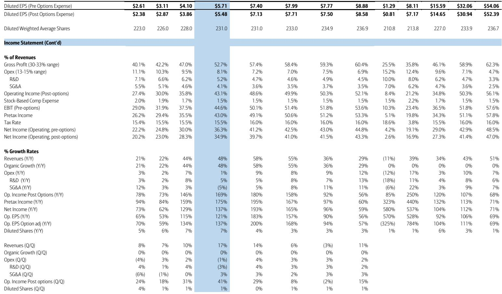
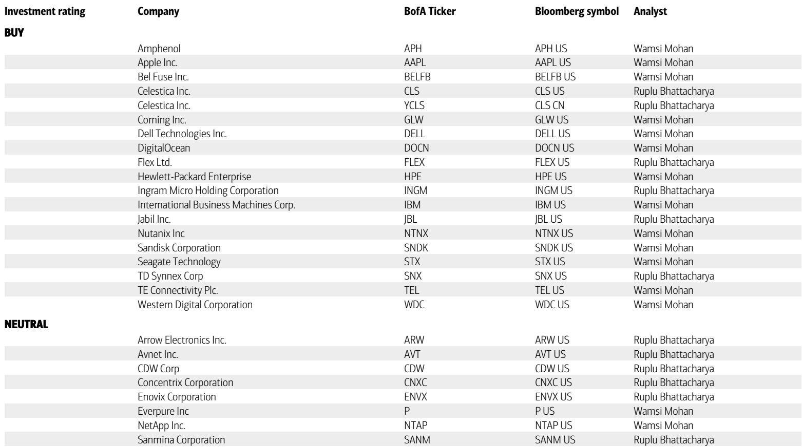
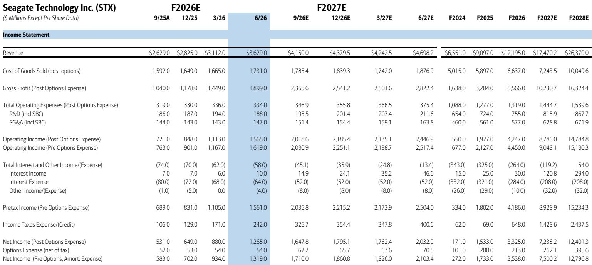

# Seagate’s Nearline Pricing Power Has Shifted from Cyclical to Structural, Driving a Margin Trajectory That the Market Still Underappreciates

Seagate Technology delivered a fiscal fourth-quarter 2026 gross margin of 52.7 percent, a full 250 basis points above consensus expectations, and guided the first quarter of fiscal 2027 to a midpoint gross margin of 57.3 percent. The sequential improvement of 460 basis points is not a one-time step function. It reflects a supply-demand regime that has fundamentally tightened, where incremental enterprise bytes available above contracted volumes are now commanding higher prices in a market that has structurally shifted from buyer-favorable to seller-favorable. The company's fiscal 2027 revenue guidance of $17.5 billion implies year-over-year growth exceeding 43 percent, accelerating from the 34 percent growth delivered in fiscal 2026.

The critical insight for observers is that Seagate's margin expansion is no longer primarily driven by the expiration of preferential introductory pricing for its first HAMR customer, which provides only a modest near-term benefit. The primary driver is a broader pricing environment where customers are competing for limited nearline supply, and that supply is already largely allocated through calendar 2028. When a company's build-to-order contracts extend through the end of fiscal 2027 and customers are extending planning horizons into calendar 2029, the traditional cyclicality of the hard disk drive industry has been replaced by a multi-year visibility that supports sustained pricing power.

The market has responded positively to the beat-and-raise quarter, but the magnitude of the structural shift in Seagate's earnings power remains underappreciated. A company that generated $8.11 in earnings per share in fiscal 2025 is now on a trajectory to deliver $32.06 in fiscal 2027, $54.06 in fiscal 2028, and $71.64 in fiscal 2029. The operating margin trajectory from 21.1 percent in fiscal 2025 to a projected 50.3 percent in fiscal 2027 and 57.5 percent by fiscal 2029 represents a transformation in the business model that warrants a re-evaluation of how the market should value this earnings stream.

## Nearline Supply Allocation Through Calendar 2028 Has Created a Pricing Floor That Exceeds Historical Norms

The most important data point from Seagate's earnings call is not the quarterly beat but the visibility statement. Management indicated that the vast majority of nearline enterprise bytes are now allocated into calendar 2028, and customers are extending their planning horizons into calendar 2029 and beyond. This is not a demand signal that can be quickly reversed. When hyperscale cloud customers commit to multi-year capacity planning, they are signaling that their internal data growth projections have become sufficiently large and certain to warrant locking in supply agreements years in advance.

The supply-demand gap has widened, and the incremental enterprise bytes available above contracted volumes are being sold at higher prices. This is a pricing mechanism that operates differently from the historical HDD cycle. In prior cycles, excess capacity would drive aggressive pricing competition among manufacturers. Today, the constraint is on the supply side. Seagate's ability to offer incremental bytes at premium prices above contracted volumes creates a pricing floor that is structurally higher than any point in the last decade.

The implication for observers is straightforward. Seagate's incremental gross margin on year-over-year revenue growth was 83.2 percent in the fiscal fourth quarter, and the first-quarter guidance implies incremental gross margin of approximately 88 percent. When a company can convert nearly 90 cents of every incremental revenue dollar into gross profit, the earnings leverage is extraordinary. This operating leverage is not a temporary phenomenon. It is the direct consequence of a supply-constrained market where the company holds pricing power over its customers.

## HAMR Adoption Is Accelerating Faster Than the Consensus Model Assumes, Driving a Product Mix Shift That Compresses the Cost Curve

HAMR technology represented approximately 40 percent of Seagate's nearline shipment run rate exiting fiscal 2026. The Mozaic 4+ platform contributed in the fiscal fourth quarter, is expected to contribute more in the fiscal first quarter, and will continue ramping through fiscal 2027. Management expects 50 percent of HAMR enterprise bytes to be on the Mozaic 4+ platform exiting calendar 2026, with Mozaic 5+ qualification shipments remaining on track for late calendar 2027.

This adoption trajectory matters because HAMR is not just a higher-capacity product. It is a higher-margin product. The transition from conventional perpendicular magnetic recording to HAMR allows Seagate to deliver drives with higher areal density, which means more terabytes per platter and lower cost per terabyte. As HAMR becomes a larger share of the nearline mix, the company benefits from both pricing power on the higher-capacity drives and cost reduction from the technology itself.

The Mozaic 4+ platform represents the next step in this evolution. When 50 percent of HAMR enterprise bytes are on this platform by the end of calendar 2026, the cost structure improves further because the platform delivers higher yields and lower manufacturing complexity relative to earlier HAMR generations. The Mozaic 5+ platform, expected to begin qualification shipments in late calendar 2027, will extend this cost curve further.

The strategic implication is that Seagate is not merely riding a demand cycle. It is executing a technology transition that structurally improves its margin profile with each successive platform generation. The operating margin projection of 57.5 percent by fiscal 2029 is built on the assumption that this technology transition continues on schedule and that customers continue to adopt higher-capacity drives at a premium price.

## The Revenue Trajectory from $12.2 Billion to $33.6 Billion in Three Years Reflects a Data Growth Cycle That Is Broadening Beyond Traditional Cloud Workloads

Seagate's revenue is projected to grow from $12.2 billion in fiscal 2026 to $17.5 billion in fiscal 2027, $26.4 billion in fiscal 2028, and $33.6 billion in fiscal 2029. This implies a compound annual growth rate of approximately 40 percent over the next three fiscal years. For a company that generated $9.1 billion in revenue just two years ago, this trajectory represents a tripling of revenue in four years.

The driver of this growth is not simply the recovery of enterprise IT spending. Management noted that data growth is broadening beyond traditional workloads. Inference applications and agentic applications are creating and retaining more unstructured data. The emergence of physical AI applications will further accelerate this trend. Each of these workload categories generates data that must be stored, and the vast majority of that data will reside on hard disk drives because the cost per terabyte of flash storage remains prohibitive for the scale of data involved.

The critical distinction for observers to understand is that this data growth is not linear. It compounds. Each new AI application generates data that becomes the training data for the next generation of models. Each inference request creates log data that must be retained for compliance, debugging, and model improvement. The result is a data creation cycle that accelerates with each successive wave of AI deployment.

Seagate's revenue projections assume that this cycle continues and that the company captures a disproportionate share of the resulting storage demand. The 50.9 percent revenue growth projected for fiscal 2028 is the most aggressive year in the forecast, which suggests that the compounding effect of AI-driven data growth will peak in that period. The deceleration to 27.5 percent growth in fiscal 2029 is not a sign of fading demand. It reflects the base effect of a company that will have nearly tripled its revenue in three years.

## A Decision Framework for Evaluating Seagate's Earnings Power and Valuation

The following framework translates the report's findings into a structured approach for assessing Seagate's case. The framework is built on three pillars: pricing visibility, technology transition, and demand durability.

The first pillar is pricing visibility. Observers should evaluate whether the supply-demand imbalance that supports Seagate's pricing power is likely to persist. The key indicators are customer contract duration, the percentage of nearline capacity allocated beyond the current fiscal year, and the pricing trajectory for incremental enterprise bytes. The report indicates that nearline supply is largely allocated through calendar 2028, which provides pricing visibility through at least the next two fiscal years. Observers should monitor whether this allocation window extends further or begins to contract, as that would signal a shift in the supply-demand balance.

The second pillar is technology transition. The HAMR adoption rate and the ramp of Mozaic 4+ and Mozaic 5+ platforms determine Seagate's cost trajectory. The key indicators are the percentage of nearline shipments on HAMR, the percentage of HAMR shipments on the latest platform generation, and the timeline for next-generation qualification shipments. The report shows HAMR at 40 percent of nearline shipments exiting fiscal 2026, with Mozaic 4+ ramping and Mozaic 5+ on track for late calendar 2027. Observers should track whether these milestones are met or accelerated, as faster adoption would compress the cost curve and expand margins.

The third pillar is demand durability. The breadth of data growth drivers determines whether the revenue trajectory is sustainable. The key indicators are the adoption rate of inference and agentic applications, the timeline for physical AI deployment, and the retention policies for unstructured data generated by these workloads. The report identifies these as broadening demand drivers beyond traditional cloud workloads. Observers should monitor hyperscale capital expenditure announcements and enterprise storage spending surveys to validate whether this broadening is occurring as projected.

Applying this framework to the current valuation, Seagate trades at 23.3 times fiscal 2027 earnings, 13.8 times fiscal 2028 earnings, and 10.4 times fiscal 2029 earnings. These multiples are not demanding for a company that is projected to grow earnings per share at a compound annual rate exceeding 70 percent over the next three years. The free cash flow yield of 3.4 percent in fiscal 2027, rising to 4.8 percent in fiscal 2028, and 7.1 percent in fiscal 2029, provides a cash return that supports the valuation case.

The risk to this framework is that the supply-demand imbalance reverses. If hyperscale customers reduce their capacity planning or if competing storage technologies achieve cost parity with HDDs, the pricing power that drives Seagate's margin expansion could erode. The report acknowledges that the supply-demand gap has widened, but it does not specify the conditions under which it would narrow. Observers should consider this limitation when assessing the durability of the pricing environment.

## The Free Cash Flow Trajectory Transforms Seagate from a Cyclical Play into a Capital Return Story

The most underappreciated aspect of Seagate's financial trajectory is the free cash flow generation. From $818 million in fiscal 2025, free cash flow is projected to grow to $3.1 billion in fiscal 2026, $5.7 billion in fiscal 2027, $8.1 billion in fiscal 2028, and $11.9 billion in fiscal 2029. This represents a compound annual growth rate of approximately 95 percent over four years.

The free cash flow conversion is driven by the same factors that drive margin expansion: pricing power, technology-driven cost reduction, and revenue growth that outpaces capital expenditure requirements. Capital expenditure is projected to grow from $265 million in fiscal 2025 to $1.7 billion in fiscal 2029, but this growth is outpaced by revenue growth that increases from $9.1 billion to $33.6 billion over the same period. The capital intensity of the business declines as revenue scales, which is a characteristic of a company that has already made the major capital investments required for its technology transition.

The balance sheet implications are significant. Seagate's net debt-to-equity ratio of 85.9 percent in fiscal 2026 is projected to turn negative by fiscal 2027, meaning the company will hold more cash than debt. By fiscal 2029, the net debt-to-equity ratio is projected at negative 56 percent, implying a net cash position of approximately $21.4 billion. A company that was carrying significant leverage just two years ago is on track to become a net cash company with substantial free cash flow generation.

For observers, this transformation means that Seagate's equity value is increasingly supported by cash returns rather than cyclical earnings. The free cash flow yield of 7.1 percent by fiscal 2029 provides a baseline return that is independent of the multiple that the market assigns to earnings. Even if the price-to-earnings multiple contracts as the company matures, the free cash flow generation provides a margin of safety that was absent in prior cycles when the company was capital-constrained and balance sheet-leveraged.

*For informational purposes only. Portions may be generated, translated, summarized, or edited with AI assistance based on source materials and may contain omissions or errors. Please verify independently. This is not professional advice.*

For informational purposes only. Portions may be generated, translated, summarized, or edited with AI assistance based on source materials and may contain omissions or errors. Please verify independently. This is not professional advice.

