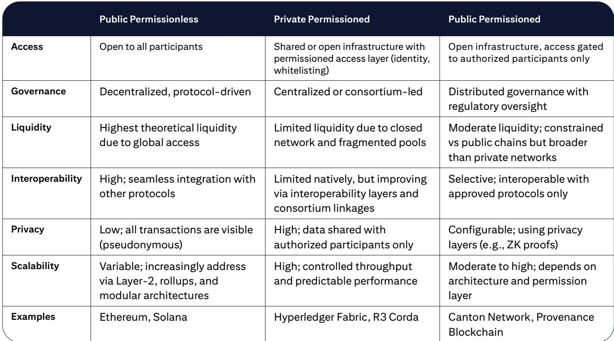
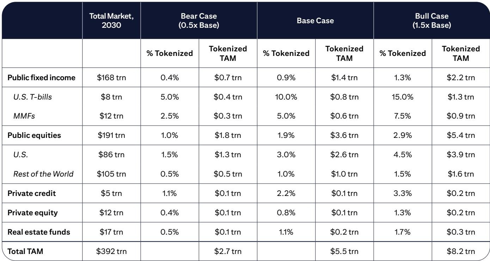
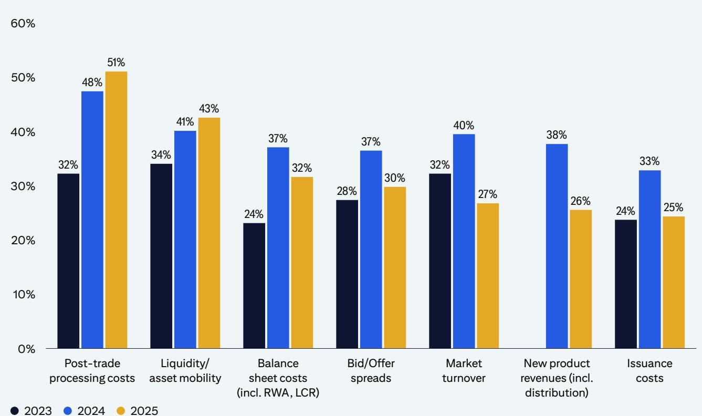

# Citi：代币化2030-华尔街链上化

Citi所在最新报告中提出，代币化资金资产正从试点阶段转向运营部署。当前全球代币化资产市场规模约为170亿美元，该机构基准情景下预计到2030年将增长至5.5万亿美元，乐观情景可达8.2万亿美元。增长主要由公开市场标的驱动，特别是美国公司和国债，而非此前市场普遍关注的私募市场。

推动这一转变的三股力量正在汇聚。首先，包括美国存管信托与清算公司、纽约标的交易所和纳斯达克在内的主要市场基础设施提供商，正在将代币化整合到核心发行、交易和结算流程中。其次，受监管的链上货币——包括稳定币（预计2030年达1.9万亿美元）和代币化存款——正在提供早期代币化尝试所缺乏的结算基础。第三，主要司法管辖区的监管清晰度正在改善。

但转型将是渐进的。报告认为，混合模式——代币化系统与遗留系统并行运行——将在短期内占据主导地位。这意味着在效率提升完全实现之前，运营复杂性会先增加。

## 1. 基础设施巨头入局，代币化从实验走向生产

报告识别出一个关键转折点：传统资金基础设施机构正在将代币化嵌入核心系统，而非建立并行的加密原生系统。DTCC于2025年底获得监管许可，计划从2026年底开始为期三年的代币化服务试点，覆盖公司、ETF和美国国债等高流动性工具。NYSE宣布计划在2026年底前推出代币化标的平台，支持美国上市公司和ETF的24x7交易与近乎实时的结算。纳斯达克已获得SEC批准，允许部分公司和ETF以代币化形式发行、交易和结算。

这些机构并非加密原生企业，而是最老牌、规模最大的机构。它们选择将代币化整合到现有市场结构中，优先保障法律确定性和读者保护，而非追求颠覆速度。

> **KC评论：** 报告将DTCC和NYSE的入局视为“临界点”，而非技术突破。关键区别在于：这些机构控制着现有市场的清算、结算和交易基础设施，它们的参与意味着代币化不再需要建立独立生态，而是可以嫁接在现有市场轨道上运行。

## 2. 链上货币补齐了代币化缺失的结算基础

早期代币化尝试未能规模化的一个关键制约因素，是缺乏受监管的链上现金。此前代币化资产仍需依赖传统法币渠道进行结算，效率提升有限。这一情况正在改变。

报告预计稳定币发行规模到2030年可达1.9万亿美元，同时主要银行正在开发代币化存款基础设施，其规模可能更大。稳定币与代币化存款的共存，为代币化标的提供了所需的结算流动性基础，支持原子化的“交付对付款”结算和连续市场运营。

值得注意的是，报告区分了不同地区的数字货币政策路径：在美国，链上货币将是稳定币与代币化存款的混合；在欧洲、印度和中国大陆，央行数字货币和代币化存款将是政策重点，而非稳定币。

## 3. 监管框架逐步清晰，但区域分化可能增加成本

美国SEC在2026年1月明确了联邦标的法对代币化标的的适用，确认技术中立原则——资产的数字包装不改变其监管属性。这一澄清使机构可以将代币化视为市场基础设施问题，而非监管实验。欧洲的MiCA法规已引入统一的加密资产框架，但行业反馈显示，欧盟DLT试点机制的范围和设计限制了其规模化代币化资本市场的有效性。

报告同时指出一个双重效应：监管清晰度提升支持规模化，但不同区域规则的差异可能碎片化市场、增加合规成本，部分抵消代币化承诺的效率提升。

## 4. 市场结构正在重塑，“结构性协调者”开始浮现

代币化可能催生新的收入池，通过可编程性、可组合性和垂直整合的业务模式实现。报告识别出一类正在浮现的机构——“结构性协调者”，即同时控制资产发行和结算轨道的机构，例如部分银行、资产管理公司和稳定币发行商。

传统交易后中介面临结构性不确定性，因为结算变得更快、更自动化。同时，在发行、交易、托管和身份验证等层面，新的市场参与者正在出现。报告认为，代币化的未来路径可能更多取决于监管协调、流动性协调和管理混合复杂性的能力，而非技术能力本身。

> **KC评论：** “结构性协调者”这个概念值得关注。它描述的是一种垂直整合模式——如果一家机构同时控制资产发行、交易平台和结算货币，它就能捕获交易生命周期中更大份额的价值。这与当前资本市场中发行、交易、清算、结算由不同机构分工的格局有本质区别。

For informational purposes only. Portions may be generated,translated,summarized,or edited with AI assistance based on source materials and may contain omissions or errors. Please verify independently. This is not investment,legal,tax,accounting,or other professional advice.

