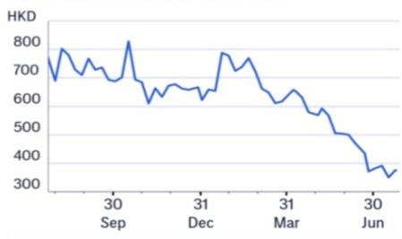
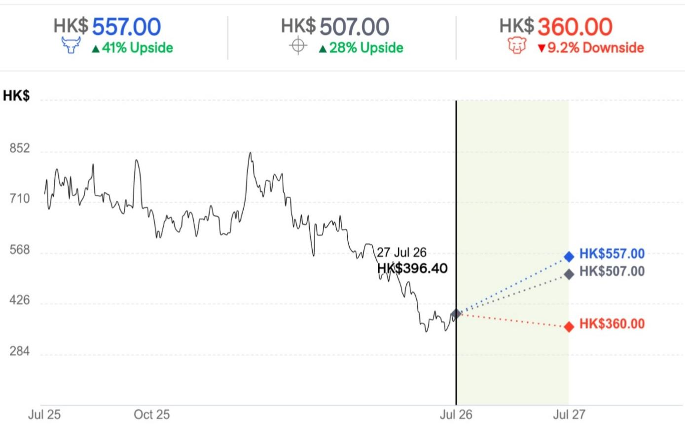
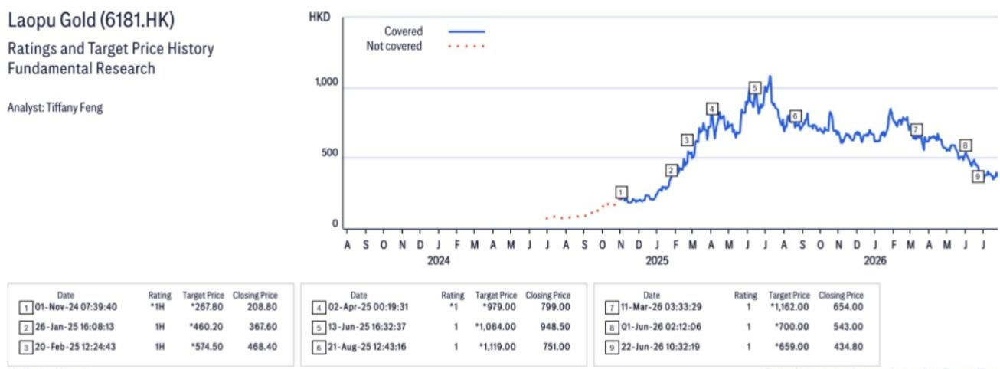
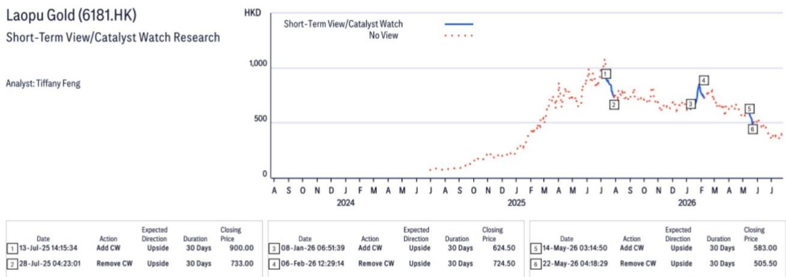

27 Jul 2026 12:18:25 ET | 14 pages

# Laopu Gold (6181.HK)

2Q26业绩低于预期

## Citi观点

老铺黄金2026年上半年初步业绩显示，第二季度净利润较Citi及市场预期低约30%。业绩低于预期主要来自营收和利润率两方面。基于对第二季度业绩进行季节性调整后，我们下调了2026-2028年净利润预测17-22%，主要反映了较弱的销售和利润率假设。我们预计市场共识预测也将出现显著下调，短期内公司报价可能面临调整。在预测调整后，我们认为SKP商场8月促销活动可能带来的销售环比改善，将成为重新评估公司价值的机会。维持报告评级，目标价下调至507港元。

第二季度业绩隐含情况——根据管理层信息，第一季度营收和净利润处于指引区间下限，分别为165亿元人民币和36亿元人民币，主要受3月份金价回调导致销售低于预期影响。这意味着第二季度营收在33亿至39.5亿元人民币之间。扣除超过4000万元人民币的股权激励费用（根据管理层信息，全部发生在第一季度），2026年上半年报告净利润预计为42.6亿至43.1亿元人民币。这意味着第二季度报告净利润为6.6亿至7.1亿元人民币，净利润率环比下降至18%-20%，而第一季度为21.8%。管理层表示，第二季度净利润率环比收缩是由于折扣产品销售额占比提高、折扣力度加大（包括金币赠送促销活动）、线上销售占比下降以及经营去杠杆化。截至2026年6月底，由于第二季度采购增加，库存较2025年12月有所上升，而2026年上半年经营现金流转为正值。

2026年下半年展望——管理层表示，第二和第三季度是黄金珠宝行业的传统淡季，而第一和第四季度是旺季，通常旺季销售额约为淡季的2倍（行业平均为1.5倍）。这种季节性意味着2026年下半年销售额可能达到第二季度水平的3倍。此外，管理层预计通过增加折扣和推出单价更低的新产品来提供更具吸引力的产品定价，以刺激销售。第二季度新产品仅为“试水”，鉴于客户反馈积极，计划在2026年下半年进行大规模产品发布。我们预计，由于这些新产品的推出，2026年下半年毛利率将低于第二季度的45%以上，这些新产品锚定43%的毛利率，并且高质量会员可享受额外5%的折扣，该折扣现在可以与门店促销活动叠加。尽管如此，我们预计更好的经营杠杆可能抵消2026年下半年相对于第二季度较低的毛利率。

盈利预测与估值——由于营收和利润率假设下调，我们将2026-2028年净利润预测下调17-22%，预计2026年/2027年（正常化盈利）/2028年净利润分别为64亿/51亿/59亿元人民币。目标价从659.0港元下调至507.0港元，基于不变的15倍2027年预期市盈率。以11.7倍2027年预期市盈率和6.4%的回报表现计算，估值对我们而言仍不算高。

## 盈利摘要

<table><tr><td>截至12月31日年度</td><td>净利润（百万元人民币）</td><td>摊薄每股收益（人民币）</td><td>每股收益增长率（%）</td><td>市盈率（倍）</td><td>市净率（倍）</td><td>净资产回报表现（%）</td><td>股息率（%）</td></tr><tr><td>2024A</td><td>1,502</td><td>9.655</td><td>253.4</td><td>35.5</td><td>14.7</td><td>55.3</td><td>1.9</td></tr><tr><td>2025A</td><td>5,029</td><td>29.285</td><td>203.3</td><td>11.7</td><td>5.4</td><td>67.0</td><td>6.3</td></tr><tr><td>2026E</td><td>6,455</td><td>36.596</td><td>25.0</td><td>9.4</td><td>4.4</td><td>52.0</td><td>8.0</td></tr><tr><td>2027E</td><td>5,200</td><td>29.480</td><td>-19.4</td><td>11.6</td><td>4.3</td><td>37.3</td><td>6.4</td></tr><tr><td>2028E</td><td>5,995</td><td>33.989</td><td>15.3</td><td>10.1</td><td>3.7</td><td>39.4</td><td>7.3</td></tr></table>

来源：数据中央

## 买入

短期观点：下行

价格（2026年7月27日16:10） 396.40港元

目标价 507.00港元↓

此前目标价 659.00港元

预期报价回报率 27.9%

预期股息率 7.8%

预期总回报率 35.7%

市值 70,062百万港元

Tiffany Feng $^{AC}$ +852-2501-2759
tiffany.feng@citi.com

Xiaopo Wei, CFA
+852-2501-2472
xiaopo.wei@citi.com

Brian Cho

+852-2501-2712

brian.cho@citi.com

<table><tr><td>利润表（百万元人民币）</td><td>2024</td><td>2025</td><td>2026E</td><td>2027E</td><td>2028E</td></tr><tr><td>营业收入</td><td>8,506</td><td>27,303</td><td>31,898</td><td>27,627</td><td>31,842</td></tr><tr><td>营业成本</td><td>-5,004</td><td>-17,029</td><td>-18,531</td><td>-15,939</td><td>-18,247</td></tr><tr><td>毛利润</td><td>3,501</td><td>10,274</td><td>13,367</td><td>11,688</td><td>13,594</td></tr><tr><td>毛利率（%）</td><td>41.2</td><td>37.6</td><td>41.9</td><td>42.3</td><td>42.7</td></tr><tr><td>EBITDA（调整后）</td><td>2,158</td><td>6,862</td><td>9,033</td><td>7,348</td><td>8,444</td></tr><tr><td>EBITDA利润率（调整后）（%）</td><td>25.4</td><td>25.1</td><td>28.3</td><td>26.6</td><td>26.5</td></tr><tr><td>折旧</td><td>-181</td><td>-339</td><td>-376</td><td>-385</td><td>-448</td></tr><tr><td>摊销</td><td>0</td><td>0</td><td>0</td><td>0</td><td>0</td></tr><tr><td>EBIT（调整后）</td><td>1,977</td><td>6,523</td><td>8,657</td><td>6,963</td><td>7,995</td></tr><tr><td>EBIT利润率（调整后）（%）</td><td>23.2</td><td>23.9</td><td>27.1</td><td>25.2</td><td>25.1</td></tr><tr><td>净利息收入/支出</td><td>-30</td><td>-139</td><td>-223</td><td>-224</td><td>-225</td></tr><tr><td>联营公司</td><td>0</td><td>0</td><td>0</td><td>0</td><td>0</td></tr><tr><td>非经营/特殊/其他调整</td><td>0</td><td>0</td><td>0</td><td>0</td><td>0</td></tr><tr><td>税前利润</td><td>1,947</td><td>6,384</td><td>8,434</td><td>6,739</td><td>7,770</td></tr><tr><td>所得税</td><td>-473</td><td>-1,516</td><td>-2,024</td><td>-1,617</td><td>-1,865</td></tr><tr><td>非常项目/少数股东权益/优先股股息</td><td>0</td><td>0</td><td>0</td><td>0</td><td>0</td></tr><tr><td>报告净利润</td><td>1,473</td><td>4,868</td><td>6,410</td><td>5,122</td><td>5,905</td></tr><tr><td>净利润率（%）</td><td>17.3</td><td>17.8</td><td>20.1</td><td>18.5</td><td>18.5</td></tr><tr><td>核心净利润</td><td>1,502</td><td>5,029</td><td>6,455</td><td>5,200</td><td>5,995</td></tr></table>

<table><tr><td colspan="6">价格：396.40港元；目标价：507.00港元；市值：70,062百万港元；评级：买入</td></tr><tr><td>估值比率</td><td>2024</td><td>2025</td><td>2026E</td><td>2027E</td><td>2028E</td></tr><tr><td>市盈率（倍）</td><td>35.5</td><td>11.7</td><td>9.4</td><td>11.6</td><td>10.1</td></tr><tr><td>市净率（倍）</td><td>14.7</td><td>5.4</td><td>4.4</td><td>4.3</td><td>3.7</td></tr><tr><td>企业价值/EBITDA（倍）</td><td>28.2</td><td>9.2</td><td>7.1</td><td>8.4</td><td>7.1</td></tr><tr><td>自由现金流回报表现（%）</td><td>-2.8</td><td>-12.4</td><td>9.5</td><td>12.4</td><td>7.8</td></tr><tr><td>股息率（%）</td><td>1.9</td><td>6.3</td><td>8.0</td><td>6.4</td><td>7.3</td></tr><tr><td>派息率（%）</td><td>66</td><td>74</td><td>74</td><td>74</td><td>74</td></tr><tr><td>净资产回报表现（%）</td><td>54.2</td><td>64.8</td><td>51.6</td><td>36.7</td><td>38.8</td></tr></table>

<table><tr><td>现金流量表（百万元人民币）</td><td>2024</td><td>2025</td><td>2026E</td><td>2027E</td><td>2028E</td></tr><tr><td>EBITDA</td><td>2,158</td><td>6,862</td><td>9,033</td><td>7,348</td><td>8,444</td></tr><tr><td>营运资本变动</td><td>-3,038</td><td>-12,552</td><td>-960</td><td>2,085</td><td>-1,560</td></tr><tr><td>其他</td><td>-349</td><td>-1,158</td><td>-1,926</td><td>-1,589</td><td>-1,726</td></tr><tr><td>经营活动现金流</td><td>-1,228</td><td>-6,848</td><td>6,147</td><td>7,845</td><td>5,157</td></tr><tr><td>资本支出</td><td>-71</td><td>-145</td><td>-151</td><td>-98</td><td>-107</td></tr><tr><td>净收购/处置</td><td>0</td><td>0</td><td>0</td><td>0</td><td>0</td></tr><tr><td>其他</td><td>0</td><td>0</td><td>0</td><td>0</td><td>0</td></tr><tr><td>投资活动现金流</td><td>-71</td><td>-145</td><td>-151</td><td>-98</td><td>-107</td></tr><tr><td>已支付股息</td><td>0</td><td>-1,096</td><td>-3,800</td><td>-4,808</td><td>-3,841</td></tr><tr><td>融资活动现金流</td><td>1,960</td><td>8,361</td><td>-4,308</td><td>-5,300</td><td>-4,378</td></tr><tr><td>现金净变动</td><td>663</td><td>1,335</td><td>1,688</td><td>2,447</td><td>672</td></tr><tr><td>股东自由现金流</td><td>-1,465</td><td>-7,261</td><td>5,711</td><td>7,478</td><td>4,738</td></tr></table>

<table><tr><td>每股数据</td><td>2024</td><td>2025</td><td>2026E</td><td>2027E</td><td>2028E</td></tr><tr><td>报告每股收益（人民币）</td><td>9.471</td><td>28.346</td><td>36.340</td><td>29.038</td><td>33.480</td></tr><tr><td>核心每股收益（人民币）</td><td>9.655</td><td>29.285</td><td>36.596</td><td>29.480</td><td>33.989</td></tr><tr><td>每股股息（人民币）</td><td>6.355</td><td>21.546</td><td>27.255</td><td>21.778</td><td>25.110</td></tr><tr><td>每股经营现金流（人民币）</td><td>-7.898</td><td>-39.877</td><td>34.851</td><td>44.476</td><td>29.237</td></tr><tr><td>每股自由现金流（人民币）</td><td>-9.417</td><td>-42.280</td><td>32.380</td><td>42.397</td><td>26.864</td></tr><tr><td>每股净资产（人民币）</td><td>23.284</td><td>62.902</td><td>77.952</td><td>80.176</td><td>92.387</td></tr><tr><td>加权平均普通股数量（百万）</td><td>156</td><td>172</td><td>176</td><td>176</td><td>176</td></tr><tr><td>加权平均摊薄股数（百万）</td><td>156</td><td>172</td><td>176</td><td>176</td><td>176</td></tr></table>

<table><tr><td>增长率</td><td>2024</td><td>2025</td><td>2026E</td><td>2027E</td><td>2028E</td></tr><tr><td>营业收入（%）</td><td>167.5</td><td>221.0</td><td>16.8</td><td>-13.4</td><td>15.3</td></tr><tr><td>EBIT（调整后）（%）</td><td>245.8</td><td>229.9</td><td>32.7</td><td>-19.6</td><td>14.8</td></tr><tr><td>核心净利润（%）</td><td>253.4</td><td>234.9</td><td>28.3</td><td>-19.4</td><td>15.3</td></tr><tr><td>核心每股收益（%）</td><td>253.4</td><td>203.3</td><td>25.0</td><td>-19.4</td><td>15.3</td></tr></table>

<table><tr><td>资产负债表（百万元人民币）</td><td>2024</td><td>2025</td><td>2026E</td><td>2027E</td><td>2028E</td></tr><tr><td>现金及现金等价物</td><td>733</td><td>2,068</td><td>3,606</td><td>6,053</td><td>6,725</td></tr><tr><td>应收账款</td><td>801</td><td>1,280</td><td>1,496</td><td>1,295</td><td>1,493</td></tr><tr><td>存货</td><td>4,088</td><td>16,044</td><td>17,125</td><td>14,927</td><td>16,598</td></tr><tr><td>固定资产及其他有形资产净额</td><td>198</td><td>304</td><td>370</td><td>350</td><td>326</td></tr><tr><td>商誉及无形资产</td><td>305</td><td>399</td><td>539</td><td>564</td><td>594</td></tr><tr><td>金融及其他资产</td><td>212</td><td>1,157</td><td>1,351</td><td>1,170</td><td>1,349</td></tr><tr><td>总资产</td><td>6,337</td><td>21,253</td><td>24,488</td><td>24,360</td><td>27,085</td></tr><tr><td>应付账款</td><td>228</td><td>636</td><td>743</td><td>643</td><td>742</td></tr><tr><td>短期借款</td><td>1,373</td><td>6,164</td><td>6,164</td><td>6,164</td><td>6,164</td></tr><tr><td>长期借款</td><td>0</td><td>0</td><td>0</td><td>0</td><td>0</td></tr><tr><td>准备及其他负债</td><td>815</td><td>3,257</td><td>3,881</td><td>3,461</td><td>3,933</td></tr><tr><td>总负债</td><td>2,416</td><td>10,057</td><td>10,788</td><td>10,268</td><td>10,839</td></tr><tr><td>股东权益</td><td>3,920</td><td>11,095</td><td>13,750</td><td>14,142</td><td>16,296</td></tr><tr><td>少数股东权益</td><td>0</td><td>0</td><td>0</td><td>0</td><td>0</td></tr><tr><td>总权益</td><td>3,920</td><td>11,095</td><td>13,750</td><td>14,142</td><td>16,296</td></tr><tr><td>净债务（调整后）</td><td>641</td><td>4,096</td><td>2,558</td><td>111</td><td>-561</td></tr><tr><td>净债务权益比（调整后）（%）</td><td>16.3</td><td>36.9</td><td>18.6</td><td>0.8</td><td>-3.4</td></tr></table>

有关此表中项目的定义，请点击此处。

Citi消费研究管理层会议 — (1) 东鹏饮料 (9980.HK /605499.SS) 董事会秘书电话会议，7月31日下午3点（香港时间）（注册）；(2) 百胜中国 (9987.HK/YUMC.N) 首席财务官电话会议，7月31日（注册）；(3) UPC (0220.HK) 首席财务官电话会议，8月6日（注册）；(4) 万洲国际 (0288.HK) 首席执行官及首席财务官电话会议/会议，8月12日（注册）；(5) 361度 (1361.HK) 董事会副总裁及首席财务官电话会议，8月19日（注册）；(6) 健合集团 (1112.HK) 主席、首席执行官及首席财务官会议，8月26日（注册）

图1. 盈利预测调整

<table><tr><td>百万元人民币</td><td colspan="3">新预测</td><td colspan="3">旧预测</td><td colspan="3">变动</td></tr><tr><td></td><td>2026E</td><td>2027E</td><td>2028E</td><td>2026E</td><td>2027E</td><td>2028E</td><td>2026E</td><td>2027E</td><td>2028E</td></tr><tr><td>营业收入</td><td>31,898</td><td>27,627</td><td>31,842</td><td>33,633</td><td>28,346</td><td>32,416</td><td>-5.2%</td><td>-2.5%</td><td>-1.8%</td></tr><tr><td>毛利润</td><td>13,367</td><td>11,688</td><td>13,594</td><td>15,282</td><td>13,572</td><td>15,634</td><td>-12.5%</td><td>-13.9%</td><td>-13.0%</td></tr><tr><td>营业利润</td><td>8,657</td><td>6,963</td><td>7,995</td><td>10,337</td><td>8,817</td><td>10,137</td><td>-16.3%</td><td>-21.0%</td><td>-21.1%</td></tr><tr><td>净利润</td><td>6,410</td><td>5,122</td><td>5,905</td><td>7,687</td><td>6,531</td><td>7,532</td><td>-16.6%</td><td>-21.6%</td><td>-21.6%</td></tr><tr><td></td><td></td><td></td><td></td><td></td><td></td><td></td><td>百分点</td><td>百分点</td><td>百分点</td></tr><tr><td>毛利率</td><td>41.9%</td><td>42.3%</td><td>42.7%</td><td>45.4%</td><td>47.9%</td><td>48.2%</td><td>(3.5)</td><td>(5.6)</td><td>(5.5)</td></tr><tr><td>营业利润率</td><td>27.1%</td><td>25.2%</td><td>25.1%</td><td>30.7%</td><td>31.1%</td><td>31.3%</td><td>(3.6)</td><td>(5.9)</td><td>(6.2)</td></tr><tr><td>净利润率</td><td>20.1%</td><td>18.5%</td><td>18.5%</td><td>22.9%</td><td>23.0%</td><td>23.2%</td><td>(2.8)</td><td>(4.5)</td><td>(4.7)</td></tr></table>

## 对老铺黄金 (6181.HK) 增加30日短期下行观点

方向：下行

持续时间：30天内

类别：盈利

老铺黄金2026年上半年初步业绩显示，第二季度净利润较Citi及市场预期低约30%。业绩低于预期主要来自营收和利润率两方面。我们预计市场共识预测将出现显著下调，短期内公司报价可能面临调整。

## 看涨/看跌：老铺黄金 (6181.HK)

  
价差50个百分点  
当前价格及预期回报（上行/下行）截至2026年7月27日

## 看涨假设

• 营收增长快于预期

• EBIT利润率高于预期

## 基准假设

• 2026年营收增长17%

• 2026年EBIT利润率扩大至27.1%

## 老铺黄金

## 公司描述

中国珠宝零售商老铺黄金在“古法金”领域开辟了独特的高端产品细分市场，融合现代设计与经典中国元素，采用至少两种中国传统手工黄金制作工艺，常镶嵌钻石和/或宝石，产品在风格类似传统中国书斋的优雅精品店中销售。老铺黄金的主要优势包括高客单价（平均超过5万元人民币）、领先的单店销售额（超过5亿元人民币）、独特的固定价格模式、卓越的盈利能力以及在其“古法金”细分市场中精湛的工艺和产品创新。

## 投资策略

我们对老铺黄金的评级为买入。随着对价格敏感的客户逐渐离开，我们认为老铺黄金现在拥有更高比例的忠实客户，他们对价格溢价不太敏感。因此，我们预计未来销售与金价的关联度将降低，金价下跌带来的进一步下行风险有限，这应能提高盈利的可预测性。尽管客户结构转变在短期内导致盈利波动，但这可能已被市场消化，我们认为这有助于确立独特的品牌定位和匹配的受众，从长远来看提供更稳健、可持续的业务模式。

## 估值

我们的目标价507港元基于15倍2027年预期市盈率（正常化盈利），而全球奢侈品同行约为22倍2026年预期市盈率。我们对老铺黄金应用约30%的估值折价，以反映其在奢侈品行业中较短的品牌历史和业绩记录。隐含的12倍2026年预期市盈率处于全球奢侈品同行的低端。

## 风险

可能阻碍公司达到我们目标价的主要下行风险包括：1) 金价波动；2) 激烈竞争；3) 消费者品味和偏好的变化；4) 消费降级；以及5) 扩张期间的负自由现金流。

如果您有视觉障碍并希望与Citi代表就本文档中图形的细节进行沟通，请致电美国 1-888-500-5008 (TTY: 711)，或从美国境外拨打 +1-210-677-3788

## 附录 A-1

## 分析师认证

主要负责本研究报告准备和内容的研究分析师要么在作者栏中由“AC”指定，要么以粗体列出，并附有归属于该分析师的内容。如果作者栏中指定了多位AC分析师，每位分析师仅对其负责的部分进行认证，但不包括(a) 归属于另一位以粗体列出的AC认证分析师的内容，以及(b) 仅针对特定发行人的观点，这些观点归属于下方该发行人价格图表或评级历史表中确定的另一位AC认证分析师。这些分析师中的每一位均就其负责的报告部分认证：(1) 其中表达的观点准确反映了他们个人对每个提及的发行人和证券的看法，并且是以独立的方式准备的，包括对Citi全球市场有限公司及其关联公司；(2) 研究分析师的薪酬的任何部分过去、现在或将来都不会直接或间接地与本研究分析师在本报告中表达的具体建议或观点相关联。

## 重要披露

\*表示变更

<table><tr><td colspan="2">日期</td><td rowspan="2">评级*1H</td><td rowspan="2">目标价*267.80</td><td rowspan="2">收盘价208.80</td></tr><tr><td>1</td><td>2024年11月1日 07:39:40</td></tr><tr><td>2</td><td>2025年1月26日 16:08:13</td><td>1H</td><td>*460.20</td><td>367.60</td></tr><tr><td>3</td><td>2025年2月20日 12:24:43</td><td>1H</td><td>*574.50</td><td>468.40</td></tr></table>

上述评级/目标价变动反映美国东部时间

<table><tr><td rowspan="2" colspan="2">日期</td><td rowspan="2">操作</td><td rowspan="2">预期方向</td><td colspan="2">收盘价</td><td rowspan="2" colspan="2">日期</td><td rowspan="2">预期方向</td><td rowspan="2" colspan="2">收盘价</td><td rowspan="2" colspan="2">日期</td><td rowspan="2">操作</td><td rowspan="2">预期方向</td><td rowspan="2" colspan="2">收盘价</td></tr><tr><td>持续时间</td><td>30天</td></tr><tr><td>1</td><td>2025年7月13日 14:15:34</td><td>添加CW</td><td>上行</td><td>30天</td><td>900.00</td><td>3</td><td>2026年1月8日 06:51:39</td><td>添加CW</td><td>上行</td><td>30天</td><td>624.50</td><td>5</td><td>2026年5月14日 03:14:50</td><td>添加CW</td><td>上行</td><td>30天</td></tr><tr><td>2</td><td>2025年7月28日 04:23:01</td><td>移除CW</td><td>上行</td><td>30天</td><td>733.00</td><td>4</td><td>2026年2月6日 12:29:14</td><td>移除CW</td><td>上行</td><td>30天</td><td>724.50</td><td>6</td><td>2026年5月22日 04:18:29</td><td>移除CW</td><td>上行</td><td>30天</td></tr></table>

CW - 催化剂观察，STV - 短期观点  
上述评级/目标价变动反映美国东部时间

自2025年1月1日起，本公司至少一次在老铺黄金股份有限公司的公开交易股权证券中担任做市商。

<table><tr><td>Citi全球市场有限公司或其关联公司在过去12个月内已因向老铺黄金提供投资银行服务而获得报酬。</td></tr><tr><td>Citi全球市场有限公司或其关联公司在过去12个月内因向老铺黄金提供投资银行服务以外的产品和服务而获得报酬。</td></tr><tr><td>Citi全球市场有限公司或其关联公司目前拥有，或在过去12个月内曾拥有以下作为投资银行客户：老铺黄金。</td></tr><tr><td>Citi全球市场有限公司或其关联公司目前拥有，或在过去12个月内曾拥有以下作为客户，且提供的服务为非投资银行、非证券相关服务：老铺黄金。</td></tr><tr><td>分析师的薪酬由Citi管理层和Citi高级管理层决定，并基于旨在惠及Citi全球市场有限公司及其关联公司（“本公司”）读者客户的活动和服务。薪酬不与特定交易或建议挂钩。与所有公司员工一样，分析师的薪酬受到公司整体盈利能力的影响，其中包括投资银行、销售和交易以及本金交易收入。股权研究分析师薪酬的一个因素是安排机构客户与被覆盖公司管理团队之间的企业访问活动。通常，当分析师对公司持积极看法时，公司管理层更有可能参与。</td></tr></table>

对于产品中推荐的本公司未担任做市商的金融工具，本公司是该等金融工具（及其任何基础工具）的流动性提供者，并可能作为主体参与该等工具的交易。本公司是定期发行与产品中可能推荐的证券挂钩的可交易金融工具的发行人。本公司定期交易本产品中讨论的发行人的证券。本公司可能以与本产品不一致的方式进行证券交易，并且对于本产品涵盖的证券，将按本金基础向客户买入或卖出。

本公司是老铺黄金公开交易股权证券的做市商。

除非另有说明，研究分析师或其团队的任何成员在过去12个月内均未实地考察过已提供投资观点的公司的重大运营情况。

有关作为本Citi产品（“产品”）主题的公司的重大披露（包括历史披露副本），请联系Citi，地址：388 Greenwich Street, 6th Floor, New York, NY, 10013，收件人：Legal
