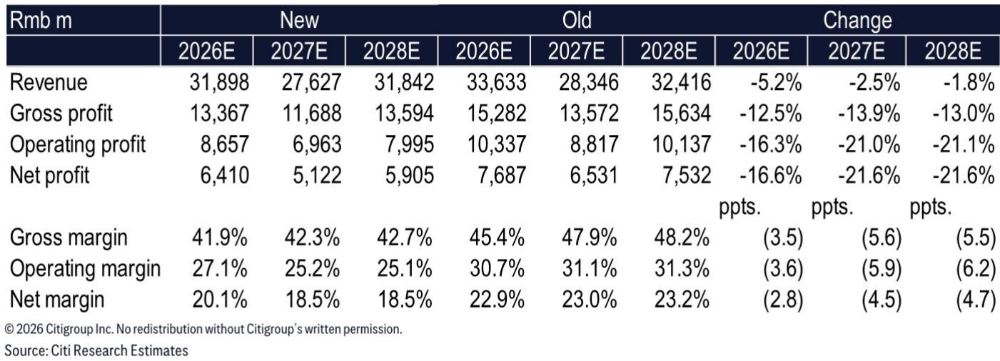
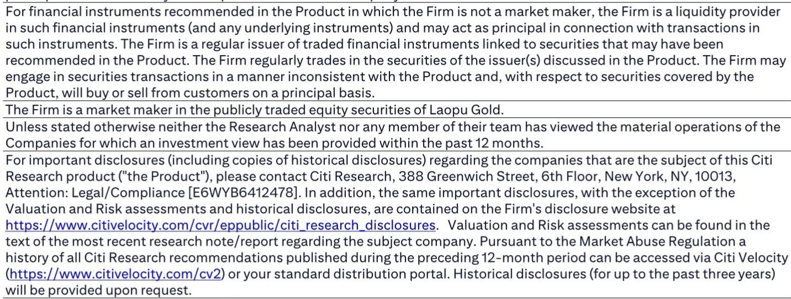

# Citi：老铺黄金业务与季度数据观察

老铺黄金（6181.HK）在2026年第二季度业绩出现一定变化。根据Citi7月27日发布的研报，公司初步披露的2026年上半年业绩显示，第二季度净利润比Citi及市场预期低了约30%。这一表现受到收入端和利润率端的双重因素影响。报告将2026至2028年的净利润预测下调了17%至22%，并预计市场一致预期将出现相应调整，短期内报价可能有所波动。

Citi认为，业绩低于预期的核心原因在于二季度收入与利润率同时出现变化。根据管理层信息，2026年第一季度收入和净利润已处于指引区间下限，分别为165亿元人民币和36亿元人民币，主要受3月金价调整导致销售变化影响。由此推算，第二季度收入约为33亿至39.5亿元人民币。剔除一季度发生的超过4000万元股权激励费用后，上半年报告净利润预计在42.6亿至43.1亿元人民币之间，这意味着第二季度报告净利润仅为6.6亿至7.1亿元人民币，净利润率从一季度的21.8%环比下降至18%至20%。

## 1. 利润率调整来自产品组合与折扣结构变化

管理层将第二季度净利润率的环比调整归因于几个具体因素：折扣产品在销售组合中占比上升、更大幅度的折扣力度（包括金币赠送促销）、线上销售占比下降，以及运营去杠杆效应。截至2026年6月底，公司库存较2025年底有所上升，原因是二季度采购增加，但上半年经营性现金流已转为正值。这些细节表明，利润率的变化并非单一因素驱动，而是销售结构与定价策略共同作用的结果。

> **KC评论：** Citi报告中最值得关注的不是净利润低于预期本身，而是利润率调整的结构性原因。折扣产品占比上升和线上销售占比下降，说明公司在金价波动环境下主动调整了销售策略，这比单纯的需求变化更具分析价值。

## 2. 下半年季节性规律与新品策略构成关键观察窗口

管理层指出，黄金珠宝行业的二、三季度为淡季，一、四季度为旺季，老铺黄金的旺季销售额通常可达淡季的约2倍，高于行业平均的1.5倍。基于这一季节性规律，Citi预计2026年下半年销售额可能达到二季度水平的3倍。此外，管理层计划通过增量折扣和推出单价更低的新产品来促进销售。二季度推出的新品仅为“试水”，鉴于客户反馈积极，下半年将进行大规模产品发布。

Citi预计，由于新品发布（锚定43%毛利率）以及高质量会员可叠加的5%额外折扣，下半年毛利率将低于二季度超过45%的水平。但报告同时认为，更好的运营杠杆可能部分抵消毛利率的变化。这一判断的关键在于，收入增长能否足够强劲，以覆盖利润率的结构性变化。

For informational purposes only. Portions may be generated,translated,summarized,or edited with AI assistance based on source materials and may contain omissions or errors. Please verify independently. This is not investment,legal,tax,accounting,or other professional advice.

