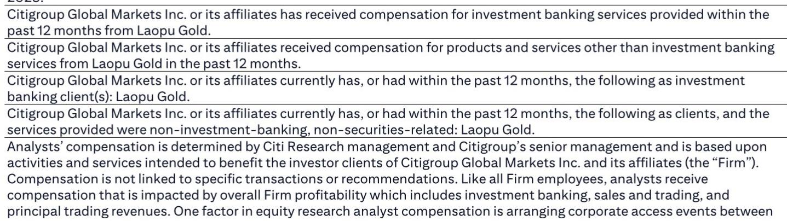

# 老铺黄金二季度表现观察：高速增长阶段或面临调整

老铺黄金2026年上半年初步业绩显示，第二季度净利润较市场普遍预期及分析师预测低约30%。这一差距并非单一因素所致，而是同时体现在营收和利润率两个维度。第二季度营收介于33亿至39.5亿元人民币之间，当季净利润降至6.6亿至7.1亿元，净利润率为18%-20%，较第一季度的21.8%有所回落。对于一家此前保持高速增长——2024年净利润增长253%，2025年再增长203%——的公司而言，这一季度表现并非寻常波动。它可能是一个结构性信号，表明支撑老铺高估值定位的商业模式正面临多重挑战。

这一差距的严重性源于管理层自身提及的多重因素叠加：折扣产品在销售组合中占比上升、包括赠金币促销在内的更大幅度折扣、线上销售占比下降，以及运营去杠杆效应。这些并非暂时性逆风。它们反映了在金价波动重塑消费行为、公司扩张战略迫使以利润率换取销量增长的背景下，老铺必须调整竞争策略的根本性变化。分析师已将2026-2028年净利润预测进行下调。

读者面临的关键问题，并非老铺能否从单季表现中恢复，而是其作为高端古法金饰品牌的独特定位，能否在积极折扣、产品组合变化以及业务季节性特征（第一季度和第四季度销售额约为第二、第三季度的两倍）的共同作用下保持韧性。分析师维持原有观点，但短期展望已明确标注为偏弱，而相较于全球奢侈品牌同行30%的估值折价——基于老铺较短的品牌历史——如今看来更像是前瞻性判断，而非保守估计。

## 二季度表现并非偶然：是既定策略触及边界的体现

管理层自身的评论表明，第二季度的疲软对公司而言并非意外。第一季度已处于指引区间低端，受3月金价回调影响。第二季度则因一系列自身因素导致的利润率压力而进一步加剧。折扣产品在销售组合中占比上升，公司提供了更大幅度折扣（包括赠金币促销），通常利润率较低的线上渠道贡献减少，固定成本分摊至更小的营收基础，形成运营去杠杆。

这些因素单独来看均可管理。但综合起来，它们揭示了一家在需求趋弱时期主动以利润率换取销量的公司。分析师的盈利修正表显示了调整幅度：2026年毛利率预测下调3.5个百分点至41.9%，2027年和2028年分别下调5.6和5.5个百分点。营业利润率预测下调幅度更大，2026年下调3.6个百分点，随后两年每年下调超过6个百分点。2027年净利润预测（分析师称之为“正常化盈利”年份）下调21.6%。

含义明确：分析师不预期快速逆转。利润率下降已被纳入未来三年的基本假设。此前基于2025年37.6%毛利率为暂时低点、将回升至45%以上区间假设来评估老铺的读者，现在需要重新调整。新的基本假设将2026年毛利率定为41.9%，2027年42.3%，2028年42.7%——逐步改善，但从未回到此前预测所假设的峰值水平。

## 下半年复苏叙事取决于销量与价格之间的微妙平衡，历史表明这种平衡难以维持

管理层对2026年下半年的展望持谨慎乐观态度，但这种乐观伴随着明确的利润率前提。公司指出季节性特征明显：第一季度和第四季度销售额通常约为第二、第三季度的两倍，而行业平均水平为1.5倍。基于此，下半年销售额可能达到第二季度水平的三倍。这一计算在机械层面可行，但它假设第二季度的需求疲软主要是季节性而非结构性。

展望中更值得关注的部分涉及产品策略。管理层指出，第二季度新产品发布有限，仅为“试水”，而积极的客户反馈已推动计划在下半年进行大规模产品发布。这些新产品将以43%的毛利率为锚点，公司计划为高质量会员提供额外5%折扣，且该折扣可与门店促销叠加。分析师明确预期下半年毛利率将低于第二季度已处于低位的略高于45%的水平。

这是老铺故事中的核心张力。公司需要新产品来刺激销售并从第二季度表现中恢复。但这些新产品带有内在的利润率上限——43%甚至低于已下调的2026年预期毛利率41.9%——而折扣叠加意味着实际利润率可能更低。分析师的希望在于，更高销量带来的更好运营杠杆将抵消毛利率压缩。但这种希望取决于销量能否达到管理层设想的规模，以及运营杠杆是否足以弥补本质上单位盈利能力结构性下降的影响。

## 2027年盈利正常化并非复苏：是市场尚未完全定价的下行重置

修正后盈利预测最显著的特征是利润轨迹的形状。2026年预期净利润为64亿元，随后在2027年预期降至51亿元，2028年预期恢复至59亿元。2027年数据被描述为“正常化盈利”，较2026年预期下降19.4%。营收遵循相同模式：2026年319亿元，2027年降至276亿元，2028年升至318亿元。

这不是周期性下滑。这是结构性台阶式下降。分析师预测，在调整当前年份的扭曲因素后，老铺的盈利能力较2026年数据所暗示的水平低约20%。应用于2027年预期正常化盈利的15倍市盈率表明，分析师认为公司未来盈利将低于此前预期。

当前股价396.40港元对应2027年预期市盈率11.6倍，股息率6.4%。这些倍数从历史标准看并不高，分析师认为估值仍“不贵”。但倍数偏低有其原因：市场正在折价反映正常化程度可能比分析师修正后预测更深的风险，或2028年复苏未能实现的风险。相较于全球奢侈品牌同行30%的估值折价——分析师以老铺较短的品牌历史为由——如果利润率恶化持续，这一折价可能需要进一步扩大。

## 读者决策框架：三种情景及区分它们的信号

对于权衡当前价格是买入机会还是价值陷阱的读者，关键在于识别三种情景中哪一种正在展开。第一种情景是分析师的基本假设：第二季度表现是金价波动和产品过渡的暂时结果，季节性推动下半年强劲复苏，业务进入较低但仍盈利的增长轨道，2027年正常化盈利约51亿元。在此情景下，当前价格较507港元目标价有27.9%上行空间，加上7.8%股息率，总预期回报率为35.7%。

第二种情景更为悲观：利润率恶化是结构性的，由竞争压力驱动，迫使老铺即使在产品过渡完成后仍维持折扣。在这种情况下，2027年预期净利润51亿元可能过于乐观，2028年恢复至59亿元可能无法实现。需要关注的关键信号是2026年下半年毛利率。如果低于分析师隐含假设的约43-44%，则利润率底部尚未找到，进一步盈利下调可能发生。

第三种情景是看涨情景，分析师在报告中概述：营收增长快于预期，息税前利润率高于预期。这需要下半年新产品发布成功超出管理层预期，折扣被证明是暂时的，客户组合向忠诚、对价格不敏感的买家加速转变。看涨情景虽有可能但概率不高，因为分析师已明确基于预期股价负面反应（随着市场数据被下调）而提出30天短期偏弱观点。

因此，决策框架取决于一个可观察变量：2026年下半年毛利率轨迹。从第二季度略高于45%的水平环比改善将支持基本假设。进一步下降将验证悲观情景。读者还应关注库存水平，由于采购增加，2026年上半年库存较2025年末有所上升。库存上升伴随利润率下降是经典预警信号，表明需求弱于公司下单时的预期。

## 结构性挑战：老铺的高端定位正被其用于捍卫市场份额的策略所侵蚀

老铺的研究逻辑始终基于其在古法金细分领域获得溢价的能力。公司的固定价格模式、平均超过5万元的高客单价、以及单店销售额超过5亿元，是使其看起来免受困扰大众市场珠宝零售商折扣影响的业务支柱。第二季度业绩直接挑战了这一叙事。

折扣产品在销售组合中占比上升以及推出赠金币促销并非边际调整。它们代表了老铺竞争方式的转变。当高端品牌开始积极折扣时，存在训练客户等待促销而非全价购买的风险。管理层计划在下半年实施的高质量会员折扣与门店促销叠加，加剧了这一风险。每一层折扣都在侵蚀品牌的定价能力，并使未来恢复全价销售变得更加困难。

分析师间接承认了这一张力，指出客户组合正转向忠诚、对价格不敏感的买家，他们不太在意溢价。这一转变被呈现为积极发展，应能降低未来销售与金价的相关性。但它也意味着，正在离开的价格敏感客户曾是营收基础的重要组成部分，而用更小的忠诚客户群体替代他们可能需要更低价格来维持销量。第二季度业绩表明，这一过渡比分析师此前预期的更为痛苦，对利润率的破坏也更大。

*仅供参考。部分内容可能基于源材料通过AI辅助生成、翻译、总结或编辑，可能存在遗漏或错误。请独立核实。本文不构成任何专业建议。*

仅供参考。部分内容可能基于源材料通过AI辅助生成、翻译、总结或编辑，可能存在遗漏或错误。请独立核实。本文不构成任何专业建议。

