# 宏观环境研究

# 印度生成式AI：就业的交叉影响，生产率的顺风

生成式人工智能（Gen-AI）可能对宏观经济产生广泛影响。在我们的基准观点中，我们认为Gen-AI的采用对印度增长前景是一个中期积极因素，尽管对劳动力市场的影响可能是不均衡的。

- 更多是补充而非替代：沿用我们全球团队的方法论，我们估计，根据对Gen-AI能够执行的任务复杂程度的假设，Gen-AI可以完成印度非农业劳动力目前承担的9-17%的任务。我们进一步根据任务内容暴露于Gen-AI的程度对职业进行分类：高暴露度的职业更可能面临替代，而中等暴露度的职业更可能得到补充。根据各行业的就业情况对这些职业进行加权，我们估计8-12%的非农业就业面临替代风险，而42-48%的非农业就业可能得到补充，其余部分基本不受影响。

Gen-AI可能重塑职业构成：基于职业层面的分析，我们估计就业下降可能集中在常规文书支持、专业和技术人员等职业。与此同时，常规体力职业，其次是手工艺和相关行业工人以及机器操作员，可能会看到就业增加，因为体力、手工和人际交往任务仍然难以自动化。

■ 暴露集中在服务业：医疗、教育、金融和专业服务似乎更容易通过诊断和数据分析受到AI相关的增强影响，而IT支持的业务流程服务（BPS）以及邮政和电信服务由于集中在重复、可编码的任务上，面临更大的替代风险。制造业由于任务组合更偏体力，直接受影响较小。一个重要的说明是，与早期的技术周期一样，Gen-AI的采用也可能随着时间的推移创造新的职业类别，这不在本报告的范围内。

生产率提升可能意义重大，但时机难以预测：我们的基准观点表明，在10年期间，Gen-AI的采用可能使年劳动生产率增长提高约0.4个百分点，根据其能够执行的任务复杂程度，范围在0.1到0.8个百分点之间。

## Santanu Sengupta

+91(22)6616-9042 | santanu.sengupta@gs.com GS India SPL

Arjun Varma
+91(22)6616-9043 |
arjun.varma@gs.com
GS India SPL

Andrew Tilton
+852-2978-1802 |
andrew.tilton@gs.com
GS (Asia) L.L.C.

知识密集型服务业，即医疗、教育、媒体、部分金融和专业服务，看起来最有可能受益，而建筑和制造业的收益可能有限。

- 采用的顺序将很重要。生产率的主要提升可能来自企业间的广泛部署。如果在替代密集型部署之前优先部署劳动增强型Gen-AI，那么在劳动力市场干扰变得更加明显之前，生产率提升可能会更广泛地扩散。

全球能力中心（GCC）的韧性可能缓冲常规商业服务的替代风险。我们认为，虽然常规IT-BPS功能面临替代风险，但截至目前，整体科技行业就业（约占非农业就业的2%）、服务出口和GCC扩张仍然保持韧性。我们发现，人员精简集中在前6大IT服务公司（净减少约6.4万人，总员工170万），而科技服务行业的其余部分（包括GCC）在过去三年中增加了约70万员工，达到440万。

## 我们基准观点的主要风险：

基础设施仍然是一个关键制约因素。印度的Gen-AI扩散不仅取决于软件能力，还取决于计算的可负担性、数据中心建设、可靠的电力、水资源供应以及更广泛的数字基础设施。鉴于印度目前的数据中心容量仅为约1GW（占全球数据中心容量的1%），扩大AI采用将需要对物理和数字基础设施进行大量投资。

服务出口目的地市场保护主义抬头。除了通常对全球ICT支出的依赖外，围绕跨境数据、数字服务以及使用外国AI模型的更严格政策环境可能会拖累服务出口增长。例如，欧盟加强了对跨境数据传输的审查，而美国越来越强调AI主权，可能主张限制在美国境外部署Gen-AI模型。

## 印度的Gen-AI采用：更多是补充而非替代

生成式人工智能（Gen-AI）的快速发展标志着近几十年来塑造印度增长和劳动力市场的一系列技术进步中的最新一次。在这篇宏观环境研究中，我们将当前的Gen-AI采用置于印度过去技术采用周期的背景下，评估印度劳动力市场对Gen-AI的潜在暴露程度以及Gen-AI采用带来的生产率提升空间。我们进一步记录了印度与Gen-AI相关的资本支出，包括数据中心、半导体芯片和数字基础设施。最后，我们探讨了Gen-AI在印度的采用可能是什么样子——具体来说，是在其14亿人口中推广Gen-AI使用所需的计算和物理基础设施要求。

## 印度互联网和技术发展历史

印度过去的技术采用在连接成本下降和数字基础设施规模化时加速。我们认为，Gen-AI的采用可能遵循类似的路径，其扩散的速度和广度取决于更便宜的计算、可靠的电力以及支持性数字和物理基础设施的建设。印度的数字演进经历了连续的以基础设施为主导的阶段——从早期有限且配给的互联网阶段，到移动和移动互联网的采用，再到数字公共基础设施的建设（图表1）。在过去十年中，印度堆栈¹的扩展、更广泛的智能手机普及率（图表2）以及移动数据成本的急剧下降，显著拓宽了数字接入和使用。

图表1：自推出以来，Aadhar卡（数字身份）的发放数量显著增长  
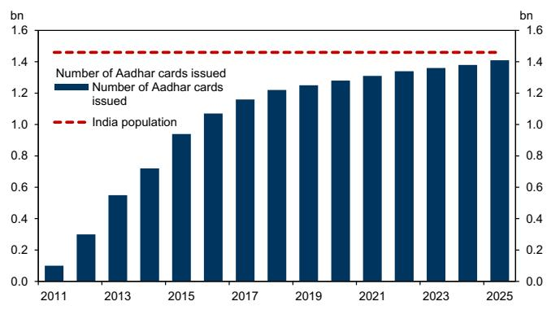  
来源：UIDAI

图表2：印度的智能手机普及率在过去十年中翻了一番多  
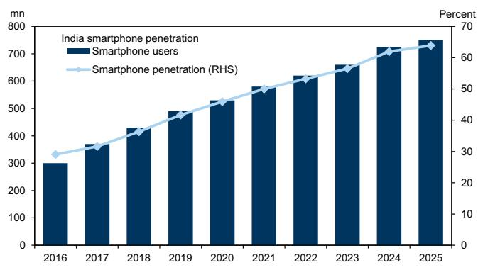  
来源：各类新闻文章，GS全球研究

具有全球竞争力的数字服务：这些技术周期也帮助创建了具有全球竞争力的数字服务生态系统。信息技术-业务流程管理（IT-BPM）行业的兴起使印度更深入地嵌入全球服务价值链，培养了数字技能型劳动力，并强化了基础设施和可负担性作为技术扩散关键推动因素的作用。可负担的移动互联网和不断上升的智能手机普及率也使得印度的食品配送平台得以出现，这些平台在数字商务上实现了规模化。

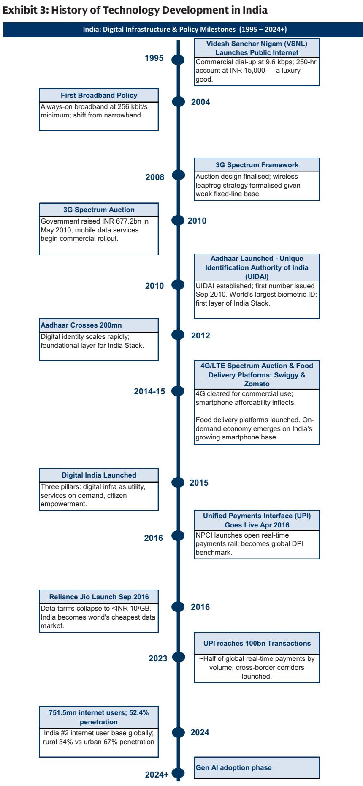  
来源：GS全球研究

印度先前的技术浪潮是由连接成本下降和可扩展的数字基础设施推动的。我们认为，Gen-AI的采用可能同样取决于计算的可负担性、电力可用性和支持性数字基础设施。与此同时，Gen-AI的能力似乎比早期技术周期进步得更快，最近的模型已远远超出基本的文本生成，转向更广泛的常规知识型任务，这些任务难以与人类输出区分。这种异常快速的改进对印度的劳动力市场具有重要影响，也指向了潜在的有意义的生产率提升，特别是在服务导向型和知识密集型行业。

## Gen-AI对印度劳动力市场的影响

为了分析这些影响，我们首先考察印度劳动力市场对Gen-AI采用的暴露程度，然后评估其对现有劳动力的增强程度。

我们通过将任务层面的职业信息网络（O\*NET）数据与国际劳工组织（ILO）的印度职业层面就业数据相结合，来估计Gen-AI的潜在劳动力市场影响。我们从O\*NET开始，它包含美国约900个职业和39项基础工作活动的信息。我们确定这39项工作活动中的13项可能暴露于Gen-AI相关的自动化（详见附录1），并根据我们全球研究团队的方法论，使用相关的任务难度水平（1-6级）²为每个职业构建Gen-AI暴露评分。

具体来说，我们对任务进行复杂度加权平均，以估计每个职业中可能被Gen-AI自动化的任务内容比例。在我们的基准中，我们假设美国和印度类似任务的难度分配是相似的。

例如，“研究脚本以确定项目要求”、“监控财务表现”等任务被分配难度级别2，而“在治疗期间监控患者”或“分析数据以识别变量之间的趋势和关系”或“研究专业领域内的主题”等任务被分配难度级别6（详见附录1）。

然后，我们使用ILO的就业数据（按2015年国家职业分类（NCO）第一级职业类别提供，如管理人员、专业人员、技术人员和准专业人员、文书支持人员等）将职业层面的暴露评分汇总并映射到印度的职业结构。

ILO数据库还提供了这些职业在22个广泛行业中的分布，使我们能够估计每个行业工作量中可能暴露于Gen-AI的比例。由于印度的就业数据仅以广泛的NCO-2015第一级职业类别提供，我们对底层子类别的职业层面Gen-AI暴露评分进行平均，以得出NCO-2015第一级水平的暴露评分，这导致AI暴露评分的分布比更细粒度的职业层面更窄（图表4）。

最后，我们跨职业和行业汇总这些估计，以估计经济总任务内容中可能暴露于Gen-AI相关自动化和增强的比例。在我们的基准中，我们假设主要涉及体力或户外任务的职业——例如农业——对Gen-AI驱动的自动化没有暴露。

图表4：估计可能暴露于Gen-AI相关自动化的就业份额的框架  
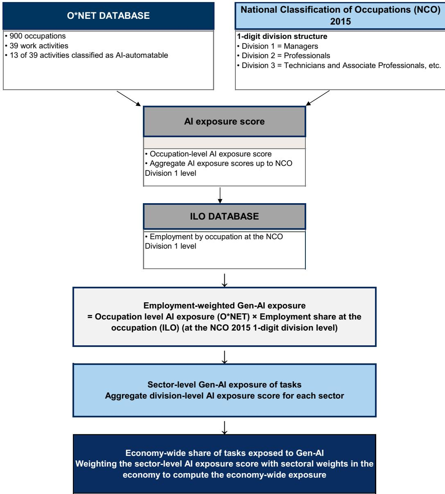  
来源：GS全球研究

Gen-AI暴露评分因职业而异，范围从约2%到40%的任务内容，具体取决于职业和Gen-AI能够自动化的任务复杂程度。我们首先按就业对这些职业层面的暴露评分进行加权，以得出行业层面暴露于Gen-AI的任务内容份额估计。然后，我们按每个行业在经济中的就业份额对其暴露程度进行加权，以估计整个经济中暴露于Gen-AI相关自动化的任务份额。

在我们的基准下，如果Gen-AI能够完成难度级别高达3-4的任务，例如“监控组织合规性”（难度级别3）、“检查财务记录”（难度级别3）或“分析数据中的趋势和关系”（难度级别4），那么我们估计约13-15%的非农业工作任务暴露于Gen-AI相关自动化。服务业暴露程度高，包括教育、媒体以及金融和专业服务³。与此同时，建筑等体力密集型行业的任务暴露程度相对较低（约8%）（图表5）。

图表5：服务业暴露于Gen-AI相关自动化的任务份额最高 注意：科技服务行业在哪里

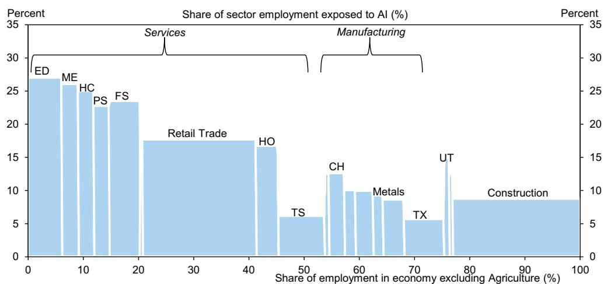  
注：i) ED：教育，ME：媒体，HC：医疗，PS：公共服务，FS：金融服务，HO：酒店，UT：公用事业，CH：化工，TS：运输服务，TX：纺织。  
ii) ILO的分类包括计算机编程、信息服务以及部分咨询活动归入媒体，而部分咨询和专业服务归入金融服务

## 来源：O\*NET数据库，ILO，GS全球研究

我们通过改变Gen-AI可以自动化的任务难度阈值来构建替代情景。如果Gen-AI只能执行低复杂度任务（最高难度级别2），则暴露于Gen-AI的任务份额显著下降至9%。同时，如果Gen-AI能够执行更复杂的任务（最高难度级别6），则暴露于AI的任务份额上升至17%（图表6）。

即使在上限情景下，整个经济中暴露的任务份额也仅上升至约17%，原因有二。首先，我们的框架仅识别出一部分工作活动可能被Gen-AI自动化，而其余部分主要涉及体力执行、人际互动或监督，这些仍然需要人类投入。其次，Gen-AI暴露评分相对较高的职业——如文书支持人员和技术人员——集中在经济中非农业就业份额相对较低的行业。

图表6：根据我们的估计，印度当前约9-17%的工作任务可能暴露于Gen-AI自动化

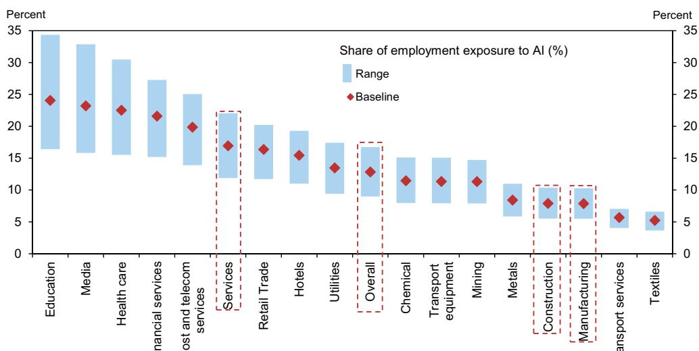  
ILO的分类包括计算机编程、信息服务以及部分咨询活动归入媒体，而部分咨询和专业服务归入金融服务

来源：GS全球研究

## 更多是补充而非替代

我们估计印度约9-17%的非农业任务暴露于Gen-AI驱动的自动化，但劳动力市场的影响将取决于每个职业的任务内容有多少可以被自动化。在暴露有限的地方，Gen-AI更可能通过减少花在常规任务上的时间并释放能力用于更高价值的工作来补充工人。在暴露较高的地方，替代风险上升。同时，以体力任务为主的职业可能基本不受影响。

为了说明这一点，我们将工人分为五大类：常规和行政工人（文书支持），面临最大的替代风险；高层管理人员（管理者），更可能得到补充；专业人员、技术人员以及服务和销售人员，面临混合结果⁴；以及蓝领和体力工人⁵，他们受Gen-AI采用的直接影响应该更有限。

在行业层面，医疗、教育、媒体和娱乐以及部分金融服务似乎更有可能从劳动力增强中受益，这反映了它们相对较高的技能工人比例。相比之下，邮政和电信服务以及其他常规服务部门面临更高的替代风险，因为它们更集中在客户支持、文档和处理任务上。建筑、制造和采矿等行业直接暴露较少，因为任务内容仍然更偏体力性质。（图表7）。

图表7：技能型服务行业似乎更适合AI互补性，而常规服务行业面临更高的替代风险 注意：科技服务行业在哪里

  
√ 专业人员、技术人员以及服务和销售人员  
■ 常规/行政员工  
注：i) 蓝色或蓝色阴影表示互补性。灰色或灰色阴影表示替代风险。阴影图案表示混合结果。  
ii) ILO的分类包括计算机编程、信息服务以及部分咨询活动归入媒体，而部分咨询和专业服务归入金融服务

## 来源：ILO，GS全球研究

例如，在金融服务中，Gen-AI可以通过自动化某种形式的基本建模（难度级别3）来补充分析师角色，但可能完全替代常规后台功能，如基本合规检查（难度级别1）。根据ILO的分类，该行业约占（不包括农业）总就业的6%。

在零售贸易中，Gen-AI可以通过库存管理（难度级别2至4）补充销售人员，同时通过自助结账系统（难度级别1）替代收银员角色，其中一些已经到位。该行业约占（不包括农业）总就业的20%。

在医疗领域，Gen-AI可以通过协助诊断和治疗规划（难度级别6）增强医生，但更可能替代行政任务，如安排预约（难度级别2）。该行业约占（不包括农业）总就业的3%。

在教育领域，Gen-AI可以通过个性化学习工具（难度级别3-4）补充导师，同时替代常规任务，如评分评估或标准化答案的测试（如选择题测试（难度级别1））。该行业约占（不包括农业）总就业的6%。

一个分类问题值得注意。根据ILO就业数据，印度IT和IT支持服务劳动力的一部分属于媒体和娱乐（高互补性行业），而其他部分则归入金融服务（高替代风险）。印度的IT和IT支持服务行业雇佣了400-600万⁶人，而基于ILO数据的行业层面细分可能低估了AI对印度更广泛的科技服务行业的重要性。因此，我们稍后在报告中单独讨论对IT服务和GCC的影响（参见专栏：印度的全球能力中心（GCC）和IT服务行业——Gen-AI风险还是机遇？）。

## 劳动力市场结果：更多是补充而非替代

为了将任务暴露与潜在的劳动力市场结果联系起来，我们将职业分为三组。我们假设任务内容暴露低于10%的职业可能基本不受影响。任务内容暴露在10-35%之间的职业可能得到补充。最后，任务内容暴露超过35%的职业（我们分布中AI暴露评分的最高十分位），可能被替代——与暴露的任务内容份额成比例。

在此基础上，我们估计约8-12%的当前非农业就业面临替代风险，而42-48%更可能得到补充，其余部分可能基本不受影响。我们认为，这表明Gen-AI采用在印度的劳动力市场效应更可能是增强而非广泛的替代。

在行业层面，医疗、教育和媒体娱乐似乎最有可能受到互补性影响，而邮政和电信服务以及部分金融服务则更容易受到替代，这反映了客户支持和文档处理的高度集中，这些工作可以越来越多地被Gen-AI自动化（图表8）。然而，在行业就业份额相对较小的情况下，总体就业影响可能是有限的，例如邮政和电信服务仅占（不包括农业）总就业的约0.5%。

图表8：印度大多数受AI影响的就业更可能得到补充而非替代  
  
行业就业中不同AI暴露程度的份额：  
■ 替代 ■ 互补 ■ 无自动化  
注：ILO的分类包括计算机编程、信息服务以及部分咨询活动归入媒体，而部分咨询和专业服务归入金融服务

AI的采用可能重塑广泛职业群体的就业构成。我们首先确定每个NCO 2015第一级水平内的细分职业（例如，会计师、软件开发人员），这些职业在我们的框架下被归类为面临替代风险，然后将这些结果汇总到更广泛的职业群体。鉴于体力、手工和人际交往任务可能不太容易通过Gen-AI采用实现自动化，被替代的工人可能会在Gen-AI采用期间逐渐转向此类职业。

我们的估计表明，就业下降可能集中在常规或行政职业，如文书支持（约占非农业就业的3%），其次是专业人员（约3%）、服务和销售人员（约2%）以及技术人员（约1%）（图表9）。同时，体力职业⁷可能看到就业增加（约4%），其次是手工艺和相关行业工人（约3%）以及工厂和机器操作员（约2%）。总体而言，Gen-AI更可能在Gen-AI采用期间跨职业重新分配劳动力。

图表9：Gen-AI可能改变就业的职业构成  
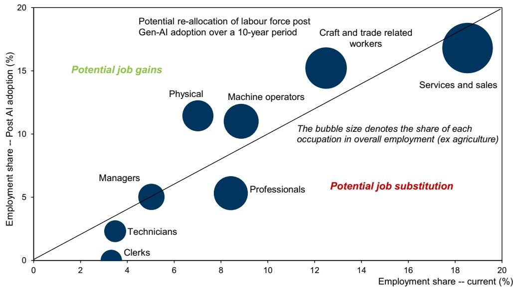  
来源：ILO，GS全球研究

## 估计Gen-AI采用对印度劳动生产率增长的提升

Gen-AI可以通过两个主要渠道影响印度的劳动生产率。首先，它可以通过自动化常规任务并释放时间转向更高价值的任务，来提高受AI影响职业的人均产出。例如，IT服务、GCC和商业服务中的正规部门工人可能被重新部署到更高价值的分析、监督或客户面对面的角色。其次，从常规服务职能中被取代的工人可能面临较弱的再就业结果或转向生产率较低的角色。也就是说，如果被取代的工人被重新部署到生产率更高的新角色，而不是永久失业，这部分工人的生产率可以提高（如一项ILO研究所引用的）。

## 印度过去的技术周期表明，新技术的采用可以显著提高生产率。

1990年代末和2000年代的IT服务扩张通过采用新的数字技术和将劳动力重新分配到更高附加值的活动，提升了服务业的生产率。2010年代中期开始的数字堆栈创建和智能手机普及率的提高降低了交易成本，拓宽了市场准入，并改善了劳动力和资本的利用，使得工作能够重新分配到更有生产力的任务。例如，对于银行员工来说，数字化减少了花在文书工作和交易处理上的时间，使工人能够更多地专注于客户获取和服务交付。

## 估计生产率提升

为了估计生产率影响，我们将Gen-AI暴露评分与RBI KLEMS行业层面劳动生产率数据相结合。RBI KLEMS提供了27个行业的行业层面劳动生产率增长和劳动收入份额的衡量指标，我们将其映射到相应的ILO行业（详见附录2）。

我们将受Gen-AI影响的劳动力分为三组：

1.  那些任务被Gen-AI补充（增强）并继续就业且生产率更高的人（增强份额记为λᵢ）
2.  那些任务被Gen-AI替代（取代）并随后被重新分配到较低生产率活动的人（替代份额记为δᵢ）
3.  那些任务未暴露于Gen-AI的人（1 - λᵢ - δᵢ）

我们为每个行业内的三个工人群体分配不同的生产率增长：

1.  增强型工人，他们经历由Gen-AI采用驱动的提升，达到该行业历史峰值生产率增长，并进一步通过劳动力成本节约渠道增强（如下所述）
2.  替代型工人，假设他们重新就业于生产率增长等于该行业在FY12-FY23期间（不包括疫情时期）劳动生产率增长的四分位数的岗位
3.  非Gen-AI暴露工人，他们继续沿着历史基准生产率增长路径

我们计算每个行业的劳动力成本节约率（LCSᵢ），作为先前归属于任务被Gen-AI替代的工人的增加值份额。我们假设这一生产率盈余的50%归于剩余劳动力，产生额外的劳动生产率提升。行业层面的LCS使用RBI KLEMS数据库中的行业层面劳动收入份额进行估计。

最后，每个行业的替代调整后总劳动生产率增长计算为三组生产率增长率的加权平均值（详见附录中的详细方法论）。

我们的基准估计表明，如果Gen-AI能够自动化难度级别高达3-4的任务，那么在10年期间，印度Gen-AI采用对年劳动生产率增长的提升约为0.4个百分点。鉴于对劳动生产率增长提升估计的不确定性，我们根据Gen-AI能够完成的任务难度水平构建了3个额外情景。

在Gen-AI只能完成难度级别高达2的任务（即“监控财务表现”）的情景下，我们估计劳动生产率增长的提升较小，约为0.1个百分点。另一方面，如果Gen-AI更强大，能够完成难度级别为6的任务（即“分析数据以识别变量之间的趋势和关系”），那么我们估计劳动生产率增长的提升将增加到高达0.8个百分点（图表10）。

图表10：我们估计印度Gen-AI采用对年劳动生产率增长的提升范围在0.1-0.8个百分点之间

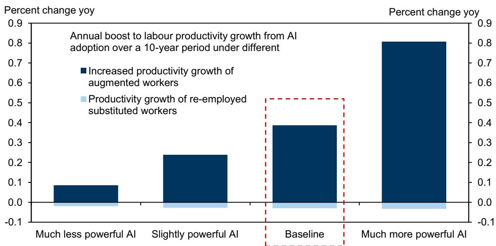

来源：GS全球研究

最大的生产率提升可能集中在媒体和娱乐、教育和医疗等行业，在这些行业，AI更可能增强知识密集型工作。相比之下，纺织、建筑以及邮政和电信等行业的生产率提升可能较为温和，因为这些行业更大比例的任务仍然是体力性质的，受Gen-AI暴露的影响有限（图表11）。

印度的全球能力中心（GCC）和IT服务行业——Gen-AI的采用构成风险还是机遇？

读者对Gen-AI的担忧主要集中在印度的IT服务和GCC行业是否因其大量接触常规数据处理工作而面临不成比例的干扰。我们在本节中考察这些行业的最新证据。虽然整体科技行业仅占非农业就业的约2%（IT服务行业占非农业就业的份额更小），但它由相对较高生产率和薪酬更好的工作组成，并且仍然是服务出口的重要驱动力。

## 迄今为止，对就业的担忧似乎大于证据所显示的程度

尽管存在对AI采用的担忧，但与美国的观察结果一致，印度IT服务行业的总体就业仍然基本保持韧性。人员精简集中在大型上市IT公司，这是在疫情后招聘激增之后发生的，而整个行业的就业（约占行业份额的75%，不包括前6大IT公司）仍高于疫情前趋势（图表12）。

## 软件服务出口仍远高于疫情前趋势

虽然前六大IT服务公司的收入保持在疫情前趋势附近，但软件服务出口在过去六年中仍远高于疫情前趋势（图表13）。这表明软件服务出口越来越多地由GCC和其他中型IT服务公司推动。

图表12：人员精简集中在大型IT公司，而更广泛的行业继续增加就业  
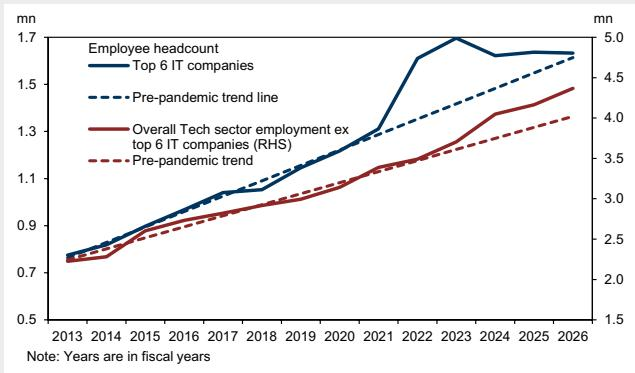  
来源：公司报告，NASSCOM

图表13：软件服务出口仍远高于疫情前趋势，而前十大IT公司的收入与趋势一致  
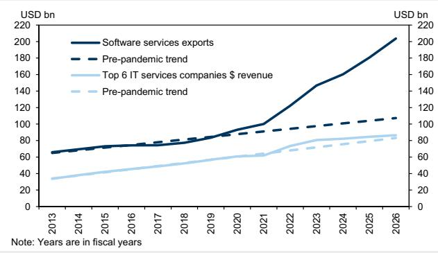  
来源：公司报告，GS全球研究

## Gen-AI可能改变工作构成

最可能被替代的职业通常是常规编码、测试、文档、数据处理和基本业务流程任务。此外，正如我们的权益分析师所指出的，大型IT服务公司由AI驱动的生产率提升正通过降低定价传递给客户，限制了收入和利润率的收益。他们进一步指出，AI导致的收入通缩目前大多被工作范围的扩大所抵消；然而，如果存在时间错配（先负面影响后收益），收入增长可能面临进一步压力。因此，对收入和利润率的净影响将取决于AI主导的生产率提升是主要通过降低定价被竞争掉，还是被更广泛的工作范围所抵消；在现阶段，这些力量之间的平衡仍然不确定。随着时间的推移，AI可能同时增加对更高价值活动的需求，如AI实施、数据工程和网络安全，这进一步扩大了工作范围。

## GCC扩张和服务出口持续增长

印度的服务出口在过去两年中保持强劲，到CY26年第一季度上升至GDP的约10.7%（CY24年为GDP的10.1%），其中软件和商业服务约占75%的份额，这可能表明自动化的生产率提升伴随着对更高价值服务的新需求（图表14）。印度继续拥有世界上最大的科技人才库之一，并已成为跨国公司建立GCC的首选地点，涵盖技术、分析、财务、运营和产品开发职能。印度的GCC数量在过去十五年中增长了约3倍，而员工数量和收入分别增长了约6倍和8倍（图表15）。

几家AI公司已经扩大了在印度的业务，这既反映了人才库的深度，也反映了国内AI市场日益增长的重要性。例如，媒体报道OpenAI已在印度建立本地业务，并正在积极招聘技术、客户成功和企业职能方面的人才，而Anthropic于2026年开设了班加罗尔办事处，并正在招聘本地人才以支持企业采用和开发者生态系统。此外，像Nvidia这样的公司将其全球约10%的员工部署在印度——不仅限于软件服务，还包括工程和设计流程。

图表14：印度的计算机和商业服务出口保持强劲  
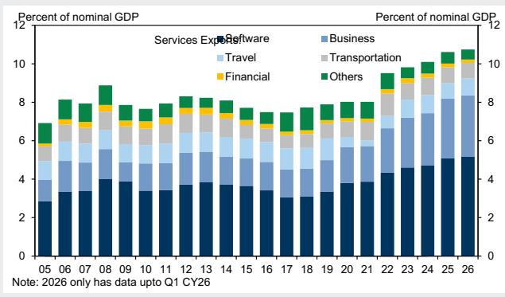  
来源：RBI  
图表15：GCC的收入在过去十五年中增长了近8倍

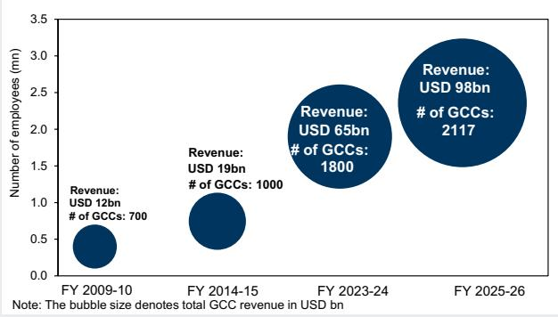  
来源：NASSCOMM

## 印度的主要权衡：AI采用的关键考虑因素和风险

我们认为，印度的AI机遇是重要的，并且采用顺序很重要。Gen-AI可以提高生产率并降低成本，但与早期的技术浪潮不同，它还需要对数据和计算能力进行更深入的投资。我们认为，部署可能比早期的技术采用浪潮更复杂，因为公司需要重组工作流程、决策和劳动力组织。

## 早期收益可能在AI补充劳动力的地方较强：在我们的框架中，GCC、金融服务、医疗和教育等行业似乎更适合利用Gen-AI来提高工人生产率，而不是直接取代劳动力。这些行业在我们的框架中也显示出一些最高的AI互补性评分（医疗约83%的任务是互补的，而金融服务约68%的任务是互补的），这表明Gen-AI更可能增强现有工人并提高生产率。我们的分析还表明，在替代之前进行增强很重要，因为印度面临的主要风险是，如果替代来得太早（在采用之前），经济可能会在生产率提升广泛扩散之前经历一段就业增长疲弱的时期。

目的地市场保护主义抬头是印度与AI相关的服务出口面临的外部风险。除了通常对全球ICT支出的依赖外，围绕跨境数据、数字服务以及使用外国AI模型的更严格政策环境可能会拖累出口增长，特别是如果发达经济体的公司越来越倾向于国内托管、本地模型部署或国家控制的AI堆栈。主要市场近期的政策动向包括欧盟对跨境数据传输的更严格审查，以及美国和其他地方围绕AI主权、本地化和可信计算框架的日益激烈的辩论。

## 基础设施需要得到加强，以免成为制约因素：Gen-AI不仅仅是软件故事，还需要可负担的计算、可靠的电力、水资源和数据中心容量。印度在Gen-AI相关的物理基础设施方面起点相对较低，特别是数据中心容量。如图表16所示，印度的已安装数据中心容量仍显著低于发达市场和中国，美国约占全球已安装容量的47%，其次是中国占25%，而截至2025年⁸，印度约占1%。印度最近的政策通过以全球平均成本约三分之一的价格向初创企业和学术界提供这些设施的补贴使用，使计算基础设施的使用变得可负担。

支持数据中心建设还需要额外的电力基础设施。我们的权益分析师估计，到FY30年，与数据中心相关的电力需求可能上升到总电力需求的约1.4%。虽然仍然温和，但这种增量需求将加剧到FY30年约6%的峰值电力缺口，使电力成为扩展AI基础设施的重要考虑因素。

图表16：与发达市场和中国相比，印度的已安装数据中心容量相对较低  
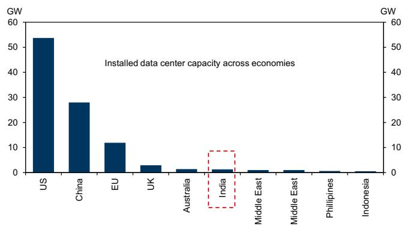  
来源：各类新闻文章，GS全球研究

图表17：数据中心容量建设将增加峰值电力需求  
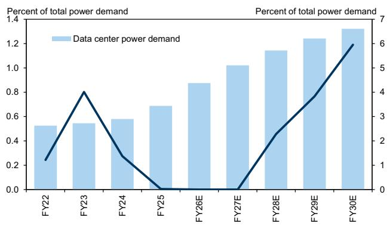  
来源：CEA，公司数据，GS全球研究

## 附录1

图表18：Gen-AI暴露的工作活动

<table><tr><td>AI暴露的活动</td><td>任务示例及相关难度</td></tr><tr><td>获取信息</td><td>2. 阅读工作单以确定材料或设置要求。4. 研究脚本以确定项目要求。6. 进行研究以增加对医疗问题的了解。</td></tr><tr><td>监控过程、材料或环境</td><td>2. 监控财务表现4. 监控影响业务运营的外部事务或事件。6. 在治疗、程序或活动期间监控患者状况。</td></tr><tr><td>识别对象、行动和事件</td><td>1. 识别工作或就业机会。3. 标记材料或对象以供识别。5. 识别战略商业研究线索。</td></tr><tr><td>估计产品、事件或信息的可量化特征</td><td>2. 测量距离或尺寸。4. 测量材料或对象的物理或化学性质。5. 测量材料以标记参考点、切割线或其他指示。</td></tr><tr><td>处理信息</td><td>2. 核对销售或其他财务交易的记录。4. 检查诊断图像的质量5. 验证患者信息的准确性</td></tr><tr><td>评估信息以确定是否符合标准</td><td>1. 校对文档、记录或其他文件以确保准确性。3. 评估是否符合环境法律。5. 评估绿色运营或项目是否符合标准或法规。</td></tr><tr><td>分析数据或信息</td><td>2. 分析项目数据以确定规格或要求。4. 分析测试数据或图像以辅助诊断或治疗。6. 分析数据以识别变量之间的趋势或关系。</td></tr><tr><td>更新和使用相关知识</td><td>2. 了解专业领域的最新发展。4. 更新与工作相关的知识或技能。6. 研究专业领域内的主题。</td></tr><tr><td>安排工作和活动</td><td>1. 安排餐饮预订。3. 安排维修、安装或维护活动。5. 安排运营活动。</td></tr><tr><td>组织、规划和优先安排工作</td><td>2. 规划工作程序。4. 为公众规划社区计划或活动。6. 制定详细的项目计划。</td></tr><tr><td>记录/记录信息</td><td>1. 维护财务或账户记录。3. 记录有关零件、材料或维修程序的信息。5. 提交医学研究报告。</td></tr><tr><td>为他人解释信息的含义</td><td>2. 与客户沟通产品、程序和政策。4. 与家属协商讨论客户治疗计划或进展。6. 向患者或家属解释医疗程序或测试结果。</td></tr><tr><td>执行行政活动</td><td>2. 处理销售或其他交易。4. 执行学生注册或登记活动。5. 按照程序处理法医或法律证据。</td></tr></table>

来源：O\*NET，GS全球研究

## 附录2

## RBI KLEMS行业到ILO行业的映射

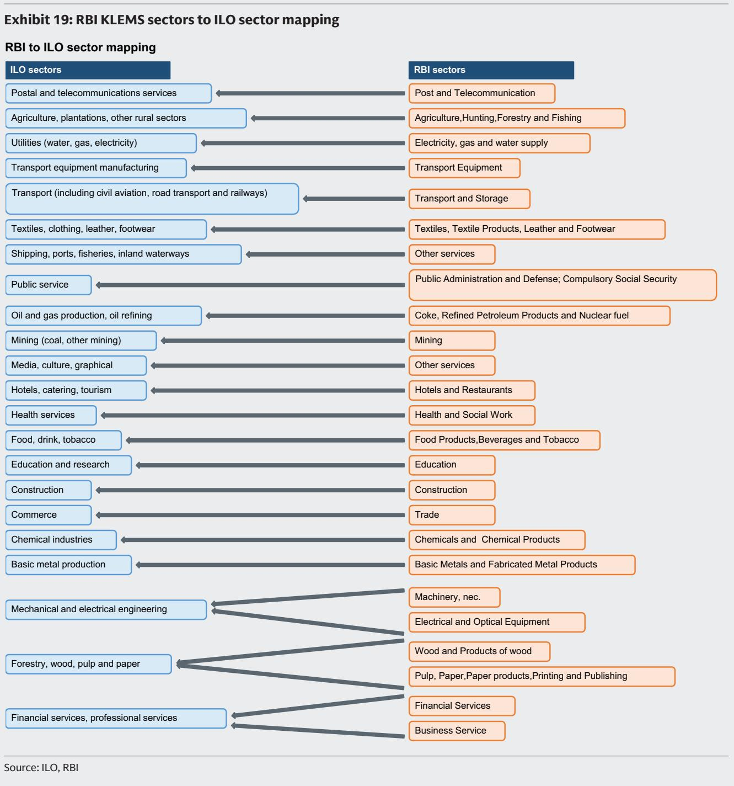

## 附录3：

## 计算劳动生产率增长提升的方法论

我们使用Gen-AI暴露评分（AESᵢ）在行业层面描述印度劳动力对Gen-AI的暴露程度，该评分衡量每个ILO行业总工作量中暴露于Gen-AI驱动任务自动化的份额。

对于每个行业i，总就业EMPᵢ：

被补充（增强）的工人：EMPᵢ^aug = AESᵢ × λᵢ × EMPᵢ

被替代（取代）的工人：EMPᵢ^sub = AESᵢ × δᵢ × EMPᵢ

未暴露的工人：EMPᵢ^non-exposed = (1 - AESᵢ) × EMPᵢ + AESᵢ × (1 - λᵢ - δᵢ)

根据构建：EMPᵢ^non-exposed + EMPᵢ^aug + EMPᵢ^sub = EMPᵢ

其中：

■ AESᵢ ∈ [0,1] 是行业层面的Gen-AI暴露评分（总任务内容中暴露于Gen-AI的份额）

- λᵢ ∈ [0,1] 是受Gen-AI影响的工人中被补充的份额

■ δᵢ ∈ [0,1] 是受Gen-AI影响的工人中被替代的份额

(1 - λᵢ - δᵢ) 是受Gen-AI影响的工人中未暴露于Gen-AI的份额

## A.2 标准化Gen-AI暴露评分

为了根据每个行业Gen-AI渗透的深度来缩放被补充工人的生产率提升，我们构建了一个标准化的Gen-AI暴露评分：

$$
\widetilde {A E S} _ {i} = \frac {A E S _ {i} - \min _ {j} (A E S _ {j})}{\max _ {j} (A E S _ {j}) - \min _ {j} (A E S _ {j})}
$$

其中最小值和最大值取自所有22个ILO行业j。这确保了Gen-AI渗透率最高的行业获得最大的生产率提升。

A.3 KLEMS的基准生产率变量

所有基准变量均根据RBI KLEMS数据库在FY12-FY23期间计算：

行业层面平均LPG（基准）：

$$
\overline {{L P G}} _ {i} ^ {2 0 1 2 - 2 0 2 3} = \frac {1}{1 2} \sum_ {t = 2 0 1 2} ^ {2 0 2 3} L P G _ {i, t}
$$

其中LPGᵢ,ₜ是来自RBI KLEMS数据库的劳动生产率（按2011-12年不变价格计算的人均增加值）的对数变化。

行业层面历史最大LPG：

$$
L P G _ {i} ^ {\max} = \max _ {t \in [ 2 0 1 2, 2 0 2 3 ]} L P G _ {i, t}
$$

这捕捉了行业i在FY12-FY23期间（不包括疫情时期）历史上观察到的最佳生产率表现，代表了Gen-AI驱动提升的上限。

行业层面平均实际增加值增长：

$$
\overline {{V A _ {-} g}} _ {i} ^ {2 0 1 2 - 2 0 2 3} = \frac {1}{1 2} \sum_ {t = 2 0 1 2} ^ {2 0 2 3} V A _ {-} g _ {i, t}
$$

其中VA_gᵢ,ₜ是实际增加值的对数变化。

增加值中的劳动收入份额：

$$
L S H _ {-} v a _ {i} = \frac {1}{1 2} \sum_ {t = 2 0 1 2} ^ {2 0 2 3} L S H _ {-} v a _ {i, t}
$$

这代表了行业i中增加值归于劳动的平均份额。

## A.4 劳动力成本节约率

我们计算每个行业的劳动力成本节约率（LCSᵢ），作为先前归属于任务被Gen-AI替代的工人的增加值份额：

$$
L C S _ {i} = A E S _ {i} \times \delta_ {i} \times L S H _ {-} v i
$$

当Gen-AI替代了被替代工人的任务时，这部分增加值（LCSᵢ）不再作为工资支付，而是作为生产率盈余可用。我们假设该盈余的50%通过更高的工资重新分配给剩余的（被补充的）劳动力，而公司保留剩余的50%作为更高的留存收益。

行业i每单位增加值的相对劳动力成本节约：

$$
\Delta L C _ {i} = L C S _ {i} \times \overline {{V A _ {-} g}} _ {i} ^ {2 0 1 2 - 2 0 2 3}
$$

该项作为被补充工人生产率提升的额外渠道进入增强的生产率增长公式。

## A.5 按工人群体
