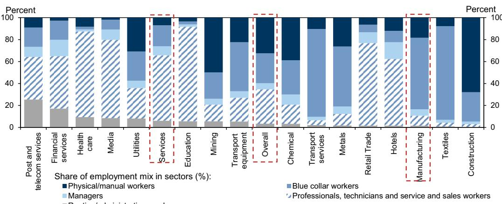
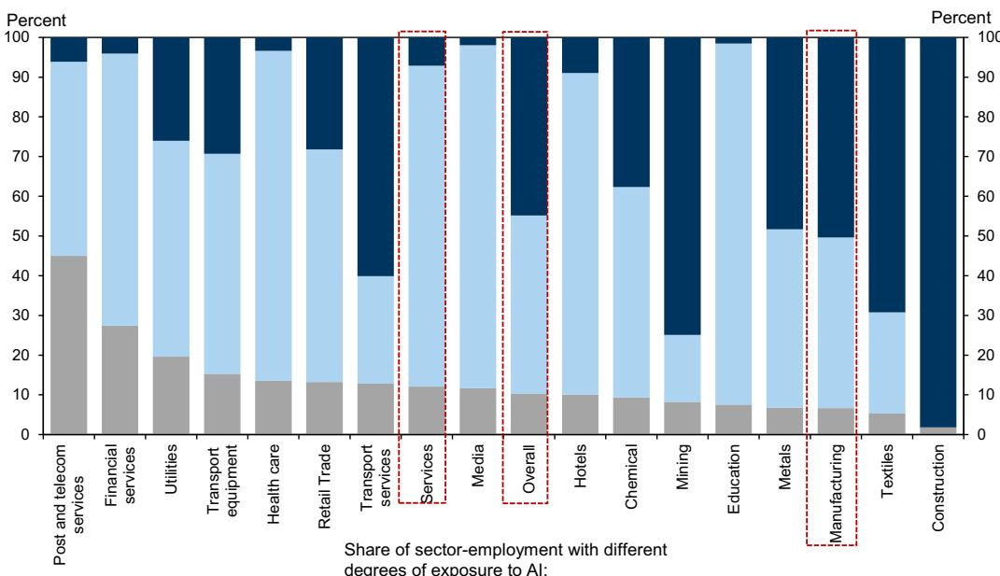

# GS：亚洲宏观分析-印度生成式AI与就业交叉影响

印度劳动力市场正面临生成式AI带来的结构性变化。GS在最新发布的亚洲宏观环境分析报告中，基于任务层面的O*NET数据和ILO就业数据，对印度非农就业的AI暴露度进行了量化评估。核心判断是：生成式AI对印度就业市场的影响更偏向“互补”而非“替代”，但行业和职业之间的分化将十分显著。

报告估计，在基准情景下，印度非农工作中约13-15%的任务内容暴露于生成式AI相关的自动化。如果考虑任务复杂度的上下限，这一比例在9%至17%之间波动。更重要的是，GS将职业按AI暴露度分为三类：高暴露职业更可能面临替代，中等暴露职业更可能被增强。加权计算后，约8-12%的非农就业面临替代不确定性，而42-48%的就业可能被AI增强，其余岗位基本不受影响。

## 1. 替代不确定性集中在常规文职和技术岗位

就业下降预计集中在特定职业类别。报告指出，常规文职支持人员、专业技术人员和助理专业人员面临最高的替代不确定性。这些岗位的工作内容包含大量可编码、重复性的任务，如基本合规检查、文档处理和标准化测试评分。

与之形成对比的是，体力型常规职业——包括工匠、贸易相关工人和机器操作员——的就业可能反而增加。原因在于，物理操作、手工劳动和人际交互任务目前仍难以被生成式AI自动化。这种职业间的此消彼长，意味着印度劳动力市场将经历一次显著的职业构成重塑。

> **KC评论：** 报告隐含了一个容易被忽略的机制：替代和增强不是零和游戏。当文职岗位被AI替代后，企业释放的成本可能重新配置到需要物理操作或人际交互的岗位，从而推高后者的就业。读者在观察行业就业数据时，不应只看被替代的岗位数量，还要看哪些岗位在净增。

## 2. 服务业内部出现“增强”与“替代”的分化

行业层面的暴露度差异更为鲜明。医疗、教育、资金和专业服务因其较高的知识密集度和数据分析需求，更可能从AI增强中受益。例如，AI可以辅助医生进行诊断和治疗规划（难度等级6），或为教师提供个性化学习工具（难度等级3-4）。

而邮政与电信服务、以及部分IT业务流程服务（BPS）则面临更高的替代不确定性。这些行业集中了大量客户支持、文档处理和流程操作任务，属于可编码的常规工作。报告特别指出，在ILO的分类体系中，印度IT和IT服务业的就业数据被分散归入“媒体娱乐”和“资金服务”两个类别，前者被标记为高互补性，后者则被标记为高替代不确定性——这一分类细节值得关注。

制造业和建筑业由于任务内容更偏物理性质，直接受影响程度较低，其任务暴露度仅约8%。

## 3. 全球能力中心（GCC）的扩张可能缓冲替代冲击

对于印度最受关注的科技服务业，报告提供了一个重要的观察视角。虽然常规IT-BPS功能面临替代不确定性，但整体科技行业就业、服务出口和GCC扩张目前仍保持韧性。

数据显示，过去三年中，印度前六大IT服务公司的净裁员约6.4万人（总员工约170万），但同期科技服务行业其他部分（包括GCC）新增了约70万个岗位，总就业达到440万人。这意味着，替代效应目前集中在头部企业，而GCC的扩张正在吸收部分被释放的劳动力。报告认为，这种结构性缓冲可能持续，但前提是GCC的业务模式从低成本执行向高价值分析转型。

## 4. 生产率提升的潜力与基础设施约束

报告估计，生成式AI的采用可能在10年内将印度年劳动生产率增速提升约0.4个百分点，区间范围为0.1至0.8个百分点，具体取决于AI能够处理的任务复杂度。知识密集型服务业——医疗、教育、媒体、部分资金和专业服务——最有可能受益，而建筑和制造业的增益可能有限。

但报告也明确指出了基础设施瓶颈。印度目前的数据中心容量仅约1GW，占全球总量的1%。要支持14亿人口规模的AI应用扩散，需要在计算能力、数据中心建设、可靠电力和水资源方面进行大规模研究。此外，目的地市场的保护主义——如欧盟对跨境数据流动的审查加强，以及美国对AI主权的强调——可能对印度服务出口增长构成外部约束。

> **KC评论：** 报告对生产率提升的预测（0.4pp/年）看起来温和，但需要放在印度当前约5%的劳动生产率增速背景下来看。这意味着AI带来的增量贡献约为8%。更关键的是，报告指出采用顺序会影响结果——如果企业优先部署劳动增强型AI，再推进替代型AI，生产率提升会更早显现，劳动力市场的阵痛也会更平缓。这一判断对政策制定者和企业管理者都有实际参考价值。

For informational purposes only. Portions may be generated,translated,summarized,or edited with AI assistance based on source materials and may contain omissions or errors. Please verify independently. This is not investment,legal,tax,accounting,or other professional advice.

For informational purposes only. Portions may be generated,translated,summarized,or edited with AI assistance based on source materials and may contain omissions or errors. Please verify independently. This is not investment,legal,tax,accounting,or other professional advice.

