July 27, 2026 09:00 PM GMT

Greater China Semiconductors | Asia Pacific

# AI Networking: Scale-up Technology Enables China's AI Supernodes

Following our WAIC takeaways, we further examine China's emerging scale-up landscape, the role of optical interconnect, and implications for the domestic interconnect supply chain.

AI Supernodes enabled by scale-up are becoming the focus of China's AI computing landscape. Alongside our China WAIC takeaways, we provide an in-depth follow-up study of China's scale-up technology development. As we wrote in China's AI Accelerators – Who's Poised to Win?, Chinese AI GPUs are strong in optical networking and server rack design at the system level, although they remain constrained by wafer process technology at the chip level (Exhibit 6). These chip-level constraints are shifting competition in China's AI computing market from standalone chip specs to system solutions. WAIC 2026 featured fewer chip launches and more supernode solutions. Leading domestic accelerator vendors displayed rack-scale or multi-rack supernodes with scale-up domains of 64 accelerators or more, mostly enabled by proprietary scale-up technologies.

China's scale-up landscape is rapidly broadening, led by proprietary fabrics but spanning multiple system architectures (Exhibit 4). A year ago, our US semis team published Semiconductors: Scaling the AI Opportunity: A Scale-Up Network Primer (29 Aug 2025); China is now catching up quickly in scale-up technology. Huawei remains the domestic scale leader, with Atlas 950 using UnifiedBus 2.0 to connect 1,024 NPUs in the demonstrated configuration and designed to scale to 8,192 NPUs. Biren's next-gen BR2xx NPO architecture targets up to 1,024 GPUs through BLink 2.0. Sugon's scaleX640 connects 640 accelerators in a single rack. Moore Threads' (not covered) MTT C256 supports 128 GPUs in one rack and 256 across two racks through MT-Link 2.0, while MetaX, Alibaba and Enflame support 64- to 128-accelerator domains through MetaXLink-E, ICN, and GCU-LARE, respectively.

Stock implications: We believe Montage (OW, covered by Daniel Yen) is set to benefit from higher PCIe interconnect content in larger, distributed supernodes. As systems scale across racks, denser and longer PCIe links among CPUs, xPUs, switches, NICs and peripherals should support demand for PCIe retimers and PCIe switch chips. We also expect China AI GPU vendors, such as Hygon (OW, covered by Daisy Dai) (along with its ecosystem partner Sugon), Cambricon and Iluvatar (both OW, covered by Charlie Chan), to introduce or leverage scale-up technology to improve their AI server rack performance.

(Continued below.)

MS ASIA LIMITED+
Ethan Jia
Research Associate
Ethan.Jia@morganstanley.com +852 3963-2287

Charlie Chan
Equity Analyst
Charlie.Chan@morganstanley.com +886 2 2730-1725

Daniel Yen, CFA
Equity Analyst
Daniel.Yen@morganstanley.com +886 2 2730-2863

Daisy Dai, CFA
Equity Analyst
Daisy.Dai@morganstanley.com +852 2848-7310

Henry Zhao
Research Associate
Henry.Zhao@morganstanley.com +852 2239-7731

Tiffany Yeh
Equity Analyst
Tiffany.Yeh@morganstanley.com +886 2 7712-3032

Lucas Wang
Research Associate
Lucas.Wang@morganstanley.com +886 2 2730-2875

  
GREATER CHINA TECHNOLOGY SEMICONDUCTORS
Asia Pacific
Industry View Attractive

MS does and seeks to do business with companies covered in MS. As a result, investors should be aware that the firm may have a conflict of interest that could affect the objectivity of MS. Investors should consider MS as only a single factor in making their investment decision.

For analyst certification and other important disclosures, refer to the Disclosure Section, located at the end of this report.

+= Analysts employed by non-U.S. affiliates are not registered with FINRA, may not be associated persons of the member and may not be subject to FINRA restrictions on communications with a subject company, public appearances and trading securities held by a research analyst account.

## China AI Interconnect - Scale-up

## Global AI server scale-up technology trend

## What is scale-up networking?

Scale-up networking refers to high-speed communication between GPUs/accelerators within the same server or rack. Interconnecting accelerators allow them to function as one large supercomputer, accessing the same memory and processing the same workload. This differs from scale-out networking, which connects multiple systems across a broader data center infrastructure.

Montage's PCIe 6.x/CXL3.x x16 AEC has completed interoperability testing, and targets supernode and inter-rack deployments. Chinese systems deploying more xPUs per unit of compute could further increase PCIe content. Beyond standardized PCIe connectivity, multi-rack scale-up should also accelerate demand for domestic optical interconnect.

Exhibit 1: Scale-up interface data rate per lane  
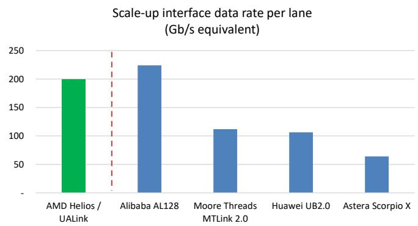  
Source: Company data, MS

Exhibit 2: Scale-up bandwidth per accelerator  
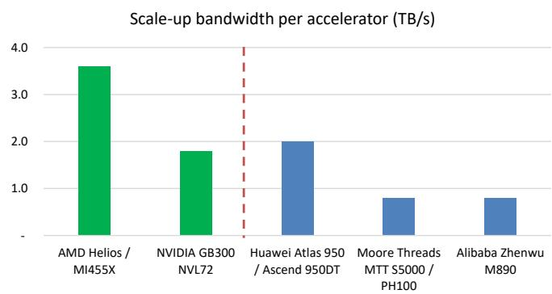  
Source: Company data, MS

Exhibit 3: US AI networking scale-up technologies

<table><tr><td>Technology</td><td>NVLink5</td><td>UALink 1.0</td><td>SUE</td><td>PCIe Gen 6</td><td>ICI</td><td>NeruonLink</td></tr><tr><td>Purpose</td><td>GPU-GPU; CPU-GPU</td><td>xPU-xPU</td><td>xPU-xPU</td><td>Primarily CPU-XPU;xPU-xPU</td><td>TPU interconnect</td><td>Trainiuminterconnect</td></tr><tr><td>Bandwidth</td><td>100 GB/s</td><td>100 GB/s</td><td>100 GB/s</td><td>64 GT/s</td><td>50-100 c B/S</td><td>not standardized</td></tr><tr><td>Latency</td><td>10-20 nm</td><td>&lt;100 nm</td><td>-</td><td>-</td><td>varies</td><td>varies</td></tr><tr><td>Ecosystem</td><td>NVIDIA (proprietary)</td><td>Open standard</td><td>Open standard</td><td>Open standard</td><td>Google (proprietary)</td><td>Amazon (proprietary)</td></tr><tr><td>Scalability</td><td>576 GPUs</td><td>1,024 xPUs</td><td>1,024 xPUs</td><td>varies</td><td>varies</td><td>64 Trainium</td></tr></table>

Source: Company data, MS

Exhibit 4: AI supernode scale-up solutions

<table><tr><td>Scale-up tech summary</td><td>NVIDIA</td><td>AMD</td><td>AsteraLabs</td><td>Huawei</td><td>Moore Threads</td><td>Sugon</td><td>MetaX</td><td>Alibaba</td><td>Enflame</td><td>Enflame</td><td>Biren</td><td>Biren</td></tr><tr><td>Supernode / accelerator name</td><td>GB300 NV/L72 (144 dies)</td><td>AMD Helios / Mi455X</td><td>N/A</td><td>Atlas 950 SuperPoD</td><td>MTT C256 / MTT S5000, PH100</td><td>scaleX640</td><td>Xijing S600 / C600</td><td>Panju AL128 / Zhenwu M890</td><td>Yunsui ESL64-O</td><td>NPO optical prototype</td><td>LightSphere 128 / Bili 166L</td><td>BR2xx NPO supernode (announced)</td></tr><tr><td>Scale-up solution</td><td>NVLink 5 + NVSwitch</td><td>UALink 1.0 / UALoE</td><td>Scorpio X-Series</td><td>UnifiedBus 2.0</td><td>MTLink 2.0</td><td>scaleX fabric</td><td>MetaXLink and MetaXLink-E</td><td>ALink system; MB90 implements ICN + ICN Switch 1.0</td><td>GCU-LARE</td><td>Undisclosed</td><td>Undisclosed</td><td>Blink 2.0</td></tr><tr><td>Technology foundation</td><td>Proprietary</td><td>Ethernet PHY-based, memory-semantic UALink fabric</td><td>PCIe Gen6</td><td>Proprietary</td><td>Proprietary</td><td>Open multi-vendor system architecture</td><td>Proprietary</td><td>Supports proprietary protocol and UALink</td><td>Proprietary</td><td>Undisclosed</td><td>SIPH OCS</td><td>Proprietary</td></tr><tr><td>Singal lane speed</td><td>Physical-lane rate N/A; 100GB/s per NVLink S link</td><td>200Gb/s per lane; 212.5GT/s raw signaling rate</td><td>Undisclosed</td><td>106.25Gb/s PAM4 under UB2.0 specification</td><td>112Gb/s per lane</td><td>Undisclosed</td><td>Undisclosed</td><td>112G/224G SerDes supported at AL128 platform level</td><td>Undisclosed</td><td>Undisclosed</td><td>Undisclosed</td><td>Undisclosed</td></tr><tr><td>Total bandwidth per accelerator</td><td>1.8TB/s</td><td>3.6TB/s</td><td>Undisclosed</td><td>2TB/s</td><td>800GB/s</td><td>Undisclosed</td><td>Undisclosed</td><td>800GB/s</td><td>Undisclosed</td><td>Undisclosed</td><td>Undisclosed</td><td>Undisclosed</td></tr><tr><td>Total accelerator units in supernode</td><td>72</td><td>72</td><td>Up to 80 per switch (merchant solution)</td><td>1,024 NPUs demonstrated / 8,192 NPUs announced</td><td>128 GPUs in one rack; 256 GPUs across two racks</td><td>640</td><td>64 GPUs in S600 rack; 128 GPUs through C600 MetaXLink-E</td><td>128 per rack; 64 per disclosed full-bandwidth ICN domain</td><td>64</td><td>512-plus</td><td>128</td><td>1,024</td></tr><tr><td>Physical interface</td><td>Passive copper; NVLink cable-cartridge / backplane</td><td>Electrical/copper</td><td>Electrical/copper</td><td>Hybrid: orthogonal cableless electrical interconnect intra-rack; optical interconnect inter-rack</td><td>All-copper Cable Tray</td><td>Electrical/copper</td><td>Cabless OEX electrical interconnect</td><td>Backplane-free orthogonal electrical; NPC interconnect</td><td>Cabless OEX electrical interconnect</td><td>NPO optics</td><td>SIPH optical circuit switching supplied by Lightelligence</td><td>NPO optics</td></tr><tr><td>Copper cable</td><td>Yes</td><td>Yes</td><td>Yes</td><td>No (cableless)</td><td>Yes</td><td>Undisclosed</td><td>No (cableless)</td><td>Yes</td><td>No (cableless)</td><td>No</td><td>No</td><td>No</td></tr><tr><td>CPO</td><td>No for scale-up (Yes for scale-out)</td><td>No</td><td>No</td><td>Undisclosed</td><td>No</td><td>Undisclosed</td><td>No</td><td>No</td><td>No</td><td>No</td><td>No</td><td>No</td></tr><tr><td>NPO</td><td>No</td><td>No</td><td>No</td><td>Undisclosed</td><td>No</td><td>Undisclosed</td><td>No</td><td>No</td><td>No</td><td>Yes</td><td>No</td><td>Yes</td></tr></table>

Source: Company data, MS

Exhibit 5: Scale-up vs. scale-out networking  
  
Source: Broadcom 2025 OCP Summit Keynote, MS

## China AI server scale-up development

In China, electrical interconnect remains the preferred option within racks, while optical becomes more important as scale-up domains extend across racks. Short electrical links offer lower cost and simpler integration within boards, trays and single-rack systems. Moore Threads' C256 uses an all-copper cable tray design, while the orthogonal zero-cable architectures by Enflame and MetaX also remain electrical. Optical interconnection becomes more attractive across racks, where copper reach, signal loss and power consumption become constraints. Huawei's Atlas 950 SuperPoD extends UnifiedBus across racks within the same SuperPoD using optical interconnect.

The transition toward optical connectivity may create demand for domestic switching and optical engine solutions designed for AI systems. At WAIC 2026, Lightelligence (not covered) showcased its new NPO/CPO switch solutions (Exhibit 8, Exhibit 9), which pair the switch ASIC from a leading domestic vendor, which we believe is Centec Communications (not covered), with Lightelligence's optical engine, including the SiPh PIC and selected EICs such as the TIA. The NPO/CPO solutions shorten the high-speed

electrical path between the switch ASIC and optical engine, improving bandwidth density and power efficiency, while NPO retains greater serviceability than CPO. The same architecture can serve both scale-up and scale-out networks, with scale-up becoming increasingly relevant as tightly coupled accelerator domains extend across racks.

More broadly, scale-up is emerging as the principal area of architectural differentiation, while scale-out remains the backbone of large-scale clusters. System solutions generally use a specialized fabric to connect accelerators within a supernode, and Ethernet-based fabrics such as RoCE or UBoE, or Infiniband to connect multiple supernodes across a cluster. NVIDIA combines NVLink with InfiniBand or Spectrum-X Ethernet; AMD Helios pairs UALink with Ethernet scale-out; Huawei uses UnifiedBus within the SuperPoD, and UBoE or RoCE for scale-out between SuperPoDs.

Exhibit 6: Relative strengths of AI industries in the US and China - optical networking almost on par

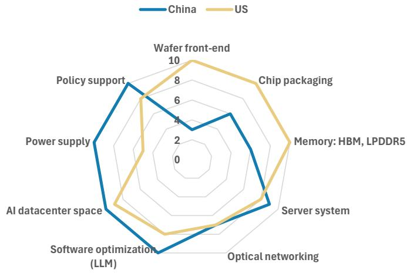  
Source: MS

Exhibit 7: Domestic chips have lower TCO and comparable per token cost (AI LLM inference) vs. NVIDIA's processors for China  
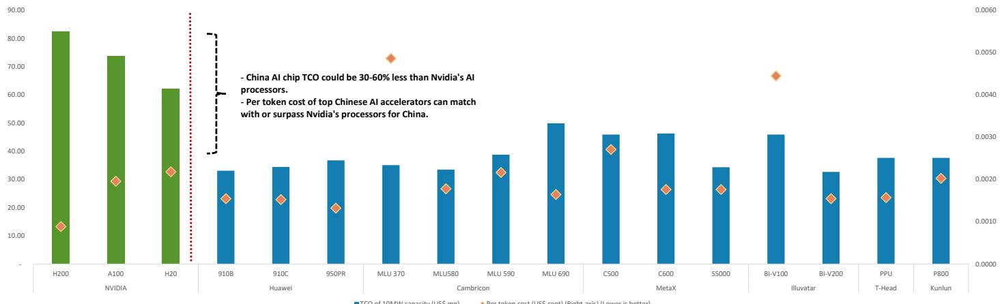  
Source: Company data, MS estimates

## Optical interconnect is progressing towards scale-up system deployment

Enflame and Lightelligence previously demonstrated an xPU-CPO prototype that places the optical engine beside the accelerator, enabling direct optical output from the xPU and reducing the electrical distance between the compute silicon and optics. At WAIC 2026, Enflame displayed an NPO-equipped GPU-server solution targeting scale-up domains of 512 accelerators or more, developed in partnership with Lightelligence (Exhibit 10). Biren also unveiled a next-gen BR2xx-based NPO architecture designed to support a scale-up domain of up to 1,024 GPUs (Exhibit 11). Also, LightSphere X (jointly developed by Lightelligence, Biren, ZTE, and other partners) incorporates Lightelligence's SiPh interconnect and dOCS technology, enabling the accelerator domain to extend across racks and allowing the topology to be reconfigured according to workload requirements (Exhibit 12). These projects show domestic optical technology being integrated at both the accelerator optical-I/O layer and the distributed optical-switching layer, to support larger, multi-rack scale-up domains.

Exhibit 8: 51.2T CPO switch module (displayed by Lightelligence)  
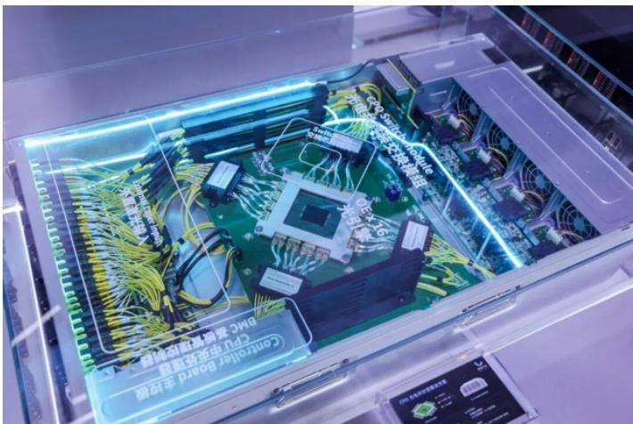  
Source: Company data, MS

Exhibit 9: NPO switch module (displayed by Lightelligence)  
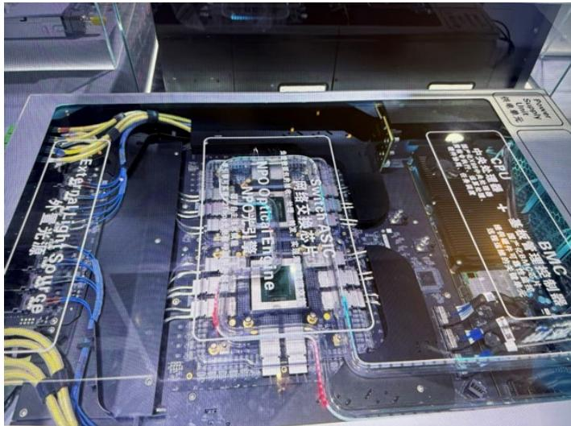  
Source: Company data, MS

Exhibit 10: Enflame's NPO optical interconnect solution for scale-up  
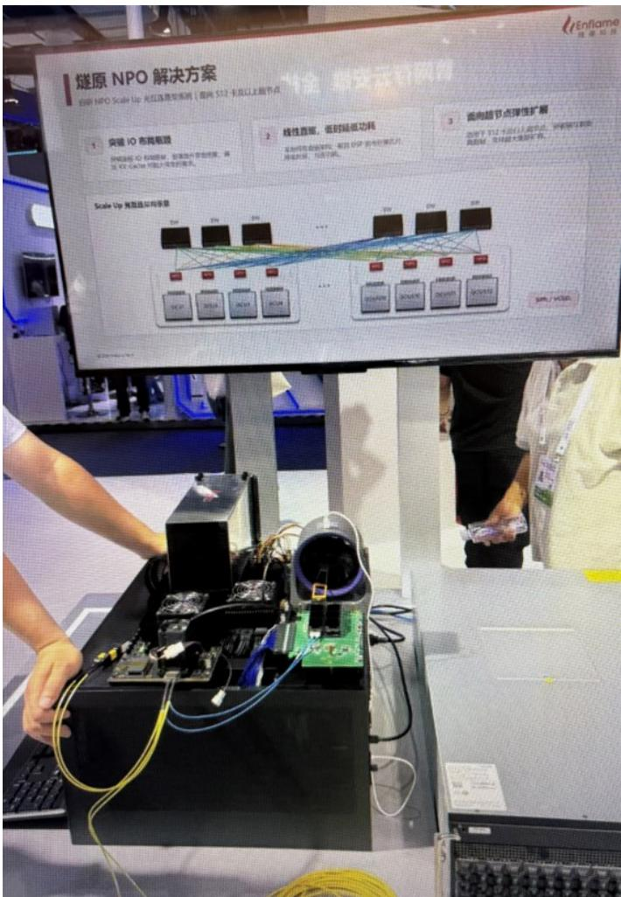  
Exhibit 12: LightSphere X (Lightelligence)  
Source: Company data

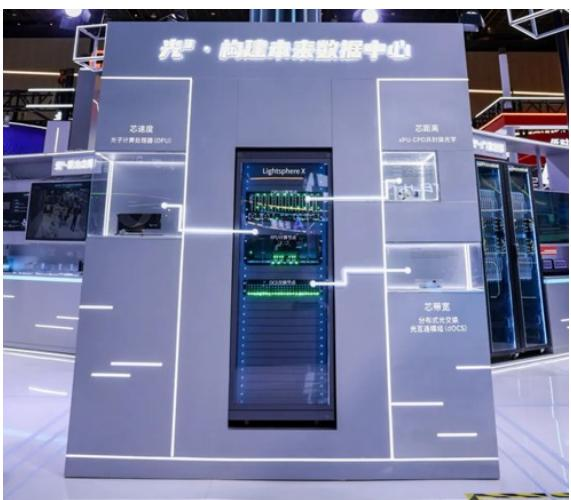  
Source: Company data  
Source: Company data, MS

Exhibit 11: Biren's NPO optical interconnect solution for scale-up  
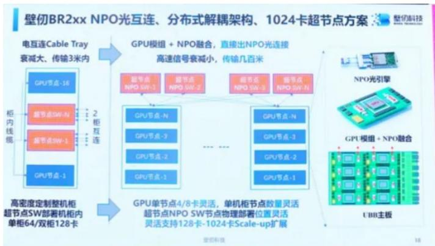

## US scale-up networking ecosystem and TAM forecast

Exhibit 13: Chinese CSPs' capex will be a key demand driver for Chinese AI GPUs  
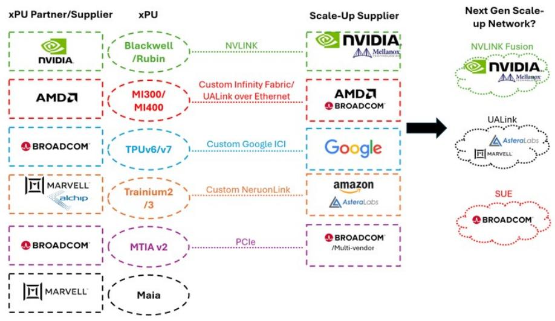  
Source: Company data, MS

Exhibit 14: US semi : Scale-up TAM estimate (\$mn)  
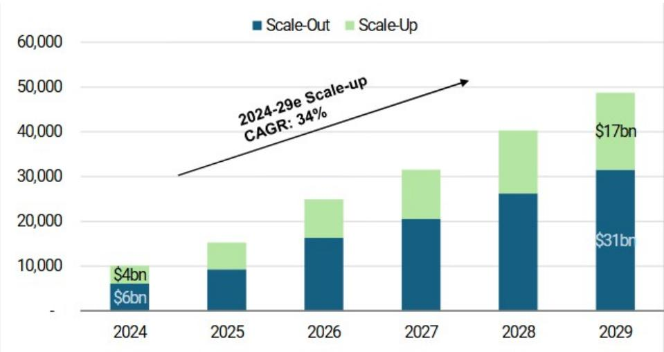  
Source: Company data, MS (E) estimates

This report references U.S. Executive Order 14032 and/or entities or securities that are designated thereunder. U.S. persons may be prohibited from buying certain securities of entities named in this report. Readers are solely responsible for ensuring that their investment activities are carried out in compliance with applicable laws.

This report references export controls and/or entities that may be subject to export control restrictions. Readers are solely responsible for ensuring that their investment or trade activities are carried out in compliance with applicable laws.

This report references U.S. Executive Order 14105 and/or entities that may be in scope of such order. U.S. persons may be prohibited from engaging in certain transactions or otherwise require certain other transactions be notified to the U.S. Department of Treasury. Readers are solely responsible for ensuring that their investment or trade activities are carried out in compliance with applicable laws.

## Valuation Methodology and Risks

## Montage Technology Co Ltd (6809.HK)

Base case, residual income model. Key assumptions:

■ 8.4% CoE (1.2 beta, 3.0% risk-free rate, and 4.5% risk premium)

■ 30% payout ratio

■ 19.3% medium-term growth rate

■ 4% terminal growth rate

These assumptions reflect cloud capex growth, DRAM interface technology migration, and Montage's strong position in China's datacenter semi localization. We then apply an exchange rate of 1.15 HKD:1 RMB, assuming no H-share discount vs the A-share.

## Risks to Upside

■ Faster-than-expected phase-out of US peers

■ Faster-than-expected spec migration

## Risks to Downside

■ Weaker-than-expected cloud demand

■ Slower-than-expected DRAM interface technology migration

■ Delay in new product launches

## Montage Technology Co Ltd (688008.SS)

Base case, residual income model. Key assumptions:

■ 8.4% CoE (1.2 beta, 3.0% risk-free rate, and 4.5% risk premium)

■ 30% payout ratio

■ 19.3% medium-term growth rate

■ 4% terminal growth rate

We believe these assumptions are justified, given the cloud capex growth, DRAM interface technology migration, and Montage's strong position in China's datacenter semi localization.

## Risks to Upside

■ Faster-than-expected phase-out of US peers

■ Faster-than-expected spec migration

## Risks to Downside

■ Weaker-than-expected cloud demand

■ Slower-than-expected DRAM interface technology migration

■ Delay in new product launches

## Hygon Information Technology Co., Ltd. (688041.SS)

We assume an 8.0% cost of equity (beta 1.05, risk-free rate 2.0% and risk premium 5.8%), a payout ratio of 50%, a medium-term growth rate of 25.0%, and a terminal growth rate of 5.0%, all of which are in line with other China AI chip companies under our coverage.

## Risks to Upside

■ Hygon further differentiates itself from local CPU and GPU competitors and gains significant market share in China's CPU and GPU markets

■ China AI demand is stronger than expected

■ Faster ramp-up of leading node capacity

## Risks to Downside

■ Intensified pricing competition among local GPU companies

■ China AI demand is weaker than expected

■ Slower yield improvement and capacity buildout at local leading node foundries

## Cambricon Technology Corporation (688256.SS)

Key valuation assumptions underpinning our model include: an 8.4% cost of equity (derived from a beta of 1.06, risk-free rate of 2.0%, and equity risk premium of 6.0%), a long-term payout ratio of 40% (was 57%), a medium-term growth rate of 16%, and a terminal growth rate of 6.0%.

## Risks to Upside

■ Stronger-than-expected AI demand

■ CSP order ramp-up

■ Accelerating localization

## Risks to Downside

■ Capacity and yield constraints

■ Customer concentration risk

■ Slower technology iteration

## Iluvatar CoreX Semiconductor Co., Ltd. (9903.HK)

Key valuation assumptions include:

■ An 8.3% cost of equity (derived from a beta of 1.05, risk-free rate of 2.0%, and equity risk premium of 6.0%)

■ A long-term payout ratio of 34% (was 33%)

■ A medium-term growth rate of 16%

■ A perpetual terminal growth rate of 6%

## Risks to Upside

■ Stronger-than-expected CSP orders

■ Faster CUDA replacement with Iluvatar's software

■ Expansion of overseas and domestic capacity

## Risks to Downside

■ Order ramp below expectations

■ Escalation of sanctions

■ Intensifying competition

## Disclosure Section

The information and opinions in MS were prepared or are disseminated by MS Asia Limited (which accepts the responsibility for its contents) and/or MS Asia (Singapore) Pte. (Registration number 199206298Z) and/or MS Asia (Singapore) Securities Pte Ltd (Registration number 200008434H), regulated by the Monetary Authority of Singapore (which accepts legal responsibility for its contents and should be contacted with respect to any matters arising from, or in connection with, MS), and/or MS Taiwan Limited and/or MS & Co International plc, Seoul Branch, and/or MS Australia Limited (A.B.N. 67 003 734 576, holder of Australian financial services license No. 233742, which accepts responsibility for its contents), and/or MS Wealth Management Australia Pty Ltd (A.B.N. 19 009 145 555, holder of Australian financial services license No. 240813, which accepts responsibility for its contents), and/or MS India Company Private Limited having Corporate Identification No (CIN) U22990MH1998PTC115305, regulated by the Securities and Exchange Board of India ("SEBI") and holder of licenses as a Research Analyst (SEBI Registration No. INH000001105); Stock Broker (SEBI Stock Broker Registration No. INZ000244438), Merchant Banker (SEBI Registration No. INM000011203), and depository participant with National Securities Depository Limited (SEBI Registration No. IN-DP-NSDL-567-2021) having registered office at Altimus, Level 39 & 40, Pandurang Budhkar Marg, Worli, Mumbai 400018, India; Telephone no. +91-22-61181000; Compliance Officer Details: Mr. Tejarshi Hardas, Tel. No.: +91-22-61181000 or Email: tejarshi.hardas@morganstanley.com; Grievance officer details: Mr. Tejarshi Hardas, Tel. No.: +91-22-61181000 or Email: msic-compliance@morganstanley.com which accepts the responsibility for its contents and should be contacted with respect to any matters arising from, or in connection with, MS, and their affiliates (collectively, "MS"). MS India Company Private Limited (MSICPL) may use AI tools in providing research services. All recommendations contained herein are made by the duly qualified research analysts.

For important disclosures, stock price charts and equity rating histories regarding companies that are the subject of this report, please see the MS Disclosure Website at www.morganstanley.com/eqr/disclosures/webapp/generalresearch, or contact your investment representative or MS at 1585 Broadway, (Attention: Research Management), New York, NY, 10036 USA.

For valuation methodology and risks associated with any recommendation, rating or price target referenced in this research report, please contact the Client Support Team as follows: US/Canada +1 800 303-2495; Hong Kong +852 2848-5999; Latin America +1 718 754-5444 (U.S.); London +44 (0)20-7425-8169; Singapore +65 6834-6860; Sydney +61 (0)2-9770-1505; Tokyo +81 (0)3-6836-9000. Alternatively you may contact your investment representative or MS at 1585 Broadway, (Attention: Research Management), New York, NY 10036 USA.

## Analyst Certification

The following analysts hereby certify that their views about the companies and their securities discussed in this report are accurately expressed and that they have not received and will not receive direct or indirect compensation in exchange for expressing specific recommendations or views in this report: Charlie Chan; Daisy Dai, CFA; Tiffany Yeh; Daniel Yen, CFA.

## Global Research Conflict Management Policy

MS has been published in accordance with our conflict management policy, which is available at www.morganstanley.com/institutional/research/conflictpolicies. A Portuguese version of the policy can be found at www.morganstanley.com.br

## Important Regulatory Disclosures on Subject Companies

As of June 30, 2026, MS beneficially owned 1% or more of a class of common equity securities of the following companies covered in MS: ACM Research Inc, Advanced Micro-Fabrication Equipment Inc, Advanced Wireless Semiconductor Co, Alchip Technologies Ltd, AllRing Tech Co., AP Memory Technology Corp, ASE Technology Holding Co. Ltd., ASMPT Ltd, Cambricon Technology Corporation, Dosilicon Co Ltd, FOCI Fiber Optic Communications Inc, GigaDevice Semiconductor Beijing Inc, GlobalWafers Co Ltd, Gudeng Precision, Hangzhou Silan Microelectronics Co. Ltd., King Yuan Electronics Co Ltd, Macronix International Co Ltd, MediaTek, Montage Technology Co Ltd, Parade Technologies Ltd, Phison Electronics Corp, Powerchip Semiconductor Manufacturing Co, SG Micro Corp., Shanghai Fudan Microelectronics, Silergy Corp., Silicon Motion, TSMC, UMC, Unigroup Guoxin Microelectronics Co Ltd, Vanguard International Semiconductor, WIN Semiconductors Corp, Winbond Electronics Corp, WPG Holdings, WT Microelectronics Co. Ltd..

Within the last 12 months, MS managed or co-managed a public offering (or 144A offering) of securities of Alchip Technologies Ltd, Iluvatar CoreX Semiconductor Co., Ltd., Montage Technology Co Ltd, Powerchip Semiconductor Manufacturing Co.

Within the last 12 months, MS has received compensation for investment banking services from ASMPT Ltd, Iluvatar CoreX Semiconductor Co., Ltd., Montage Technology Co Ltd, Powerchip Semiconductor Manufacturing Co.

In the next 3 months, MS expects to receive or intends to seek compensation for investment banking services from Advanced Micro-Fabrication Equipment Inc, Alchip Technologies Ltd, AP Memory Technology Corp, ASE Technology Holding Co. Ltd., ASMedia Technology Inc, ASMPT Ltd, Aspeed Technology, Espressif Systems, GigaDevice Semiconductor Beijing Inc, GlobalWafers Co Ltd, Gudeng Precision, Himax Technologies Inc, Hua Hong Semiconductor Ltd, Iluvatar CoreX Semiconductor Co., Ltd., Innoscience, King Yuan Electronics Co Ltd, Macronix International Co Ltd, MediaTek, MetaX Integrated Circuits, Montage Technology Co Ltd, Novatek, Phison Electronics Corp, Powerchip Semiconductor Manufacturing Co, Realtek Semiconductor, SG Micro Corp., Shenzhen Longsys Electronics Co Ltd, SICC Co Ltd, Silergy Corp., Silicon Motion, TSMC, UMC, Universal Scientific Ind. (Shanghai), Vanguard International Semiconductor, Winbond Electronics Corp, WinWay Technology Co Ltd, WPG Holdings, WT Microelectronics Co. Ltd..

Within the last 12 months, MS has received compensation for products and services other than investment banking services from ASE Technology Holding Co. Ltd., King Yuan Electronics Co Ltd, MediaTek, Nanya Technology Corp., Novatek, Nuvoton Technology Corporation, Realtek Semiconductor, Silicon Motion, SMIC, TSMC, UMC, Universal Scientific Ind. (Shanghai), Winbond Electronics Corp, WT Microelectronics Co. Ltd..

Within the last 12 months, MS has provided or is providing investment banking services to, or has an investment banking client relationship with, the following company: Advanced Micro-Fabrication Equipment Inc, Alchip Technologies Ltd, AP Memory Technology Corp, ASE Technology Holding Co. Ltd., ASMedia Technology Inc, ASMPT Ltd, Aspeed Technology, Espressif Systems, GigaDevice Semiconductor Beijing Inc, GlobalWafers Co Ltd, Gudeng Precision, Himax Technologies Inc, Hua Hong Semiconductor Ltd, Iluvatar CoreX Semiconductor Co., Ltd., Innoscience, King Yuan Electronics Co Ltd, Macronix International Co Ltd, MediaTek, MetaX Integrated Circuits, Montage Technology Co Ltd, Novatek, Phison Electronics Corp, Powerchip Semiconductor Manufacturing Co, Realtek Semiconductor, SG Micro Corp., Shenzhen Longsys Electronics Co Ltd, SICC Co Ltd, Silergy Corp., Silicon Motion, TSMC, UMC, Universal Scientific Ind. (Shanghai), Vanguard International Semiconductor, Winbond Electronics Corp, WinWay Technology Co Ltd, WPG Holdings, WT Microelectronics Co. Ltd..

Within the last 12 months, MS has either provided or is providing non-investment banking, securities-related services to and/or in the past has entered into an agreement to provide services or has a client relationship with the following company: ASE Technology Holding Co. Ltd., Iluvatar CoreX Semiconductor Co., Ltd., King Yuan Electronics Co Ltd, MediaTek, Montage Technology Co Ltd, Nanya Technology Corp., Novatek, Nuvoton Technology Corporation, Realtek Semiconductor, Silicon Motion, SMIC, TSMC, UMC, Universal Scientific Ind. (Shanghai), Winbond Electronics Corp, WT Microelectronics Co. Ltd..

The equity research analysts or strategists principally responsible for the preparation of MS have received compensation based upon various factors, including quality of research, investor client feedback, stock picking, competitive factors, firm revenues and overall investment banking revenues. Equity Research analysts' or strategists' compensation is not linked to investment banking or capital markets transactions performed by MS or the profitability or revenues of particular trading desks.

MS and its affiliates do business that relates to companies/instruments covered in MS, including market making, providing liquidity, fund management, commercial banking, extension of credit, investment services and investment banking. MS sells to and buys from customers the securities/instruments of companies covered in MS on a principal basis. MS may have a position in the debt of the Company or instruments discussed in this report. MS trades or may trade as principal in the debt securities (or in related derivatives) that are the subject of the debt research report.

Certain disclosures listed above are also for compliance with applicable regulations in non-US jurisdictions.

## STOCK RATINGS

MS uses a relative rating system using terms such as Overweight, Equal-weight, Not-Rated or Underweight (see definitions below). MS does not assign ratings of Buy, Hold or Sell to the stocks we cover. Overweight, Equal-weight, Not-Rated and Underweight are not the equivalent of buy, hold and sell. Investors should carefully read the definitions of all ratings used in MS. In addition, since MS contains more complete information concerning the analyst's views, investors should carefully read MS, in its entirety, and not infer the contents from the rating alone. In any case, ratings (or research) should not be used or relied upon as investment advice. An investor's decision to buy or sell a stock should depend on individual circumstances (such as the investor's existing holdings) and other considerations.

## Global Stock Ratings Distribution

## (as of June 30, 2026)

The Stock Ratings described below apply to MS's Fundamental Equity Research and do not apply to Debt Research produced by the Firm.

For disclosure purposes only (in accordance with FINRA requirements), we include the category headings of Buy, Hold, and Sell alongside our ratings of Overweight, Equal-weight, Not-Rated and Underweight. MS does not assign ratings of Buy, Hold or Sell to the stocks we cover. Overweight, Equal-weight, Not-Rated and Underweight are not the equivalent of buy, hold, and sell but represent recommended relative weightings (see definitions below). To satisfy regulatory requirements, we correspond Overweight, our most positive stock rating, with a buy recommendation; we correspond Equal-weight and Not-Rated to hold and Underweight to sell recommendations, respectively.

<table><tr><td></td><td colspan="2">Coverage Universe</td><td colspan="3">Investment Banking Clients (IBC)</td><td colspan="2">Other Material Investment ServicesClients (MISC)</td></tr><tr><td>Stock RatingCategory</td><td>Count</td><td>% of Total</td><td>Count</td><td>% of Total IBC</td><td>% of RatingCategory</td><td>Count</td><td>% of Total OtherMISC</td></tr><tr><td>Overweight/Buy</td><td>1544</td><td>42%</td><td>453</td><td>49%</td><td>29%</td><td>757</td><td>44%</td></tr><tr><td>Equal-weight/Hold</td><td>1577</td><td>43%</td><td>390</td><td>42%</td><td>25%</td><td>769</td><td>44%</td></tr><tr><td>Not-Rated/Hold</td><td>3</td><td>0%</td><td>1</td><td>0%</td><td>33%</td><td>1</td><td>0%</td></tr><tr><td>Underweight/Sell</td><td>544</td><td>15%</td><td>89</td><td>10%</td
