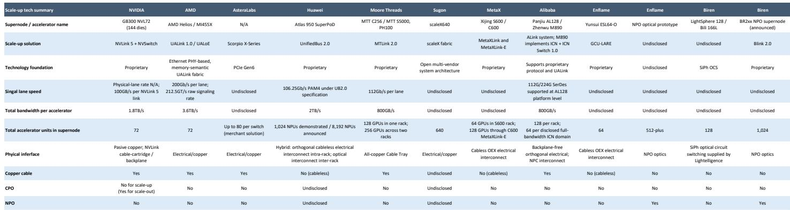
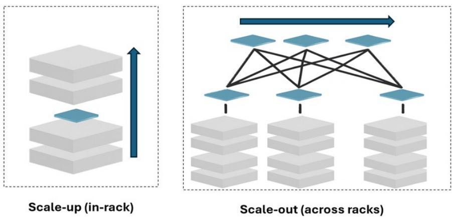

# MS：中国AI超节点规模互联技术演进

中国AI计算正在从单芯片性能竞争转向系统级解决方案的比拼，而规模互联技术成为这一转变的核心载体。MS在WAIC 2026后的跟踪报告中指出，中国AI GPU在晶圆制程层面仍受约束，但在光互联和服务器机架设计等系统层面已形成相对优势。这一判断基于一个可观察的事实：WAIC 2026上芯片新品发布减少，取而代之的是更多超节点方案展示。

报告认为，芯片级限制正在将中国AI计算市场的竞争焦点从独立芯片规格转向系统方案。国内主流加速器厂商展出了64颗或更多加速器组成的机架级或多机架超节点，多数采用自研规模互联技术。

## 1. 国内规模互联方案快速铺开，华为仍为领先者

MS梳理了国内主要厂商的规模互联技术布局。华为Atlas 950通过UnifiedBus 2.0连接1024颗NPU，设计目标可扩展至8192颗NPU。壁仞科技下一代BR2xx NPO架构目标支持1024颗GPU，通过BLink 2.0实现。中科曙光scaleX640在单机架内连接640颗加速器。摩尔线程MTT C256通过MT-Link 2.0支持单机架128颗GPU、双机架256颗。沐曦、阿里和燧原分别支持64至128颗加速器域。

这些方案的技术路径并不统一，但共同指向一个方向：规模互联正在成为中国AI计算基础设施的差异化竞争维度。

> **KC评论：** 报告中的Exhibit 4详细对比了各家方案的加速器数量、物理接口和互联技术基础。值得关注的是，华为的规模扩展能力明显领先，而其他厂商在64至256颗加速器区间形成差异化定位。这张表格是理解国内AI互联竞争格局的起点。

## 2. 电互联主导机架内，光互联向跨机架延伸

报告区分了两种互联场景。在机架内部，电互联仍是首选方案，成本更低、集成更简单。摩尔线程C256采用全铜缆线缆托盘设计，燧原和沐曦的零背板正交架构也保持电互联。但当规模互联域跨出单机架，铜缆的传输距离、信号损耗和功耗限制开始显现，光互联的优势变得突出。

华为Atlas 950 SuperPoD在跨机架场景中已采用光互联。WAIC 2026上，Lightelligence展示了与国内交换芯片厂商盛科通信合作的NPO/CPO交换方案，将交换ASIC与光学引擎结合，缩短高速电信号路径，提升带宽密度和功耗效率。报告认为，这种架构可同时服务于规模互联和规模扩展网络，而随着紧耦合加速器域跨机架扩展，规模互联场景的重要性将持续上升。

## 3. 光互联从原型走向系统部署，多家厂商推进NPO方案

报告提供了多个光互联向系统级部署推进的具体案例。燧原与Lightelligence此前展示了xPU-CPO原型，将光学引擎置于加速器旁，实现从xPU直接输出光信号。WAIC 2026上，燧原展示了配备NPO的GPU服务器方案，目标支持512颗以上加速器的规模互联域。壁仞发布了基于BR2xx的NPO架构，设计支持1024颗GPU的规模域。

此外，Lightelligence、壁仞、中兴等联合开发的LightSphere X，集成了硅光互联和dOCS技术，使加速器域可跨机架扩展，并允许根据工作负载需求重新配置拓扑结构。这些项目表明，国内光技术正在加速器光学I/O层和分布式光交换层两个层面被整合，以支持更大规模、多机架的规模互联域。

## 4. PCIe互联内容增长与供应链影响

随着系统跨机架扩展，CPU、xPU、交换机、网卡和外设之间需要更密集、更长的PCIe链路。报告认为，这将支撑对PCIe重定时器和PCIe交换芯片的需求。澜起科技的PCIe 6.x/CXL3.x x16 AEC已完成互操作性测试，目标指向超节点和跨机架部署。国内系统在单位算力中部署更多xPU的趋势，可能进一步增加PCIe内容。

报告也指出，国内AI GPU厂商如海光信息（及其生态伙伴中科曙光）、寒武纪和燧原科技，正在引入或利用规模互联技术来提升其AI服务器机架性能。这些厂商在系统层面的能力，正在成为其市场竞争力的重要组成部分。

> **KC评论：** 报告对PCIe互联内容的分析提供了一个可复用的观察框架：当规模互联域从单机架扩展到多机架，互联组件的种类和数量都会发生变化。关注PCIe重定时器、交换芯片以及光互联模块的需求变化，是跟踪这一趋势的切入点。Exhibit 4和Exhibit 13分别提供了技术方案对比和需求驱动因素的参考。

For informational purposes only. Portions may be generated,translated,summarized,or edited with AI assistance based on source materials and may contain omissions or errors. Please verify independently. This is not investment,legal,tax,accounting,or other professional advice.

For informational purposes only. Portions may be generated,translated,summarized,or edited with AI assistance based on source materials and may contain omissions or errors. Please verify independently. This is not investment,legal,tax,accounting,or other professional advice.

