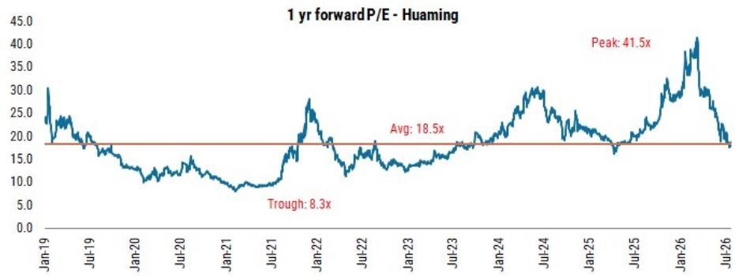
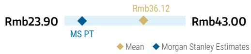
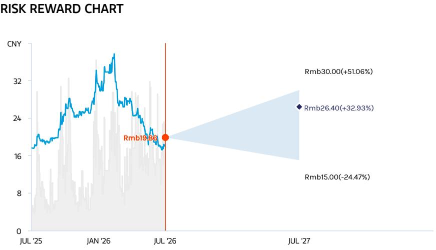
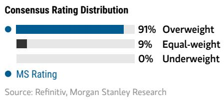

# 华明电力装备 | 亚太市场：在审慎中布局，为增长蓄力

<table><tr><td colspan="3">变化摘要</td></tr><tr><td>华明电力装备 (002270.SZ)</td><td>此前</td><td>当前</td></tr><tr><td>目标估值</td><td>Rmb34.50</td><td>Rmb26.40</td></tr></table>

我们认为市场对竞争格局的担忧可能过度，而低估了华明的长期发展潜力。在估值调整后，我们维持积极看法，并预计实际表现将优于市场预期，成为正面催化剂。

华明公司报价自2026年初的历史高点已出现明显调整，市场关注点包括主要竞争对手的产能扩张、美国市场拓展节奏慢于预期，以及2026年第一季度业绩表现。但我们持有不同观点，认为当前估值水平相较于全球可比公司具有一定吸引力。我们下调了2026-2028年的净利润预测，以反映对非电网国内业务更为审慎的增长预期、股权激励带来的费用增加，以及汇率波动的影响。基于此，我们调整了目标估值。

**竞争对手产能扩张的真正含义是什么？** 华明的主要竞争对手MR计划在2028-2030年间将产能弹性较高。市场认为这将加剧竞争，但我们认为这可能也预示着市场总规模的超预期扩张。近期欧盟电气化行动计划显示，欧盟目标是到2040年将电气化率提升至46%，而过去十年该比例一直停滞在23%左右。这将推动可再生能源和电动汽车的普及，使得配电网中低压分接开关的安装需求更为迫切，从而创造出比当前高压分接开关更大的市场空间。

**华明的海外战略是否发生变化？** 我们重申对华明海外拓展的积极看法。这一拓展并非源于供给短缺，而是基于成本优势以及客户对供应链多元化的意愿提升。美国市场的业务拓展需经过产品测试阶段，我们将其视为2026年第四季度的潜在催化剂。我们预计华明电力装备的出口收入在2025-2029年间将保持约30%的年复合增长率，海外收入占比有望从2025年的34%提升至2029年的54%。

**盈利增长预计从2027年起重新加速：** 经过我们的预测调整，2026年净利润增长约11%，与卖方共识基本一致，但高于部分买方预期。展望2026年之后，我们认为随着产品结构优化以及汇率和股权激励费用影响的减弱，盈利增长有望恢复至18-20%的年均水平。

<table><tr><td colspan="2">MS ASIA LIMITED+</td></tr><tr><td colspan="2">Tom Li</td></tr><tr><td colspan="2">Equity Analyst</td></tr><tr><td>Tom.Li1@morganstanley.com</td><td>+852 2239-1059</td></tr><tr><td colspan="2">Eva Hou</td></tr><tr><td colspan="2">Equity Analyst</td></tr><tr><td>Eva.Hou@morganstanley.com</td><td>+852 2848-6964</td></tr></table>

## 亚洲夏季研讨会 2026

## 华明电力装备 (002270.SZ, 002270 CS)

<table><tr><td>股票评级</td><td>Overweight</td></tr><tr><td>行业观点</td><td>Attractive</td></tr><tr><td>目标估值</td><td>Rmb26.40</td></tr><tr><td>目标估值潜在空间 (%)</td><td>33</td></tr><tr><td>收盘价 (2026年7月27日)</td><td>Rmb19.86</td></tr><tr><td>52周区间</td><td>Rmb38.01-17.23</td></tr><tr><td>摊薄后总股本 (百万)</td><td>896</td></tr><tr><td>当前市值 (百万)</td><td>Rmb17,799.0</td></tr><tr><td>企业价值 (百万)</td><td>Rmb17,239.6</td></tr><tr><td>日均交易额 (百万)</td><td>Rmb411</td></tr></table>

<table><tr><td>财年截止日</td><td>12/25</td><td>12/26e</td><td>12/27e</td><td>12/28e</td></tr><tr><td>每股收益 (Rmb)**</td><td>0.8</td><td>0.9</td><td>1.0</td><td>1.2</td></tr><tr><td>此前每股收益 (Rmb)**</td><td>-</td><td>0.9</td><td>1.1</td><td>1.4</td></tr><tr><td>每股收益 (Rmb)§</td><td>0.8</td><td>0.9</td><td>1.1</td><td>1.3</td></tr><tr><td>净收入 (Rmb 百万)</td><td>2,426.8</td><td>2,697.6</td><td>3,088.4</td><td>3,524.8</td></tr><tr><td>EBITDA (Rmb 百万)</td><td>847.5</td><td>938.2</td><td>1,106.1</td><td>1,298.2</td></tr><tr><td>ModelWare 净利润 (Rmb 百万)</td><td>709.7</td><td>785.3</td><td>938.9</td><td>1,110.4</td></tr><tr><td>P/E</td><td>31.7</td><td>22.7</td><td>19.0</td><td>16.0</td></tr><tr><td>P/BV</td><td>7.1</td><td>5.3</td><td>4.8</td><td>4.4</td></tr><tr><td>RNOA (%)</td><td>29.4</td><td>28.2</td><td>28.0</td><td>31.2</td></tr><tr><td>ROE (%)</td><td>22.4</td><td>25.0</td><td>27.8</td><td>30.1</td></tr><tr><td>EV/EBITDA</td><td>25.8</td><td>18.7</td><td>15.8</td><td>13.3</td></tr><tr><td>股息率 (%)</td><td>2.2</td><td>3.1</td><td>3.5</td><td>4.2</td></tr><tr><td>FCF 回报表现 (%)**</td><td>2.1</td><td>3.5</td><td>4.0</td><td>4.8</td></tr><tr><td>杠杆率 (期末) (%)</td><td>(27.5)</td><td>(17.2)</td><td>(19.1)</td><td>(21.1)</td></tr></table>

除非另有说明，所有指标均基于MS ModelWare框架
§ = 共识数据由Refinitiv Estimates提供
\*\* = 基于共识方法论
e = MS预测

MS与报告中涉及的公司有业务往来或寻求建立业务关系。因此，读者应注意可能存在利益冲突。读者应将MS视为决策参考因素之一。

## 分析师认证及其他重要披露信息，请参阅本报告末尾的披露章节。

+= 非美国关联机构雇用的分析师未在FINRA注册，可能不是会员的关联人士，可能不受FINRA关于与主题公司沟通、公开露面以及研究分析师账户持有证券交易限制的约束。

AlphaSignals 业绩预览

<table><tr><td>关注指标</td><td>关注指标预期</td><td>对共识每股收益的可能影响*</td></tr><tr><td colspan="3">华明电力装备 002270.SZ</td></tr><tr><td>分接开关出口收入</td><td>↑ 可能超预期</td><td>↑ 小幅上调</td></tr><tr><td colspan="3">*对共识每股收益的可能影响为未来12个月来源：公司数据，MS</td></tr></table>

资产负债表

## 财务摘要

图表1：财务摘要

<table><tr><td>Rmb 百万</td><td>2025</td><td>2026E</td><td>2027E</td><td>2028E</td></tr><tr><td>收入</td><td>2,427</td><td>2,698</td><td>3,088</td><td>3,525</td></tr><tr><td>营业成本</td><td>(1,104)</td><td>(1,209)</td><td>(1,349)</td><td>(1,501)</td></tr><tr><td>毛利润</td><td>1,322</td><td>1,488</td><td>1,740</td><td>2,023</td></tr><tr><td>税金及附加</td><td>(32)</td><td>(36)</td><td>(41)</td><td>(47)</td></tr><tr><td>销售费用</td><td>(252)</td><td>(243)</td><td>(263)</td><td>(282)</td></tr><tr><td>管理费用</td><td>(170)</td><td>(252)</td><td>(297)</td><td>(347)</td></tr><tr><td>研发费用</td><td>(88)</td><td>(98)</td><td>(113)</td><td>(129)</td></tr><tr><td>EBIT</td><td>781</td><td>859</td><td>1,027</td><td>1,219</td></tr><tr><td>财务费用</td><td>26</td><td>10</td><td>17</td><td>20</td></tr><tr><td>其他收益</td><td>47</td><td>76</td><td>86</td><td>96</td></tr><tr><td>其他支出</td><td>(6)</td><td>(7)</td><td>(8)</td><td>(9)</td></tr><tr><td>税前利润</td><td>848</td><td>939</td><td>1,122</td><td>1,327</td></tr><tr><td>所得税</td><td>(129)</td><td>(142)</td><td>(170)</td><td>(201)</td></tr><tr><td>年度利润</td><td>720</td><td>796</td><td>952</td><td>1,126</td></tr><tr><td>少数股东损益</td><td>(10)</td><td>(11)</td><td>(13)</td><td>(15)</td></tr><tr><td>净利润</td><td>710</td><td>785</td><td>939</td><td>1,110</td></tr><tr><td>一次性项目</td><td>39</td><td>50</td><td>58</td><td>66</td></tr><tr><td>经常性净利润</td><td>671</td><td>735</td><td>881</td><td>1,044</td></tr><tr><td>每股收益</td><td>0.79</td><td>0.88</td><td>1.05</td><td>1.24</td></tr><tr><td>每股股息</td><td>0.61</td><td>0.70</td><td>0.84</td><td>0.99</td></tr></table>

<table><tr><td>Rmb 百万</td><td>2025</td><td>2026E</td><td>2027E</td><td>2028E</td></tr><tr><td>现金及现金等价物</td><td>1,166</td><td>884</td><td>1,006</td><td>1,155</td></tr><tr><td>应收账款及合同资产</td><td>580</td><td>645</td><td>738</td><td>843</td></tr><tr><td>其他应收款</td><td>867</td><td>964</td><td>1,104</td><td>1,260</td></tr><tr><td>存货</td><td>387</td><td>424</td><td>473</td><td>526</td></tr><tr><td>其他流动资产</td><td>274</td><td>268</td><td>261</td><td>254</td></tr><tr><td>流动资产合计</td><td>3,274</td><td>3,185</td><td>3,583</td><td>4,038</td></tr><tr><td>有形固定资产净额</td><td>1,016</td><td>1,017</td><td>1,018</td><td>1,019</td></tr><tr><td>其他长期资产</td><td>918</td><td>927</td><td>938</td><td>952</td></tr><tr><td>非流动资产合计</td><td>1,935</td><td>1,945</td><td>1,957</td><td>1,971</td></tr><tr><td>资产总计</td><td>5,208</td><td>5,130</td><td>5,540</td><td>6,009</td></tr><tr><td>短期借款</td><td>220</td><td>220</td><td>220</td><td>220</td></tr><tr><td>应付账款</td><td>221</td><td>242</td><td>270</td><td>301</td></tr><tr><td>预收款项/合同负债</td><td>68</td><td>68</td><td>68</td><td>68</td></tr><tr><td>一年内到期的长期借款</td><td>106</td><td>106</td><td>106</td><td>106</td></tr><tr><td>其他流动负债</td><td>466</td><td>510</td><td>568</td><td>631</td></tr><tr><td>流动负债合计</td><td>1,081</td><td>1,146</td><td>1,232</td><td>1,326</td></tr><tr><td>长期借款</td><td>393</td><td>-</td><td>-</td><td>-</td></tr><tr><td>长期应付款</td><td>161</td><td>161</td><td>161</td><td>161</td></tr><tr><td>其他非流动负债</td><td>401</td><td>401</td><td>401</td><td>401</td></tr><tr><td>非流动负债合计</td><td>955</td><td>562</td><td>562</td><td>562</td></tr><tr><td>负债合计</td><td>2,036</td><td>1,708</td><td>1,794</td><td>1,888</td></tr><tr><td>少数股东权益</td><td>30</td><td>41</td><td>54</td><td>70</td></tr><tr><td>股本</td><td>227</td><td>227</td><td>227</td><td>227</td></tr><tr><td>资本公积</td><td>1,083</td><td>1,083</td><td>1,083</td><td>1,083</td></tr><tr><td>留存收益</td><td>1,832</td><td>2,071</td><td>2,381</td><td>2,741</td></tr><tr><td>股东权益</td><td>3,142</td><td>3,381</td><td>3,692</td><td>4,051</td></tr><tr><td>权益合计</td><td>3,172</td><td>3,422</td><td>3,746</td><td>4,121</td></tr><tr><td>负债及权益总计</td><td>5,208</td><td>5,130</td><td>5,540</td><td>6,009</td></tr></table>

来源：FactSet，公司数据，MS (E) 预测

<table><tr><td>Rmb 百万</td><td>2025</td><td>2026E</td><td>2027E</td><td>2028E</td></tr><tr><td>年度利润</td><td>720</td><td>796</td><td>952</td><td>1,126</td></tr><tr><td>调整项：</td><td></td><td></td><td></td><td></td></tr><tr><td>折旧</td><td>6</td><td>-</td><td>-</td><td>-</td></tr><tr><td>摊销</td><td>67</td><td>79</td><td>79</td><td>79</td></tr><tr><td>财务费用</td><td>19</td><td>(10)</td><td>(17)</td><td>(20)</td></tr><tr><td>其他</td><td>86</td><td>41</td><td>39</td><td>37</td></tr><tr><td>营运资本变动</td><td>(294)</td><td>(128)</td><td>(190)</td><td>(212)</td></tr><tr><td>经营活动产生的现金流量净额</td><td>604</td><td>778</td><td>863</td><td>1,009</td></tr><tr><td>资本支出</td><td>(112)</td><td>(140)</td><td>(140)</td><td>(140)</td></tr><tr><td>其他</td><td>163</td><td>10</td><td>10</td><td>10</td></tr><tr><td>投资活动产生的现金流量净额</td><td>51</td><td>(130)</td><td>(130)</td><td>(130)</td></tr><tr><td>股份发行</td><td>0</td><td>-</td><td>-</td><td>-</td></tr><tr><td>债务增加/(减少)</td><td>193</td><td>(393)</td><td>0</td><td>0</td></tr><tr><td>已付股息及利息</td><td>(614)</td><td>(537)</td><td>(611)</td><td>(731)</td></tr><tr><td>其他融资现金流</td><td>(166)</td><td>-</td><td>-</td><td>-</td></tr><tr><td>筹资活动产生的现金流量净额</td><td>(587)</td><td>(929)</td><td>(611)</td><td>(731)</td></tr><tr><td>汇率变动影响</td><td>(6)</td><td>-</td><td>-</td><td>-</td></tr><tr><td>现金净变动</td><td>62</td><td>(281)</td><td>122</td><td>148</td></tr><tr><td>期初现金</td><td>1,104</td><td>1,166</td><td>884</td><td>1,006</td></tr><tr><td>现金重述</td><td></td><td></td><td></td><td></td></tr><tr><td>期末现金</td><td>1,166</td><td>884</td><td>1,006</td><td>1,155</td></tr></table>

<table><tr><td colspan="5">关键比率</td></tr><tr><td></td><td>2025</td><td>2026E</td><td>2027E</td><td>2028E</td></tr><tr><td colspan="5">增长</td></tr><tr><td>收入</td><td>4.5%</td><td>11.2%</td><td>14.5%</td><td>14.1%</td></tr><tr><td>毛利润</td><td>16.7%</td><td>12.5%</td><td>16.9%</td><td>16.3%</td></tr><tr><td>EBIT</td><td>16.9%</td><td>10.1%</td><td>19.5%</td><td>18.7%</td></tr><tr><td>净利润</td><td>15.5%</td><td>10.7%</td><td>19.6%</td><td>18.3%</td></tr><tr><td>经常性净利润</td><td>15.3%</td><td>9.6%</td><td>19.9%</td><td>18.5%</td></tr><tr><td colspan="5">利润率</td></tr><tr><td>毛利率</td><td>54.5%</td><td>55.2%</td><td>56.3%</td><td>57.4%</td></tr><tr><td>EBITDA 利润率</td><td>35.2%</td><td>34.8%</td><td>35.8%</td><td>36.8%</td></tr><tr><td>EBIT 利润率</td><td>32.2%</td><td>31.9%</td><td>33.3%</td><td>34.6%</td></tr><tr><td>净利润率</td><td>29.2%</td><td>29.1%</td><td>30.4%</td><td>31.5%</td></tr><tr><td>净利润率</td><td>27.6%</td><td>27.2%</td><td>28.5%</td><td>29.6%</td></tr><tr><td colspan="5">回报</td></tr><tr><td>ROA</td><td>12.9%</td><td>14.3%</td><td>15.9%</td><td>17.4%</td></tr><tr><td>ROAE</td><td>21.3%</td><td>22.5%</td><td>24.9%</td><td>27.0%</td></tr><tr><td>ROE</td><td>21.3%</td><td>21.7%</td><td>23.9%</td><td>25.8%</td></tr><tr><td colspan="5">杠杆</td></tr><tr><td>净债务 (净现金) / 权益</td><td>净现金</td><td>净现金</td><td>净现金</td><td>净现金</td></tr><tr><td>净债务 (净现金) / 资本</td><td>净现金</td><td>净现金</td><td>净现金</td><td>净现金</td></tr><tr><td>EBITDA 利息覆盖倍数</td><td>(32.7)</td><td>(95.5)</td><td>(12.9)</td><td>(13.5)</td></tr><tr><td colspan="5">估值</td></tr><tr><td>EV/EBITDA</td><td>25.8</td><td>18.4</td><td>15.5</td><td>13.1</td></tr><tr><td>P/E</td><td>31.7</td><td>22.7</td><td>19.0</td><td>16.0</td></tr><tr><td>P/BV</td><td>7.1</td><td>5.3</td><td>4.8</td><td>4.4</td></tr><tr><td>股息率</td><td>2.4%</td><td>3.5%</td><td>4.2%</td><td>5.0%</td></tr></table>

## 预测与目标估值调整

我们下调了2026-2028年的收入预测，主要考虑到非电网国内业务（包括工业和可再生能源领域）的增长更为审慎。同时，我们假设因股权激励和汇率波动导致费用率上升，因此对同期净利润预测进行了下调。

我们目前的净利润预测较卖方共识低约4%，但可能仍高于部分买方预期。基于近期交流，部分较为审慎的读者预计2026年上半年净利润可能持平或略有下降。考虑到2025年第二季度的低基数以及2026年第一季度积压需求的释放，我们认为2026年第二季度的盈利表现可能优于市场预期。

图表2：关键预测 - 新 vs. 旧

<table><tr><td>Rmb 百万</td><td>2026E</td><td>2027E</td><td>2028E</td></tr><tr><td colspan="4">收入</td></tr><tr><td>新</td><td>2,698</td><td>3,088</td><td>3,525</td></tr><tr><td>旧</td><td>2,766</td><td>3,241</td><td>3,765</td></tr><tr><td>差异</td><td>-2%</td><td>-5%</td><td>-6%</td></tr><tr><td colspan="4">净利润总额</td></tr><tr><td>新</td><td>785</td><td>939</td><td>1,110</td></tr><tr><td>旧</td><td>827</td><td>1,014</td><td>1,230</td></tr><tr><td>差异</td><td>-5%</td><td>-7%</td><td>-10%</td></tr><tr><td colspan="4">每股收益</td></tr><tr><td>新</td><td>0.88</td><td>1.05</td><td>1.24</td></tr><tr><td>旧</td><td>0.92</td><td>1.13</td><td>1.37</td></tr><tr><td>差异</td><td>-5%</td><td>-7%</td><td>-10%</td></tr></table>

来源：公司数据，MS (E) 预测

图表3：MS预测 vs. 卖方共识

<table><tr><td>Rmb 百万</td><td>2026E</td><td>2027E</td><td>2028E</td></tr><tr><td colspan="4">收入</td></tr><tr><td>MS</td><td>2,698</td><td>3,088</td><td>3,525</td></tr><tr><td>共识</td><td>2,804</td><td>3,259</td><td>3,772</td></tr><tr><td>差异</td><td>-4%</td><td>-5%</td><td>-7%</td></tr><tr><td colspan="4">净利润总额</td></tr><tr><td>MS</td><td>785</td><td>939</td><td>1,110</td></tr><tr><td>共识</td><td>821</td><td>977</td><td>1,156</td></tr><tr><td>差异</td><td>-4%</td><td>-4%</td><td>-4%</td></tr></table>

来源：FactSet，MS (E) 预测

我们的目标估值调整至Rmb26.40，基于25倍远期P/E。这一倍数高于2019年以来的长期历史均值，但低于历史高点以及全球可比公司的平均估值水平。

图表4：华明一年远期P/E区间图  
  
来源：FactSet，公司数据，MS预测

图表5：P/E估值摘要

<table><tr><td colspan="2">P/E倍数估值</td></tr><tr><td>估值日期</td><td>2026年7月26日</td></tr><tr><td>目标P/E</td><td>25.0x</td></tr><tr><td>2027E 每股收益 (Rmb)</td><td>1.05</td></tr><tr><td>隐含每股价值 (Rmb)</td><td>26.2</td></tr><tr><td>按权益成本滚动调整</td><td>27.2</td></tr><tr><td>减：每股股息 (Rmb)</td><td>(0.7)</td></tr><tr><td>目标估值 (Rmb)</td><td>26.4</td></tr><tr><td>当前报价</td><td>19.9</td></tr><tr><td>目标估值潜在空间</td><td>33%</td></tr><tr><td colspan="2">估值输入参数</td></tr><tr><td>无风险利率</td><td>2.1%</td></tr><tr><td>权益市场风险溢价</td><td>4.5%</td></tr><tr><td>Beta</td><td>1.0</td></tr><tr><td>权益成本</td><td>6.6%</td></tr></table>

来源：FactSet，公司数据，MS (E) 预测

<table><tr><td></td><td>2025E</td><td>2026E</td><td>2027E</td><td>2028E</td><td>2029E</td></tr><tr><td>每股收益</td><td>0.79</td><td>0.88</td><td>1.05</td><td>1.24</td><td>1.46</td></tr><tr><td>每股股息</td><td>0.61</td><td>0.70</td><td>0.84</td><td>0.99</td><td>1.17</td></tr><tr><td>P/E (当前)</td><td>25.1</td><td>22.7</td><td>19.0</td><td>16.0</td><td>13.6</td></tr><tr><td>P/E (隐含)</td><td>33.4</td><td>30.1</td><td>25.2</td><td>21.3</td><td>18.0</td></tr><tr><td>股息率 (当前)</td><td>3.1%</td><td>3.5%</td><td>4.2%</td><td>5.0%</td><td>5.9%</td></tr></table>

<table><tr><td>定价能力：</td><td>正面</td></tr><tr><td>长期增长：</td><td>正面</td></tr></table>

风险回报主题说明请见此处

## 风险回报 – 华明电力装备 (002270.SZ)

高质量成长型公司

## 目标估值 Rmb26.40

我们的目标估值基于25倍一年远期P/E，高于2019年以来的长期历史均值，但低于历史高点及全球可比公司平均估值。

## 共识目标估值分布

来源：Refinitiv，MS

## 风险回报图

  
图例：— 历史表现 ● 当前报价 ◆ 目标估值  
来源：Refinitiv，MS

## 积极观点核心逻辑

盈利增长从2024-2026年的11-16%加速至2027-2029年的18-20%，驱动因素包括国内电网资本支出、全球市场份额提升以及特高压产品开发。

利润率扩张得益于产品结构优化——海外和特高压产品毛利率较传统国内产品有显著优势。

良好的竞争格局支撑现金流和高股息——我们预计2026-2029年股息支付率约80%。

当前估值水平低于全球可比公司，存在进一步重估空间。

## 风险回报主题

## 乐观情景

## 27.0x 2027E P/E

Rmb30.00

假设：1) 特高压产品市场份额较基准高3个百分点；2) 间接出口收入增速较基准高5个百分点；3) 直接出口收入增速较基准高5个百分点；4) 电力装备毛利率较基准高1个百分点。

## 基准情景

## 25.0x 2027E P/E

## Rmb26.40

假设：1) 特高压产品市场份额为3%/3.5%/4%；2) 间接出口收入年复合增长率40%；3) 直接出口收入年复合增长率15%；4) 电力装备平均毛利率61%。

## 审慎情景

## Rmb15.00

## 15.2x 2027E P/E

假设：1) 特高压产品市场份额较基准低3个百分点；2) 间接出口收入增速较基准低5个百分点；3) 直接出口收入增速较基准低5个百分点；4) 电力装备毛利率较基准低1个百分点。

来源：MS预测 ◆ 均值 ◆ MS预测  
来源：Refinitiv，MS

## 风险回报 – 华明电力装备 (002270.SZ)

## 关键盈利输入

<table><tr><td>驱动因素</td><td>2025年12月</td><td>2026年12月e</td><td>2027年12月e</td><td>2028年12月e</td></tr><tr><td>电力装备收入增长 (%)</td><td>16.1</td><td>10.8</td><td>16.8</td><td>16.0</td></tr><tr><td>综合毛利率 (%)</td><td>54.5</td><td>55.2</td><td>56.3</td><td>57.4</td></tr><tr><td>销售管理费用率 (%)</td><td>21.0</td><td>22.0</td><td>21.7</td><td>
