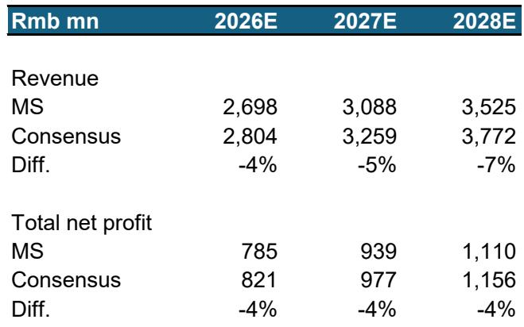
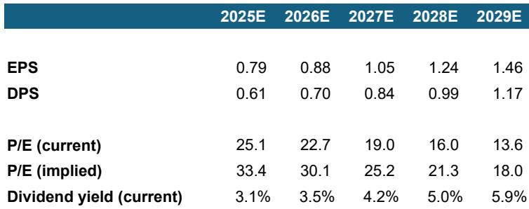
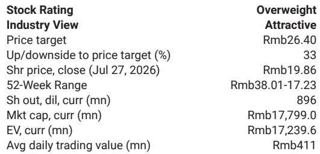

# MS：华明装备业务与近期数据观察

华明装备报价自2026年初历史高点已回调约54%，市场对竞争加剧、美国市场进展缓慢以及一季度业绩不及预期的担忧集中释放。MS在最新报告中认为，这些担忧可能过度，而公司长期增长逻辑并未改变。主要反映对非电网国内收入更保守的预期、股权激励带来的费用上升以及人民币升值造成的汇兑损失，但维持正面评级。当前报价对应2027年预期市盈率约19倍，低于全球同业平均的30倍。

## 1. 主要竞争对手扩产可能指向更大的市场总规模

Maschinenfabrik Reinhausen（MR）作为全球市占率约50%的分接开关龙头，计划在2028-2030年前将产能弹性较高。市场普遍将此解读为竞争加剧的信号，但MS提出了另一种可能性：这一扩产动作可能暗示市场总规模（TAM）正在超预期扩张。报告援引欧盟近期发布的电气化行动计划作为线索——欧盟目标到2040年将电气化率从过去十年停滞的23%提升至46%。这一目标将推动更多可再生能源和电动汽车接入，使得中低压配电网安装分接开关的需求变得更为紧迫，从而创造出比当前35kV以上分接开关市场更大的增量空间。

> **KC评论：** 竞争者的产能规划往往被简单理解为市场份额争夺，但报告提醒读者注意另一种解释——当行业龙头选择大规模扩产时，可能意味着它看到了下游需求的结构性扩张。欧盟电气化目标是一个可追踪的验证指标。

## 2. 海外收入增长路径不依赖短期供需缺口

市场对华明装备海外战略的疑虑集中在两点：美国市场产品测试周期拉长，以及国内变压器出口仍在调整。报告认为，公司海外扩张的核心驱动力并非短期供应短缺，而是成本优势和客户对供应链多元化的意愿提升。在中国变压器出口持续增长的背景下，这一趋势具有持续性。报告预计公司电力设备出口收入在2025-2029年间将实现约30%的年复合增长率，海外收入占比将从2025年的34%提升至2029年的54%。美国市场的产品测试进展被视作2026年第四季度的潜在催化剂。

## 3. 盈利增长预计在2027年重新提速

经过盈利预测下调后，报告预计2026年净利润增长约11%，这一数字与卖方共识基本一致，但高于部分买方读者的预期——一些最悲观的读者甚至预期2026年上半年净利润持平或小幅下滑。报告认为，由于2025年二季度基数较低，加上2026年一季度积压订单的交付追赶，2026年二季度盈利表现可能好于市场担忧。展望2026年之后，随着产品结构改善以及汇兑损失和股权激励费用的影响减弱，盈利增速有望恢复至每年18-20%。

## 4. 当前估值已低于历史中枢和全球同业水平

报告将估值倍数从30.5倍下调至25倍。这一倍数约比2019年以来的长期历史均值高出一个标准差，但低于2019年初、2021年底、2024年中以及2026年初曾达到的30-40倍区间，也低于全球同业平均的30倍。从财务数据看，公司2026-2028年预期净资产回报表现（ROE）从25%逐步提升至30%，而净现金状态持续，这为估值提供了一定支撑。

> **KC评论：** 估值倍数的下调反映了盈利预测下调和市场情绪变化，但报告的核心判断是：市场对竞争和短期业绩的担忧可能已经充分反映在价格中，而需求端的结构性变化——尤其是欧洲电网研究——尚未被充分定价。2026年二季度业绩能否好于预期，将是检验这一判断的第一个观察窗口。

For informational purposes only. Portions may be generated,translated,summarized,or edited with AI assistance based on source materials and may contain omissions or errors. Please verify independently. This is not investment,legal,tax,accounting,or other professional advice.

For informational purposes only. Portions may be generated,translated,summarized,or edited with AI assistance based on source materials and may contain omissions or errors. Please verify independently. This is not investment,legal,tax,accounting,or other professional advice.

