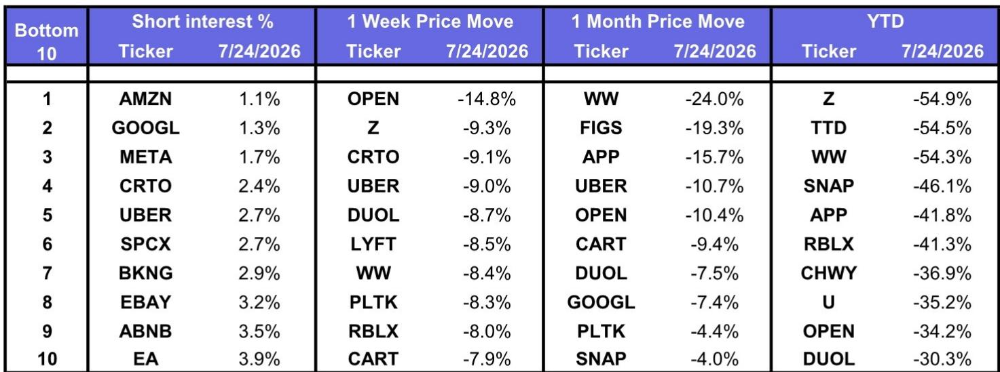
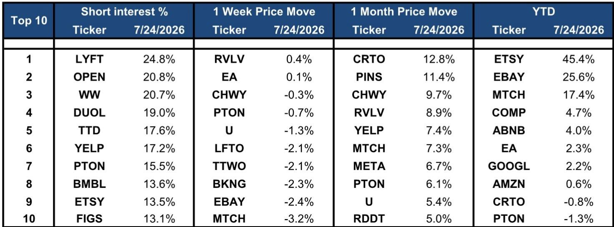
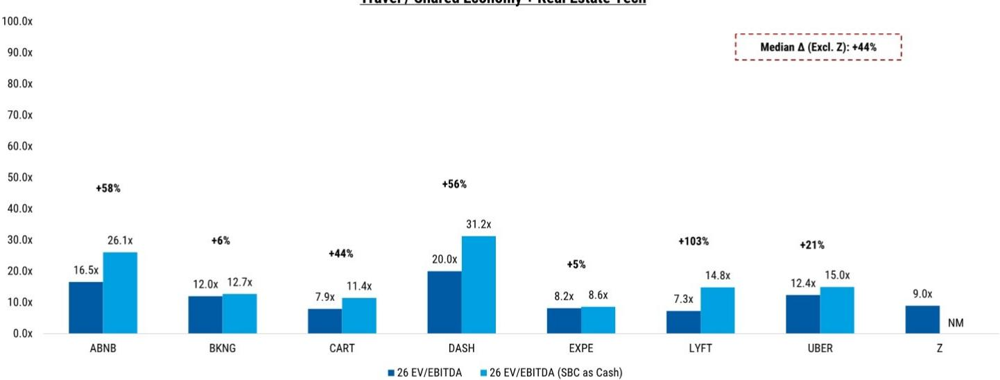

# 互联网公司正在重新定价增长预期，而非基本面：2026年7月市场波动揭示AI商业化估值逻辑的转变

2026年7月24日，互联网板块经历了一次广泛而显著的价格调整，这不仅仅是宏观环境波动的简单反映。标普500指数下跌1%，纳斯达克指数下跌2%，但部分互联网公司的跌幅更为明显。Meta Platforms和Alphabet均下跌8%。亚马逊下跌6%。Uber和Lyft各下跌9%。AppLovin下跌8%。这不是一次均匀的风险规避行为，而是一次针对增长预期的重新定价，主要集中在市场此前对AI驱动收入增长抱有最高期望的公司。

调整幅度的差异值得关注。按市值加权计算，数字广告类公司平均下跌7.8%。共享经济平台类公司平均下跌8.0%。相比之下，旅游类公司按加权计算仅下跌2.8%。电子商务类公司下跌6.0%。模式清晰可见：跌幅最大的正是那些与AI商业化主题关联最紧密的子板块。市场并非在广泛质疑互联网行业，而是在质疑哪些公司能够以此前预期的速度将AI投入转化为实际回报。

这不是一次周期性的轮动，而是一次结构性的重新评估——AI驱动的收入增长究竟会在哪里实现，以及需要付出何种成本。同一天的估值数据揭示了这种张力。Alphabet对应2027年预期收益的估值为21倍，较其过去十二个月的平均水平低19%。Meta对应2027年预期收益的估值为18倍，较其平均水平低12%。亚马逊对应2027年预期收益的估值为20倍，较其平均水平低25%。这些并非困境中的估值倍数，但相对于近期历史确实出现了显著压缩。市场实际上在说：我们仍然相信长期逻辑，但不再信任近期的增长轨迹。

这次调整为观察者提供了一个战略性的思考节点。过去按行业分类互联网公司的框架——广告、电商、旅游、出行——已不再能捕捉关键的风险因素。新的分界线在于：对AI商业化不确定性的暴露程度，与对终端市场需求稳定性的暴露程度。那些AI期望高而当前盈利可见性低的公司正在被重新评估。那些需求可预测、商业模式经过验证的公司则相对稳健。问题在于，这种重新定价是否已经过度，还是更深层次调整的开始。

## AI商业化溢价已发生逆转：AI期望最高的公司现在对估值压缩最为敏感

7月24日调整最显著的特征是，它并未按比例影响所有互联网公司。数字广告板块——包括Alphabet、Meta、Snap、Pinterest和Reddit——按市值加权下跌7.8%。共享经济板块——包括Uber、Lyft、DoorDash和Instacart——下跌8.0%。这是过去十八个月中AI叙事被最积极定价的两个子板块。

与旅游板块的对比具有启发性。Booking Holdings、Expedia和Airbnb合计仅下跌2.8%。旅游需求在短期内对AI变革相对不敏感。消费者根据目的地、价格和便利性预订行程，而非平台是否使用大型语言模型推荐酒店。旅游板块的估值反映了这一现实。Booking对应2027年预期收益的估值为17倍，Expedia为13倍。这些倍数并不紧张，没有AI溢价需要压缩。

对于数字广告而言，情况则不同。AI溢价是真实存在的。Alphabet和Meta此前基于AI驱动的广告定向将加速收入增长并扩大利润率的逻辑，一直以较高的估值交易。7月的调整表明，市场现在开始质疑这一收益的时机和规模。Alphabet对应2027年预期收益的21倍估值，按历史标准并不便宜，但已比其过去平均水平低19%。这种压缩意味着市场已经移除了一部分——但并非全部——AI溢价。风险在于，如果下一个业绩周期未能实现预期的加速增长，进一步的压缩可能会随之而来。

## 盈利预期的时间跨度比商业模式更重要：三年远期估值揭示市场最谨慎的领域

仅看当前年份的市盈率并不能说明全部问题。更具揭示性的指标是对2027年预期收益的估值倍数，它剔除了短期噪音，反映了市场对正常化盈利能力的看法。基于此，互联网公司之间的估值差异极为显著。

Alphabet对应2027年预期收益的估值为21倍。Meta为18倍。亚马逊为20倍。这些并非困境中的估值。然而，它们都显著低于各自公司过去十二个月的平均水平：Alphabet低19%，Meta低12%，亚马逊低25%。市场认为这些公司能够通过增长来匹配当前的估值，但实现增长的路径比六个月前更加不确定。

与AppLovin的对比更为鲜明。AppLovin对应2027年预期收益的估值为20倍，比其过去平均水平低26%。该公司一直是互联网板块中最纯粹的AI商业化故事之一，其软件平台利用机器学习优化移动广告。7月24日8%的单日跌幅，加上过去一个月15.7%的跌幅，表明市场正在重新评估AppLovin的AI驱动增长能否维持其此前的轨迹。过去一个月15.7%的跌幅，在互联网覆盖范围内属于最严重之列，仅被WW International和FIGS超越。

对观察者而言，含义很直接：市场并非在为这些公司的破产或周期性衰退定价，而是在为AI驱动的盈利增长慢于预期而定价。问题在于，当前的估值倍数是否已经反映了这种较慢的增长，还是存在进一步下行的空间。

## 空头头寸数据证实了市场的选择性谨慎：最高空头仓位集中在最需要证明自己的公司

截至7月24日的空头头寸数据提供了另一个观察视角。最高的空头仓位集中在那些AI期望高、当前盈利能力低或两者兼有的公司。Lyft的空头比例为24.8%。Duolingo为19.0%。Trade Desk为17.6%。Yelp为17.2%。这些并非AI逻辑明显错误的公司，而是其逻辑需要多年执行才能验证的公司。

与大型公司的对比引人注目。亚马逊的空头比例为1.1%。Alphabet为1.3%。Meta为1.7%。这些是整个覆盖范围内空头仓位最低的公司之一。市场并非在押注这些公司下跌，只是不愿支付今年早些时候盛行的AI溢价。

空头数据还揭示了共享经济板块内部的模式。尽管Uber单日下跌9%，但其空头比例仅为2.7%。Lyft则为24.8%。这种差异反映了市场结构。Uber是一个多元化的平台，涵盖外卖、货运和国际业务。Lyft则是一家专注于美国市场的出行公司，安全边际较小。市场正在区分哪些公司能够承受增长放缓，哪些不能。

对于观察者而言，空头数据提供了一个实用的分析框架。那些空头比例高且AI期望高的公司，如果宏观环境恶化或业绩不及预期，可能面临进一步的下行风险。而那些空头比例低且估值已压缩的公司，可能提供更好的风险回报比，但这需要AI逻辑在两到三年的时间内仍然成立。

## 后AI溢价时代互联网公司观察的决策框架

7月24日的调整并未否定互联网公司的AI逻辑。然而，它确实要求一个更加严谨的框架来评估仓位和入场时机。以下决策矩阵捕捉了关键变量。

**第一步：根据主要估值驱动因素对每只互联网公司进行分类。** 分为三类。A类：AI商业化逻辑是估值倍数主要驱动因素的公司。这包括Alphabet、Meta、AppLovin、Trade Desk和Reddit。B类：终端市场需求是主要驱动因素，AI是次要因素的公司。这包括亚马逊、Booking、Expedia和eBay。C类：商业模式本身存在疑问，与AI无关的公司。这包括Lyft、WW International和Opendoor。

**第二步：评估估值倍数相对于历史水平的位置。** 对于A类公司，关键问题是当前估值倍数是否已经反映了较慢的AI增长。Alphabet对应2027年预期收益的21倍估值，比其过去平均水平低19%，可能已经反映了一个更为保守的前景。AppLovin对应2027年预期收益的20倍估值，比其平均水平低26%，如果AI逻辑仍然成立，可能更接近公允价值。对于B类公司，估值压缩不那么严重，安全边际更高。亚马逊对应2027年预期收益的20倍估值，比其平均水平低25%，如果电商和AWS的增长轨迹保持稳定，可能提供一个更具吸引力的观察点。

**第三步：将空头头寸作为情绪指标进行评估。** 高空头比例与高AI期望相结合，创造了一种二元结果。如果公司实现了AI驱动的增长，空头将被迫回补，可能带来上行空间。如果业绩令人失望，下行风险可能很大。低空头比例与压缩的估值倍数相结合，表明市场已经调整了预期。进一步大幅下跌的风险较低，但上行空间也更为有限。

**第四步：确定合适的时间跨度。** 对于A类公司，逻辑需要12到24个月的时间来展开。AI驱动的广告定向和推荐系统不会在一夜之间改变盈利状况。时间跨度较短的观察者应倾向于B类公司，其需求可见性更高，估值压缩提供了一定的缓冲。对于C类公司，适当的做法是在商业模式风险得到解决之前完全避开。

这个框架并非对任何特定公司的操作建议。它是一个将隐含因素显性化的工具。7月24日的调整是一个信号，而非结论。市场重新评估了风险，但并未平等地重新评估整个互联网板块。未来十二个月的赢家和输家，将取决于哪些公司能够驾驭这种更高谨慎和更低估值的新环境。

## 二阶影响：AI基础设施支出对互联网公司而言正从资产变为负债

7月24日的调整还有一个更深层次的影响，大多数观察者尚未完全消化。AI基础设施的大规模资本支出周期，此前一直是云服务提供商和半导体公司的利好因素，现在正成为那些必须投入资金以保持竞争力的互联网平台的阻力。

Alphabet、Meta和亚马逊每年在AI相关的数据中心、芯片和研究上合计投入数百亿美元。在利率上升或增长放缓的环境中，这些支出会成为自由现金流的拖累。市场开始为这一风险定价。7月24日数字广告类公司7.8%的跌幅，可能不仅反映了对收入增长的担忧，也反映了对成本端的担忧。

数据支持这一解读。Alphabet和Meta的估值倍数均低于其过去平均水平，但其自由现金流回报表现尚不足以补偿资本支出风险。Alphabet的过去自由现金流回报表现因数据不可比而标注为“NM”。Meta 2026年的自由现金流回报表现仅为0.8%。这些并非产生超额现金的公司的指标，而是积极进行再投资的公司的指标。

风险在于，资本支出周期的高峰晚于预期，或者AI支出的收入回报需要更长时间才能实现。无论哪种情况，随着市场调整对自由现金流生成的预期，这些公司可能面临进一步的估值压缩。旅游和电商板块的AI资本支出要求较低，受此风险影响较小。

对于观察者而言，含义是明确的。互联网公司的AI逻辑有两个方面：收入加速和成本上升。过去一年，市场几乎只关注收入端。7月24日的调整表明，成本端开始变得重要。任何关于该板块的决策都必须明确考虑这两个方面。

*仅供参考。部分内容可能基于原始材料通过AI辅助生成、翻译、总结或编辑，可能存在遗漏或错误。请独立核实。本文不构成任何专业建议。*

仅供参考。部分内容可能基于原始材料通过AI辅助生成、翻译、总结或编辑，可能存在遗漏或错误。请独立核实。本文不构成任何专业建议。

