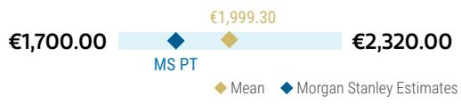
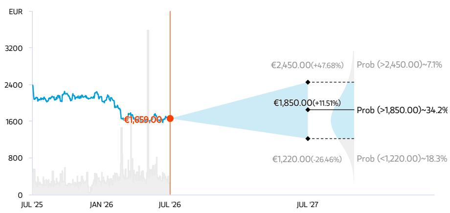
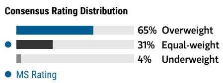
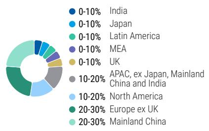
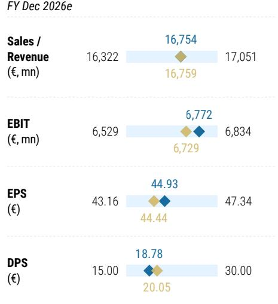
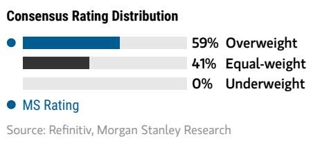
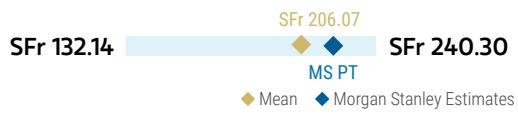
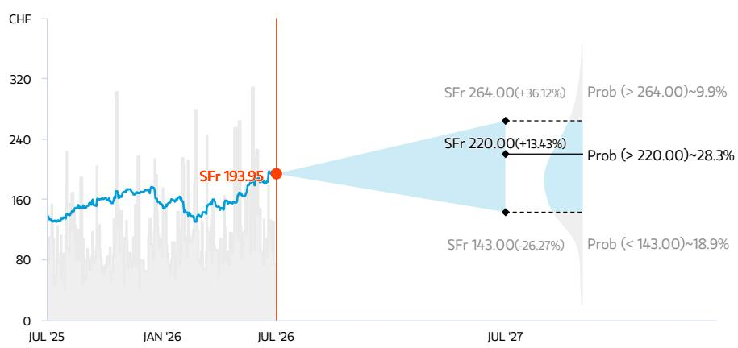

Luxury | Europe

# Updating our tax rate assumptions

## Key Takeaways

We believe the market may be underestimating the likelihood of the French tax surcharge being cemented amid the political risk and fiscal challenges in France.

We now incorporate the tax surcharge for LVMH and Hermès into our outer years (our effective tax rate assumptions are +300-400bps higher than VA css for 2027-2029).

Our France Economics teams have published this morning A Comprehensive Framework Ahead of French Elections, where they note that France faces a challenging political calendar with the budget season (autumn 2026), the presidential election (18 April and 2 May 2027) and, in their baseline scenario, snap parliamentary elections around mid-June 2027. They believe these events are likely to keep policy uncertainty elevated well into the middle of next year. We think there is a risk for the French corporate tax surcharge to be extended into 2027 and beyond.

LVMH, Hermès, Kering and Richemont are exposed to any changes to corporate tax rates for large companies in France. While their sales exposure to France is limited (<10% for all), taxation is based on where the economic value creation is produced – thus skewed to where goods production takes place (Hermès discloses that 74% of its products are manufactured in France, and around ~50% for LVMH, ~35% for Richemont and ~15% for Kering, on our estimates).

As a reminder, in 2025 the French government implemented a corporate income tax surcharge of 20% (that is, tax rate going to 30% from 25%) for companies with revenues of €1-3bn in France (this includes Kering), and a surcharge of 41% (tax rate going to 35.25% from 25%) for those with revenues above €3bn in France (includes LVMH, Hermès and Richemont; note we include inter-company sales when estimating total sales generated in France).

We believe the political and fiscal challenges France faces may cement the tax surcharge. We adjusted our tax rate for LVMH yesterday evening (post LVMH results - see Off the call / updating estimates (27 Jul 2026)) and adjust the tax rate for Hermès. We now model the same effective tax rate as 2025 (when the recent corporate tax surcharge was implemented) for the outer years in our model for both companies.

Overall, we believe the market may be underestimating the EPS impact to LVMH and Hermès (~6% EPS downside) from a sustained tax surcharge. As can be seen in Exhibit 1 below, current Visible Alpha consensus does not incorporate the French tax surcharge post 2026 for LVMH nor Hermès. Should the corporate tax surcharge be cemented for longer (as is now our base case), there is ~5-6% EPS downside to consensus on LVMH and Hermès from the tax rate change alone.

- We note that LVMH paid €5.5bn in taxes in 2025, of which roughly half in France, according to the company. We estimate the French tax surcharge amounted to close to €700m in that year. We adjusted our tax rate for LVMH yesterday evening (post LVMH results - see here); the impact to our EPS from just the change in our tax rate assumptions was -6.2% in 2027-2029.

- The CFO of Hermès (whose tax bill was €2.3bn in 2025, of which around half paid in France) observed that the tax surcharge in 2025 amounted to ~ €330m, saying that it was "equivalent to a 5% increase [in the company's tax rate] in 2025" and that "we hope that it just happens for a couple of years, but maybe this exceptional tax will be a feature in years to come". We adjust our tax rate for Hermès, now modeling a tax rate of 33.4% (in-line with 2025) going forward. Our 2027-29 EPS come down by 3.5%. Our price target is now €1,850 (vs. €1,930 previously).

- At Richemont, while we estimate ~35% of its production takes places in France, Cartier's headquarters are based in Geneva (not Paris), so we assume the majority of its profits are generated in Switzerland (under international tax principles, profits are allocated according to where strategic decision-making, brand stewardship, pricing architecture and intellectual property oversight are located). Therefore, we assume that only ~5% of its profits are exposed to French taxation and thus the surcharge impact was not meaningful in the last financial year. We nonetheless take this opportunity to refresh our estimates regarding Richemont's tax rate; we now model the tax rate in line with its FY26 (year to March 2026) effective rate of 20.4% (note that the dip in tax rate in FY25, to 16.5%, was due to non-cash accounting factors). Our FY27-FY29 EPS come down by 2.3%. Our price target is now CHF 220 (vs. CHF 225 previously).

- Kering manufactures about ~15% of its products in France, we estimate (with most of its brands manufactured in Italy), so we estimate its revenue in France (including inter-company sales) is less than €3bn. On that basis, we presume Kering would fall into the lower tax surcharge bracket. As a result of both these factors, the tax surcharge did not have a meaningful impact in 2025.

Exhibit 1: Effective tax rate for LVMH, Hermès and Richemont

<table><tr><td>Tax rate</td><td>2010</td><td>2011</td><td>2012</td><td>2013</td><td>2014</td><td>2015</td><td>2016</td><td>2017</td><td>2018</td><td>2019</td><td>2020</td><td>2021</td><td>2022</td><td>2023</td><td>2024</td><td>2025</td><td>2026e</td><td>2027e</td><td>2028e</td><td>2029e</td></tr><tr><td>LVMH</td><td>30.7%</td><td>29.6%</td><td>31.8%</td><td>30.8%</td><td>27.1%</td><td>33.0%</td><td>32.6%</td><td>29.2%</td><td>26.3%</td><td>27.4%</td><td>32.7%</td><td>26.2%</td><td>26.7%</td><td>26.2%</td><td>28.5%</td><td>32.8%</td><td></td><td></td><td></td><td></td></tr><tr><td>MSe</td><td></td><td></td><td></td><td></td><td></td><td></td><td></td><td></td><td></td><td></td><td></td><td></td><td></td><td></td><td></td><td></td><td>32.8%</td><td>32.8%</td><td>32.8%</td><td>32.8%</td></tr><tr><td>VA css</td><td></td><td></td><td></td><td></td><td></td><td></td><td></td><td></td><td></td><td></td><td></td><td></td><td></td><td></td><td></td><td></td><td>32.1%</td><td>29.4%</td><td>29.0%</td><td>28.9%</td></tr><tr><td></td><td></td><td></td><td></td><td></td><td></td><td></td><td></td><td></td><td></td><td></td><td></td><td></td><td></td><td></td><td></td><td></td><td>+74 bps</td><td>+344 bps</td><td>+377 bps</td><td>+385 bps</td></tr><tr><td>Hermes</td><td>33.7%</td><td>32.3%</td><td>31.7%</td><td>33.3%</td><td>33.2%</td><td>35.8%</td><td>33.7%</td><td>35.4%</td><td>32.5%</td><td>33.1%</td><td>30.9%</td><td>29.5%</td><td>28.2%</td><td>27.8%</td><td>28.7%</td><td>33.4%</td><td></td><td></td><td></td><td></td></tr><tr><td>MSe</td><td></td><td></td><td></td><td></td><td></td><td></td><td></td><td></td><td></td><td></td><td></td><td></td><td></td><td></td><td></td><td></td><td>33.4%</td><td>33.4%</td><td>33.4%</td><td>33.4%</td></tr><tr><td>VA css</td><td></td><td></td><td></td><td></td><td></td><td></td><td></td><td></td><td></td><td></td><td></td><td></td><td></td><td></td><td></td><td></td><td>33.4%</td><td>30.2%</td><td>29.4%</td><td>29.1%</td></tr><tr><td></td><td></td><td></td><td></td><td></td><td></td><td></td><td></td><td></td><td></td><td></td><td></td><td></td><td></td><td></td><td></td><td></td><td>+5 bps</td><td>+322 bps</td><td>+404 bps</td><td>+427 bps</td></tr><tr><td></td><td>FY-11</td><td>FY-12</td><td>FY-13</td><td>FY-14</td><td>FY-15</td><td>FY-16</td><td>FY-17</td><td>FY-18</td><td>FY-19</td><td>FY-20</td><td>FY-21</td><td>FY-22</td><td>FY-23</td><td>FY-24</td><td>FY-25</td><td>FY-26</td><td>FY-27</td><td>FY-28</td><td>FY-29</td><td>FY-30</td></tr><tr><td>Richemont</td><td>16.7%</td><td>14.6%</td><td>15.6%</td><td>16.5%</td><td>21.5%</td><td>17.9%</td><td>22.5%</td><td>25.5%</td><td>21.6%</td><td>22.6%</td><td>15.1%</td><td>17.2%</td><td>17.9%</td><td>18.1%</td><td>16.5%</td><td>20.4%</td><td></td><td></td><td></td><td></td></tr><tr><td>MSe</td><td></td><td></td><td></td><td></td><td></td><td></td><td></td><td></td><td></td><td></td><td></td><td></td><td></td><td></td><td></td><td></td><td>20.4%</td><td>20.4%</td><td>20.4%</td><td>20.4%</td></tr><tr><td>VA css</td><td></td><td></td><td></td><td></td><td></td><td></td><td></td><td></td><td></td><td></td><td></td><td></td><td></td><td></td><td></td><td></td><td>18.6%</td><td>18.5%</td><td>18.4%</td><td>17.9%</td></tr><tr><td></td><td></td><td></td><td></td><td></td><td></td><td></td><td></td><td></td><td></td><td></td><td></td><td></td><td></td><td></td><td></td><td></td><td>+178 bps</td><td>+190 bps</td><td>+199 bps</td><td>+253 bps</td></tr></table>

Source: Visible Alpha, Company data, MS estimates (e). Note: Consensus as of 27 July 2026

Risk Rewards

## Risk Reward – Hermes International S.C.A. (HRMS.PA)

We see the risk/reward profile as balanced

## PRICE TARGET €1,850.00

We use a DCF-based valuation methodology, as we think this best reflects Hermès' margin potential and cash flow generation. We assume a WACC of 6.3% and a long-term growth rate of 2.8%.

Consensus Price Target Distribution

Source: Refinitiv, MS

## RISK REWARD CHART AND OPTIONS IMPLIED PROBABILITIES (12M)

  
Key: — Historical Stock Performance ● Current Stock Price ◆ Price Target

## EQUAL-WEIGHT THESIS

We believe that Hermès' shares are appropriately valued by the market, with top-line estimates embedding high-single-digit growth for the next couple of years.

  
Source: Refinitiv, MS

## Risk Reward Themes

Pricing Power: Positive
Secular Growth: Positive
View descriptions of Risk Rewards Themes here

Source: Refinitiv, MS, MS Institutional Equities Division. The probabilities of our Bull, Base, and Bear case scenarios playing out were estimated with implied volatility data from the options market as of 27 Jul 2026. All figures are approximate risk-neutral probabilities of the stock reaching beyond the scenario price in either three-months' or one-years' time. View explanation of Options Probabilities methodology here

## BULL CASE

€2,450.00

## Faster increase in the share of leather goods

We model Hermès increasing its operating margin from 40% in 2025 to ~44% in 2034e (and 15% average top-line growth), mostly driven by a higher share of leather goods (from 50% in 2020 to 60% in 2024, more or less in line with Saint Laurent today at 69%) in the sales mix and acceleration in growth of the non-leather goods category.

## BASE CASE

## €1,850.00 BEAR CASE

## Steady HSD/LDD growth

We forecast Hermès' EBIT margin to reach 43% by 2033. Margin expansion is a function of higher sales densities (annual selling space growth remains limited), higher share of online sales and higher-margin categories increasing in the mix.

€1,220.00

## Margin reversion and slower growth

Assumes that Hermès' margin reverts within five years, reaching 38% by 2030 vs. 41% in 2022 (and top-line growth is +6% on average). This is mostly driven by lower pricing power on its iconic products as the brand's desirability declines and overall demand for luxury goods from Chinese nationals softens.

<table><tr><td>5/5 MOST</td><td>3 Month Horizon</td></tr></table>

- Spending of Chinese nationals on luxury goods

## Risk Reward – Hermes International S.C.A. (HRMS.PA)

## KEY EARNINGS INPUTS

<table><tr><td>Drivers</td><td>Dec 2025</td><td>Dec 2026e</td><td>Dec 2027e</td><td>Dec 2028e</td></tr><tr><td>Group % Change - constant currency (%)</td><td>8.9</td><td>7.1</td><td>9.1</td><td>10.7</td></tr><tr><td>Europe % Change - constant currency (%)</td><td>10.3</td><td>6.5</td><td>9.7</td><td>11.2</td></tr><tr><td>Americas % Change - constant currency (%)</td><td>12.4</td><td>14.0</td><td>10.0</td><td>10.0</td></tr><tr><td>APAC % Change - constant currency (%)</td><td>6.5</td><td>5.5</td><td>8.3</td><td>10.4</td></tr></table>

## INVESTMENT DRIVERS

- Brand desirability

• Leather goods supply

## GLOBAL REVENUE EXPOSURE

  
Source: MS Estimate View explanation of regional hierarchies here  
- Operating margin lifted by a higher share of most profitable categories in the sales mix

## MS ALPHA MODELS

Source: Refinitiv, FactSet, MS; 1 is the highest favored Quintile and 5 is the least favored Quintile

## RISKS TO PT/RATING

## RISKS TO UPSIDE

## RISKS TO DOWNSIDE

- Discount rate: two-thirds of Hermes' equity value is in its TV

- FX: majority of Hermès' products are manufactured in the euro zone

- Overdependence on a few iconic products? We estimate Birkin & Kelly bags account for ~25% & 33% of sales & profits, respectively

- Middle-income consumers become the main growth driver

## OWNERSHIP POSITIONING

<table><tr><td>Inst. Owners, % Active</td><td>65.7%</td><td colspan="4"></td></tr><tr><td>HF Sector Long/Short Ratio</td><td>1.6x</td><td colspan="4"></td></tr><tr><td>HF Sector Net Exposure</td><td>7.6%</td><td colspan="4"></td></tr></table>

Refinitiv; MSPB Content. Includes certain hedge fund exposures held with MSPB. Information may be inconsistent with or may not reflect broader market trends. Long/Short Ratio = Long Exposure / Short exposure. Sector % of Total Net Exposure = (For a particular sector: Long Exposure - Short Exposure) / (Across all sectors: Long Exposure – Short Exposure).

MS ESTIMATES VS. CONSENSUS  
  
◆ Mean ◆ MS Estimates
Source: Refinitiv, MS

Source: Refinitiv, MS

## Risk Reward – Richemont SA (CFR.S)

Risk/reward profile is skewed to the upside

## PRICE TARGET SFr 220.00

We use a DCF-based valuation methodology, which we think best reflects the company's margin potential and cash flow. We assume a WACC of 8.4% and long-term growth rate of 2.5%.

Consensus Price Target Distribution

Source: Refinitiv, MS

SFr 132.14

## RISK REWARD CHART AND OPTIONS IMPLIED PROBABILITIES (12M)

  
Key: — Historical Stock Performance ● Current Stock Price ◆ Price Target

## OVERWEIGHT THESIS

Source: Refinitiv, MS, MS Institutional Equities Division. The probabilities of our Bull, Base, and Bear case scenarios playing out were estimated with implied volatility data from the options market as of 27 Jul 2026. All figures are approximate risk-neutral probabilities of the stock reaching beyond the scenario price in either three-months' or one-years' time. View explanation of Options Probabilities methodology here

Richemont is a fundamentally stronger organisation today than five or 10 years ago, mostly as a function of the fact that its two largest brands (Cartier and Van Cleef) are performing better and account for a greater share of the Group's sales and profits.

## Risk Reward Themes

Pricing Power: Positive
Self-help: Positive
View descriptions of Risk Rewards Themes here

## BULL CASE

SFr 264.00

## BASE CASE

## Sustained top-line and EBIT growth

Assumes that Jewellery Maisons organic sales grow at a double-digit CAGR in the next five years. EBIT margin of Jewellery Maisons division reaches 40% in FY28.

## SFr 220.00 BEAR CASE

## Top-line growth, operating leverage

We forecast Jewellery Maisons organic sales to grow at c.+9% CAGR to €20.4bn in FY28. We expect further operating leverage as JM's margins should broadly reach ~35% in FY28.

SFr 143.00

## Flattish Jewellery Maison sales FY24-28e

Assumes that demand from the West contracts over the next 12 months, while China recovery is more sluggish than anticipated. Sales at both Jewellery Maisons and Specialist Watchmaker divisions turn negative, leading to further margin contraction. We model flattish Jewellery Maisons sales across FY24-28. Jewellery Maisons margins contract by -150 bps on average per year across FY24-28 to below 30%.

## Risk Reward – Richemont SA (CFR.S)

## KEY EARNINGS INPUTS

<table><tr><td>Drivers</td><td>Mar 2026</td><td>Mar 2027e</td><td>Mar 2028e</td><td>Mar 2029e</td></tr><tr><td>Group Organic Growth in % (constant FX) (%)</td><td>11.0</td><td>12.1</td><td>8.5</td><td>8.6</td></tr><tr><td>Jewellery Maison Organic Growth in % (%)</td><td>14.0</td><td>14.5</td><td>9.2</td><td>9.0</td></tr><tr><td>Specialist Watchmakers Organic Growth in % (%)</td><td>1.0</td><td>4.5</td><td>6.5</td><td>8.0</td></tr></table>

## INVESTMENT DRIVERS

• DOS and wholesale sales

- Swiss watch data

• Global gold and diamond pricing - Online distributors strategy on client service, discounting

## GLOBAL REVENUE EXPOSURE

<table><tr><td rowspan="9"></td><td>0-10%</td><td>India</td></tr><tr><td>0-10%</td><td>Japan</td></tr><tr><td>0-10%</td><td>Latin America</td></tr><tr><td>0-10%</td><td>MEA</td></tr><tr><td>0-10%</td><td>UK</td></tr><tr><td>10-20%</td><td>APAC, ex Japan, Mainland China and India</td></tr><tr><td>10-20%</td><td>Europe ex UK</td></tr><tr><td>10-20%</td><td>Mainland China</td></tr><tr><td>20-30%</td><td>North America</td></tr></table>

Source: MS Estimate View explanation of regional hierarchies here

## MS ALPHA MODELS

<table><tr><td>3/5 MOST</td><td>3 Month Horizon</td></tr></table>

Source: Refinitiv, FactSet, MS; 1 is the highest favored Quintile and 5 is the least favored Quintile

## RISKS TO PT/RATING

## RISKS TO UPSIDE

- If our assumption of an efficiency focus materialises, this would likely result in EPS growth.

- Cartier jewellery sales growing more than expected.

## RISKS TO DOWNSIDE

- A material slowdown in China when the US slows down presents the biggest risk to Richemont.

- Continued deterioration in the watch segment.

## OWNERSHIP POSITIONING

<table><tr><td>Inst. Owners, % Active</td><td>68%</td><td colspan="4"></td></tr><tr><td>HF Sector Long/Short Ratio</td><td>1.6x</td><td colspan="4"></td></tr><tr><td>HF Sector Net Exposure</td><td>7.6%</td><td colspan="4"></td></tr></table>

Refinitiv; MSPB Content. Includes certain hedge fund exposures held with MSPB. Information may be inconsistent with or may not reflect broader market trends. Long/Short Ratio = Long Exposure / Short exposure. Sector % of Total Net Exposure = (For a particular sector: Long Exposure - Short Exposure) / (Across all sectors: Long Exposure – Short Exposure).

MS ESTIMATES VS. CONSENSUS

<table><tr><td colspan="3">FY Mar 2027e</td></tr><tr><td rowspan="2">Sales / Revenue (€, mn)</td><td rowspan="2">23,763</td><td>25,349</td></tr><tr><td>25,090</td></tr><tr><td rowspan="2">EBITDA (€, mn)</td><td rowspan="2">5,921</td><td>7,099</td></tr><tr><td>7,015</td></tr><tr><td rowspan="2">EBIT (€, mn)</td><td rowspan="2">4,949</td><td>5,434</td></tr><tr><td>5,497</td></tr><tr><td rowspan="2">EPS (€)</td><td rowspan="2">5.88</td><td>7.26</td></tr><tr><td>7.41</td></tr><tr><td rowspan="2">DPS (€)</td><td rowspan="2">3.30</td><td>3.30</td></tr><tr><td>4.30</td></tr></table>

◆ Mean ◆ MS Estimates
Source: Refinitiv, MS

## Risk Reward Reference links

1. View explanation of Options Probabilities methodology -

Options\_Probabilities\_Exhibit\_Link.pdf

2. View descriptions of Risk Rewards Themes - RR\_Themes\_Exhibit\_Link.pdf

3. View explanation of regional hierarchies - GEG\_Exhibit\_Link.pdf

4. View explanation of Theme/Exposure methodology -

ESG\_Sustainable\_Solutions\_External\_Link.pdf

5. View explanation of HERS methodology - ESG\_HERS\_External\_Link.pdf

## Disclosure Section

The information and opinions in MS were prepared or are disseminated by MS Europe S.E., regulated by Bundesanstalt fuer Finanzdienstleistungsaufsicht (BaFin) and/or MS & Co. International plc, authorized by the Prudential Regulation Authority and regulated by the Financial Conduct Authority and the Prudential Regulation Authority. MS & Co. International plc disseminates in the UK research that it has prepared, and which has been prepared by any of its affiliates, only to persons who (i) are investment professionals falling within Article 19(5) of the Financial Services and Markets Act 2000 (Financial Promotion) Order 2005 (as amended, the "Order"); (ii) are persons who are high net worth entities falling within Article 49(2)(a) to (d) of the Order; or (iii) are persons to whom an invitation or inducement to engage in investment activity (within the meaning of section 21 of the Financial Services and Markets Act 2000, as amended) may otherwise lawfully be communicated or caused to be communicated. As used in this disclosure section, MS includes RMB MS Proprietary Limited, MS Europe S.E., MS & Co International plc and its affiliates.

For important disclosures, stock price charts and equity rating histories regarding companies that are the subject of this report, please see the MS Disclosure Website at www.morganstanley.com/eqr/disclosures/webapp/generalresearch, or contact your investment representative or MS at 1585 Broadway, (Attention: Research Management), New York, NY, 10036 USA.

For valuation methodology and risks associated with any recommendation, rating or price target referenced in this research report, please contact the Client Support Team as follows: US/Canada +1 800 303-2495; Hong Kong +852 2848-5999; Latin America +1 718 754-5444 (U.S.); London +44 (0)20-7425-8169; Singapore +65 6834-6860; Sydney +61 (0)2-9770-1505; Tokyo +81 (0)3-6836-9000. Alternatively you may contact your investment representative or MS at 1585 Broadway, (Attention: Research Management), New York, NY 10036 USA.

## Analyst Certification

The following analysts hereby certify that their views about the companies and their securities discussed in this report are accurately expressed and that they have not received and will not receive direct or indirect compensation in exchange for expressing specific recommendations or views in this report: Edouard Aubin; Natasha Bonnet; Grace Smalley, CFA.

## Global Research Conflict Management Policy

MS has been published in accordance with our conflict management policy, which is available at www.morganstanley.com/institutional/research/conflictpolicies. A Portuguese version of the policy can be found at www.morganstanley.com.br

## Important Regulatory Disclosures on Subject Companies

As of June 30, 2026, MS beneficially owned 1% or more of a class of common equity securities of the following companies covered in MS: Adidas, Avolta AG, Birkenstock Holding plc, Burberry, Ferrari NV, Hermes International S.C.A., Hugo Boss AG, Kering, Moncler SpA, Pandora A/S, PUMA SE.

Within the last 12 months, MS has received compensation for investment banking services from Avolta AG, LVMH Moet Hennessy Louis Vuitton SA, Richemont SA.

In the next 3 months, MS expects to receive or intends to seek compensation for investment banking services from Adidas, Avolta AG, Burberry, EssilorLuxottica SA, Ferrari NV, Hermes International S.C.A., Kering, Luxexperience BV, LVMH Moet Hennessy Louis Vuitton SA, Moncler SpA, Pandora A/S, Prada SpA, PUMA SE, Richemont SA, Salvatore Ferragamo Spa. Within the last 12 months, MS has received compensation for products and services other than investment banking services from Adidas, Avolta AG, EssilorLuxottica SA, Ferrari NV, Kering, LVMH Moet Hennessy Louis Vuitton SA, Richemont SA, Salvatore Ferragamo Spa.

Within the last 12 months, MS has provided or is providing investment banking services to, or has an investment banking client relationship with, the following company: Adidas, Avolta AG, Burberry, EssilorLuxottica SA, Ferrari NV, Hermes International S.C.A., Kering, Luxexperience BV, LVMH Moet Hennessy Louis Vuitton SA, Moncler SpA, Pandora A/S, Prada SpA, PUMA SE, Richemont SA, Salvatore Ferragamo Spa.

Within the last 12 months, MS has either provided or is providing non-investment banking, securities-related services to and/or in the past has entered into an agreement to provide services or has a client relationship with the following company: Adidas, Avolta AG, Burberry, EssilorLuxottica SA, Ferrari NV, Kering, LVMH Moet Hennessy Louis Vuitton SA, Richemont SA, Salvatore Ferragamo Spa.

MS & Co. LLC makes a market in the securities of Ermenegildo Zegna.

MS & Co. International plc is a corporate broker to Burberry.

The equity research analysts or strategists principally responsible for the preparation of MS have received compensation based upon various factors, including quality of research, investor client feedback, stock picking, competitive factors, firm revenues and overall investment banking revenues. Equity Research analysts' or strategists' compensation is not linked to investment banking or capital markets transactions performed by MS or the profitability or revenues of particular trading desks.

MS and its affiliates do business that relates to companies/instruments covered in MS, including market making, providing liquidity, fund management, commercial banking, extension of credit, investment services and investment banking. MS sells to and buys from customers the securities/instruments of companies covered in MS on a principal basis. MS may have a position in the debt of the Company or instruments discussed in this report. MS trades or may trade as principal in the debt securities (or in related derivatives) that are the subject of the debt research report.

Certain disclosures listed above are also for compliance with applicable regulations in non-US jurisdictions.

## STOCK RATINGS

MS uses a relative rating system using terms such as Overweight, Equal-weight, Not-Rated or Underweight (see definitions below). MS does not assign ratings of Buy, Hold or Sell to the stocks we cover. Overweight, Equal-weight, Not-Rated and Underweight are not the equivalent of buy, hold and sell. Investors should carefully read the definitions of all ratings used in MS. In addition, since MS contains more complete information concerning the analyst's views, investors should carefully read MS, in its entirety, and not infer the contents from the rating alone. In any case, ratings (or research) should not be used or relied upon as investment advice. An investor's decision to buy or sell a stock should depend on individual circumstances (such as the investor's existing holdings) and other considerations.

## Global Stock Ratings Distribution

(as of June 30, 2026)

The Stock Ratings described below apply to MS's Fundamental Equity Research and do not apply to Debt Research produced by the Firm.

For disclosure purposes only (in accordance with FINRA requirements), we include the category headings of Buy, Hold, and Sell alongside our ratings of Overweight, Equal-weight, Not-Rated and Underweight. MS does not assign ratings of Buy, Hold or Sell to the stocks we cover. Overweight, Equal-weight, Not-Rated and Underweight are not the equivalent of buy, hold, and sell but represent recommended relative weightings (see definitions below). To satisfy regulatory requirements, we correspond Overweight, our most positive stock rating, with a buy recommendation; we correspond Equal-weight and Not-Rated to
