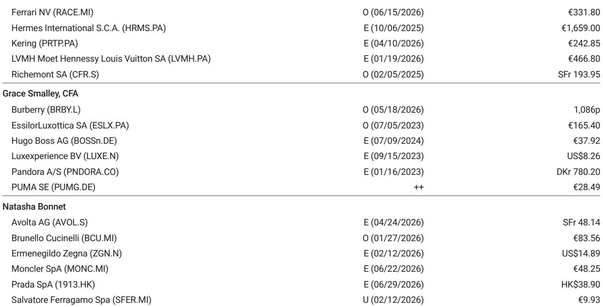
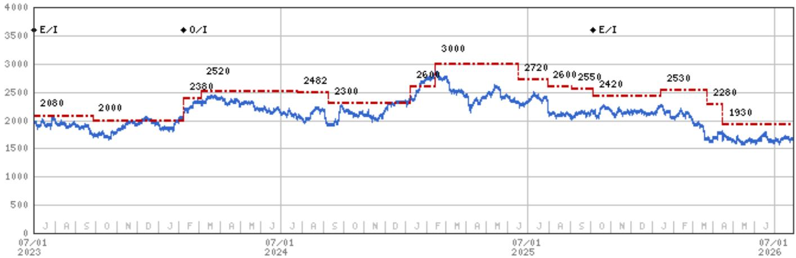
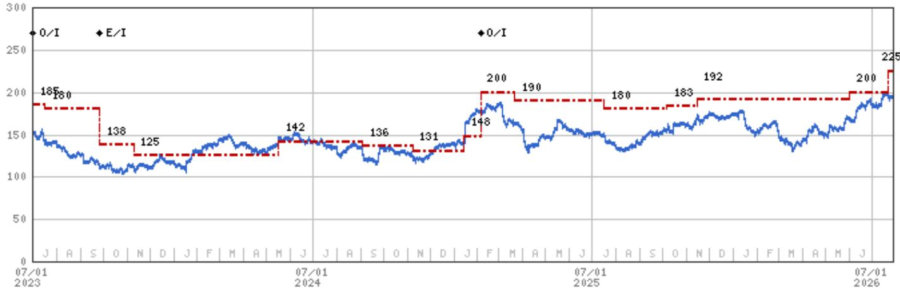

# MS：奢侈品牌税率假设更新

市场可能低估了法国企业附加税被长期延续的可能性。MS在最新研报中调整了对LVMH和爱马仕的远期税率假设，将2027-2029年的有效税率设定在2025年水平——即附加税实施后的实际税率。这一调整意味着两家公司的每股盈利存在约6%的节奏变化空间，而当前Visible Alpha的共识预期并未包含这一因素。

法国正面临密集的政治日程：2026年秋季预算季、2027年4-5月的总统选举，以及MS法国宏观环境团队基线情景中2027年6月可能提前举行的议会选举。研报认为，这些事件将使政策不确定性持续到2027年中，法国企业附加税被延长至2027年及以后的可能性正在上升。

## 1. 附加税机制与公司实际税负差异

2025年，法国针对大型企业实施了两档附加税：在法国营收10-30亿欧元的公司，附加税率为20%（实际税率从25%升至30%）；营收超过30亿欧元的公司，附加税率为41%（实际税率从25%升至35.25%）。LVMH、爱马仕和历峰集团落入高税率区间，开云集团因在法营收低于30亿欧元而适用较低税率。

税率影响的关键在于利润归属地，而非销售地。虽然四家公司在法国的销售占比均低于10%，但税收基于宏观环境价值创造地——即生产所在地。爱马仕约74%的产品在法国制造，LVMH约50%，历峰约35%，开云约15%。这意味着即使法国市场销售占比有限，这些公司仍面临显著的法国税负敞口。

LVMH在2025年缴纳了55亿欧元税款，其中约一半在法国，MS估算当年附加税贡献接近7亿欧元。爱马仕2025年税单为23亿欧元，同样约一半在法国支付，其首席财务官曾表示附加税相当于2025年税率提升约5个百分点，并坦言“希望这只是暂时的，但这笔特别税可能成为未来几年的常态”。

> **KC评论：** 生产集中度是理解税率不确定性的关键。爱马仕超过七成产品在法国制造，意味着即使其法国销售占比不到10%，利润归属仍高度集中于法国税制之下。这一结构差异解释了为何附加税对爱马仕和LVMH的盈利影响远大于历峰和开云。

## 2. 历峰与开云：税率影响有限但估值已调整

历峰集团的税率不确定性相对可控。虽然约35%的生产在法国完成，但卡地亚总部位于日内瓦，根据国际税收原则，利润按战略决策、品牌管理、定价架构和知识产权所在地分配。MS假设历峰仅约5%的利润暴露于法国税制，因此附加税对其上一财年的影响并不显著。研报仍借此机会更新了税率假设，将远期税率设定在FY26实际税率20.4%的水平，FY27-FY29的每股盈利因此下调2.3%。

开云集团约15%的产品在法国制造，大部分品牌生产集中在意大利。MS估算其在法营收（含公司间交易）低于30亿欧元，落入较低附加税档位。综合来看，附加税对开云2025年的影响同样不显著。

## 3. 共识预期与机构假设的差距：一个可量化的观察框架

研报提供了一个清晰的对比框架：将MS的新税率假设与Visible Alpha的共识预期进行逐项比较。以LVMH为例，2027-2029年，MS假设有效税率为32.8%，而共识预期分别为29.4%、29.0%和28.9%，差距在344至385个基点之间。爱马仕的差距更为显著：MS假设33.4%，共识预期从2027年的30.2%逐步降至2029年的29.1%，差距达322至427个基点。

这一差距意味着，如果附加税被延续，仅税率变化一项，LVMH和爱马仕的每股盈利就存在5-6%的节奏变化空间。对于依赖远期盈利进行估值定价的读者而言。

> **KC评论：** 共识预期往往假设附加税是临时措施，因此远期税率逐年下降。MS的新假设恰恰相反——将2025年的实际税率直接外推至2029年。两者之间的300-400个基点差距，本质上是对法国政治周期判断的分歧，而非对公司经营层面的争议。

## 4. 对行业观察框架的启示

这份研报提供了一个可复用的分析框架：当政策不确定性集中于税收制度时，需要同时关注三个维度——政策持续性的政治基础、公司利润的地理归属结构，以及市场共识是否已充分定价。对于欧洲奢侈品行业，法国政治日程的密集程度意味着2027年前政策不确定性不会自然消散，而生产集中度高的公司（如爱马仕和LVMH）将承受更直接的盈利影响。

研报对历峰和开云的处理方式也值得注意：即使两家公司受附加税影响有限，MS仍借此机会全面更新了税率假设。这表明，在宏观政策环境变化时，分析师倾向于对覆盖公司进行系统性重估，而非仅调整受影响最大的标的。

For informational purposes only. Portions may be generated,translated,summarized,or edited with AI assistance based on source materials and may contain omissions or errors. Please verify independently. This is not investment,legal,tax,accounting,or other professional advice.

For informational purposes only. Portions may be generated,translated,summarized,or edited with AI assistance based on source materials and may contain omissions or errors. Please verify independently. This is not investment,legal,tax,accounting,or other professional advice.

