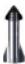
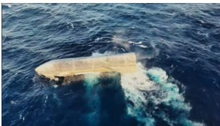

# Starship Flight 13 任务评估：在谨慎氛围中的积极信号

虽然这属于定性评估，但如果要给 SpaceX 的 Starship Flight 13 打分，我们会给出 A- 的整体评价。尽管并非完美无缺，Flight 13 包含了一些非凡的里程碑，这些里程碑应该能让观察者对 Starship 走向运营的路径更有信心。最值得注意的是，飞行后不久，马斯克发文表示 SpaceX 可能会在 Flight 14 上尝试首次飞船捕获，这为关注者提供了一个值得关注的潜在积极进展。持保留态度的人可能会将助推器着陆燃烧的异常视为谨慎的理由，但这只是 V3 助推器及其全新 Raptor 3 推进系统的第二次着陆尝试，因此硬着陆并不令人意外，而且与 Flight 12 相比，这仍然是一个明显的进步——当时 V3 助推器在到达着陆点之前就已丢失。8 月 4 日财报后的首次锁定期解除仍是一个悬而未决的因素，这可能会让许多潜在的长期持有者保持观望。整体来看，对公司的观察结论：积极。下一个里程碑……捕获飞船。如果他们能做到这一点，持保留态度的人可能需要重新审视自己的看法。

## 七个方面的评估：

1. **倒计时与发射准备 (B)**：从 7 月 16 日的 T-0 发射台中止中恢复（液氧涡轮泵中的水分导致四台 Raptor 发动机未能启动；更换了六台发动机），随后于 7 月 24 日顺利发射。7 月 23 日因天气能见度差而推迟，但这不在 SpaceX 的控制范围内。

2. **升空与爬升 (A+)**：全部 33 台 Super Heavy Raptor 发动机在干净、全推力的爬升中点火，无发动机熄火。

3. **热分离 (A+)**：干净的热分离和级间分离，没有重复导致 Flight 12 助推器失败的约 90 度翻转。

4. **返场推进与着陆燃烧 (C+)**：返场推进干净，但最后的着陆燃烧仅点燃了约 5 台发动机（共 13 台），导致在墨西哥湾硬着陆。未计划捕获，但软着陆是未来任何 V3 助推器塔架捕获的先决条件。

5. **载荷部署 (A+)**：首次部署了 20 颗生产型 Starlink V3 卫星（之前的飞行携带模拟器）。阵列和天线展开，与星座的激光链路成功。卫星按计划在不久后离轨——这些卫星并非用于服务客户。卫星在部署后拍摄了飞船隔热罩的大量图像。

6. **在轨机动/Raptor 重新点火 (A+)**：飞行约 39 分钟后成功进行单台发动机重新点火。这是在 Flight 12 上因飞船真空 Raptor 发动机丢失而放弃的机动测试。

7. **飞船再入、隔热罩与溅落 (A+)**：通过了峰值加热和最大动压，随后实现了 SpaceX 有史以来最软的溅落：无爆炸，飞船完好，在印度洋漂浮并传输遥测数据，使 SpaceX 能够捕获几乎整个隔热罩的高质量图像。部分隔热瓦受损，但隔热罩相比以往飞行有明显改进（见下文）。

## 接下来呢？值得关注的后续发射节点：

- **Flight 14**（预计约一个月后，8 月底/9 月初）：在 Ship 40 溅落后不久，马斯克发文称，除非数据审查发现问题，否则 SpaceX 将尝试用塔架捕获飞船，这将是 Starbase 首次在 Mechazilla 的机械臂上捕获飞船。
  - 这意味着 Starship 的首次轨道飞行：塔架捕获飞船需要轨道轨迹，因此 Flight 14 很可能是首次轨道尝试。经过 13 次试飞和三年时间，SpaceX 尚未用 Starship 完成完整的地球轨道飞行。
  - 可能还不会进行 V3 助推器捕获：鉴于 Flight 13 的助推器硬着陆，SpaceX 会希望在冒险进行捕获之前，先实现新型 V3 助推器的干净软着陆，因此 Flight 14 的助推器应该会再次飞向水面。
  - 潜在的首批运营型 Starlink V3：Flight 13 的 20 颗 V3 是一次亚轨道演示，在部署后约 20 分钟再入销毁；轨道飞行的 Flight 14 理论上可以首次将 V3 部署到工作轨道。

- **Flight 15**（大约再一个月后）：如果 Flight 14 成功实现飞船捕获和助推器软着陆，Flight 15 可能成为首次在同一任务中尝试飞船捕获和 V3 助推器捕获的飞行。

Flight 14/15 的飞行方案尚未得到 SpaceX 的官方确认；时间和捕获顺序是我们的估计。

**附图 1：Flight 13 评估表**

## Starship Flight 13 评估表

| 飞行测试 | Flight 13 (Ship 40 / Booster 20) |
| :--- | :--- |
| 日期 | 2026年7月24日 |
| 发射场 | Starbase, TX |
| 飞行器 | Starship V3 (第二次飞行) |
| 时长 | 约66分钟，亚轨道 |
| 结果 | 双溅落；飞船完好 |

| 飞行阶段 | 评分 |
| :--- | :--- |
| 01 倒计时与发射准备 | (B) |
| 02 升空与爬升 | (A+) |
| 03 热分离 | (A+) |
| 04 返场推进与着陆燃烧 | (C+) |
| 05 载荷部署 | (A+) |
| 06 在轨机动/Raptor 重新点火 | (A+) |
| 07 飞船再入、隔热罩与溅落 | (A+) |

## □ 评论

虽然这属于定性评估，但如果要给 SpaceX 的 Starship Flight 13 打分，我们会给出 A- 的整体评价。尽管并非完美无缺，Flight 13 包含了一些非凡的里程碑，这些里程碑应该能让观察者对 Starship 走向运营的路径更有信心。最值得注意的是，飞行后不久，马斯克发文表示 SpaceX 可能会在 Flight 14 上尝试首次飞船捕获，这为关注者提供了一个值得关注的潜在积极进展。

持保留态度的人可能会将助推器着陆燃烧的异常视为谨慎的理由，但这只是 V3 助推器及其全新 Raptor 3 推进系统的第二次着陆尝试，因此硬着陆并不令人意外，而且与 Flight 12 相比，这仍然是一个明显的进步——当时 V3 助推器在到达着陆点之前就已丢失。8 月 4 日财报后的首次锁定期解除仍是一个悬而未决的因素，这可能会让许多潜在的长期持有者保持观望。

整体来看，对公司的观察结论：积极。下一个里程碑……捕获飞船。如果他们能做到这一点，持保留态度的人可能需要重新审视自己的看法。

## □ 值得关注的节点

**Flight 14**（目标约一个月后，8 月底/9 月初）：在 Ship 40 溅落后不久，马斯克发文称，除非数据审查发现问题，否则 SpaceX 将尝试用塔架捕获飞船，这将是 Starbase 首次在 Mechazilla 的机械臂上捕获飞船。

来源：MS

> 这意味着 Starship 的首次轨道飞行：塔架捕获飞船需要轨道轨迹，因此 Flight 14 很可能是首次轨道尝试。经过 13 次飞行和三年时间，SpaceX 尚未用 Starship 完成完整的地球轨道飞行。

可能还不会进行 V3 助推器捕获：鉴于 Flight 13 的助推器硬着陆，SpaceX 会希望在冒险进行捕获之前，先实现新型 V3 助推器的干净软着陆，因此 Flight 14 的助推器应该会再次飞向水面。

> 潜在的首批运营型 Starlink V3：Flight 13 的 20 颗 V3 是一次亚轨道演示，在部署后约 20 分钟再入销毁；轨道飞行的 Flight 14 可以首次将 V3 部署到工作轨道。

**Flight 15**（大约再一个月后）：如果 Flight 14 成功实现飞船捕获和助推器软着陆，Flight 15 可能成为首次在同一任务中尝试飞船捕获和 V3 助推器捕获的飞行。

Flight 14/15 的飞行方案尚未得到 SpaceX 的官方确认；时间和捕获顺序是我们的估计。

**附图 2：级间分离后的 Ship 40 视图**

来源：SpaceX

**附图 3：Ship 40 在印度洋完好漂浮**

来源：SpaceX
