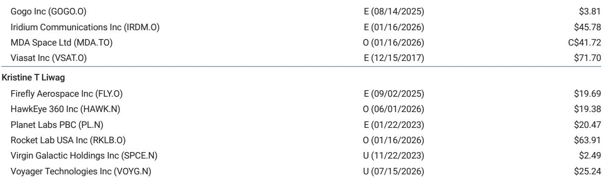
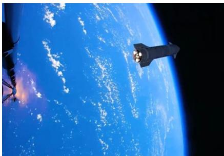

# MS：SpaceX星舰第13次飞行测试观察

星舰第13次飞行测试（Flight 13）在2026年7月24日完成，MS研究团队给出整体A-的评价。这份报告的核心判断是：尽管助推器着陆阶段出现硬着陆，但飞行测试在载荷部署、在轨发动机重启和飞船再入回收三个关键环节均达到或超出预期，为星舰从测试阶段走向运营阶段提供了更清晰的路径。尤其值得关注的是，马斯克在飞行后公开表示，第14次飞行将尝试首次捕获飞船，这可能是星舰项目迄今最明确的进展信号。

## 1. 首次部署生产型星链V3卫星，载荷能力得到验证

Flight 13首次搭载并部署了20颗生产型星链V3卫星，此前所有测试飞行使用的都是模拟载荷。报告指出，这些卫星成功展开阵列和天线，与星座建立了激光链路，并在再入大气层前对飞船热防护系统进行了成像。虽然这批卫星按计划在部署约20分钟后坠毁，并未进入服务轨道，但这次部署证明了星舰具备实际投放生产型卫星的能力。MS认为，如果Flight 14实现轨道飞行，将有可能首次将星链V3卫星部署到工作轨道，这将是星舰首次真正意义上的运营任务。

> **KC观察：** 从模拟载荷到生产型卫星，这一步跨越的意义在于验证了星舰作为运载工具的商业可行性。报告没有强调的是，20颗V3卫星的部署能力意味着星舰的单次发射效率已远超猎鹰9号，这对星链星座的组网速度有直接影响。

## 2. 飞船再入与回收取得重要进展，热防护系统改进显著

飞船在印度洋实现了迄今为止最软的海上溅落，没有发生爆炸，船体完整并持续传输遥测数据。报告特别提到，SpaceX得以获取几乎整个热防护系统的高清图像，虽然部分隔热瓦有损伤，但相比前几次飞行有明显改善。这一结果直接支撑了Flight 14尝试捕获飞船的可行性——如果飞船在再入过程中无法保持结构完整，捕获操作将无从谈起。MS将飞船再入、热防护和溅落环节评为A+。

## 3. 助推器着陆仍为薄弱环节，但属于预期范围内的技术迭代

Flight 13的助推器在返回着陆阶段仅点燃了13台发动机中的约5台，导致硬着陆。报告将其评为C+，但同时强调，这是V3助推器及其全新猛禽3发动机的第二次着陆尝试，Flight 12中V3助推器甚至未能到达着陆区就失效了。MS的判断是，硬着陆不应被视为重大意外，而是新一代推进系统迭代过程中的正常现象。在实现软着陆之前，SpaceX不会冒险尝试用发射塔捕获V3助推器，因此Flight 14的助推器仍将执行海上溅落。

## 4. Flight 14的轨道捕获尝试将成为关键节点

报告将Flight 14视为星舰项目最重要的观察节点。如果SpaceX按计划尝试用发射塔机械臂捕获飞船，这将意味着星舰首次执行轨道飞行任务——因为塔架捕获要求飞船进入轨道轨迹，而非亚轨道。经过13次测试飞行和三年时间，星舰尚未完成一次完整的地球轨道飞行。MS分析师指出，如果Flight 14成功捕获飞船，Flight 15有可能首次尝试在同一任务中同时捕获飞船和V3助推器。报告认为，捕获飞船的能力将是改变市场对星舰项目定价预期的关键变量。

> **KC观察：** MS对SpaceX的估值模型中，企业AI业务占比超过一半（每股152美元），星舰和星链的运营进度直接影响市场对这家公司技术执行力的判断。Flight 14的轨道捕获尝试，本质上是检验SpaceX能否将测试能力转化为运营能力的分水岭。

For informational purposes only. Portions may be generated,translated,summarized,or edited with AI assistance based on source materials and may contain omissions or errors. Please verify independently. This is not investment,legal,tax,accounting,or other professional advice.

