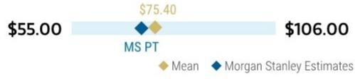
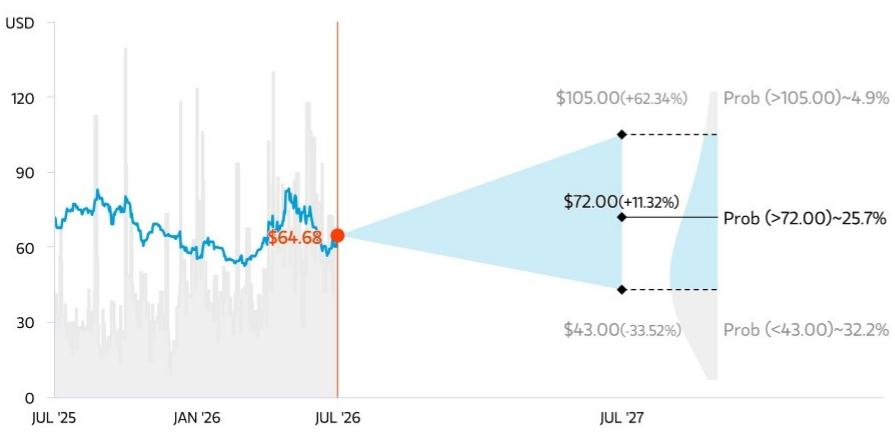
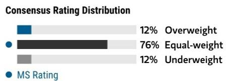
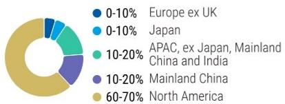
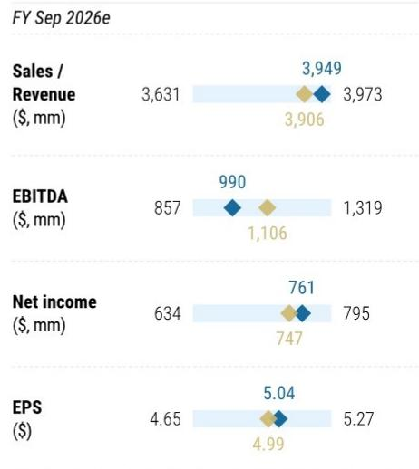

Skyworks Solutions Inc | North America

# 稳健季度，交易提前完成，股息暂停

## 主要变化

<table><tr><td>Skyworks Solutions Inc (SWKS.O)</td><td>此前</td><td>当前</td></tr><tr><td>目标报价</td><td>$76.00</td><td>$72.00</td></tr></table>

## AlphaSignals 业绩反应

<table><tr><td>未改变 对研究框架的影响</td><td>— 符合预期 财务表现与市场共识</td><td>— 基本不变 未来12个月共识每股盈利方向</td></tr></table>

来源：公司数据，MS

Skyworks 公布了稳健的业绩，考虑到智能手机领域的环境，这有些出乎意料，并认为 Qorvo 交易有可能提前完成。暂停股息是合理的，但会产生一定影响。

## 关键要点

智能手机业务在内存相关因素影响下保持稳定，苹果内容相关的不利影响低于预期，且8月份有新品发布

\- 广泛市场表现分化，汽车和数据中心强劲，但物联网较弱

Qorvo 交易可能在今年内完成；QRVO 的数据同样稳健，表明有显著的增厚效应

\- 暂停股息会对报价产生干扰，但为有耐心的观察者提供了机会

相关因素使我们维持中性评级，但我们确实看到对耐心观察者的价值

移动端需求保持稳定，但评估更高内存价格的最终影响仍为时尚早。管理层继续看到渠道库存偏紧，订单出货比高于1，且没有异常库存积累或终端需求实质性变化的迹象。9月移动业务收入预计将环比增长接近20%，苹果（由 Erik Woodring 覆盖）在季节性新品发布期间的增长速度明显快于整体移动业务。苹果的趋势相比最初预期有所改善，预期的内容相关下降幅度从20-25%收窄至10%出头，这得益于更好的出货量和产品组合。长期来看，我们持续关注价格通胀的影响。苹果和高端市场可能具有更大的价格弹性，但新一轮价格上涨的影响需要时间才能显现。目前，Skyworks 继续预计下半年将呈现季节性特征，综合内容持平，与之前的指引一致。

广泛市场保持稳定，汽车和数据中心增长强劲

<table><tr><td colspan="2">MS &amp; CO. LLC</td></tr><tr><td colspan="2">Joseph Moore</td></tr><tr><td colspan="2">股票分析师</td></tr><tr><td>Joseph.Moore@morganstanley.com</td><td>+1 212 761-7516</td></tr><tr><td colspan="2">Ella Tulchinsky</td></tr><tr><td colspan="2">研究助理</td></tr><tr><td>Ella.Tulchinsky@morganstanley.com</td><td>+1 212 761-2222</td></tr><tr><td colspan="2">Shane Brett</td></tr><tr><td colspan="2">股票分析师</td></tr><tr><td>Shane.Brett@morganstanley.com</td><td>+1 212 761-1022</td></tr><tr><td colspan="2">Mason Wayne</td></tr><tr><td colspan="2">研究助理</td></tr><tr><td>Mason.Wayne@morganstanley.com</td><td>+1 212 761-6012</td></tr><tr><td colspan="2">Nicole Kozhukhov</td></tr><tr><td colspan="2">研究助理</td></tr><tr><td>Nicole.Kozhukhov@morganstanley.com</td><td>+1 212 761-1636</td></tr></table>

## Skyworks Solutions Inc (SWKS.O, SWKS US)

半导体 | 美国

<table><tr><td>股票评级</td><td>中性</td></tr><tr><td>行业观点</td><td>有吸引力</td></tr><tr><td>目标报价</td><td>$72.00</td></tr><tr><td>报价，收盘价 (2026年7月28日)</td><td>$64.68</td></tr><tr><td>当前市值 (百万)</td><td>$9,858</td></tr><tr><td>52周范围</td><td>$90.90-51.93</td></tr></table>

<table><tr><td>财年截止日</td><td>09/25</td><td>09/26e</td><td>09/27e</td><td>09/28e</td></tr><tr><td>每股盈利 ($)**</td><td>5.93</td><td>5.04</td><td>5.11</td><td>6.04</td></tr><tr><td>此前每股盈利 ($)**</td><td>-</td><td>4.77</td><td>5.11</td><td>6.08</td></tr><tr><td>市盈率</td><td>17.1</td><td>19.9</td><td>24.1</td><td>18.2</td></tr><tr><td>每股盈利 ($)§</td><td>5.55</td><td>4.99</td><td>5.16</td><td>6.40</td></tr><tr><td>股息率 (%)</td><td>3.7</td><td>3.3</td><td>0.0</td><td>0.0</td></tr></table>

除非另有说明，所有指标均基于 MS ModelWare 框架
\*\* = 基于共识方法
§ = 共识数据由 Refinitiv Estimates 提供
e = MS 估计

## 季度每股盈利 (\$)

<table><tr><td>季度</td><td>2025</td><td>2026e 此前</td><td>2026e 当前</td><td>2027e 此前</td><td>2027e 当前</td></tr><tr><td>Q1</td><td>1.60</td><td>-</td><td>1.54a</td><td>1.45</td><td>1.40</td></tr><tr><td>Q2</td><td>1.24</td><td>-</td><td>1.15a</td><td>1.15</td><td>1.19</td></tr><tr><td>Q3</td><td>1.33</td><td>-</td><td>1.08a</td><td>1.12</td><td>1.05</td></tr><tr><td>Q4</td><td>1.76</td><td>1.24</td><td>1.27</td><td>1.39</td><td>1.47</td></tr></table>

e = MS 估计，a = 公司实际报告数据

MS 与其研究报告中所覆盖的公司有业务往来或寻求建立业务关系。因此，读者应注意，该公司可能存在影响 MS 客观性的利益冲突。读者应将 MS 视为做出决策的单一因素之一。

有关分析师认证和其他重要披露，请参阅本报告末尾的披露部分。

但消费类物联网产品表现疲软。数据中心仍然是增长最快的领域，由于对时序、高速连接和电源隔离解决方案的需求，同比增长超过50%，目前增长受供应限制。

## 较高的投入成本仍是近期毛利率的主要影响因素。

9月毛利率指引为44%-45%，而6月约为45%，反映了更高的移动业务组合以及来自黄金、运费、加急费用和更紧张的制造产能的成本通胀。这种影响在移动业务中更为明显，因为该领域在产品周期内定价固定，限制了Skyworks抵消成本上涨的能力，并吸收了正常的季节性效率提升。长期来看，更丰富的高毛利广泛市场收入组合、Qorvo目前超过50%的毛利率以及至少5亿美元的预期协同效应，支持了合并后公司50%-55%的毛利率目标。

对Qorvo交易提前完成的信心增强，同时Skyworks正在取消股息，并越来越多地为FY27的合并公司进行规划。中国的监管审查已进入与SAMR的第三阶段，管理层将其描述为流程的最后阶段，公司正在与剩余的两个司法管辖区进行建设性合作。Skyworks现在对交易能在2026日历年完成持乐观态度，并正在为可能在其财年结束前完成交易做准备。

为此，Skyworks预计近期将筹集约20亿美元的债务，并宣布对其资本配置框架进行重大调整。

## 取消股息的决定将在短期内导致一些卖出压力。

合并后的实体将拥有显著更多的股份数量，这将提高股息成本，此外还有为交易融资而进行的债务筹集。如果公司希望调整资本结构以维持股息，这是可行的，但我们的感觉是，公司明显倾向于使用现金回购股份或进行非有机增长——并对当前报价未能充分反映交易价值和高回报表现感到一些困扰。尽管如此，从历史上看，对于具有可观回报表现的公司，暂停股息曾导致明显的价格错位。

9月季度指引：收入指引为10.35亿美元（环比增长11%，同比下降6%），高于市场预期的10.26亿美元和我们估计的10.13亿美元。毛利率为44.5%，符合市场和我们的预期。每股盈利指引为1.27美元，略低于共识预期的1.29美元和我们估计的1.30美元。移动业务指引为环比增长接近20%，符合我们16%的预期。广泛市场指引为环比略有增长，也符合我们1%的预期。

对估计的调整：对于FY26，我们目前模型为39亿美元/45.3%/$5.04，此前为39亿美元/45.6%/$5.04。对于FY27，我们目前模型为40亿美元/45.7%/$5.11，此前为41亿美元/46.4%/$5.38。

对公司的看法：尽管面临苹果相关的内容不利因素，Skyworks 执行良好，公司持续的稳健表现令人鼓舞。智能手机环境似乎保持稳定，但考虑到内存短缺的严重性，我们仍持一些谨慎态度——智能手机市场目前似乎是半导体领域需求驱动因素中较弱的之一。

尽管如此，在增厚效应之后，该报价似乎便宜得不容忽视，尤其是在股息暂停导致报价疲软的情况下。我们当然可以看到，有比支持一个仅导致个位数倍数的股息更好的现金用途。我们在此看到对耐心观察者的价值，但业务方面的因素使我们维持中性评级。

关于我们的目标报价，我们对CY27的盈利估计因更保守的毛利率展望而略有下降。将相同的13.5倍倍数应用于我们修订后的每股盈利估计5.31美元，得出新的目标报价72美元。

## 风险回报 – Skyworks Solutions Inc (SWKS.O)

长期内容增长机会，但因客户集中度维持中性

## 目标报价 \$72.00

考虑到交易协同效应，我们相信合并后的CY27每股盈利约为7美元，而我们独立估计为5.31美元，因此这大约是合并实体的13倍。考虑到一些交易风险和协同效应的不确定性，我们更倾向于基于独立每股盈利以13.5倍倍数进行估值。

共识目标报价分布

来源：Refinitiv, MS

## 风险回报图及期权隐含概率 (12个月)

  
关键：— 历史报价表现 ● 当前报价 ◆ 目标报价

## 中性评级框架

■ SWKS 宣布收购射频同行 QRVO，预计在CY27完成。该交易预计将具有增厚效应，并有助于加强移动技术和扩大规模。

\- 我们看好 Skyworks 的长期增长故事，受到 Wi-Fi 7 物联网升级周期和新兴汽车业务的鼓舞。短期内，公司正面临其最大客户苹果的份额流失，我们认为扩大其业务覆盖范围也很重要。广泛市场业务正从库存失衡和终端需求变化中复苏。
- 如果广泛市场业务能占公司业务更大比例，或者公司的移动业务能够在中国市场抓住需求，我们认为估值有上行空间。

来源：Refinitiv, MS, MS Institutional Equities Division。我们牛市、基准和熊市情景的概率是使用截至2026年7月28日期权市场的隐含波动率数据估算的。所有数字均为近似风险中性概率，即报价在三个月或一年内达到情景价格以上的概率。在此查看期权概率方法说明

  
来源：Refinitiv, MS

## 牛市情景

\$105.00

## 16倍 CY27 非GAAP每股盈利 \$6.58

SWKS/QRVO 收购完成。收入增长超出预期，因为更广泛的智能手机复苏带来更高的内容价值和智能手机出货量增长。毛利率向 SWKS 的目标模型改善，WiFi 7/8 升级惠及广泛市场，向股东的现金回报提升倍数。

## 基准情景

\$72.00

## 13倍 CY27 每股盈利 \$5.31

Skyworks 在CY26下降8%，在CY27实现2.1%的收入增长。广泛市场增速超过公司平均水平，苹果内容持平。

## 熊市情景

\$43.00

## 8倍 CY27 非GAAP每股盈利 \$5.34

收购交易被取消。Skyworks 在苹果失去大量份额，且公司未能实现多元化。报价的估值倍数进一步下降。

## 风险回报 – Skyworks Solutions Inc (SWKS.O)

## 关键盈利输入

<table><tr><td>驱动因素</td><td>2025年9月</td><td>2026年9月e</td><td>2027年9月e</td><td>2028年9月e</td></tr><tr><td>GAAP 收入 ($, 百万)</td><td>4,087</td><td>3,949</td><td>4,036</td><td>4,463</td></tr><tr><td>MW 毛利率 (%)</td><td>45.9</td><td>44.2</td><td>45.0</td><td>45.9</td></tr><tr><td>MW 每股盈利 ($)</td><td>4.51</td><td>3.25</td><td>2.68</td><td>3.56</td></tr><tr><td>库存 ($, 百万)</td><td>755</td><td>829</td><td>818</td><td>900</td></tr><tr><td>库存周转天数</td><td>114.5</td><td>131.1</td><td>134.5</td><td>136.1</td></tr></table>

## 驱动因素

\- 广泛市场增长快于预期，包括来自 SLAB I&A 收购的贡献。

\- 增加对股东的现金回报，包括回购和股息增长

• 在苹果持续获得内容增长

## 全球收入分布

  
来源：MS 估计 在此查看区域层级说明

## MS ALPHA 模型

<table><tr><td>3/5 最佳</td><td>24个月 展望</td><td>4/5 最多</td><td>3个月 展望</td></tr></table>

来源：Refinitiv, FactSet, MS；1 是最受青睐的五分位，5 是最不受青睐的五分位

## 目标报价/评级的风险

## 上行风险

• SWKS/QRVO 收购获批

• 在5G智能手机中捕获更多内容价值

• 在经历一段疲弱期后，有可能在中国市场恢复份额

\- 广泛市场产品组合进一步扩张

## 下行风险

• SWKS/QRVO 收购被取消

\- 射频领域的竞争加剧和中国本土化努力

\- 客户集中度以及来自苹果的潜在定价压力（约占总销售额的60%）

• 如果毛利率未能恢复到近期目标

## 持仓情况

<table><tr><td>机构持有人，主动占比</td><td>41.2%</td><td></td><td></td><td></td><td></td></tr><tr><td>对冲基金行业多空比</td><td>2.1x</td><td></td><td></td><td></td><td></td></tr><tr><td>对冲基金行业净敞口</td><td>29.5%</td><td></td><td></td><td></td><td></td></tr></table>

Refinitiv; MSPB Content。包括与 MSPB 持有的某些对冲基金敞口。信息可能与更广泛的市场趋势不一致或未能反映。多空比 = 多头敞口 / 空头敞口。行业占总净敞口的百分比 = (对于特定行业：多头敞口 - 空头敞口) / (在所有行业中：多头敞口 - 空头敞口)。

MS 估计 vs. 共识  
  
◆ 均值 ◆ MS 估计  
来源：Refinitiv, MS

财务摘要

图表 1：利润表摘要  
SWKS-US：截至2026年6月季度的概况

<table><tr><td colspan="10">利润表</td></tr><tr><td>季度结果：</td><td colspan="3">实际</td><td>上一季度</td><td>环比</td><td>去年同期</td><td>同比</td><td>共识</td><td>MSe</td></tr><tr><td>收入</td><td colspan="3">$935.0</td><td>$943.7</td><td>-0.9%</td><td>$965.0</td><td>-3.1%</td><td>$901.8</td><td>$925.0</td></tr><tr><td>毛利率</td><td colspan="3">44.9%</td><td>45.0%</td><td>-12 基点</td><td>47.1%</td><td>-217 基点</td><td>44.9%</td><td>45.0%</td></tr><tr><td>每股盈利</td><td colspan="3">$1.08</td><td>$1.15</td><td>($0.07)</td><td>$1.33</td><td>($0.25)</td><td>$1.04</td><td>$1.05</td></tr><tr><td>下季度展望：</td><td>低</td><td>高</td><td>中点</td><td rowspan="4"></td><td></td><td></td><td></td><td></td><td></td></tr><tr><td>收入</td><td>$1,010</td><td>$1,060</td><td>$1,035.0</td><td>10.7%</td><td>$1,100.2</td><td>-5.9%</td><td>$1,026.2</td><td>$1,013.0</td></tr><tr><td>毛利率</td><td>44.0%</td><td>45.0%</td><td>44.5%</td><td>-40 基点</td><td>46.5%</td><td>-197 基点</td><td>45.8%</td><td>45.8%</td></tr><tr><td>每股盈利</td><td></td><td></td><td>$1.27</td><td>$0.19</td><td>$1.76</td><td>($0.49)</td><td>$1.29</td><td>$1.30</td></tr></table>

来源：公司数据，FactSet，MS 估计

图表 2：利润表差异

<table><tr><td colspan="5">非GAAP财务数据，$ 百万，每股数据除外</td></tr><tr><td></td><td>报告 2026/2F</td><td>MS 估计 2026/2F</td><td>差异 实际 vs. 估计</td><td>每股差异</td></tr><tr><td>总收入</td><td>943.7</td><td>925.0</td><td>18.7</td><td>0.12</td></tr><tr><td>销售成本</td><td>518.8</td><td>508.7</td><td>10.1</td><td>(0.07)</td></tr><tr><td>毛利润</td><td>424.9</td><td>416.2</td><td>8.7</td><td>0.06</td></tr><tr><td>毛利率</td><td>45.0%</td><td>45.0%</td><td>0.0%</td><td></td></tr><tr><td>研发</td><td>175.8</td><td>188.2</td><td>(12.4)</td><td>0.08</td></tr><tr><td>销售、一般及行政</td><td>103.9</td><td>96.1</td><td>7.8</td><td>(0.05)</td></tr><tr><td>其他运营支出 (收入)</td><td>(43.7)</td><td>(40.0)</td><td>(3.7)</td><td>0.02</td></tr><tr><td>总运营费用</td><td>236.0</td><td>244.3</td><td>(8.3)</td><td>0.05</td></tr><tr><td>运营收入</td><td>188.9</td><td>172.0</td><td>16.9</td><td>0.11</td></tr><tr><td>运营利润率</td><td>20.0%</td><td>18.6%</td><td>1.4%</td><td></td></tr><tr><td>所得税准备</td><td>19.2</td><td>17.6</td><td>1.6</td><td>(0.01)</td></tr><tr><td>净利润</td><td>173.0</td><td>158.4</td><td>14.6</td><td>0.10</td></tr><tr><td>每股盈利</td><td>$1.15</td><td>$1.05</td><td>$0.10</td><td>0.10</td></tr></table>

来源：公司数据，MS 估计

## 预计财务报表

图表 3：Skyworks：预计利润表

<table><tr><td rowspan="3">Skyworks 利润表($ 百万；财年截止于9月)</td><td>C4Q24A</td><td>C1Q25A</td><td>C2Q25A</td><td>C3Q25A</td><td>C4Q25A</td><td>C1Q26A</td><td>C2Q26A</td><td>C3Q26E</td><td>C4Q26E</td><td>C1Q27E</td><td>C2Q27E</td><td>C3Q27E</td><td>C4Q27E</td><td>C1Q28E</td><td>C2Q28E</td><td>C3Q28E</td></tr><tr><td>Dec-24</td><td>Mar-25</td><td>Jun-25</td><td>Sep-25</td><td>Dec-25</td><td>Mar-26</td><td>Jun-26</td><td>Sep-26</td><td>Dec-26</td><td>Mar-27</td><td>Jun-27</td><td>Sep-27</td><td>Dec-27</td><td>Mar-28</td><td>Jun-28</td><td>Sep-28</td></tr><tr><td>2025/1F</td><td>2025/2F</td><td>2025/3F</td><td>2025/4F</td><td>2026/1F</td><td>2026/2F</td><td>2026/3F</td><td>2026/4F</td><td>2027/1F</td><td>2027/2F</td><td>2027/3F</td><td>2027/4F</td><td>2028/1F</td><td>2028/2F</td><td>2028/3F</td><td>2028/4F</td></tr><tr><td>总收入</td><td>$ 1,068.5</td><td>$ 953.2</td><td>$ 965.0</td><td>$ 1,100.2</td><td>$ 1,035.4</td><td>$ 943.7</td><td>$ 934.8</td><td>$ 1,034.7</td><td>$ 1,074.3</td><td>$ 970.3</td><td>$ 944.2</td><td>$ 1,047.2</td><td>$ 1,138.8</td><td>$ 1,084.8</td><td>$ 1,055.2</td><td>$ 1,184.4</td></tr><tr><td>总收入 MW</td><td>1,068.5</td><td>953.2</td><td>965.0</td><td>1,100.2</td><td>1,035.4</td><td>943.7</td><td>934.8</td><td>1,034.7</td><td>1,074.3</td><td>970.3</td><td>944.2</td><td>1,047.2</td><td>1,138.8</td><td>1,084.8</td><td>1,055.2</td><td>1,184.4</td></tr><tr><td>环比变化</td><td>4.3%</td><td>-10.8%</td><td>1.2%</td><td>14.0%</td><td>-5.9%</td><td>-8.9%</td><td>-0.9%</td><td>10.7%</td><td>3.8%</td><td>-9.7%</td><td>-2.7%</td><td>10.9%</td><td>8.7%</td><td>-4.7%</td><td>-2.7%</td><td>12.2%</td></tr><tr><td>同比变化</td><td>-11.1%</td><td>-8.9%</td><td>6.6%</td><td>7.3%</td><td>-3.1%</td><td>-1.0%</td><td>-3.1%</td><td>-6.0%</td><td>3.8%</td><td>2.8%</td><td>1.0%</td><td>1.2%</td><td>6.0%</td><td>11.8%</td><td>11.8%</td><td>13.1%</td></tr><tr><td>销售成本 - GAAP</td><td>626.6</td><td>561.6</td><td>564.0</td><td>652.6</td><td>608.2</td><td>558.4</td><td>559.8</td><td>582.0</td><td>594.0</td><td>530.4</td><td>520.9</td><td>573.9</td><td>617.6</td><td>587.2</td><td>576.0</td><td>631.6</td></tr><tr><td>毛利率 - GAAP</td><td>441.9</td><td>391.6</td><td>401.0</td><td>447.6</td><td>427.2</td><td>385.3</td><td>375.0</td><td>452.8</td><td>480.3</td><td>440.0</td><td>423.3</td><td>473.3</td><td>521.2</td><td>497.6</td><td>479.2</td><td>552.8</td></tr><tr><td>毛利率 GAAP %</td><td>41.4%</td><td>41.1%</td><td>41.6%</td><td>40.7%</td><td>41.3%</td><td>40.8%</td><td>40.1%</td><td>43.8%</td><td>44.7%</td><td>45.3%</td><td>44.8%</td><td>45.2%</td><td>45.8%</td><td>45.9%</td><td>45.4%</td><td>46.7%</td></tr><tr><td>毛利率 - 非GAAP</td><td>497.1</td><td>444.7</td><td>454.2</td><td>511.3</td><td>482.3</td><td>424.9</td><td>420.0</td><td>460.8</td><td>484.3</td><td>445.6</td><td>434.2</td><td>481.3</td><td>525.2</td><td>503.2</td><td>490.1</td><td>560.8</td></tr><tr><td>毛利率 非GAAP%</td><td>46.5%</td><td>46.7%</td><td>47.1%</td><td>46.5%</td><td>46.6%</td><td>45.0%</td><td>44.9%</td><td>44.5%</td><td>45.1%</td><td>45.9%</td><td>46.0%</td><td>46.0%</td><td>46.1%</td><td>46.4%</td><td>46.4%</td><td>47.3%</td></tr><tr><td>毛利率 - MW</td><td>489.8</td><td>439.0</td><td>445.7</td><td>503.3</td><td>464.9</td><td>419.3</td><td>409.1</td><td>452.8</td><td>480.3</td><td>440.0</td><td>423.3</td><td>473.3</td><td>521.2</td><td>497.6</td><td>479.2</td><td>552.8</td></tr><tr><td>毛利率 MW%</td><td>45.8%</td><td>46.1%</td><td>46.2%</td><td>45.7%</td><td>44.9%</td><td>44.4%</td><td>43.8%</td><td>43.8%</td><td>44.7%</td><td>45.3%</td><td>44.8%</td><td>45.2%</td><td>45.8%</td><td>45.9%</td><td>45.4%</td><td>46.7%</td></tr><tr><td>研发 - GAAP</td><td>176.4</td><td>186.5</td><td>199.4</td><td>223.1</td><td>203.4</td><td>212.4</td><td>207.8</td><td>225.6</td><td>214.9</td><td>223.2</td><td>217.2</td><td>209.4</td><td>227.8</td><td>238.7</td><td>232.1</td><td>236.9</td></tr><tr><td>占收入百分比</td><td>16.5%</td><td>19.6%</td><td>20.7%</td><td>20.3%</td><td>19.6%</td><td>22.5%</td><td>22.2%</td><td>21.8%</td><td>20.0%</td><td>23.0%</td><td>23.0%</td><td>20.0%</td><td>20.0%</td><td>22.0%</td><td>22.0%</td><td>20.0%</td></tr><tr><td>销售、一般及行政 - GAAP</td><td>82.6</td><td>88.0</td><td>89.3</td><td>111.7</td><td>108.4</td><td>119.7</td><td>98.7</td><td>108.6</td><td>107.4</td><td>106.7</td><td>113.3</td><td>115.2</td><td>102.5</td><td>119.3</td><td>116.1</td><td>118.4</td></tr><tr><td>占收入百分比</td><td>7.7%</td><td>9.2%</td><td>9.3%</td><td>10.2%</td><td>10.5%</td><td>12.7%</td><td>10.6%</td><td>10.5%</td><td>10.0%</td><td>11.0%</td><td>12.0%</td><td>11.0%</td><td>9.0%</td><td>11.0%</td><td>11.0%</td><td>10.0%</td></tr><tr><td>其他运营支出 - GAAP</td><td>1.8</td><td>19.8</td><td>1.7</td><td>1.8</td><td>11.6</td><td>11.1</td><td>20.0</td><td>0.2</td><td>0.2</td><td>0.2</td><td>0.2</td><td>0.2</td><td>0.2</td><td>0.2</td><td>0.2</td><td>0.2</td></tr><tr><td>运营收入 - GAAP</td><td>181.1</td><td>97.3</td><td>110.6</td><td>111.0</td><td>103.8</td><td>42.1</td><td>48.5</td><td>118.4</td><td>157.8</td><td>109.8</td><td>92.6</td><td>148.5</td><td>190.
