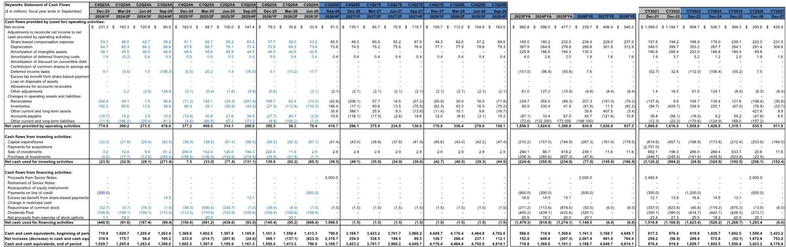
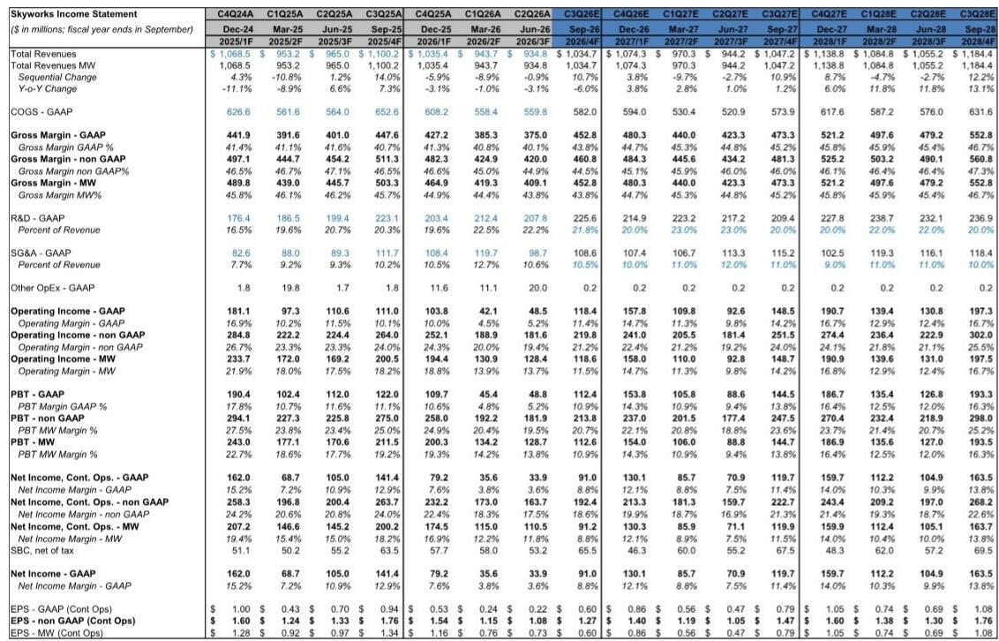
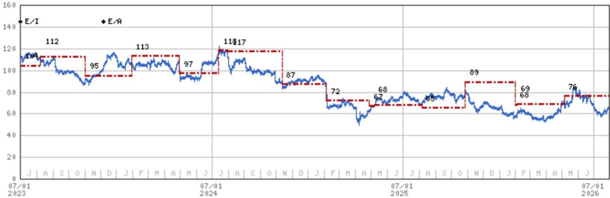

# Skyworks 股息调整与Qorvo交易加速：一个值得关注的战略转型案例

Skyworks Solutions近期交出了一份稳健的季度成绩单，营收略超预期。9月季度营收指引为10.35亿美元，高于市场预期的10.26亿美元和分析师预估的10.13亿美元。智能手机业务——长期被视为拖累因素——展现出令人意外的韧性。苹果业务相关的不利因素从最初预计的20-25%下降收窄至低两位数，主要得益于更好的出货量和产品组合。但真正的战略故事在于：Skyworks目前对Qorvo的收购能在2026日历年内完成持乐观态度，这早于此前预期，公司已做出暂停股息以资助交易并重塑资本结构的重要决定。

这种运营稳定性与战略转型的结合，创造了一种不同寻常的风险回报特征。该公司的报价约为分析师修正后2027日历年度每股收益预估（约7美元）的13.5倍，备考基础上市盈率仅为10-11倍。股息暂停虽然在短期内带来干扰，但最终可能成为推动公司重新估值的催化剂，通过将资本重新配置到更高回报的用途上。对于愿意审视短期波动的耐心观察者而言，当前格局具有不同寻常的非对称性。

## 股息暂停短期内将影响公司表现，但代表理性的资本配置决策

取消股息的决定是短期内对公司影响最重大的催化剂，可能会引发一定的卖出压力。Skyworks此前支付的股息回报表现约为3.7%（基于当前报价）。分析师指出，历史上具有可观回报表现的公司暂停股息的情况，往往伴随着明显的价格调整。此举背后的逻辑很直接：与Qorvo合并后的实体将拥有显著更大的股本规模，使得维持股息成本更高，公司还需要筹集约20亿美元债务来资助交易。管理层明确表示更倾向于将现金用于回购和内生增长，而非支持分析师描述为“仅带来高个位数倍数”的股息。

这是资本配置纪律的典型范例。当一家公司的自由现金流回报表现处于低个位数时，通过股息向股东返还现金是低效的资本使用方式。分析师注意到管理层对当前报价未能充分反映交易价值和较高回报表现感到有些困扰，这表明股息暂停可能是一个有意的信号：公司认为自身被低估，更倾向于将资本部署到创造价值的收购和回购中。对于认同这一判断的观察者而言，股息暂停并非困境的信号，而是将资本理性重新配置到更高回报机会的行为。

## Qorvo交易加速推进，将提升合并实体的盈利能力和利润率

Qorvo收购是Skyworks研究主题的核心，时间表正在加快。中国监管审查已进入与SAMR的第三阶段，管理层将其描述为流程的最后阶段，公司正在与剩余两个司法管辖区进行建设性合作。Skyworks目前对交易能在2026日历年内完成持乐观态度，并正在为可能在其财年结束前完成交易做准备。这相比此前预期有显著加速。

交易的财务逻辑具有说服力。Qorvo的毛利率超过50%，合并后的实体目标毛利率为50-55%，至少5亿美元的预期协同效应提供支撑。分析师估计，合并后2027日历年度每股收益约为7美元，而独立预估为5.31美元。按当前报价64.68美元计算，备考市盈率约为9倍，显著低于可比半导体公司的估值倍数。分析师出于交易风险和协同效应不确定性，在估值中对独立每股收益应用13.5倍市盈率，但上行情景清晰：如果交易完成且协同效应实现，公司可能获得显著重估。

## 核心业务表现好于预期，但结构性风险依然存在

运营表现为战略转型提供了坚实基础。移动需求保持稳定，管理层报告渠道库存健康、订单出货比高于1，且没有异常库存积累或终端需求明显变化的迹象。9月移动业务营收预计环比增长高两位数，苹果在季节性新品推出期间的增长速度显著快于整体移动业务。苹果相关不利因素从20-25%收窄至低两位数，得益于更好的出货量和产品组合。

然而，分析师对智能手机环境仍持谨慎态度，将其描述为“目前半导体领域需求驱动因素中最弱的之一”，原因是内存短缺的严重性。更高的内存价格可能最终影响需求弹性，尤其是在苹果所在的高端市场。分析师指出，苹果和高端市场可能具有更大的价格弹性，但新的涨价周期需要时间才能生效。这是一个在未来几个季度可能重新出现的真实风险。

广泛市场业务呈现更为复杂的图景。汽车和数据中心领域增长强劲，数据中心业务同比增长超过50%，得益于时序、高速连接和电源隔离解决方案的需求。然而，面向消费者的物联网产品仍然疲软。数据中心业务目前受供应限制，这表明如果产能能够扩大，存在额外上行空间。向更高利润率的广泛市场业务的结构性转变，是长期利润率目标的关键驱动因素。

## 毛利率压力集中在短期，随着Qorvo交易完成应会逆转

最直接的财务压力是毛利率压缩。9月毛利率指引为44-45%，低于6月的约45%，反映了更高的移动业务占比以及来自黄金、运费、加急费用和更紧的制造能力的成本上涨。压力在移动业务中更为明显，该业务在产品周期内定价固定，限制了Skyworks抵消成本上涨的能力。分析师已下调2026和2027财年的毛利率预估，但这是一个短期现象。

长期利润率轨迹更为有利。更高利润率的广泛市场业务占比提升，加上Qorvo超过50%的毛利率和预期的协同效应节省，支持合并后公司50-55%的毛利率目标。分析师对2028财年的预估显示毛利率恢复至45.9%，仍低于目标，但相比当前水平有显著改善。关键变量是时间：广泛市场业务占比提升的速度以及Qorvo整合的效率。

## 评估Skyworks机会的分析框架

对于考虑Skyworks的观察者而言，分析框架应围绕三个变量：Qorvo交易完成的概率和时间表、苹果业务相关趋势、以及毛利率恢复路径。

首先，Qorvo交易是主要价值驱动因素。如果交易按管理层目前预期在2026日历年内完成，合并后的实体将产生约7美元的每股收益，当前报价对应的个位数市盈率对于Skyworks这样市场地位和利润率潜力的公司而言是不可持续的。风险在于交易失败或延迟，这将触发每股43美元的悲观情景。分析师的基本情景基于独立每股收益以13.5倍市盈率估值，意味着较当前水平约有11%的上行空间。乐观情景为105美元，假设交易完成、营收增长加速、利润率向目标模型改善。

其次，苹果业务是独立业务中最重要的变量。不利因素已收窄，但分析师警告，更高内存成本带来的价格上涨可能最终影响需求。观察者应关注苹果的产品周期和定价策略，以及Skyworks维持或增加单设备内容的能力。分析师的基本情景假设苹果业务在综合基础上持平，与先前指引一致。

第三，毛利率恢复是业务结构转变和成本管理的函数。来自移动业务占比和投入成本上涨的短期压力应随着时间推移而缓解，但结构性改善取决于广泛市场业务作为营收占比的增长。观察者应追踪广泛市场业务（尤其是数据中心）的环比增长率，以及Qorvo整合的节奏。

股息暂停创造了一个战术性关注点。分析师指出，该公司似乎“太便宜而不容忽视，尤其是在交易完成后，特别是如果公司因股息暂停而表现疲弱的情况下。”对于12-18个月视野的观察者而言，风险回报具有非对称性：下行空间限于交易失败时的悲观情景43美元，而如果交易完成且协同效应实现，上行至乐观情景105美元的空间可观。分析师因业务压力和客户集中度保留报告观点，但承认对耐心观察者的价值机会。

*仅供参考。部分内容可能基于源材料通过AI辅助生成、翻译、总结或编辑，可能存在遗漏或错误。请独立核实。这不构成专业建议。*

仅供参考。部分内容可能基于源材料通过AI辅助生成、翻译、总结或编辑，可能存在遗漏或错误。请独立核实。这不构成专业建议。

