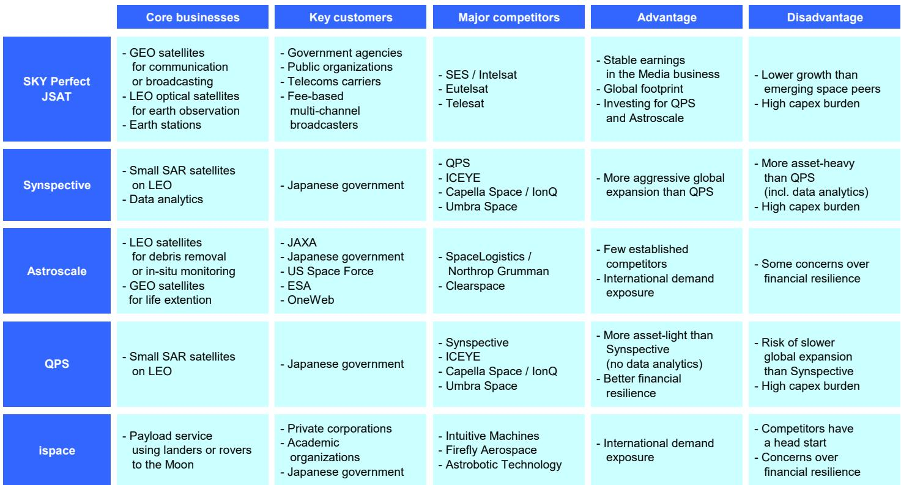
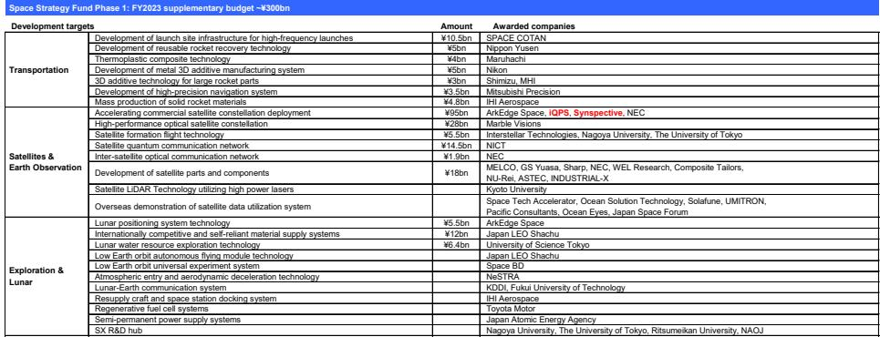
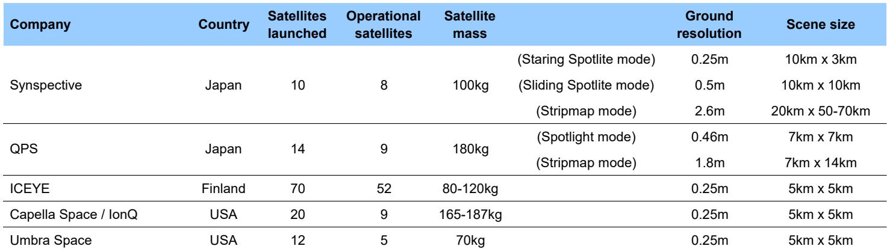

# MS：日本太空公司覆盖四只公司

日本太空产业正处在一个关键节点：全球火箭发射次数在过去五年以约25%的年复合增长率攀升，2025年发射量约为2020年的三倍，但日本本土年发射次数仍停留在个位数。MS在2026年7月发布的一份覆盖五家日本太空公司的报告中指出，日本在发射量上落后于美国和中国，但一批卫星运营商正在借助海外发射服务实现增长，同时其精密组件供应链和地理条件构成了差异化基础。报告对日本太空产业给出了“与大盘持平”的行业观点，核心判断是：增长潜力真实存在，但多数公司需要外部资本支撑前期投入，行业整体尚未进入自我循环阶段。

## 1. 日本太空产业面临“高精度、低产量”的成本约束

报告通过对比美日太空产业的结构性差异，揭示了一个关键矛盾。美国2025年火箭发射近200次，低轨卫星年发射量自2020年以来保持约25%的年复合增长，可重复使用技术大幅降低了发射成本。日本同期年均发射仅5次，卫星年发射量约15颗，且依赖海外发射服务商。

日本在精密组件制造领域拥有全球竞争力——火箭和卫星需要承受真空、辐射和极端温差，一旦发射便难以维修，对可靠性的要求极高。日本制造业的“过度工程”倾向在其他行业常被批评，但在太空领域反而成为优势。然而，由于发射和卫星制造规模没有显著增长，日本仍停留在高精度、低产量的模式，成本下降速度远不及美国和中国。报告将这一状态描述为“相互制约的僵局”：缺乏规模导致成本难以下降，成本高企又限制了商业应用的扩展。

> **KC评论：** 报告对日本组件供应链的分析值得注意。它没有简单说日本技术好，而是点出了“高精度”在太空领域的正反两面——既是竞争壁垒，也是规模化的障碍。读者可以对照美国SpaceX推动的成本下降曲线，判断日本组件商能否在保持精度的同时实现量产。

## 2. 政府太空战略产品提供研发支持，但商业化阶段仍需补充机制

日本政府通过JAXA管理的“太空战略产品”向产业注入资金。该产品由内阁府、文部科学省、宏观环境产业省和总务省共同出资，分三个阶段覆盖不同主题。第一阶段（2023财年补充预算约3000亿日元）已向SPACE COTAN、日本邮船、尼康等企业拨款，用于发射场基础设施、可重复使用火箭回收技术、金属3D打印等开发项目。第三阶段（2025财年补充预算约2000亿日元）正在推进。

报告肯定这类稳定资金来源对长开发周期的太空产业至关重要，但也明确指出：产品主要支持研发，对于私营企业进入商业化阶段，现有支持机制仍不充分。这一判断与报告对多家公司的财务评估直接相关——多数初创公司在成长阶段需要外部融资，而日本机构对亏损中的太空初创企业态度比美国同行更为谨慎。

## 3. 五家公司覆盖卫星遥感、通信、轨道服务和月球探测，财务韧性差异显著

报告覆盖的五家公司业务定位各不相同。SKY Perfect JSAT运营地球静止轨道通信卫星和低轨光学卫星，拥有稳定的媒体业务现金流，但增长潜力低于新兴太空公司。QPS Holdings和Synspective均从事低轨小型SAR（合成孔径雷达）卫星业务，前者采用更轻资产的模式（不涉及数据分析），后者更积极拓展全球市场但资产更重。Astroscale专注于轨道碎片清除和卫星在轨延寿服务，竞争格局相对清晰，但财务韧性存在隐忧。ispace提供月球着陆器和漫游车载荷服务，增长潜力大，但竞争对手已取得先发优势，且其对外部资本的依赖程度高于同行。

报告对五家公司的评级差异，核心依据是“增长潜力”与“财务韧性”两个维度的组合。QPS Holdings因轻资产模式获得最高财务韧性评分，Synspective和Astroscale因需要外部资本而被更新公司观点，ispace则因资本需求更大、竞争格局更不利而获得较低评级。SKY Perfect JSAT虽然增长吸引力有限，但报告认为机构读者仍会将其作为行业核心持仓。

> **KC评论：** 这份报告对太空公司的评估框架——同时看增长潜力和财务韧性——在资本密集型行业中具有通用性。对于日本太空产业而言，关键问题不是技术是否领先，而是哪些公司能在获得外部资本之前，用现有资源跑通商业闭环。QPS的轻资产模式提供了一个参照系。

For informational purposes only. Portions may be generated,translated,summarized,or edited with AI assistance based on source materials and may contain omissions or errors. Please verify independently. This is not investment,legal,tax,accounting,or other professional advice.

