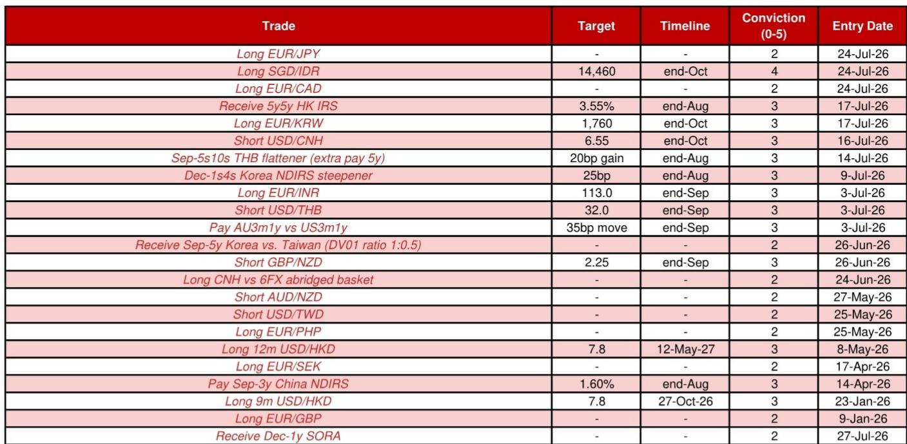
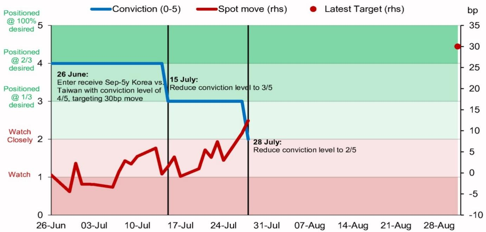

# NOM：研究主题与行业变化观察

美联储7月议息会议前夕，NOM亚洲利率策略团队在最新报告中做出一个明确选择：降低此前持有的韩国与台湾利率交易仓位，同时维持对香港和中国大陆的不同方向头寸。这份7月27日发布的报告，核心判断并非方向性看多或看空亚洲利率，而是在中期偏空框架下，识别出短期不确定性回报不对称的交易窗口，并据此调整组合。

报告的中期观点延续此前立场：亚洲利率面临上行不确定性。理由有两个层面。其一，市场对美联储下一步行动的讨论已从“降息还是按兵不动”转向“加息还是按兵不动”，即便本周美联储维持利率不变，市场仍会为加息不确定性定价一定期限溢价。其二，尽管伊朗临时协议达成，地缘政治不确定性溢价在能源价格中仍应保留一部分。这两个因素构成NOM对亚洲利率中期偏空的底层逻辑。

但中期偏空并不排斥短期交易机会。报告以印度利率为例：6月底油价在每桶70美元附近、5年期NDOIS接近200日移动均线但尚未跌破时，做空印度利率的不确定性回报不对称。NOM在7月20日平仓了这一空头头寸，但如果油价回到70-75美元区间，可能重新考虑入场。

## 1. 韩国与台湾利率交易：降低仓位但保留观察

NOM自6月24日起提到“接收韩国5年期利率、同时做空台湾5年期利率”的相对价值交易，以1:1的DV01比例配置。FOMC会议前，策略团队将台湾空头仓位减半，并于7月27日完全退出该交易。当前韩国5年期NDIRS利率为4.06%，台湾为2.345%。

退出交易的理由并非观点反转，而是事件不确定性临近。NOM仍维持对韩国利率的偏多判断：近期KOSPI走弱和美元兑韩元贬值，应降低韩国央行激进加息的不确定性。NOM宏观环境学家预计韩国央行将在8月和10月各加息一次，这与当前市场定价基本一致。此外，韩国银行体系贷存比近几个月下降，如果这一趋势持续，可能推动银行在下半年增加债券购买，从而压低利率。

台湾方面，NOM认为央行在增长和通胀前景上落后于曲线，近期国债和央行存单拍卖需求仍在调整。但5年期NDIRS利率在2.30%以上做空并不划算——该利率在5月和6月两次未能突破2.40%阻力位。突破需要催化剂，例如7月CPI数据高于预期。

> **KC评论：** NOM在FOMC前主动降低仓位，反映的是事件不确定性对相对价值交易的干扰，而非对韩国或台湾利率方向的根本性改变。报告保留了2/5的观察级别，说明策略团队认为交易逻辑仍在，只是需要等待更清晰的信号。

## 2. 香港与中国大陆：长端接收与短端做空的差异化布局

NOM在香港和中国大陆采取了方向相反的头寸。香港方面，维持接收5年远期5年期IRS头寸，目标利率3.55%，信心级别3/5。报告认为，如果未来几个月美联储转向更鹰派立场，美国长端利率的节奏变化不确定性大于上行不确定性——即回报表现曲线熊市平坦化，前端上升而长端稳定甚至节奏变化。本地因素方面，香港非资金企业债券发行节奏变化、贷款增长依然仍在调整，应意味着香港与美国IRS利差有收窄空间。

中国大陆方面，NOM维持做空3年期NDIRS头寸，当前利率1.435%，目标1.60%。逻辑是7天回购利率的节奏变化空间有限。NOM宏观环境学家预计中国人民银行在2026年全年维持政策利率和存款准备金率不变。报告还指出，中国科技领域的一些突破——提及Moonshot和ChangXin——应为中国利率提供底部支撑，尽管传统部门如房地产市场持续面临不确定性。

## 3. 一个可复用的观察框架：中期方向与短期交易的分离

这份报告提供了一个值得关注的框架：如何在同一市场中同时持有中期方向判断和短期交易仓位。NOM的做法是，将中期偏空作为背景，但识别出特定时间窗口内不确定性回报不对称的机会，进行方向相反的短期交易。印度利率的例子说明，当价格接近关键技术位且基本面催化剂明确时，短期交易可以与中期方向不同。

关键在于，这种短期交易有明确的退出条件——要么价格达到目标，要么事件不确定性临近。NOM在FOMC前退出韩国与台湾交易，正是这一纪律的体现。对于关注亚洲利率市场的读者，这一框架提示：区分中期趋势判断和短期交易执行，前者决定方向性敞口，后者决定入场时机和仓位管理。

报告同时展示了不同市场间的差异化处理：香港与中国大陆方向相反，韩国与台湾作为相对价值交易，印度则根据油价变化灵活调整。这种多市场、多方向的组合管理，反映了利率策略中“分散化”不仅适用于资产类别，也适用于同一资产类别内的不同市场和期限结构。

For informational purposes only. Portions may be generated,translated,summarized,or edited with AI assistance based on source materials and may contain omissions or errors. Please verify independently. This is not investment,legal,tax,accounting,or other professional advice.

For informational purposes only. Portions may be generated,translated,summarized,or edited with AI assistance based on source materials and may contain omissions or errors. Please verify independently. This is not investment,legal,tax,accounting,or other professional advice.

