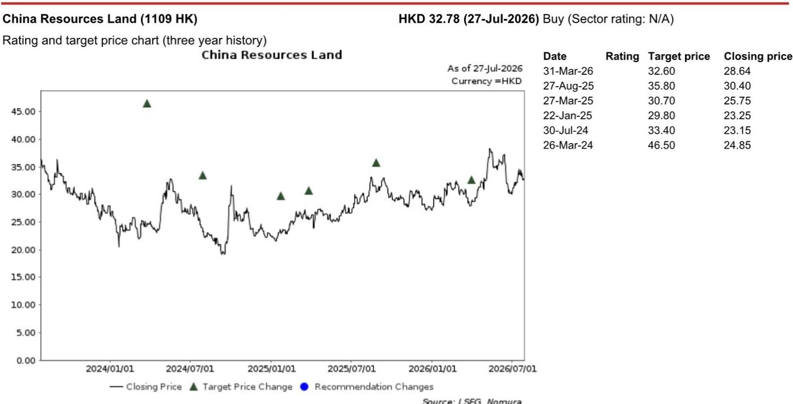
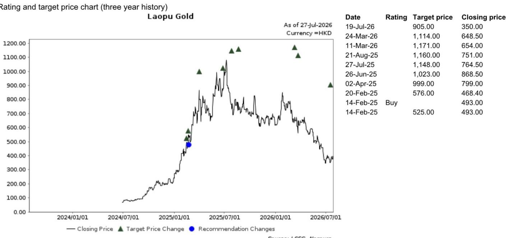

# LVMH第二季度业绩揭示分化中的奢侈品格局：关注特定零售地产与黄金关联品牌

LVMH 2026年第二季度有机收入同比增长3%，略高于市场普遍预期的2%，但这并非全面复苏的信号。这是一个狭窄的、区域和品类集中的结果，掩盖了表面之下的结构性变化。整体数据虽略超预期，但掩盖了一个事实：全球奢侈品读者最关注的亚太地区（除日本）增速从第一季度的7%放缓至第二季度的4%。这一放缓，加上2026年上半年中国客户国内消费同比持平，揭示了一个比单一收入数据更复杂的图景。

这份报告的时机很重要，因为它出现在奢侈品行业后疫情正常化已让位于更加碎片化的需求环境之际。消费者行为不再按统一周期在全球范围内变化。相反，区域消费模式正在分化，品牌组合内的品牌层级正在变化，奢侈品消费本身的性质正被集中的购物活动和国内外消费的分化所重新定义。对于观察者而言，LVMH业绩的关键洞察并非3%的增长数字本身，而是其内部构成揭示了结构性需求真正在何处积累，以及何处仅是企稳。

数据中浮现出三个相互关联的动态，值得关注：中国的放缓并非需求崩溃，而是消费的重新布局，这有利于特定的零售地产资产；美国市场因游客加速消费而重新成为相对表现较好的市场；在LVMH自身组合中，时装与皮具部门恢复正增长，掩盖了传统大品牌与更小、更灵活品牌之间日益扩大的表现差距。这些模式共同指向一个奢侈品市场，其中超额回报将越来越多地通过精准布局零售基础设施、黄金关联珠宝以及具有清晰差异化的品牌来获得，而非通过广泛的行业敞口。

## 亚太地区（除日本）放缓是消费重构，而非需求破坏

亚太地区（除日本）有机增速从第一季度的7%降至第二季度的4%，很容易被解读为中国奢侈品需求疲软的信号。然而，仔细阅读LVMH管理层的评论，会发现一个更复杂的机制在起作用。2026年上半年，中国客户的整体消费同比持平，其国内消费意愿仍处于历史高位。消费持平与区域收入增速放缓之间的矛盾表明，消费的构成正在发生变化——更多消费被出境游和特定的国内渠道所捕获，而这些渠道可能不会像以前那样以相同比例直接计入LVMH报告的亚太地区收入。

这一解读得到了LVMH自身渠道调查的支持。该调查咨询了熟悉中国高端奢侈品购物中心的专家，结果显示LVMH主要品牌在第二季度的销售势头稳定。如果商场层面的需求稳定，那么报告中的放缓可能反映了库存正常化、中国消费者购买地点转移（可能通过跨境渠道或第三方平台，这些被计入不同区域分部），以及消费日益集中在特定购物节日的综合影响。LVMH明确指出，消费者需求日益集中在特定的购物节日和活动，这意味着季度比较可能因这些活动相对于前一年的时间安排而失真。

其战略意义在于，中国的奢侈品市场仍有显著的结构性增长空间，但捕捉这种增长的机制正在改变。观察者不应将亚太地区报告收入的放缓推断为中国需求疲软。相反，证据指向一个市场，赢家将是那些拥有实体零售基础设施、能够捕捉高流量、活动驱动型消费的企业。这正是报告偏好华润置地的逻辑所在：作为高端购物中心的开发商和运营商，华润置地从奢侈品消费集中于优质实体零售环境中受益，无论最终是哪个品牌完成销售。

## 美国市场加速具有结构性意义，因其由游客消费驱动，而非仅靠国内消费

美国市场在第二季度实现了6%的有机收入增长，较第一季度的3%翻了一番。这一加速值得注意，因为它是在美国国内需求已被LVMH管理层描述为强劲的背景下实现的。额外的驱动力来自游客消费的加速，这推动美国增长超过了仅靠国内消费所能支撑的水平。这是一个结构性的重要区别。美国国内奢侈品消费一直具有韧性，但并未加速；增量增长来自外部来源——国际旅游——这是一个可能随汇率、签证政策和地缘政治情绪而变化的变量。

美国游客消费加速也有助于解释，为何LVMH在第二季度实现了3%的整体收入增长，尽管中东冲突持续带来约1个百分点的拖累。如果没有这一地缘政治逆风，有机增长率将达到4%。美国市场有效地弥补了受冲突影响地区的疲软，展示了LVMH地域分布的多元化优势。但对于观察者而言，问题在于美国旅游业的提振是可持续的还是周期性的。如果美元走弱或旅行模式发生变化，美国市场的相对优势可能会缩小。

对于组合策略而言，美国市场的加速强化了布局具有强劲入境旅游流市场的重要性。这也表明，拥有强大美国分销渠道和品牌资产的奢侈品牌，比那些过度依赖中国国内消费的品牌，更能捕捉到这种游客消费。这并非呼吁放弃以中国为重点的布局，而是提醒，奢侈品领域的地域多元化不仅是一种风险管理工具——当一个地区的游客流入弥补了另一个地区的放缓时，它也是超额回报的来源。

## 时装与皮具部门恢复正增长，掩盖了品牌间日益扩大的表现层级

时装与皮具部门是LVMH的核心利润驱动部门，在经历多年下行趋势后，于第二季度恢复了1%的有机正增长。然而，这一整体数据掩盖了品牌间的显著差异。路易威登的表现与部门平均水平一致，即基本持平或略有增长。迪奥略高于平均水平。Loro Piana和Rimowa继续表现突出。Celine和Fendi环比有所改善。这不是一个统一的复苏；这是一个分层复苏，其中定位清晰的品牌——无论是在超奢华材质（Loro Piana）、旅行奢侈品（Rimowa）还是传统工艺方面——正在与中间层品牌拉开差距。

按客户国籍划分的消费数据增加了另一层细节。欧洲、日本和中国客户在时装与皮具上的消费在第二季度同比大致持平。然而，美国客户实现了高个位数的百分比增长。这意味着整个部门1%的增长是由美国消费者不成比例地推动的。如果美国消费者在奢侈品上的支出减弱，该部门的增长很可能会再次转为负值。因此，复苏是脆弱的，且依赖于单一客户群体。

对于观察者而言，这种品牌层面的分化有两个含义。首先，它验证了在低增长奢侈品环境中，品牌差异化成为表现优异的主要驱动力。其次，它表明，传统的持有一篮子多元化奢侈品牌的策略，可能需要转向一种更注重选择的方法，聚焦于那些拥有经证明的定价能力和品类领导力的品牌。Loro Piana和Rimowa的优异表现——两者都占据着特定、可防御的细分市场——与消费者变得更加挑剔、不愿为无差异化的奢侈品支付溢价的趋势一致。

## 应对后正常化奢侈品周期的决策框架

LVMH第二季度业绩中的模式可以综合为一个三轴决策框架。第一轴是地域布局：优先考虑具有强劲入境旅游动态的市场（美国、日本），而非消费纯粹依赖国内的市场，并认识到中国的奢侈品增长日益依赖于渠道而非品牌。第二轴是组合内的品牌定位：青睐具有清晰品类领导力或材质差异化的品牌，而非那些增长与部门平均水平一致的传统大品牌。第三轴是零售基础设施：鉴于消费集中在节假日和活动周围，拥有捕捉这些流量的实体零售资产，可能比拥有在这些商场租赁空间的品牌提供更可预测的回报。

这一框架解释了为何报告中的股票偏好并非随意。华润置地符合零售基础设施逻辑：作为高端奢侈品商场的业主，它受益于活动驱动的消费集中，无论哪个品牌完成交易。老铺黄金符合品类领导力逻辑：作为黄金关联珠宝品牌，它占据了一个结合奢侈品消费与黄金内在价值的细分市场，这种双重吸引力在消费集中且挑剔时尤为相关。这两只股票都受益于LVMH业绩所揭示的结构性趋势，而非依赖于广泛的奢侈品行业复苏。

观察者应注意，LVMH自身业绩存在一个局限性：中东冲突带来的1个百分点拖累是一个可能持续或加剧的外部因素。这一地缘政治变量未被上述结构性框架所涵盖，它引入了一个难以仅通过选股来对冲的不确定性来源。该决策框架是为中东冲突仍构成逆风的世界而设计的；如果该逆风消退，上行空间将是对结构性逻辑的增量补充，而非根本性改变。

奢侈品市场并非在统一复苏。它正在围绕新的消费模式、区域分化和品牌层级进行重构。能够认识到后正常化周期奖励的是选择性而非广度，并据此调整布局的观察者，将更有可能把握其中的机会。

*仅供参考。部分内容可能基于源材料通过AI辅助生成、翻译、总结或编辑，可能存在遗漏或错误。请独立核实。本文不构成任何专业建议。*

仅供参考。部分内容可能基于源材料通过AI辅助生成、翻译、总结或编辑，可能存在遗漏或错误。请独立核实。本文不构成任何专业建议。

