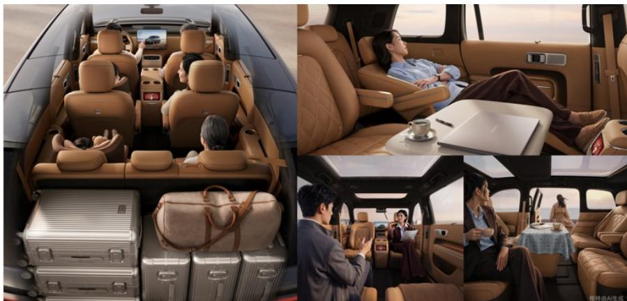
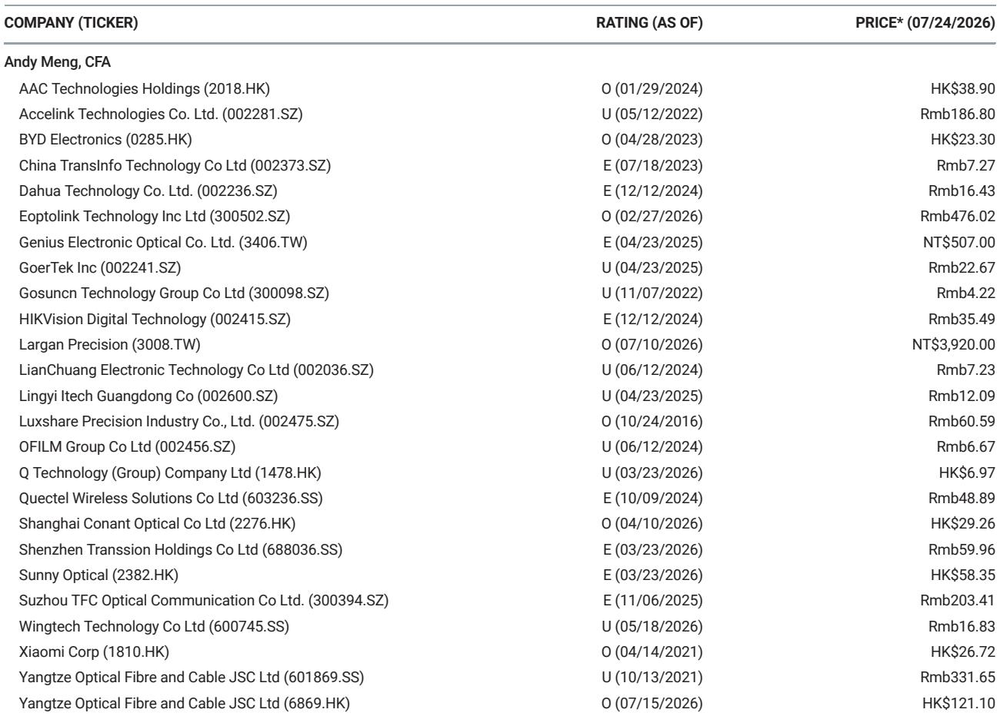
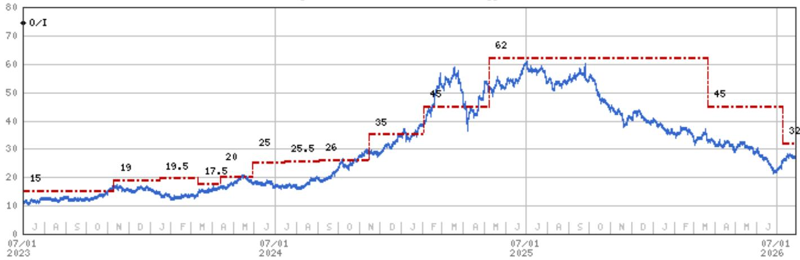

# Xiaomi’s SkyNomad Launch Could Redefine the EV Cabin as a Monetizable Living Space – and That Changes the Observation Framework

On July 30 in Beijing, Xiaomi will unveil SkyNomad, its new electric vehicle brand. The launch is not merely a product introduction. It is the public debut of a strategic thesis that, if executed well, could shift how observers value Xiaomi’s automotive business. The core argument is this: SkyNomad is designed to turn the car cabin into a flexible, intelligent living space rather than a transportation capsule. That design philosophy, backed by a 380 km pure-electric range under WLTC, a tested endurance from -41°C to 53°C, and a deployment of 566 test vehicles across more than 300 Chinese cities, suggests Xiaomi is targeting a use-case breadth that competitors have not systematically addressed. For a company whose core smartphone and IoT businesses face margin compression, a differentiated EV proposition with the potential for recurring software and service revenue could become the catalyst that re-rates the entire equity story.

The timing matters. Xiaomi’s stock has traded in a wide range of HK$21.30 to HK$59.90 over the past 52 weeks, closing at HK$26.72 on July 24. The current price implies a P/E of 37.6x on 2026 consensus earnings, a multiple that reflects skepticism about near-term profitability from the EV venture. The SkyNomad launch, however, provides a concrete event around which the market can reassess the probability of success. A global investment bank report has assigned a 20% probability to a bull case for the EV business, 60% to a base case, and 20% to a bear case. The launch event is the first major inflection point that could shift those probabilities upward.

The following analysis unpacks why the SkyNomad launch matters beyond the spec sheet, what the living space concept means for unit economics, and how observers should frame their own decision-making around the upcoming event.

## The Living Space Concept Is Not a Marketing Slogan; It Is a Structural Cost and Revenue Advantage

Xiaomi’s stated goal with SkyNomad is to “redefine space through intelligence” and create a “living space” inside the vehicle. The company argues that cabin space should not be static but should adapt flexibly to users’ needs – commuting, resting, working, family trips, or camping. This is a fundamentally different design philosophy from the prevailing approach, which treats the cabin as a driver-centric cockpit with passenger accommodations as an afterthought.

The structural advantage here is twofold. First, by designing for multiple use cases, Xiaomi can target a broader addressable market with a single platform. A vehicle that serves as a daily commuter, a mobile office, and a weekend camper reduces the need for multiple vehicle ownership. That value proposition is particularly strong in China, where urban parking is scarce and multi-car households are less common than in the US. Second, a flexible cabin architecture allows for higher utilization of the vehicle’s interior space, which directly translates into a lower cost per usable square meter – a metric that matters when battery costs remain the dominant cost driver.

The report notes that target users may spend two hours commuting each day, take short rests in the car, handle work on the go, travel with family on weekends, or use the vehicle as a second home while camping. Each of these scenarios implies different interior configurations. If Xiaomi has solved for reconfigurability at the hardware and software layer, it has created a product that competes not just on range and price but on lifestyle integration. That is a moat that is harder to replicate than a better battery pack.

## A 380 km WLTC Range and 5.7 L/100 km Fuel Consumption Create a Pragmatic Bridge Between BEV and EREV Architectures

Under WLTC conditions, SkyNomad offers a maximum pure-electric range of up to 380 km and a minimum fuel consumption of 5.7 L/100 km in charge-sustaining mode. These numbers are important because they position the vehicle in a specific competitive zone. A 380 km electric range is sufficient for the vast majority of daily urban commuting in China, where the average one-way commute is under 40 km. At the same time, the charge-sustaining fuel consumption of 5.7 L/100 km is competitive with hybrid sedans, meaning the vehicle does not compromise on long-distance efficiency.

This dual-mode capability is strategically astute. Pure battery electric vehicles still face range anxiety for intercity travel, especially during Chinese holiday periods when charging station queues can exceed two hours. Pure hybrids, meanwhile, sacrifice the low operating cost and smooth driving experience of electric-only operation for most daily trips. SkyNomad’s architecture bridges the two. The 380 km range covers roughly 95% of daily driving without any fuel consumption, while the efficient charge-sustaining mode eliminates range anxiety for the remaining 5% of trips.

The practical implication for observers is that this architecture reduces the risk of demand disappointment. It does not require consumers to make a binary choice between electric and internal combustion. It offers both, with the electric mode being the primary experience. That should broaden the buyer pool beyond early EV adopters to include mainstream consumers who are cost-conscious and convenience-sensitive.

## The Testing Program Signals a Serious Commitment to Reliability, Which Is the Unspoken Risk in Every New EV Brand

Xiaomi has deployed 566 test vehicles, accumulated more than 4.28 million km of road testing, and covered over 300 cities across China. Testing conditions ranged from -41°C to 53°C, with the highest altitude reaching 5,380 meters. These numbers are not just for show. They address the single biggest reputational risk for any new EV entrant: quality and reliability.

In China’s hyper-competitive EV market, a recall or widespread quality issue can affect a brand within months. The testing program suggests that Xiaomi is aware of this and is investing heavily in pre-launch validation. The temperature range from -41°C to 53°C covers virtually every climatic condition in China, from the frigid northeast to the scorching Turpan basin. The altitude range up to 5,380 meters covers the Qinghai-Tibet plateau, where oxygen-thin air affects both combustion engine efficiency and battery thermal management.

The report does not disclose specific failure rates or engineering changes made during testing, but the sheer scale of the program – 4.28 million km across 566 vehicles – implies a level of statistical confidence that many startup EV brands have not achieved before their first delivery. For observers, this reduces the probability of a problematic launch. It does not eliminate the risk, but it makes the base case more plausible.

## How to Frame Your Own Decision-Making Around the July 30 Launch

The SkyNomad launch on July 30 is not a binary event. It is the first of many data points that will determine whether Xiaomi’s EV business creates or changes shareholder value. A structured decision framework can help observers avoid the trap of reacting to short-term sentiment.

First, define the three scenarios explicitly. In the bull case, the launch generates strong pre-orders, positive media coverage, and credible demonstrations of the living space concept that go beyond mockups. The stock could move from the July 24 close. In the base case, the launch is competent but not transformative. Pre-orders are moderate, and the market waits for delivery data before adjusting expectations. The stock trades in a range. In the bear case, the launch reveals design flaws, unclear positioning, or a pricing strategy that does not resonate. The stock could test the lower end of its 52-week range.

Second, identify the specific signals that will differentiate these scenarios. The most important signal is the number of pre-orders within the first 72 hours, relative to production capacity. A ratio above 2x would indicate strong demand. The second signal is the quality of the living space demonstrations. If Xiaomi can show working hardware that transforms the cabin configuration in under 30 seconds, that is a positive. If the demonstrations are static mockups, that is a negative. The third signal is the pricing relative to comparable vehicles from BYD, NIO, and Li Auto. A price that is at or below the midpoint of the competitive set, combined with a differentiated interior, would be a strong value proposition.

Third, plan your response time. The market will react within the first 24 hours of the event. That reaction may be exaggerated in either direction. The disciplined approach is to wait for the pre-order data, which will likely be disclosed within one week. If the pre-orders are strong, the bull case becomes more probable, and adding to a position on any post-event pullback makes sense. If pre-orders are weak, the bear case becomes more probable, and reducing exposure is prudent.

Finally, do not ignore the broader context. Xiaomi’s smartphone and IoT businesses face headwinds from inventory destocking and weak demand, as the report notes. The EV business is a long-duration project that will not contribute materially to earnings until 2027 at the earliest, based on the EPS estimates of Rmb0.89 for 2026 and Rmb1.27 for 2027. The SkyNomad launch is a catalyst, not a conclusion. It changes the probability distribution, but it does not eliminate the fundamental uncertainty around execution, competition, and margin trajectory.

*For informational purposes only. Portions may be generated, translated, summarized, or edited with AI assistance based on source materials and may contain omissions or errors. Please verify independently. This is not professional advice.*

For informational purposes only. Portions may be generated, translated, summarized, or edited with AI assistance based on source materials and may contain omissions or errors. Please verify independently. This is not professional advice.

